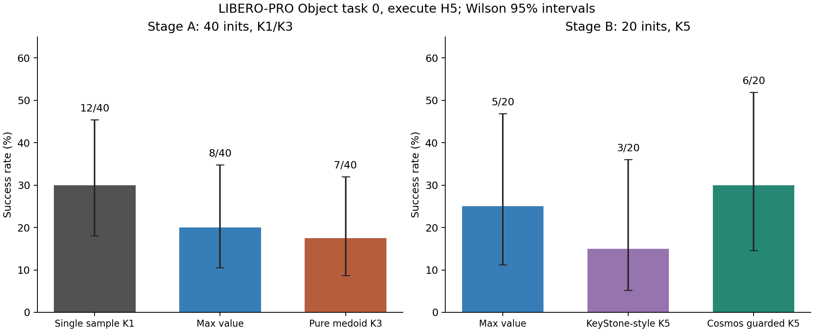
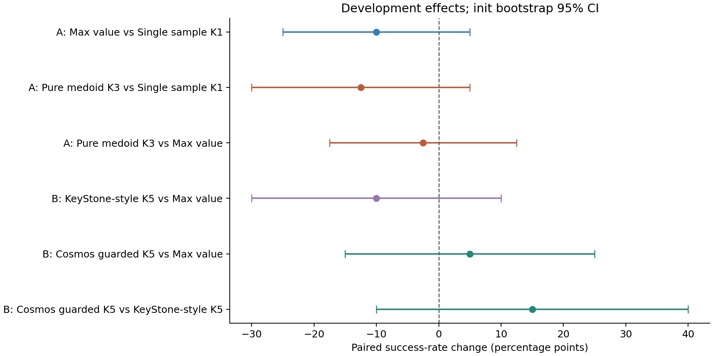
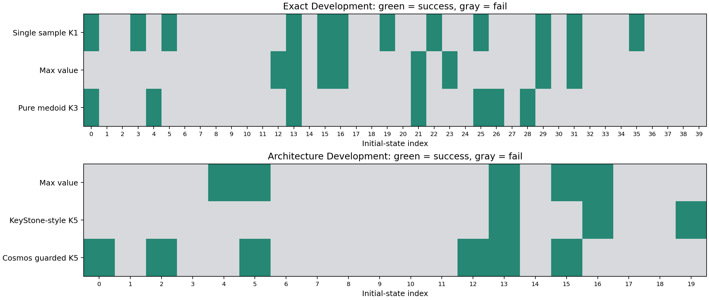

# P4c: consensus-medoid перед P5, результаты

Дата анализа: 7 сентября 2026 года. Статус campaign: **completed**, exit code 0,
окончание в 14:53:47 MSK. Завершены 12/12 jobs: 180 development rollouts и 6
smoke rollouts. Smoke используется только для проверки запуска и не добавляется
к development-статистике: это повторные конфигурации init 0.

**Решение:** pure medoid и KeyStone-style selector не показали преимущества в
этом screen. Cosmos-aware selector дал небольшой положительный point estimate,
но не прошёл development gate по efficacy и drop-прокси. Confirmatory holdout
для текущих настроек не открываем; основной следующий приоритет остаётся P5.

## Постановка и гипотеза

Suite `libero_object_object`, task 0, команда:
**“pick up the alphabet soup and place it in the basket”**.
Это одна задача LIBERO-PRO Object с object perturbation, а не средний SR по
всему бенчмарку, Environment или Position.

Гипотеза: качественные stochastic action chunks образуют плотную группу;
выбор её представителя должен отбрасывать неудачные выбросы и повышать SR.

Модель генерировала 16 действий `[16,7]`, исполнялись первые 5, затем модель
получала новое реальное наблюдение. Все методы имели H5, максимум 280 действий
после 10 settling steps, 5 denoising steps, prediction mode `parallel`.
Action, future proprio и value генерировались совместно; это не проверка
авторегрессионного planning `a -> s' -> V`.

| Этап | Init states | Rollout seeds | Методы | Rollouts |
|---|---|---|---|---:|
| A | 0–39 | `16100000 + 10000 * init` | single K1; max-value K3; medoid K3 | 120 |
| B | 0–19 | `16200000 + 10000 * init` | max-value K5; KeyStone-style K5; Cosmos guarded K5 | 60 |

Внутри этапа одинаковы task/init/rollout seeds. Этапы имеют разные seeds и
разный состав init, поэтому разность A и B нельзя трактовать как чистый эффект
увеличения K. Baseline K1 не запускался на seeds этапа B.

## Формулы проверенных методов

Pure medoid использовал только исполняемый префикс:

$$
d(a,b)=\frac{\|\Delta p_a-\Delta p_b\|_2}{\sqrt3}
+\frac{0.5}{\pi}\arccos\!\left(\operatorname{clip}
\left[\frac{\operatorname{tr}(R_aR_b^\top)-1}{2},-1,1\right]\right)
+0.25\,\mathbf1[\operatorname{sign}(g_a)\ne\operatorname{sign}(g_b)],
$$

$$
D_{ij}=\frac{\sum_{t=0}^{4}0.9^t d(a_{i,t},a_{j,t})}{\sum_{t=0}^{4}0.9^t},
\qquad C_i^a=\frac1{K-1}\sum_{j\ne i}D_{ij},\qquad
i^*=\arg\min_i C_i^a.
$$

Это адаптация присланной 10D формулы к native 7D Cosmos: ориентация
преобразуется из axis-angle команды вместо rotation-6D. Метрика вычислялась
в пространстве команд до внутреннего scaling контроллером OSC; физически
исполненный поворот не следует отождествлять с этой матрицей без учёта scaling.

KeyStone-style comparator использовал L2 полного flattened H16 chunk,
global-medoid guard с `tau=0.3` и medoid крупнейшего из двух кластеров.
Это локальная реализация схемы, описанной в
[протоколе](CONSENSUS_MEDOID_PRE_P5_PROTOCOL_20260907.md), а не новые результаты
официальной реализации авторов на их бенчмарке.

В Cosmos guarded для каждого кандидата считались также средние расстояния
между predicted future proprio $C_i^p$ и между values $C_i^v$:

$$
J_i=C_i^a/s_a+0.25C_i^p/s_p+0.10C_i^v/s_v,
\qquad r=\arg\min_{i\in\mathcal M}J_i,\qquad m=\arg\max_i V_i.
$$

$\mathcal M$ задаётся action-cluster guard по H5. $s_a$ — медиана положительных
попарных action distances, $s_p,s_v$ — медианы положительных соответствующих
candidate costs. При отсутствии положительных значений используется scale 1.

$$
i^*=\begin{cases}
r,&V_m-V_r\le0.02,\quad (C_m^a-C_r^a)/s_a\ge0.1,\quad J_m-J_r>0,\\
m,&\text{иначе}.
\end{cases}
$$

## Success rate и парные эффекты

| Этап | Метод | Success | SR | Drop-прокси |
|---|---|---:|---:|---:|
| A | Single sample K1 | 12/40 | **30.0%** | 3/40 |
| A | Max-value K3 | 8/40 | 20.0% | 3/40 |
| A | Pure medoid K3 | 7/40 | 17.5% | 5/40 |
| B | Max-value K5 | 5/20 | 25.0% | 1/20 |
| B | KeyStone-style K5 | 3/20 | 15.0% | 1/20 |
| B | Cosmos guarded K5 | 6/20 | **30.0%** | 2/20 |



Здесь rescue — baseline fail, method success; harm — baseline success,
method fail. CI рассчитан bootstrap по init (20 000 повторов), p — двусторонний
exact McNemar. Один init содержит один rollout каждого метода. Все сравнения
development, p-values без поправки на множественные сравнения.

| Метод против baseline | Delta SR, п.п. | 95% paired CI, п.п. | Rescue / harm | McNemar p |
|---|---:|---:|---:|---:|
| Max-value K3 против K1 | −10.0 | [−25.0; +5.0] | 3 / 7 | 0.344 |
| Pure medoid K3 против K1 | −12.5 | [−30.0; +5.0] | 4 / 9 | 0.267 |
| Pure medoid K3 против max-value K3 | −2.5 | [−17.5; +12.5] | 5 / 6 | 1.000 |
| KeyStone-style K5 против max-value K5 | −10.0 | [−30.0; +10.0] | 1 / 3 | 0.625 |
| Cosmos guarded K5 против max-value K5 | +5.0 | [−15.0; +25.0] | 3 / 2 | 1.000 |
| Cosmos guarded K5 против KeyStone-style K5 | +15.0 | [−10.0; +40.0] | 5 / 2 | 0.453 |



Ни одна разность не отделена от нуля. Положительный результат Cosmos guarded
соответствует всего одному дополнительному success на 20 init. Удачный
pure-medoid smoke 1/1 не подтвердился преимуществом на 40 init.



У Cosmos guarded против max-value спасены init **0, 2, 12**, испорчены
**4, 16**. Их seeds соответственно `16200000, 16220000, 16320000` и
`16240000, 16360000`. Все парные исходы доступны в
[`paired_cases.csv`](campaigns/consensus_medoid_pre_p5_20260907/analysis/paired_cases.csv).

## Как реально работал selector

| Метод | Query rows | Выбор отличается от max-value | Эпизоды с переключением |
|---|---:|---:|---:|
| Pure medoid K3 | 2064 | 70.1% | 40/40 |
| KeyStone-style K5 | 1075 | 83.0% | 20/20 |
| Cosmos guarded K5 | 1009 | 56.9% | 20/20 |

Эти доли посчитаны по запросам собственных траекторий каждого метода.
Они описывают поведение selector, а не вероятность успеха отдельного действия.

Cosmos gate разрешил 574 переключения. Ещё 304 предложения не прошли порог
action-consensus gain, 119 совпали с max-value, и только 12 были отклонены
по value gap. Медианный gap равен 0.000552, 95-й перцентиль — 0.008424,
при пороге 0.02. Поэтому value-ограничение на этих данных оказалось слабым;
название conservative не подтверждается редкостью вмешательств.

Future proprio доступен во всех 1009 запросах guarded. Однако независимой
абляции его веса нет: эти данные не доказывают полезность ни $C^p$, ни $C^v$
по отдельности. Межсемпловый консенсус также не является калиброванной
вероятностью fail.

## Проверка качества данных и ограничений

- Все **180/180 development эпизодов** полны; 9287 query rows не имеют дублей,
  пропусков query или разрывов simulator timeline. Все 139 fail дошли до t=280.
- При повторном вычислении selector по записанным action pools получено
  **0/9287 несовпадений выбора**. Максимальная разница distance matrices
  $1.70\cdot10^{-8}$ объясняется точностью чисел при сериализации.
- Начальные MuJoCo states совпали точно для всех сравниваемых init. При этом
  initial action pools между pure medoid и max-value K3 различаются на всех
  40 init (max abs difference 0.01256), между KeyStone-style и max-value K5 —
  на всех 20 (0.03893). У guarded и max-value K5 q0 pools совпали точно.
  Причина различия tensors в этом прогоне отдельно не установлена; это
  согласуется с ранее измеренной
  [межпроцессной невоспроизводимостью](COSMOS_QUERY_REPRODUCIBILITY_RESULTS_20260902.md).
  Paired terminal outcomes здесь означают matched init/seeds, а не строгие
  all-candidate counterfactual branches из единого сохранённого pool.
- **Prediction-error horizon не согласован:** future image/proprio обучены
  на endpoint после H16, а `prediction_error_metrics_for_query` сравнил их с
  фактическим состоянием после H5 (или ещё раньше при success). Поэтому эти
  MSE/L2 не включены в выводы об accuracy world model. Terminal SR и selector
  используют корректно записанные данные и от этой ошибки интерпретации не
  зависят. Для строгой ошибки H16 нужен replay всего исходного candidate до
  соответствующего endpoint; обычное продолжение с re-query меняет действия.
- Drop и deadlock — simulator proxies. Все official-safety flags равны нулю,
  но запуск выполнялся в LIBERO-PRO, а не официальном LIBERO-Safety. Эти нули
  не доказывают прохождение официального safety benchmark.
- `save_videos=false`: у этих 186 rollouts нет записанных MP4. Рендер из
  сохранённых sim-state snapshots возможен только как отдельная реконструкция;
  его нельзя обозначать исходным видео полного эпизода.

Все fail завершились по лимиту, но это не устанавливает физическую причину:
у pure medoid отмечено 5 drop-прокси, у guarded — 2, также есть terminal
deadlock-прокси. Чтобы утверждать, что fail случился только из-за нехватки
времени, нужно отдельное продолжение из сохранённого полного состояния.

Stage A занял 82 мин 33 с, Stage B — 51 мин 29 с на трёх GPU.
Время jobs этапа A: K1 51.3 мин, max-value K3 82.6 мин, medoid K3 80.9 мин.
Чистый consensus потребовал больше sampling, но в этом screen не дал выигрыша
по SR. Это deployment wall time, включая окружение и анализ, не чистая CUDA latency.

## Выводы и следующие решения

1. Гипотеза «самый согласованный action является лучшим» не получила поддержки
   в данном task-0 screen. У pure medoid 4 rescue против 9 harm относительно K1,
   что не проходит первый gate протокола. Это не опровергает consensus во всех
   задачах или моделях.
2. Более сложный guarded score дал кандидат на дальнейшую проверку, но
   статистика и drop-прокси не проходят gate. Не замораживаем его как победителя
   и не тратим следующий большой rollout-бюджет на перебор его коэффициентов.
3. Следующий дешёвый шаг для consensus — посчитать эти scores на уже сохранённых
   K4 all-candidate terminal branches P4b: отдельно within-state ranking,
   rescues/harms и oracle opportunity. Поскольку holdout P4b уже открыт,
   повторное использование данных будет development-анализом. Нужны контроли
   pure H5 / pure H16 / cluster / joint и controller-aware scaling.
4. Основной новый метод — P5, pairwise task-critical outcome heads. Обучать
   нужно относительное terminal преимущество внутри одного candidate pool,
   включая drop/contact/no-progress, и проверять перенос по held-out init/cells.
   Consensus можно добавить как признак, если он улучшает group-held-out ranking.
5. Новый confirmatory запуск открывать только после development gate,
   с единым захваченным candidate pool для каждого сравнения, согласованным
   prediction horizon, frozen thresholds и записью настоящих rollout videos.

## Артефакты и воспроизведение анализа

Протокол: [CONSENSUS_MEDOID_PRE_P5_PROTOCOL_20260907.md](CONSENSUS_MEDOID_PRE_P5_PROTOCOL_20260907.md).
Статус запуска: [CONSENSUS_MEDOID_PRE_P5_RUN_20260907.md](CONSENSUS_MEDOID_PRE_P5_RUN_20260907.md).

Все таблицы, integrity JSON и PNG:
[`campaigns/consensus_medoid_pre_p5_20260907/analysis/`](campaigns/consensus_medoid_pre_p5_20260907/analysis/).
Исходные parquet, manifests, configs и logs скачаны с сервера в соседние
`__exact_development`, `__architecture_development` и `__*_smoke` каталоги.
Старые автоматически созданные `consensus_analysis/paired_effects.csv`
ориентировали сравнения по алфавиту; в новом сводном анализе baseline стоит
слева, поэтому знаки разностей и подписи rescue/harm читаются привычнее.

```bash
/home/alexander/venvs/cosmos_policy_libero/bin/python \
  scripts/analyze_consensus_medoid_results.py
```
