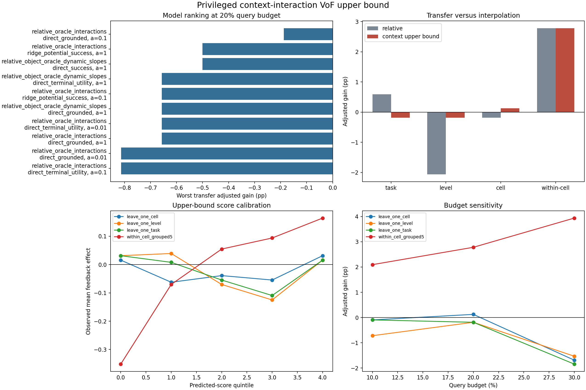

# Privileged context-interaction VoF upper bound: results

Дата анализа: 3 сентября 2026 года.

## Решение

P2d development upper bound получил **FAIL**. Даже при явном task identity,
perturbation geometry и privileged manipulation phase знак пользы query-4
feedback не переносится на unseen tasks и perturbation levels. Текущую ветку
re-query CATE routing следует закрыть и перейти к proposal recovery и
abstention.

Это exploratory анализ ранее открытых outcomes, а не confirmatory результат.
Полные таблицы находятся в
[`campaigns/context_interaction_upper_bound_20260903/analysis/`](campaigns/context_interaction_upper_bound_20260903/analysis/).

## Что проверялось

Использованы те же 640 strict query-4 exact-state пар: 320 независимых
`level x task x init` групп, 16 cells, 80 rescues, 94 harms и 466 ties.

К 80 relative action/value/proprio признакам добавлялись:

- one-hot task и exact perturbation level;
- направление и величина perturbation;
- privileged phase `approach/grasp/transport`;
- `task x perturbation`, `task x phase`, `level x phase` interactions;
- для старших моделей context-specific slopes физически выбранных motion,
  gripper, uncertainty и frozen-CLIP object variables.

Для

$$
z_i=[d_i,m_i,\phi_i^{approach},\phi_i^{grasp},\phi_i^{transport}]
$$

interaction variables имели вид

$$
x_{ij}^{interaction}=x_{ij}z_i.
$$

Оценивались direct success/grounded/utility effects и разность двух ridge
potential outcomes. Router выбирал top-20% состояний по OOF score:

$$
G_{adj}=\frac1N\sum_i q_i(\tau_i-0.025).
$$

Каждая строка предсказывалась без обучения на её task, level или cell.
Отдельный grouped five-fold split внутри каждого cell служил только
interpolation diagnostic.

## Главный результат

Лучший устойчивый interaction-вариант:
`relative_oracle_interactions + direct_grounded`, `alpha=0.1`, 172 признака.

| Split | Adjusted gain | 95% cluster CI | Rescues / harms | AUROC | Quintile rho |
|---|---:|---:|---:|---:|---:|
| leave-one-task | -0.19 п.п. | [-1.77; +1.42] | 13 / 11 | 0.463 | -0.4 |
| leave-one-level | -0.19 п.п. | [-1.87; +1.38] | 15 / 13 | 0.438 | -0.6 |
| leave-one-cell | +0.13 п.п. | [-1.38; +1.65] | 14 / 10 | 0.486 | 0.3 |
| within-cell grouped | +2.78 п.п. | [+0.71; +4.89] | 30 / 9 | 0.812 | 1.0 |

Worst-transfer adjusted gain улучшился относительно matched ridge control с
-2.06 до -0.19 п.п., но остался отрицательным. Для контекста все три transfer
AUROC ниже 0.5, все efficacy CI пересекают ноль, а worst-cell adjusted gain
достигает -15.63 п.п. На budgets 10% и 30% transfer также не стабилизируется.

Для сравнения, лучший historical P2c logistic relative control имел
worst-transfer -0.50 п.п. Новый privileged score улучшает этот point estimate
лишь до -0.19 п.п., не делает его положительным и не проходит ни один
calibration/robustness gate.

## Важный положительный diagnostic

Внутри уже известных cells предсказание не случайно. Для выбранной transfer
конфигурации top-20% routing дал +2.78 п.п., AUROC 0.812 и идеально монотонные
score quintiles. Наиболее оптимистичная, выбранная уже по within-cell result
конфигурация достигла +3.88 п.п. и AUROC 0.818, но это post-hoc число.

При переносе quintiles перестают быть монотонными. Например, для
leave-one-level средние observed effects от нижнего к верхнему quintile равны
`+3.1%, +3.9%, -7.0%, -12.5%, +1.6%`. Модель обучает локальную карту риска,
но не правило, которое сохраняет порядок после смены perturbation.

При этом выбранный relative control внутри cells тоже даёт +2.78 п.п.; разница
interaction-control равна 0.00 п.п. с CI `[-1.58; +1.57]`. Поэтому privileged
context объясняет неоднородность, но не даёт доказанного дополнительного
policy gain даже в interpolation setting.

## Проверка frozen gate

| Проверка | Результат |
|---|---|
| Лучше matched relative по worst-transfer | PASS |
| Positive adjusted gain во всех transfer splits | FAIL |
| Nonnegative worst-cell gain во всех splits | FAIL |
| Monotone quintiles во всех splits | FAIL |
| AUROC >= 0.60 во всех splits | FAIL |
| Positive within-cell grouped gain | PASS |

Итог: пройдены 2 из 6 условий, общий gate **FAIL**.

## Научный вывод

1. Value of feedback не является одной гладкой функцией визуальной близости,
   uncertainty, task ID и perturbation magnitude.
2. Главная проблема не сводится к слабому frozen CLIP: даже privileged context
   не восстанавливает transfer ranking.
3. Положительный within-cell результат показывает, что эффект предсказуем при
   повторении той же конфигурации, но такая calibration table не решает OOD
   задачу LIBERO-PRO.
4. Продолжать подбор CATE thresholds или собирать holdout для этой семьи
   нерационально. Нужна политика, создающая новый исход, а не выбирающая между
   двумя часто плохими продолжениями.

## Следующий этап P3

Следующий gate проверяет **proposal opportunity**, а не очередной selector:

1. выбрать exact states, где и commit, и обычный feedback завершаются fail;
2. из одного snapshot разветвить `commit`, `requery`, `retreat + open gripper +
   requery` и `regrasp` recovery proposals;
3. сначала измерить oracle terminal coverage и drop/wrong-object/safety risk;
4. обучать recovery selector только если хотя бы одна новая proposal family
   создаёт rescues на unseen `task/init`;
5. abstention/shield оценивать отдельно по safety endpoint, не смешивая его с
   task success.

