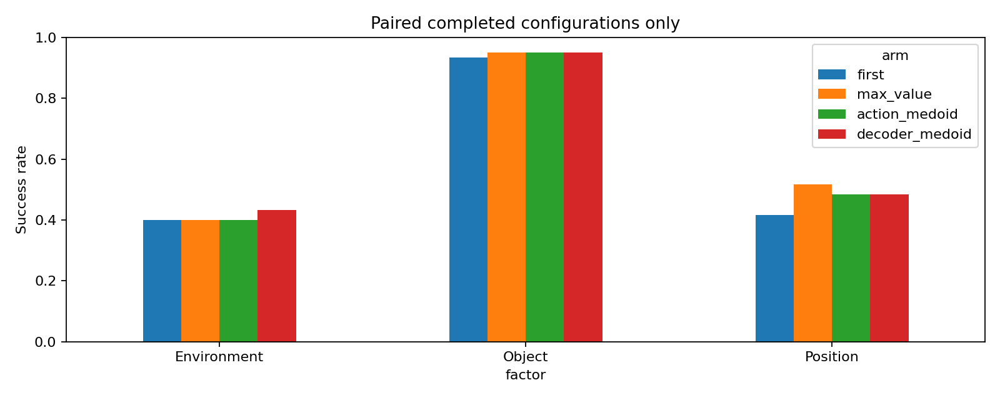

# Decoder-token medoid: полный ночной тест, controls и выводы

Серия **полностью завершена 12 сентября 2026 в07:31 MSK**, до deadline10:00.
**1440/1440 rollout**:720 main H16,360 fixed-seed controls,360 H8 controls.
Дополнительно3 hook smoke, не входящих в SR. Активных workers нет.

**Главный итог: decoder-medoid не превзошёл max-value.** При H16 оба дали
112/180 success (62.22%), но на разных эпизодах. Fixed-seed controls не
подтвердили добавленную полезность hidden consensus. H8/prefix-вариант тоже
не дал выигрыша над своим H8 max-value control.

[Основной протокол](DECODER_TOKEN_MEDOID_PROTOCOL_20260911.md),
[ночные дополнительные контроли](DECODER_MEDOID_NIGHT_20260912.md),
[общая сводка](../publication/iclr2027/RESULTS_AND_ANALYSIS.md),
[исходный main report](campaigns/decoder_token_medoid_20260911/analysis/REPORT.md),
[исходный night report](campaigns/decoder_token_medoid_20260911/night_analysis/REPORT.md).

## 1. Что именно проверено

Перенос decoder-space medoid из
[Robotics_project_YSDA](https://github.com/Doub1e05/Robotics_project_YSDA/tree/f1bb8d6221a7ee22bd34a72ec642cac244b4f89b)
на frozen Cosmos Policy, а не точное воспроизведение GR00T/MIMIC результатов.

| Параметр | Main / fixed-seed controls | H8 controls |
|---|---|---|
| Benchmark | LIBERO-PRO Object suite: Object, Environment, Position x0.2/y0.2 | Те же задачи, заранее выбранный subset init0 |
| Tasks | Все10 Object tasks | Все10 |
| Генерируемый chunk | 16 действий ×7 координат | 16×7 |
| Исполняемая часть | До16 | До8, затем fresh observation |
| K | 3 у selectors;1 у fixed controls | 3 |
| Action/future/value | Joint/parallel,5 denoising steps | То же |
| Лимит | 280 действий после10 settle steps | То же |
| Boundary/regrasp | Нет; полный rollout сt0 | Нет |
| Grid | 180 matched cases:60 на каждый factor | 120 matched cases:30 Object,30 Environment,60 Position |
| Seed groups | (1,999,998), (2,997,996), (3,995,994) | Те же |

Seed внутри группы повторно используется на каждом query; это не новый
случайный seed на каждом шаге. Всего60 task/level/init конфигураций ×3 группы
в main,40×3 в H8. Common initial simulator state, реальные input RGB/proprio
и **общий cached q0 candidate pool** зафиксированы для парных arms.
После расхождения действий наблюдения и следующие pools закономерно расходятся.

Это development architecture-transfer grid, не новый скрытый benchmark test.
Нельзя сравнивать62.22% с54.77% в valid199 как прирост метода: изменены K,
набор init/perturbation и seeds. Также это не авторский AR planning $a\to s'\to v$.

## 2. Формулы методов

### Max-value и фиксированные candidates

$$
i_V=\arg\max_{i=1,2,3}V_i,\qquad i_{fixed}\in\{1,2,3\}.
$$

V получается из того же joint sample, что action/future, без отдельного
контрфактического rollout среды. В именах файлов индексы нулевые:
`first`=0, `fixed_candidate_1`=1, `fixed_candidate_2`=2.

### Action-medoid

Реализованный control сравнивает **первые5** действий, хотя исполняет H16:

$$
d_A(i,j)=\sum_{h=0}^{4}\frac{0.9^h}{\sum_{r=0}^{4}0.9^r}
\left[\frac{\|u_{i,h}-u_{j,h}\|_2}{\sqrt3}
+0.5\frac{\theta(R_{i,h}^{\mathsf T}R_{j,h})}{\pi}
+0.25\,\mathbf1\{\operatorname{sign}g_{i,h}\ne\operatorname{sign}g_{j,h}\}\right].
$$

u — translation command, R из axis-angle команды, g — gripper; это расстояние
команд, не предсказанных физических траекторий. Выбирается observed medoid:
$i_A=\arg\min_i\frac1{K-1}\sum_{j\ne i}d_A(i,j)$.

### Decoder-medoid и prefix-weighting

Из последнего conditional forward перед `final_layer` берутся hidden
features action latent frame index4. На candidate:196 spatial tokens ×2048
features. Это **не16 отдельных action-time tokens**: действие повторено
в flattened latent16×28×28 и смешано внутри spatial patches2×2.

$$
w_p=\frac{\sum_{h=0}^{15}C_{ph}\omega_h}
{\sum_{q,h}C_{qh}\omega_h},\qquad
d_Z(i,j)=\sum_p w_p\left(1-
\frac{z_{i,p}^{\mathsf T}z_{j,p}}{\|z_{i,p}\|_2\|z_{j,p}\|_2}\right),
\qquad i_Z=\arg\min_i\frac1{K-1}\sum_{j\ne i}d_Z(i,j).
$$

C counts decoded action scalars каждого момента h в patch p; учитываются
только полные копии chunks, в порядке flatten C,H,W. На этой latent shape
12544=112 полных копий ×112 scalars, без остатка.

- Full: ω=4 на первых4 действиях,1 на остальных12.
- Prefix8: ω=4 на первых4,1 на следующих4,0 на последних8.
- `decoder_full_h8` оставляет full metric, меняет только execution horizon.
- `decoder_prefix_h8` меняет и metric, и horizon; его надо сравнивать с
  `decoder_full_h8` для эффекта prefix, с `max_value_h8` для эффекта selector.

Hook read-only, не модифицирует модель. Совпадение hidden-признаков означает
самосогласованность, а не автоматически высокую probability of task success.

## 3. H16: результаты каждого метода

Во всех factor columns n=60; macro равен среднему трёх factors, здесь он
совпадает с pooled SR. Fixed controls добавили360 rollout, старые720 не пересчитываем
как новую выборку при их включении в six-arm таблицу.

| Метод | Object | Environment | Position | Success /180 | Macro-SR,% | Вывод |
|---|---:|---:|---:|---:|---:|---|
| First, K1 | 56/60 | 24/60 | 25/60 | 105 | 58.33 | Самый простой контроль, без выбора среди candidates |
| Max-value, K3 | 57/60 | 24/60 | **31/60** | **112** | **62.22** | Сильный baseline; лучший Position score из main selectors |
| Action-medoid, K3 | 57/60 | 24/60 | 29/60 | 110 | 61.11 | Выигрыша над max-value нет; близость команд не гарантирует успех |
| Decoder-medoid, K3 | 57/60 | **26/60** | 29/60 | **112** | **62.22** | +2 Environment уравновешены −2 Position; общий gain отсутствует |
| Fixed candidate1, K1 | 57/60 | 25/60 | 28/60 | 110 | 61.11 | Почти тот же результат без K3 selection; важный seed control |
| Fixed candidate2, K1 | 56/60 | 24/60 | 29/60 | 109 | 60.56 | Также близок к hidden-medoid; добавленная полезность selection не подтверждена |



| Парное сравнение | Δmacro-SR, п.п. | Task-cluster95% CI | Rescue / harm |
|---|---:|---|---:|
| Decoder − max-value | **0.00** | [−3.33; 3.33] | **7 /7** |
| Action-medoid − max-value | −1.11 | [−4.44; 1.67] | 7 /9 |
| First − max-value | −3.89 | [−8.33; 0.00] | 5 /12 |
| Decoder − fixed1 | +1.11 | [−2.78; 5.00] | 10 /8 |
| Decoder − fixed2 | +1.67 | [−1.67; 5.56] | 10 /7 |

CI resample tasks внутри factors, удерживая repeats вместе. Они не
скорректированы на multiple comparisons. McNemar в main CSV только
descriptive: повторные seeds одной задачи зависимы. Это не доказательство
эквивалентности методов, но положительный superiority claim не поддержан.

## 4. Механизм: зависимость hidden-medoid от noise seed

Среди2341 query main decoder-medoid:

| Seed group | Часто выбираемый index /seed | Выборов /queries | Доля |
|---|---|---:|---:|
| (1,999,998) | 1 /999 | 652/772 | 84.46% |
| (2,997,996) | 0 /2 | 656/788 | 83.25% |
| (3,995,994) | 2 /994 | 634/781 | 81.18% |

При этом только40/180 episodes имеют строго постоянный index на всех queries.
То есть selector **не полностью константный**, но сильно привязан к seed group.
Пуловая частота индексов близка к равномерной и скрывает эту зависимость.
Query counts описательные: длинные fail-эпизоды дают больше queries.
Однако при равном весе episodes доли этих же любимых индексов остаются
85.90%,84.99%,82.70%. Уже на q0 они выбраны в43/60,37/60,43/60 cases:
это не только эффект большей длины fail. Источники:
[q0 choices](campaigns/decoder_token_medoid_20260911/analysis/q0_choice_frequencies.csv),
[episode-weighted fractions](campaigns/decoder_token_medoid_20260911/analysis/episode_choice_frequencies.csv).

Разность decoder−max по seed groups: −1/60,+1/60,0/60. Устойчивого
положительного направления по группам нет. Environment gain получен только
на task9/init1 в двух seed groups, не на большом наборе разных сцен.

**Интерпретация:** cosine-центральность hidden может отражать структуру
диффузионного шума/представления сильнее, чем качество действия. Наблюдаемый
seed bias и fixed controls поддерживают эту гипотезу, но ещё не доказывают
её причинно. Нельзя объявлять доказанным, что весь возможный gain объясняется
seed, или выбирать лучший seed post-hoc и выдавать это за новый метод.

В shadow-диагностике на2341 main H16 queries prefix8 и full hidden metric
выбирают разные candidates только в**7.22%** запросов; uniform и full в16.66%.
Это ещё одно ограничение силы изменения representation. Здесь оцениваются
choices на уже собранных состояниях H16, не дополнительные H8 rollout
и не контрфактический SR uniform selector.

## 5. H8: частое перепланирование и prefix-медоида

Только matched init0 subset. **Другой baseline:** H16 max здесь65%, а не62.22%.
Macro не равен success/120, потому что Position имеет вдвое больше cases.

| Метод | Object /30 | Environment /30 | Position /60 | Success /120 | Macro-SR,% | Вывод |
|---|---:|---:|---:|---:|---:|---|
| H16 max-value | 28 | 15 | 31 | 74 | 65.00 | Контроль horizon на том же subset |
| H16 decoder | 30 | 15 | 29 | 74 | 66.11 | Тот же pooled count, другая macro-оценка |
| H8 max-value | 28 | 13 | 25 | 66 | **59.44** | Частое feedback не помогло среднему SR |
| H8 decoder full | 27 | 12 | 26 | 65 | 57.78 | Хуже H8 max по точечной оценке |
| H8 decoder prefix8 | 27 | 12 | 29 | 68 | **59.44** | Prefix немного лучше full, но только сравнялся с H8 max |

| Сравнение | Δmacro-SR, п.п. | Task-cluster95% CI | Rescue /harm |
|---|---:|---|---:|
| Full H8 − max H8 | −1.67 | [−6.67; 2.78] | 9 /10 |
| Prefix H8 − max H8 | 0.00 | [−5.56; 5.00] | 9 /7 |
| Prefix H8 − full H8 | +1.67 | [−0.56; 3.89] | 4 /1 |
| Max H8 − max H16 | −5.56 | [−13.89; 1.67] | 9 /17 |
| Full H8 − decoder H16 | −8.33 | [−19.44; 1.11] | 8 /17 |

Macro0.00 при9/7 — не ошибка: rescues/harms посчитаны по120 episodes,
а macro выравнивает три factors. Все CI включают0; численное ухудшение
не является доказательством универсального вреда H8.


H8 получает настоящие свежие RGB, а не предсказанные изображения. Оно
отбрасывает половину старого chunk и меняет дальнейшую траекторию; больше
наблюдений не гарантирует более согласованное или успешное продолжение.
Эта возможная причина согласуется с прежними fresh8 опытами, но отдельного
causal continuity test в данной серии нет.

H16-predicted future нельзя сравнивать с реальностью после8 действий:
в H8 `prediction_errors` намеренно пустые. Ошибки future считаются только
после полностью исполненного16-action chunk, не на terminal/truncated chunk.

## 6. Вычислительная цена

Логические candidate evaluations за episode для max-value на matched subset:

| Factor | H16 | H8 | Отношение |
|---|---:|---:|---:|
| Object | 29.00 | 55.90 | 1.93× |
| Environment | 40.20 | 83.10 | 2.07× |
| Position | 46.75 | 94.30 | 2.02× |

Каждый candidate использует5 denoising evaluations. K1 controls выполняют
один candidate/query вместо трёх; это не гарантирует ровно3× wall-time
ускорение из-за разных длин episodes и фиксированных накладных расходов.
Сохранённый elapsed_seconds — shared-server collector time с cached q0,
hooks и логированием; он не является чистым production latency benchmark.
При удвоении логических calls H8 не показал SR gain.

## 7. Выводы и дальнейшее решение

1. **Не продвигать текущий decoder-medoid как улучшенный planner/SOTA.**
   Получен воспроизводимый перенос реализации, а не воспроизведение чужого gain.
2. **Action-medoid тоже не получил поддержки.** Простая центральность action
   или hidden пространства не заменяет action-conditioned success estimate.
3. **Fixed seed controls обязательны.** Без них разность с first K1 можно
   ошибочно приписать адаптивному consensus. Следующий diagnostic, если
   продолжать: независимые noise pools и повторения одного observation,
   randomization seed-to-index, centering/whitening с обучением только на train.
4. **Не расширять always-H8 sweep.** Prefix8 заслуживает максимум узкого
   mechanistic test; нынешний +1.67п.п. к full не подтверждён и не выигрывает
   у max H8. Более перспективен conditional feedback/recovery с harm control.
5. Для научного claim полезен отрицательный результат со строгими controls:
   seed affinity, representation mismatch, отсутствие gain при более частом
   feedback. Не утверждать, что это опровергает KeyStone/KDPE или результаты
   другой архитектуры. [Различия работ](../publication/iclr2027/RELATED_WORK_RESULTS.md).

## 8. Где смотреть данные и воспроизвести анализ

Все данные скачаны локально; завершён повторный CPU-аудит:

- SHA256 исходных NPZ/MP4,180 общих q0 pools и initial snapshots проверены.
- Во всех **1440 rollout /23933 query** исполненные actions точно совпадают
  с выбранным candidate chunk/prefix; следующий input RGB точно совпадает
  с предыдущим actual RGB. Проверены seeds, индексы selector и physical budget.
- Проверены временные условия расчёта prediction errors: H16 future не
  сравнивается с H8 observation; это не повторный численный расчёт всех MSE/SSIM.
- **1440 видео /297109 кадров** полностью декодированы; длины совпали с
  trace metadata. Выбранные раскадровки также просмотрены.
- 74 CPU-теста observation/decoder/night/review прошли. Этот аудит не
  является новым stochastic повтором модели или независимым holdout.

[Все стратегии, полные видео по конфигурациям](campaigns/decoder_token_medoid_20260911/night_analysis/video_comparison.html),
[main four-way gallery](campaigns/decoder_token_medoid_20260911/analysis/video_comparison.html),
[выбранные rescue/harm примеры](campaigns/decoder_token_medoid_20260911/review_20260912/selected_videos.html),
[query metrics](campaigns/decoder_token_medoid_20260911/night_analysis/queries.csv),
[main pairs](campaigns/decoder_token_medoid_20260911/analysis/paired_comparisons.csv),
[H8 pairs](campaigns/decoder_token_medoid_20260911/night_analysis/horizon8__paired_comparisons.csv),
[fixed-seed pairs](campaigns/decoder_token_medoid_20260911/night_analysis/seed_controls__paired_comparisons.csv),
[CPU trace audit](campaigns/decoder_token_medoid_20260911/review_20260912/summary.json).

Видео включают initial frame и каждый исполненный шаг до success/t280,
две камеры,20fps. Это не иллюстрационные reruns и не обрезка по длине success.
Тесты здесь полные: deadline truncation не случился. Поле `dependency_status`
в final metadata осталось исторически `running`; completed counts,
reports_complete, отсутствие active workers и завершение dependency проверены
отдельно. Это не признак незавершённых1440 rollout.

```bash
/home/alexander/venvs/cosmos_policy_libero/bin/python scripts/analyze_decoder_token_medoid.py --campaign experiments/campaigns/decoder_token_medoid_20260911
/home/alexander/venvs/cosmos_policy_libero/bin/python scripts/analyze_decoder_medoid_night.py --campaign experiments/campaigns/decoder_token_medoid_20260911
/home/alexander/venvs/cosmos_policy_libero/bin/python scripts/review_night_results_20260912.py --campaign experiments/campaigns/decoder_token_medoid_20260911 --kind decoder --decode-videos
```

Эти команды только CPU-аудит/анализ уже сохранённых результатов, не новый rollout.
