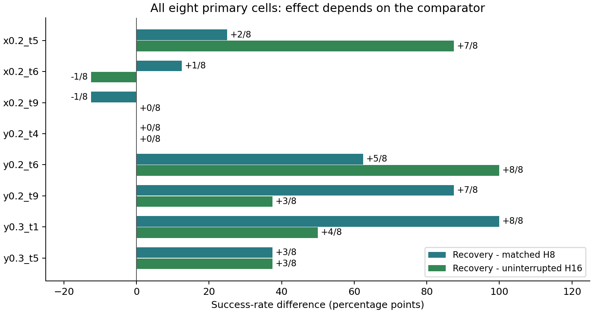

# Результаты и проверка доступности: вечер 14 сентября 2026

## Что удалось проверить

Это повторный анализ **уже завершённой recovery confirmation** и проверка
состояния новой общей серии P3. Это не объявление результатов нового benchmark.

Проверка доступа начата в 20:15 МСК. Две попытки SSH, включая новое соединение
без multiplexing, завершились ошибкой «Connection timed out during banner
exchange». Свежие серверные результаты не скачаны. Это не устанавливает ни
блокировку учётной записи, ни остановку GPU-процессов.

| Серия | Подтверждённое состояние | Можно использовать SR? |
|---|---|---|
| Recovery confirmation, main | 512/512 ветвей, 128 парных конфигураций, 4 arm | Да, с разделением primary и transfer |
| Recovery timing | 768/768 дополнительных ветвей, те же исходные траектории | Да, как зависимые timing controls |
| Grounding | 32 geometry cases, 128 oracle/replay ветвей | Да, только как privileged diagnostic |
| Старый event-shadow | Завершение не достигнуто, техническая ошибка | Нет; не путать с новой P3-event серией |
| P3 benchmark v3 | Последний локальный статус: running/main, 14 сентября 13:26 МСК | Свежий результат неизвестен |

План P3 v3: 199 конфигураций × 5 стратегий = 995 rollout.
Smoke 12/12 был завершён, восемь main workers были проверены при запуске.
Дедлайн очереди: 15 сентября, 11:17 МСК; это лимит, не ETA.
Нулевая полнота локальной analysis относится к началу серии и **не означает
995 неудачных эпизодов или отсутствие прогресса сейчас**.
Новых вычислений и дублирующих запусков при этом разборе не создано.

## Повторный аудит завершённых данных

В main/branch_outcomes.json проверены все 512 записей:
- каждый terminal outcome доступен;
- нет дубликатов case_id/arm;
- все 64 строки cohort/cell/arm точно совпадают с n и successes из cell_scores.csv;
- rollout seed одинаков у четырёх arm внутри каждой парной конфигурации.

Это повторная проверка локальных записей, **не повторный GPU-эксперимент**.
NPZ и видео заново с сервера не получены и в этом проходе не декодировались.

| Метод | Primary, n=64 | Transfer x0.3, n=64 |
|---|---:|---:|
| Max-value H16 | 17/64 = 26,56% | 0/64 |
| H8 после t72 | 16/64 = 25,00% | 0/64 |
| RGB physical regrasp | **41/64 = 64,06%** | 1/64 |
| Preserve-only extension | 41/64 = 64,06% | 1/64 |

Recovery против H8: **+39,06 п.п.**, 95% init-cluster CI [29,69; 48,44],
27 rescue / 2 harm. Против H16: +37,50 п.п., 28 rescue / 4 harm
на primary; это описательное сравнение внутри primary, не новая
пререгистрированная проверка. Preserve-only не добавляет успехов в сумме:
1 rescue / 1 harm относительно recovery по всем 128 конфигурациям.

## Разбор по всем восьми primary-конфигурациям

Каждый count ниже имеет знаменатель 8. Все клетки сохранены, не только лучшие.

| Position / task | H16 | H8 | Recovery | Net к H8 | Net к H16 | Rescue/harm к H8 |
|---|---:|---:|---:|---:|---:|---:|
| x0.2 / 5, tomato sauce | 1 | 6 | 8 | +2 | +7 | 2/0 |
| x0.2 / 6, butter | 6 | 4 | 5 | +1 | -1 | 1/0 |
| x0.2 / 9, orange juice | 1 | 2 | 1 | -1 | 0 | 0/1 |
| y0.2 / 4, ketchup | 0 | 0 | 0 | 0 | 0 | 0/0 |
| y0.2 / 6, butter | 0 | 3 | 8 | +5 | +8 | 5/0 |
| y0.2 / 9, orange juice | 4 | 0 | 7 | +7 | +3 | 7/0 |
| y0.3 / 1, cream cheese | 4 | 0 | 8 | +8 | +4 | 8/0 |
| y0.3 / 5, tomato sauce | 1 | 1 | 4 | +3 | +3 | 4/1 |
| **Итого** | **17** | **16** | **41** | **+25** | **+24** | **27/2** |

Прирост SR в п.п. для строки равен 100 × Net / 8. Это описательные малые
подгруппы уже использованной выборки, без утверждения значимости каждой клетки.

### Новое уточнение к интерпретации

Положительный point estimate есть в 6/8 клеток относительно H8 и в 5/8
относительно H16. На x0.2/task6 P3 лучше H8, но хуже H16. Поэтому формулировка
«метод улучшает каждую конфигурацию» неверна.

Близкие общие scores H16 и H8 скрывают различия:
- На y0.2/task9 и y0.3/task1 переход к H8 снижает SR с 4/8 до 0/8.
- На x0.2/task5, наоборот, H8 повышает SR с 1/8 до 6/8.
- Две клетки y0.2/task9 и y0.3/task1 дают 15 из 25 дополнительных успехов
  P3 против H8. Против H16 их вклад уже 7 из 24.
- При этом общий выигрыш P3 положителен против обоих контролей.
  Это не объясняется только слабостью H8, но величина локального эффекта
  существенно зависит от comparator.

Решение: сохранять **оба** контроля. Не выбирать H8 или H16 для каждой
сцены постфактум по тому, где прирост P3 выглядит больше. Не сравнивать эти
условные scores с общей Object/Environment/Position таблицей valid199.

## Выводы для исследования

1. Наиболее обоснованное положительное утверждение остаётся прежним:
   целевое физическое восстановление помогает frozen Cosmos на фиксированных,
   знакомых локализатору Position-конфигурациях.
2. Это эффект полного controller, а не доказанная универсальная uncertainty
   metric. Геометрический gate проверяет допустимость, не ожидаемую пользу.
3. Перенос не подтверждён: x0.3 даёт 1/64. Oracle XY повышает результат с
   0/16 до 3/16 в отдельной диагностике, но не исправляет большинство случаев.
4. Preserve-only не превзошёл recovery в confirmation. Усложнять его дальше
   до закрытия независимой общей проверки оснований меньше.
5. Событийный P3-event ещё нельзя объявлять успешным, неуспешным или
   превосходящим fixed t72: текущие исходы с сервера недоступны.
6. Малые per-cell результаты годятся для объяснения неоднородности и
   формулирования будущих гипотез, но не для настройки метода на этой же
   evaluation-выборке.

## Следующий шаг

### Дополнительная проверка доступа в 20:30 МСК

С IPQoS=none один вызов SSH true успешно прошёл авторизацию и завершился
с кодом 0. Однако последующие чтения статуса, в том числе с теми же
настройками, снова остановились на SSH banner timeout. Это не устойчивое
исправление; новых исходов эксперимента не получено.

С разрешения пользователя закрыт только локальный SSH-монитор nvtop
(PID 2019209, предварительно проверена его команда). Вычислительные
процессы и научные конфигурации не изменялись. После закрытия монитора
проблема новых подключений сохранилась. Оснований считать nvtop причиной
или объявлять доступ заблокированным нет.

[Машиночитаемая запись диагностики](campaigns/p3_benchmark_closure_20260914_v3/local_connection_check_20260914_2030.json).

Администратору: «Шлюз ssh-sr006-jupyter.ai.cloud.ru:2222 принимает TCP,
но новые SSH-подключения преимущественно не получают banner. Один вызов
успешно авторизовался по publickey и выполнил true. Ранее также был ответ
target host connection failed. Проверьте SSH portal и доступность целевого
SR006; просьба сохранить данные и работающие эксперименты, без перезапуска
узла до выяснения состояния».

Сначала восстановить доступ и получить результаты существующей очереди,
а не создавать новый прогон. После подключения проверить свежесть
sequence_status.json, существование supervisor/worker PID, completed.json
и целостность всех arm. Затем скачать результаты:

~~~bash
bash scripts/sync_p3_benchmark.sh --status
bash scripts/sync_p3_benchmark.sh
~~~

Для окончательного вывода нужны 199/199 полностью matched конфигураций,
complete=true и пройденные проверки. Если очередь прервана, недостающие
случаи не считаются fail; продолжение использует прежние config/seeds.
До этого final Macro-SR, significance и выбор лучшего нового arm не публикуются.

## Источники

- [Полный финальный recovery-отчёт](RECOVERY_FINAL_RESULTS_20260914.md).
- [512 локальных исходов](campaigns/recovery_confirmation_20260913/analysis/main/branch_outcomes.json).
- [Per-cell scores](campaigns/recovery_confirmation_20260913/analysis/review/cell_scores.csv).
- [Парные эффекты](campaigns/recovery_confirmation_20260913/analysis/main/paired_effects.csv).
- [Протокол новой серии](P3_BENCHMARK_CLOSURE_PROTOCOL_20260914.md).
- [Последний сохранённый акт запуска](campaigns/p3_benchmark_closure_20260914_v3/LAUNCH_VERIFIED.md).
- [Запись этой проверки](campaigns/p3_benchmark_closure_20260914_v3/local_review_20260914_2015.json).

SHA256 проверенных исходов:
4d95bef0e1a8641e69219017e52d1f04dcb8f6b3c92d6ea3528ae71a706d1b46.

SHA256 таблицы клеток:
ce811a0653f92dd8b52690e028c4c51ac4eea0d40ca314c1c77976920982531f.
