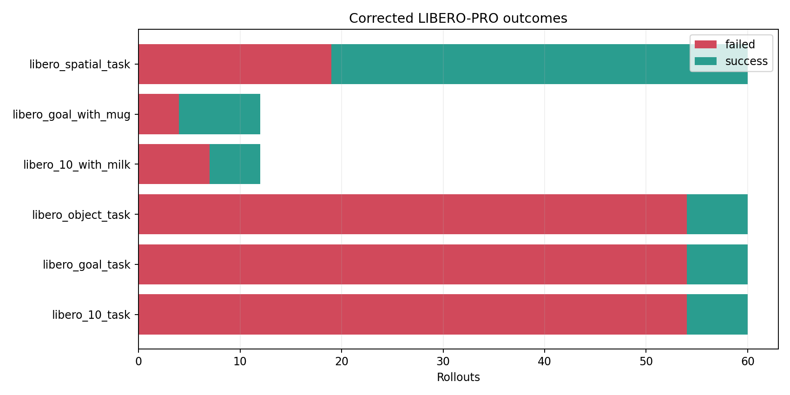
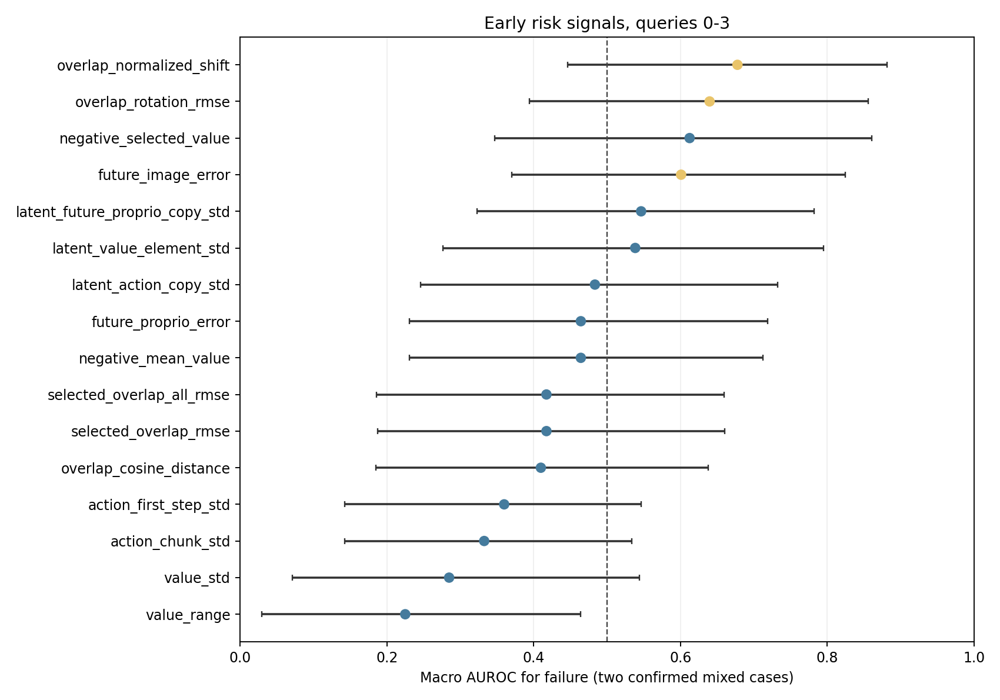

# Corrected LIBERO-PRO boundary screening: результаты

Дата анализа: 24 августа 2026 года.

## Краткий вывод

Кампания полностью завершена: 264/264 rollout, 72 success и 192 fail. После
исправления источника команды и task-aware разметки падений task-OOD suites
действительно создают сложные случаи, однако почти всегда детерминированные:
из 40 новых configurations 30 дали только fail, 9 только success и одна смесь
`5 success / 1 fail`.

Основная гипотеза в текущем виде **не подтверждена**. Ни stochastic action/value
uncertainty, ни заранее выбранные temporal-overlap distances не дают устойчивого
раннего failure detector. Лучший preregistered score имеет macro AUROC 0.613,
его 95% bootstrap CI включает 0.5. Лучший exploratory score имеет AUROC 0.678,
но не переносится одинаково между двумя mixed cases и не значим после поправки
на множественную проверку (`BH q=0.87`).

Следовательно, не следует дальше подбирать коэффициент в формуле
`value - lambda * uncertainty`. Продолжать стоит две более точные ветки:

1. adaptive feedback horizon, для которого уже получен causal gain;
2. grounded candidate ranking, где альтернативные chunks оцениваются по их
   фактическим последствиям из одного simulator state.

Task-OOD screening остаётся полезным OOD stress benchmark и источником
grounding failures, но не основной paired-выборкой для uncertainty detector.

## Протокол и целостность

В каждом query Cosmos Policy генерировала `B=4` stochastic action chunks длины
`H=16`, выбирала candidate с максимальным predicted value и исполняла первые
`K=8` действий. Uncertainty и overlap только записывались и не меняли policy.

Проверки данных:

- 6/6 jobs завершились без пропусков;
- 264 уникальных episode и 10 255 query;
- 9 991/9 991 допустимых overlap transitions выровнены как
  `A_q[8:16]` против `A_{q+1}[0:8]`;
- rollout seeds независимы;
- policy во всех 40 task-OOD cases получила команду из активного BDDL;
- raw traces сохранены локально и на сервере, compact summaries находятся в
  [`campaigns/ground_truth_boundary_screening_20260824/analysis`](campaigns/ground_truth_boundary_screening_20260824/analysis).

## Outcomes

| Suite | Rollouts | Success | Fail | Success rate |
|---|---:|---:|---:|---:|
| `libero_goal_task` | 60 | 6 | 54 | 10.0% |
| `libero_spatial_task` | 60 | 41 | 19 | 68.3% |
| `libero_object_task` | 60 | 6 | 54 | 10.0% |
| `libero_10_task` | 60 | 6 | 54 | 10.0% |
| `libero_goal_with_mug/task9` | 12 | 8 | 4 | 66.7% |
| `libero_10_with_milk/task9` | 12 | 5 | 7 | 41.7% |



Из 181 task-OOD failures:

| Failure type | Count | Интерпретация |
|---|---:|---|
| Wrong-object interaction candidate | 125 | policy действует в сторону знакомого, но неверного для активного BDDL объекта |
| Timeout without goal progress | 32 | задача не была заземлена или действие не привело к прогрессу |
| Kinematic deadlock candidate | 16 | движение практически остановилось до достижения цели |
| Premature target drop | 8 | физическая манипуляционная ошибка до выполнения predicate |

Ещё шесть successful rollout в `libero_10_task/task8` временно двигали
нецелевой объект, но затем выполнили задачу. Поэтому wrong-object event является
поведенческим сигналом, а не самостоятельной меткой terminal failure.

Главный результат screening: 39/40 новых cases оказались одноклассовыми. Это
показывает сильный OOD effect, но case identity почти полностью объясняет исход.
Такой набор нельзя использовать как честное доказательство online prediction.

## Mixed cases

| Case | Success / fail | Характер failures |
|---|---:|---|
| `libero_10_with_milk/task9/init0` | 5 / 7 | шесть incomplete second-subgoal timeouts, один deadlock |
| `libero_goal_with_mug/task9/init0` | 8 / 4 | три deadlock, один target drop на шаге 217 |
| `libero_spatial_task/task7/init0` | 5 / 1 | один физический target drop на шаге 201; provisional case |

Первые два cases заранее были известными controls и входят в primary
within-case анализ. Третий найден screening, но один minority outcome
недостаточен для confirmatory статистики.

Replay `libero_spatial_task/task7/init0` подтвердил физический смысл метки. В
fail seed `1670194` миска поднялась максимум на 0.062 м и была отпущена до
достижения `on(bowl, plate)`; в success seed `1670000` подъём составил 0.107 м,
а goal predicate выполнился на шаге 118:

- [fail replay](campaigns/ground_truth_boundary_screening_20260824/analysis/ground_truth_results/libero_spatial_task7_init0__fail_seed1670194_replay.mp4)
- [success replay](campaigns/ground_truth_boundary_screening_20260824/analysis/ground_truth_results/libero_spatial_task7_init0__success_seed1670000_replay.mp4)
- [fail storyboard](campaigns/ground_truth_boundary_screening_20260824/analysis/ground_truth_results/libero_spatial_task7_init0__fail_storyboard.png)
- [success storyboard](campaigns/ground_truth_boundary_screening_20260824/analysis/ground_truth_results/libero_spatial_task7_init0__success_storyboard.png)

## Раннее предсказание terminal fail

Для каждого episode и метрики использовался только ранний участок до 32
исполненных действий:

$$
s_{e,m}^{\mathrm{early}}
=\max_{q\in\{0,1,2,3\}} r_m(e,q),
$$

где score ориентирован так, что большее значение должно означать больший риск.
Для value использовались `-mean_value` и `-selected_value`. Macro AUROC сначала
считался внутри каждого одинакового `suite/task/init_state`, затем усреднялся
по двум confirmed mixed cases. CI получен class-stratified bootstrap, p-value -
перестановкой labels внутри case, затем применена Benjamini-Hochberg correction.

| Metric | Status | Macro AUROC | 95% CI | BH q |
|---|---|---:|---:|---:|
| Normalized candidate-set overlap shift | exploratory | 0.678 | [0.446; 0.882] | 0.870 |
| Rotation overlap RMSE | exploratory | 0.640 | [0.394; 0.856] | 0.870 |
| Negative selected value | preregistered | 0.613 | [0.347; 0.861] | 0.870 |
| Future-image prediction MSE | exploratory feedback | 0.601 | [0.371; 0.825] | 0.870 |
| Latent future-proprio copy std | preregistered | 0.546 | [0.323; 0.782] | 0.986 |
| Selected overlap RMSE | preregistered | 0.417 | [0.187; 0.661] | 0.986 |
| First-action stochastic std | preregistered | 0.360 | [0.143; 0.547] | 0.986 |
| Action-chunk stochastic std | preregistered | 0.333 | [0.143; 0.534] | 0.986 |
| Value std | preregistered | 0.285 | [0.071; 0.544] | 0.986 |
| Value range | preregistered | 0.225 | [0.030; 0.464] | 0.986 |



Нормированный shift сравнивает средние candidate sets в старом tail и новом
prefix, относящихся к одному абсолютному времени:

$$
D_{\mathrm{shift},q}=
\frac{\left\|\bar x_q-\bar y_{q+1}\right\|_2}
{\sqrt{\sum_j\operatorname{Var}_B(x_{q,j})+
       \sum_j\operatorname{Var}_B(y_{q+1,j})+\varepsilon}},
$$

$$
x_q=\operatorname{vec}(A_q[:,8:16,0:6]),
\qquad
y_{q+1}=\operatorname{vec}(A_{q+1}[:,0:8,0:6]).
$$

Он интереснее plain selected RMSE, но пока является post-hoc гипотезой. Его
AUROC сильно различается между cases: 0.543 на milk и 0.813 на mug. Ни одна из
16 проверенных метрик не имеет `q<0.05`.

Особенно важен обратный эффект: value/action uncertainty чаще была **ниже** в
fail episodes. Это не означает, что её надо просто поменять знаком. Модель может
быть согласованно и уверенно неверной, а знак связи меняется между задачами.

## Prediction error после feedback

Future-proprio error сравнивает предсказанное состояние после chunk с реальным
observation после его исполнения. Его macro AUROC меняется с фазой:

| Query | Реальное состояние уже получено после шага | Macro AUROC |
|---:|---:|---:|
| 0 | 8 | 0.560 |
| 2 | 24 | 0.693 |
| 3 | 32 | 0.464 |
| 5 | 48 | 0.740 |
| 6 | 56 | 0.524 |
| 10 | 88 | 0.255 |

Query 5 выбран после просмотра результатов и не является confirmatory finding.
Даже там AUROC равен 0.886 на milk и 0.594 на mug. Prediction error может быть
полезным phase-conditioned feedback signal, но один глобальный threshold не
поддерживается данными.

## Что обнаружено надёжно

1. Исправленная task-OOD разметка работает: policy и simulator теперь получают
   одну команду, а корректный placement не считается падением.
2. Discrete task replacement создаёт сильный OOD shift, но преимущественно
   уверенно неправильные, детерминированные modes.
3. Простая stochastic uncertainty не является монотонной оценкой failure risk.
   В частности, `value_std` и `value_range` на mixed controls направлены
   противоположно исходной гипотезе.
4. Plain selected old-tail/new-prefix distance снова не прошла detector gate.
5. Низкое predicted value даёт умеренный сигнал сложности case: на 39
   одноклассовых task-OOD cases initial `-selected_value` имеет AUROC 0.685, а
   `-mean_value` 0.681. Это не доказывает способность ранжировать candidates
   внутри одного состояния.
6. Новый `spatial_task/task7/init0` является правдоподобным boundary case, но
   требует новых seeds и минимум второго независимого fail.

## Решение и следующий эксперимент

### Что продолжаем

- task-aware simulator ground truth и раздельные endpoints `drop`,
  `wrong_object`, `no_progress`, `deadlock`, official safety;
- adaptive requery/horizon: в предыдущем matched 2x2 именно ранний feedback дал
  causal improvement, тогда как selection-only penalty его не дал;
- поиск same-case boundary data через плавное изменение сложности, а не только
  дискретную замену task;
- action-conditioned grounded evaluator.

### Что не масштабируем

- линейный `mean(value) - lambda * value_std/value_range` как основной planner;
- plain selected overlap RMSE и подбор дополнительных весов на этом наборе;
- обучение detector на смеси all-fail/all-success tasks без whole-case split;
- утверждение, что future-proprio error на query 5 уже предсказывает fail.

### Следующая confirmatory постановка

1. Для трёх текущих mixed cases и 3-5 новых parametrically tuned cases собрать
   30-60 fresh seeds на case. Интенсивность perturbation подбирать только на
   screening split, целевой success rate 20-80%.
2. Из одного сохранённого simulator state выполнить каждый из `B=4` candidate
   chunks в отдельных branches. Для candidate задать grounded target

$$
G_i=\Delta\mathrm{goal\ progress}_i
-\beta_d I_{\mathrm{drop},i}
-\beta_w I_{\mathrm{wrong\ object},i}
-\beta_n I_{\mathrm{no\ progress},i}.
$$

3. Проверить pairwise ranking и oracle regret для `value`, uncertainty,
   overlap, action-conditioned future/value и небольшого grounded critic.
4. Только score, который ранжирует фактические candidate consequences на
   held-out cases, допускать к paired closed-loop сравнению с `max(value)`.
5. Temporal detector допускается к intervention только при frozen whole-case
   gate: AUROC >= 0.65, AUPRC/prevalence >= 2, TPR >= 0.30 при FPR <= 0.05 и
   median lead >= 8 steps. Текущие результаты этот gate не прошли.

Итоговое направление меняется с общего вопроса «неуверенна ли модель перед
провалом?» на причинный вопрос «какой candidate из одного состояния приводит к
лучшему реальному прогрессу и меньшему task-critical risk?». Это более прямой
путь к улучшению planning.

## Воспроизведение

```bash
/home/alexander/venvs/cosmos_policy_libero/bin/python \
  scripts/analyze_ground_truth_boundary_results.py \
  --campaign-dir \
    experiments/campaigns/ground_truth_boundary_screening_20260824 \
  --inference-samples 5000
```

Machine-readable результаты:

- [`summary.json`](campaigns/ground_truth_boundary_screening_20260824/analysis/ground_truth_results/summary.json)
- [`case_outcomes.csv`](campaigns/ground_truth_boundary_screening_20260824/analysis/ground_truth_results/case_outcomes.csv)
- [`mixed_early_metric_auc.csv`](campaigns/ground_truth_boundary_screening_20260824/analysis/ground_truth_results/mixed_early_metric_auc.csv)
- [`future_proprio_feedback_by_query.csv`](campaigns/ground_truth_boundary_screening_20260824/analysis/ground_truth_results/future_proprio_feedback_by_query.csv)
- [`task_difficulty_metric_auc.csv`](campaigns/ground_truth_boundary_screening_20260824/analysis/ground_truth_results/task_difficulty_metric_auc.csv)
