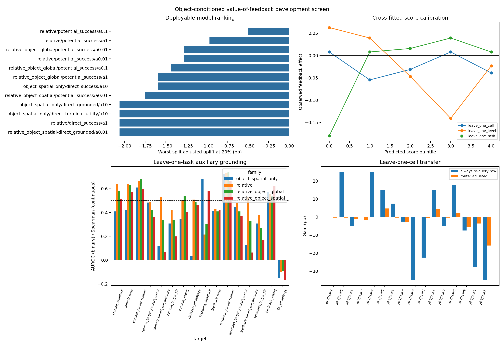

# Object/contact-conditioned VoF: development result

Дата анализа: 3 сентября 2026 года.

## Решение

Frozen-CLIP linear formulation **не прошла development gate**. Новый
confirmatory holdout для неё собирать не нужно. Результат закрывает конкретную
комбинацию `CLIP ViT-B/32 patch statistics + linear ridge/logistic heads`, но не
всю идею object-centric consequence modelling.

Полные таблицы и OOF predictions находятся в
[`campaigns/object_contact_vof_development_20260903/analysis/`](campaigns/object_contact_vof_development_20260903/analysis/).

## Постановка

Мы объединили все ранее собранные strict query-4 exact-state пары:

- 240 состояний из signed-VoF new-task holdout;
- 400 состояний из invariant-CATE reserve holdout;
- итого 640 строк, 320 независимых `level x task x init` групп и 16
  task/perturbation cells.

Для каждой строки известны два терминальных исхода из одного состояния:
`commit` продолжает старый action chunk, а `feedback` после восьми действий
использует реальное наблюдение и строит новый остаток chunk. Causal target:

$$
\tau_i = Y_i^{F} - Y_i^{C}, \qquad Y_i^b \in \{0,1\}.
$$

В корпусе commit SR равен 57.97%, feedback SR 55.78%; имеется 80 rescues,
94 harms и 466 ties. Следовательно, causal opportunity достаточно, но
безусловный feedback вреден.

## Признаки и модели

До принятия решения используются только доступные online данные: текущие RGB
agent/wrist views, четыре предсказанных Cosmos future views, task language,
proprio, action chunks и values. Frozen CLIP ViT-B/32 строит 7x7 карты
сходства patch embeddings с текстовыми понятиями target object и basket.

Из карт извлекаются confidence, entropy, centroid, spatial spread,
target/basket overlap и изменения между текущим и предсказанным кадрами.
Проверены пять семейств:

1. `relative`: 80 прежних relative action/value/proprio признаков;
2. `relative_object_global`: relative + 22 global object признака;
3. `relative_object_spatial`: relative + все 112 object/spatial признаков;
4. `object_spatial_only`: только 112 object/spatial признаков;
5. context diagnostic с известным perturbation level, который не является
   deployable.

Ridge heads напрямую предсказывают success effect, terminal utility effect или
grounded effect:

$$
\tau_i^{G} = \tau_i
-0.25\,\Delta drop_i
-0.125\,\Delta wrong_i
-0.125\,\Delta deadlock_i
+0.10\tanh\!\left(\frac{\Delta lift_i}{0.025}\right)
+0.10\tanh\!\left(\frac{d_i^C-d_i^F}{0.03}\right).
$$

Отдельно logistic potential-outcome heads оценивают

$$
\widehat{\tau}_i =
P(Y_i^F=1\mid x_i)-P(Y_i^C=1\mid x_i).
$$

Router выбирает верхние 20% состояний по score. Его compute-adjusted gain:

$$
G_{adj}=\frac{1}{N}\sum_i q_i\,(\tau_i-0.025),
\qquad q_i=\mathbf{1}\{score_i\text{ входит в top-20\%}\}.
$$

Каждая строка получала prediction только от модели, не обучавшейся на её task,
perturbation level или task-level cell: использованы leave-one-task,
leave-one-level и leave-one-cell OOF схемы.

## Основной результат

| Модель | Split | Adjusted gain | 95% cluster CI | Rescues / harms | AUROC |
|---|---|---:|---:|---:|---:|
| best relative control | task | +0.28 п.п. | [-1.70; +2.27] | 19 / 14 | 0.610 |
| best relative control | level | -0.50 п.п. | [-2.40; +1.38] | 15 / 15 | 0.413 |
| best relative control | cell | -0.03 п.п. | [-1.80; +1.73] | 15 / 12 | 0.536 |
| best object model | task | -0.34 п.п. | [-2.21; +1.52] | 16 / 15 | 0.617 |
| best object model | level | -0.97 п.п. | [-2.89; +0.92] | 14 / 17 | 0.406 |
| best object model | cell | -1.28 п.п. | [-3.13; +0.51] | 12 / 17 | 0.506 |

Лучшим overall оказался **не object model**, а `relative + potential_success`,
`alpha=0.1`. Его worst-split adjusted gain равен -0.50 п.п. Лучший object
вариант `relative_object_global + potential_success`, `alpha=0.01`, получил
-1.28 п.п.; разница с relative control также имеет CI, пересекающий ноль, во
всех трёх split schemes.

Все preregistered проверки не пройдены: object family не стала лучшей, uplift
не положителен во всех splits, worst-cell gains отрицательны, quintile effects
не монотонны, а task-transfer grounding/event thresholds не достигнуты.

## Что всё-таки удалось извлечь

Это не полностью пустой visual encoder. На leave-one-task:

- object-global признаки немного подняли contact AUROC: 0.666 -> 0.681 для
  commit и 0.735 -> 0.741 для feedback;
- object-spatial-only дал AUROC 0.683 для feedback deadlock;
- relative+spatial дал AUROC 0.620 для feedback wrong-object interaction.

Но object features ухудшили перенос target lift и target-to-EEF distance, а ни
один terminal-event head не достиг frozen AUROC 0.75. Главное: частичная
способность распознавать contact/event не превратилась в способность оценить
**разность** исходов feedback и commit. Это distinction между prediction риска
ветви и causal action selection.

## Выводы

1. Геометрический similarity/support и object presence не описывают causal
   support: похожие состояния могут иметь противоположный feedback effect.
2. Leave-one-task результат выглядит умеренно положительным, но разворачивается
   на leave-one-level. Оценивать selector только random/task split было бы
   оптимистично.
3. Frozen low-resolution CLIP patch maps дают слабые contact cues, однако им не
   хватает точной 3D геометрии, состояния grasp и interaction с perturbation.
4. Новый дорогой holdout сейчас неинформативен: ни одна deployable
   конфигурация не прошла offline gate.

## Следующий дешёвый тест

Перед обучением более тяжёлого visual encoder нужен exploratory oracle
interaction upper bound на том же открытом корпусе. Он добавляет явные
`task semantics x perturbation x privileged phase` interactions и отвечает на
один вопрос: существует ли в этих 640 состояниях переносимая функция знака VoF,
если дать модели почти идеальный context?

- Если upper bound также провалит leave-one-level/cell, re-query CATE routing
  следует остановить и перейти к conservative execution/recovery/abstention.
- Если upper bound пройдёт, следующий observable estimator должен использовать
  high-resolution target segmentation/detection, wrist contact geometry и
  action-conditioned temporal features; только затем замораживается новый
  protocol и собирается untouched holdout.

