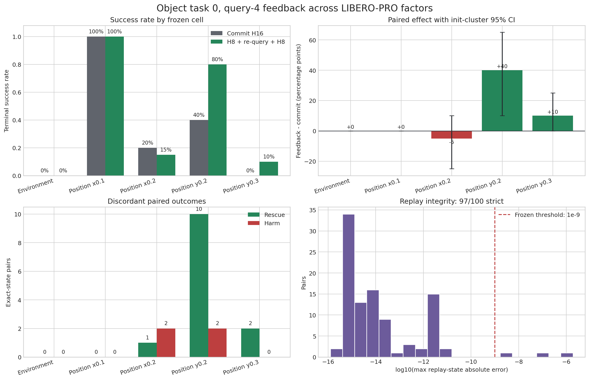

# Object task-0 query-4 cross-factor boundary screen: results

## Decision

The frozen development screen completed 100 exact-state pairs across five
official LIBERO-PRO Position/Environment cells. Its integrity gate passed:
97/100 pairs met the strict replay threshold, above the preregistered minimum
of 95.

The screen found one strong positive boundary cell. On Position `y0.2`, one
real-observation re-query at query 4 increased terminal success from **40% to
80%**: **+40 percentage points**, init-cluster 95% CI **[+10, +65] pp**, 10
rescues / 2 harms and exact McNemar **p = 0.0386**. The frozen query-cost
adjusted gain was +37.5 pp.

This is a development result, not a confirmatory transfer claim. Position
`y0.2` advances to a new-seed always-feedback holdout. Position `x0.2`, which
gave 20% -> 15%, advances with it as a negative boundary control. No cell met
the preregistered bidirectional effect-support requirement of at least three
rescues and three harms, so these data do not authorize training or claiming a
selective trigger.

Frozen protocol:
[`OBJECT_Q4_CROSS_FACTOR_BOUNDARY_SCREEN_PROTOCOL_20260902.md`](OBJECT_Q4_CROSS_FACTOR_BOUNDARY_SCREEN_PROTOCOL_20260902.md).

## Intervention and estimand

Every pair shares the same policy prefix, query-4 four-candidate pool,
`argmax(value)` candidate and captured simulator/controller state. The two
branches are

$$
\text{commit}: A_{64:80}^{old},
$$

$$
\text{feedback}: A_{64:72}^{old}\rightarrow o_{72}^{real}
\rightarrow A_{72:80}^{new}.
$$

Both branches then use the standard max-value H16 controller until task
success or 280 executed actions. For strict pair $i$,

$$
Y_i=\mathbb{1}[success_{i,feedback}]
-\mathbb{1}[success_{i,commit}],
\qquad
\widehat\Delta=\frac{1}{N}\sum_iY_i,
$$

and the conservative compute-adjusted effect is

$$
\widehat\Delta_{adjusted}=\widehat\Delta-0.025.
$$

Confidence intervals use 5,000 bootstrap resamples of independent init-state
groups. The discordant-pair p-value is the exact two-sided McNemar/binomial
test over rescues and harms.

## Cell results

| Frozen cell | Strict pairs | Commit SR | Feedback SR | Delta | 95% CI | Rescue / harm | McNemar p | Adjusted delta | Decision |
|---|---:|---:|---:|---:|---:|---:|---:|---:|---|
| Environment task 0 | 19 | 0% | 0% | 0 pp | [0, 0] | 0 / 0 | n/a | -2.5 pp | floor; stop |
| Position `x0.1` | 18 | 100% | 100% | 0 pp | [0, 0] | 0 / 0 | n/a | -2.5 pp | ceiling; stop |
| Position `x0.2` | 20 | 20% | 15% | -5 pp | [-25, +10] | 1 / 2 | 1.000 | -7.5 pp | holdout negative control |
| Position `y0.2` | 20 | 40% | **80%** | **+40 pp** | **[+10, +65]** | **10 / 2** | **0.0386** | **+37.5 pp** | holdout efficacy cell |
| Position `y0.3` | 20 | 0% | 10% | +10 pp | [0, +25] | 2 / 0 | 0.500 | +7.5 pp | below frozen support |

The frozen non-ceiling-opportunity rule selected `x0.2` and `y0.2`. The
positive `y0.3` observation is not promoted post hoc because it has only two
discordant pairs, below the required three.

## Overall descriptive result

Across the 97 strict pairs, commit success was 30/97 (30.9%) and feedback
success was 39/97 (40.2%): +9.28 pp, cluster 95% CI [+1.03, +17.53] pp, 13
rescues / 4 harms and p = 0.0490. The adjusted effect was +6.78 pp.

This pooled result is descriptive only. The five deliberately selected cells
span a ceiling, a floor and two perturbation directions with opposite effects;
pooling them is not evidence for a universal controller. The full 100-pair
sensitivity analysis was 32% -> 41%, +9 pp, with the same 13 rescues and 4
harms.

## Failure-mode evidence

The `y0.2` gain consists mainly of completion rescues. Ten pairs changed from
`timeout_no_goal` under commit to success under feedback. The two harms changed
from success to one timeout and one wrong-object interaction. Total `y0.2`
timeouts fell from 12 to 3, while mean terminal time fell from 243.2 to 225.9
actions.

The other cells tell a complementary story:

- `x0.2` produced one timeout rescue but two success-to-timeout harms;
- `y0.3` produced two timeout rescues but remained 90% failed;
- Environment remained 0/19 in both branches, with failures split mainly
  between timeout and kinematic deadlock;
- `x0.1` remained a complete ceiling.

Thus a fresh observation can correct progress on a moderate `y` displacement,
but it does not create a feasible grasp/recovery proposal in the Environment
floor and is mildly harmful on the tested `x0.2` boundary. Perturbation
magnitude alone is not a sufficient trigger; geometry and task progress must
be represented explicitly.

## Integrity and sensitivity

All 100 expected `(cell, init_state, rollout_id, rollout_seed)` keys are present
and unique. Every state has four candidates and exactly one max-value
candidate, all terminal labels are complete, and all feedback paths are valid.

Replay error passed the frozen requirement in 97/100 pairs. The three excluded
pairs were Environment init 17 and Position `x0.1` inits 12 and 13, with errors
from $3.56\times10^{-9}$ to $1.90\times10^{-6}$. Each had the same outcome in
both branches, so excluding them did not change rescue/harm counts or the sign
of any cell effect. Replay-error median was $5.47\times10^{-15}$ and the 95th
percentile was $4.76\times10^{-12}$.

The campaign config and protocol hashes matched the frozen manifest before
launch. A regression test also enforces that repeated local `snapshot_id`
values are scoped by `case_id`; otherwise Position cells sharing task/init/query
identifiers would be incorrectly merged during candidate-pool validation.

## Scientific conclusion

The experiment supports a narrower and more useful hypothesis than
"re-query helps under OOD":

$$
\operatorname{VoF}(s,\delta_{OOD})
=\mathbb{E}[G_{feedback}-G_{commit}\mid s,\delta_{OOD}]
$$

is strongly conditional on perturbation geometry. The same fixed query-4
intervention is beneficial at `y0.2`, neutral at the ceiling/floor, and
slightly harmful at `x0.2`. The next test should therefore establish the
`y0.2` effect on untouched init states and retain `x0.2` as a preregistered
interaction control. Only after that result should an object/contact-centric
model attempt to predict the sign of VoF.

## Next frozen experiment

Use untouched Position init states 20-49 with new rollout seeds:

1. primary efficacy cell: `y0.2`, commit H16 versus query-4 feedback;
2. negative boundary control: `x0.2`, with the identical intervention;
3. primary claim: positive cost-adjusted paired effect on `y0.2` with a
   strictly positive cluster-CI lower bound and McNemar p < 0.05;
4. interaction claim: the `y0.2` effect exceeds the `x0.2` effect under a
   grouped bootstrap;
5. no threshold, selector or cell composition may be changed using holdout
   outcomes.

## Artifacts

Machine-readable outputs are in
[`campaigns/object_q4_cross_factor_boundary_screen_20260902/analysis/cross_factor_boundary/`](campaigns/object_q4_cross_factor_boundary_screen_20260902/analysis/cross_factor_boundary/).
The local campaign contains all 100 compressed state/candidate sidecars. The
analysis and related regression suite pass locally (`30 passed` before the
run; `5 passed` after the cross-cell key and metadata fixes), and no campaign
process remains active on the server.
