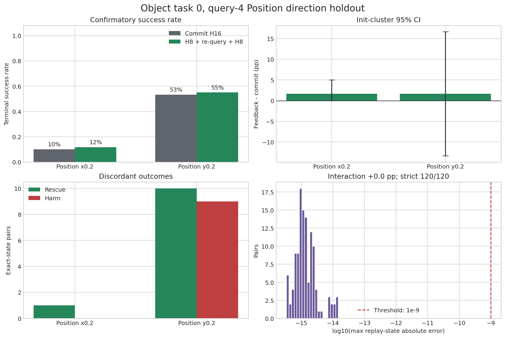

# Object task-0 query-4 Position direction holdout: results

## Decision

The preregistered Position-direction holdout completed all 120 exact-state
pairs and passed every integrity check. The efficacy hypothesis did not
replicate.

On the primary Position `y0.2` condition, commit-H16 succeeded in **32/60
(53.3%)** pairs and query-4 real-observation feedback succeeded in **33/60
(55.0%)** pairs. The paired effect was **+1.7 percentage points**, with an
init-cluster 95% CI of **[-13.3, +16.7] pp**, 10 rescues / 9 harms and exact
McNemar **p = 1.0**. After the frozen 2.5 pp query-cost penalty, the effect was
**-0.8 pp**.

The negative direction control, Position `x0.2`, also changed by +1.7 pp. The
matched-init interaction was therefore exactly 0 pp, with 95% CI
[-13.3, +13.3] pp. The frozen primary and interaction gates both **FAIL**, so
the decision is:

`do_not_promote_fixed_cross_factor_feedback`.

This result does not invalidate the separately confirmed Object task-0
positive control. It rejects transfer of that fixed query-4 rule to the
selected Position boundary and rejects the claimed `y` versus `x` direction
specificity.

Frozen protocol:
[`OBJECT_Q4_POSITION_DIRECTION_HOLDOUT_PROTOCOL_20260902.md`](OBJECT_Q4_POSITION_DIRECTION_HOLDOUT_PROTOCOL_20260902.md).

## Frozen comparison

Every pair used one shared policy prefix, one query-4 four-candidate pool, the
same `argmax(value)` candidate and one captured simulator/controller state.
The terminal branches were

$$
\text{commit}: A_{64:80}^{old},
$$

$$
\text{feedback}: A_{64:72}^{old}\rightarrow o_{72}^{real}
\rightarrow A_{72:80}^{new}.
$$

Both branches then continued with the standard max-value H16 controller until
success or 280 executed actions. For pair $i$,

$$
Y_i=\mathbb{1}[success_{i,feedback}]
-\mathbb{1}[success_{i,commit}],
\qquad
\widehat\Delta=\frac{1}{N}\sum_iY_i.
$$

Confidence intervals resampled the 30 independent init-state clusters rather
than treating the two rollout seeds per init as independent. The frozen
compute-aware endpoint was

$$
\widehat\Delta_{adjusted}=\widehat\Delta-0.025.
$$

## Confirmatory results

| Condition | Pairs / init groups | Commit SR | Feedback SR | Delta | Init-cluster 95% CI | Rescue / harm | McNemar p | Adjusted delta |
|---|---:|---:|---:|---:|---:|---:|---:|---:|
| Position `y0.2`, primary | 60 / 30 | 32/60 (53.3%) | 33/60 (55.0%) | +1.7 pp | [-13.3, +16.7] | 10 / 9 | 1.000 | -0.8 pp |
| Position `x0.2`, control | 60 / 30 | 6/60 (10.0%) | 7/60 (11.7%) | +1.7 pp | [0.0, +5.0] | 1 / 0 | 1.000 | -0.8 pp |
| `y0.2 - x0.2` interaction | 120 / 30 shared | - | - | 0.0 pp | [-13.3, +13.3] | - | - | - |

The `y0.2` confidence interval includes both a practically relevant benefit
and a practically relevant harm. The point estimate is below the frozen query
cost, and 10 rescues are almost exactly cancelled by 9 harms. The control did
not reproduce the development-screen negative point estimate, but it remained
far from a useful compute-adjusted benefit.

## Development versus holdout

The holdout used untouched official init states 20-49 and new rollout seeds;
no development row entered the confirmatory analysis.

| Stage | Init states | Seeds per init | Commit SR | Feedback SR | Delta | Rescue / harm |
|---|---:|---:|---:|---:|---:|---:|
| Development screen, `y0.2` | 0-19 | 1 | 8/20 (40%) | 16/20 (80%) | +40 pp | 10 / 2 |
| Confirmatory holdout, `y0.2` | 20-49 | 2 | 32/60 (53.3%) | 33/60 (55.0%) | +1.7 pp | 10 / 9 |

Thus the selected +40 pp screen signal did not generalize to new initial
states. It was either specific to the first init-state range or an exaggerated
winner selected from a five-cell development screen. The confirmatory result,
not the screen estimate, controls the transfer decision.

The lack of stability is visible inside the holdout as well:

- the three disjoint `y0.2` init shards had effects of -5, +15 and -5 pp;
- the first rollout seed per init gave +10 pp, while the second gave -6.7 pp;
- across 30 init clusters, one had two rescues, seven had one net rescue,
  eight had one net harm and fourteen had zero net effect.

These splits are diagnostics, not new hypothesis tests. They show that fixed
feedback timing has a state- and rollout-dependent sign rather than a stable
direction-level effect.

## Failure transitions

All ten `y0.2` rescues changed `timeout_no_goal` under commit into success.
The nine harms changed success into seven `timeout_no_goal` failures and two
`target_drop_candidate` failures. The single `x0.2` rescue changed a
`target_drop_candidate` into success.

Real-observation feedback can therefore recover a stalled trajectory, but the
newly sampled continuation can also discard a successful plan or introduce a
drop. More frequent observation is not monotonically safer, and terminal
value-of-feedback must be signed:

$$
\operatorname{VoF}(s)=
\Pr(rescue\mid s)-\Pr(harm\mid s)-c_{query}.
$$

## Integrity and execution

- 120/120 expected pair keys were present and unique;
- 120/120 pairs passed strict shared-prefix replay, above the frozen 114/120
  global and 57/60 per-condition requirements;
- every pool contained four candidates and exactly one max-value candidate;
- all terminal labels and feedback paths were complete;
- maximum simulator replay-state absolute error was
  $1.47\times10^{-14}$;
- all six GPU shards completed in 42 minutes, with no traceback, OOM,
  out-of-space or killed-process marker;
- no campaign process remains active.

The full 120-pair sensitivity analysis is identical to the strict analysis, so
the negative decision is not caused by integrity filtering.

## Scientific conclusion and next step

The reusable finding is conditionality, not a universal Position controller.
Fixed query-4 feedback is confirmed for the narrow Object task-0 setting but
does not transfer merely because another condition has similar baseline
difficulty or OOD magnitude.

The failed holdout nevertheless produced the first balanced single-cell
effect dataset in this sequence: `y0.2` contains 10 rescues and 9 harms under
the exact same intervention. After closing this confirmatory claim, those rows
may be designated as development data for a signed value-of-feedback model.
They must not also serve as evidence for that model.

The next method should default to commit and intervene only when a conservative
state/contact-conditioned estimate clears query cost:

$$
\operatorname{LCB}_{VoF}(s)
=\widehat{\mathbb{E}}[Y\mid x(s)]
-\beta\widehat\sigma[Y\mid x(s)]-c_{query}>0.
$$

Useful inputs are target/receptacle geometry, contact and grasp state, observed
progress, predicted drop/no-progress probabilities and candidate action
features. Model development must group by init state, and the next claim needs
new Position tasks or newly generated initial configurations not used to fit
the selector.

## Artifacts

Machine-readable outputs are in
[`campaigns/object_q4_position_direction_holdout_20260902/analysis/position_direction_holdout/`](campaigns/object_q4_position_direction_holdout_20260902/analysis/position_direction_holdout/).
The complete 226 MB campaign, including 120 compressed state/candidate
sidecars and all six shard outputs, has been synchronized from the server into
the local campaign directory.
