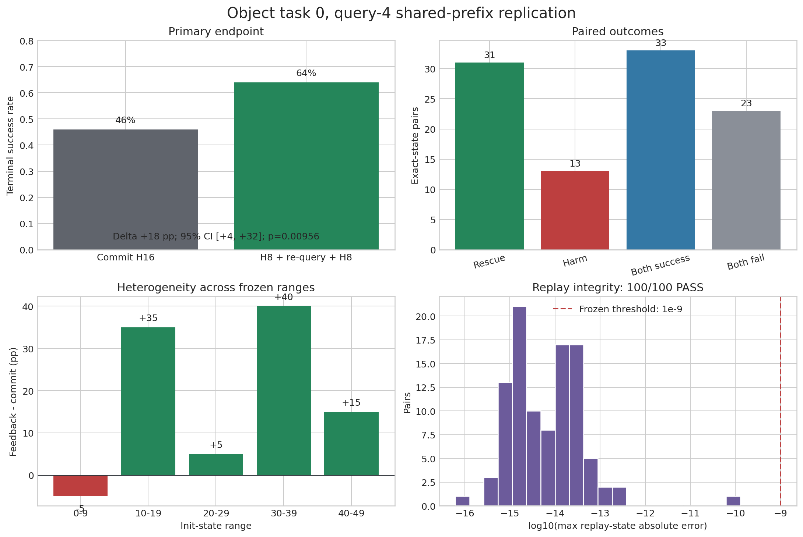

# Object task-0 query-4 shared-prefix replication: results

## Decision

The frozen shared-prefix replication passed its integrity, practical and
confirmatory gates. On 100 exact-state pairs, inserting one real-observation
re-query halfway through the query-4 action chunk increased terminal success
from **46% to 64%**: **+18 percentage points**, init-cluster 95% CI
**[+4.0, +32.0] pp**, 31 rescues / 13 harms, exact McNemar
**p = 0.00956**.

This is the strongest causal evidence in the project that the useful mechanism
is feedback timing, not uncertainty-based candidate reranking. The result is
narrow: it establishes the intervention on LIBERO-PRO Object task 0 at query 4,
not a universal policy for all tasks or perturbation factors.

Frozen protocol:
[`OBJECT_Q4_SHARED_PREFIX_REPLICATION_PROTOCOL_20260902.md`](OBJECT_Q4_SHARED_PREFIX_REPLICATION_PROTOCOL_20260902.md).

## Design

- Suite/task: `libero_object_object`, task 0.
- Init states: 0-49; two new rollout seeds per init; 100 pairs total.
- Shared trajectory: normal `max(value)` H16 policy through query 3.
- Shared decision: one four-candidate pool generated once at query 4 / step 64;
  both branches start from the same full MuJoCo/controller snapshot and the same
  selected candidate.
- Commit branch: execute the selected H16 chunk, then continue with maxV-H16.
- Feedback branch: execute the same first H8, observe the real state, issue one
  new query, execute the newly selected H8, then continue with maxV-H16.
- Episode limit: 280 executed actions.

For exact-state pair $i$, the primary contrast is

$$
Y_i = \mathbb{1}[success_{i,feedback}]
      - \mathbb{1}[success_{i,commit}],
$$

with frozen query-cost adjustment

$$
\Delta_{adjusted}=\frac{1}{N}\sum_iY_i-0.025.
$$

## Primary endpoint

| Pairs | Commit SR | Feedback SR | Delta | Init-cluster 95% CI | Rescue / harm | McNemar p | Cost-adjusted delta |
|---:|---:|---:|---:|---:|---:|---:|---:|
| 100 | 46.0% | **64.0%** | **+18.0 pp** | **[+4.0, +32.0] pp** | **31 / 13** | **0.00956** | **+15.5 pp** |

The paired outcomes were 33 both-success, 23 both-fail, 31 rescue and 13
harm. Thus 44% of states were decision-sensitive, and the net gain was 18
terminal successes per 100 interventions.

## Frozen gates

| Gate | Result | Evidence |
|---|---|---|
| Integrity | **PASS** | 100/100 strict replay pairs; minimum was 95 |
| Practical | **PASS** | raw +18.0 pp and cost-adjusted +15.5 pp are positive |
| Confirmatory | **PASS** | cluster-CI lower bound +4.0 pp and McNemar p=0.00956 |

All 100 expected `(init_state, rollout_id, rollout_seed)` keys are present and
unique. All candidate pools contain exactly four candidates and exactly one
`argmax(value)`. Suite, task, query, init set, split and terminal labels match
the frozen manifest.

Replay-state absolute error had median $6.21\times10^{-15}$, 95th percentile
$8.40\times10^{-14}$ and maximum $1.29\times10^{-10}$, below the frozen
$10^{-9}$ threshold in every pair. The config and protocol SHA-256 hashes also
match the preregistered manifest.

## Robustness and heterogeneity

Both rollout positions were directionally positive, although only the second
was individually significant:

| Rollout position | Pairs | Commit SR | Feedback SR | Delta | 95% CI | Rescue / harm | p |
|---:|---:|---:|---:|---:|---:|---:|---:|
| 0 | 50 | 50% | 60% | +10 pp | [-8, +28] pp | 13 / 8 | 0.383 |
| 1 | 50 | 42% | 68% | +26 pp | [+8, +44] pp | 18 / 5 | 0.0106 |

Across the five preregistered ten-init ranges, deltas were -5, +35, +5, +40
and +15 pp. At the init-state level, 24/50 had positive net effect, 16/50 zero
and 10/50 negative. The aggregate effect is therefore not generated by one
single range, but the intervention is not uniformly beneficial. A learned
selective trigger remains useful if it can identify the 13 harms without
discarding many of the 31 rescues.

## Failure transitions

| Commit failure to feedback result | Count |
|---|---:|
| `timeout_no_goal -> success` | 21 |
| `kinematic_deadlock_candidate -> success` | 5 |
| `target_drop_candidate -> success` | 4 |
| `wrong_object_interaction_candidate -> success` | 1 |

Of the 13 harms, ten changed from success to `timeout_no_goal`; the remaining
three became one wrong-object interaction, one target drop and one kinematic
deadlock. Feedback reduced total failures from 54 to 36, including timeout
failures from 40 to 28, deadlocks from 7 to 2 and target-drop candidates from 6
to 4. Its largest contribution is improved progress/completion, with a smaller
but positive reduction in manipulation failures.

## Operational result

Mean terminal time fell from 228.3 to 206.9 executed actions. The commit branch
used 9.76 continuation model queries after the shared query-4 decision. The
feedback branch used one explicit re-query plus 8.43 continuation queries, or
9.43 calls in total. Thus the successful intervention did not increase average
realized post-branch model calls in this stop-on-success evaluation; earlier
completion offset its extra query. This is a descriptive compute result. The
confirmatory decision still uses the conservative frozen cost of 0.025.

## Interpretation

Three independent pieces of evidence now agree in scale:

| Experiment | Integrity status | Commit/baseline SR | Feedback SR | Delta |
|---|---|---:|---:|---:|
| Exact-state holdout, 60 pairs | PASS | 38.3% | 60.0% | +21.7 pp |
| Separate-process clean replication, 100 pairs | FAIL | 35.0% | 54.0% | +19.0 pp nominal |
| Shared-prefix replication, 100 pairs | **PASS** | 46.0% | 64.0% | **+18.0 pp** |

The new experiment removes the main ambiguity of the separate-process run:
prefix and query-4 candidate generation are shared exactly. Together with the
negative selection-only experiments, this supports the mechanism

$$
A_{64:72}^{old}\rightarrow o_{72}^{real}
\rightarrow A_{72:80}^{new},
$$

rather than replacing the query-4 candidate using an internal uncertainty
penalty.

## Scope and next experiment

The result does not establish generalization beyond Object task 0. Earlier
Object tasks 1-9 were a 100% ceiling, so repeating there cannot measure uplift.
The next high-information experiment should keep this fixed controller as a
positive control and collect non-ceiling same-task cases under Position and
Environment perturbations. In parallel, an object/contact-centric signed-VoF
model should predict whether querying helps, using target/receptacle progress,
contact loss, drop, wrong-object and no-progress targets. Its frozen test must
compare `commit`, always-query-4 and selectively-query-4 from one shared pool,
and report terminal SR, harms avoided and query budget.

## Artifacts

Machine-readable outputs are in
[`campaigns/object_q4_shared_prefix_replication_20260902/analysis/object_q4_shared_prefix/`](campaigns/object_q4_shared_prefix_replication_20260902/analysis/object_q4_shared_prefix/).
The complete local campaign also contains 100 compressed sidecars with current
observations, candidate actions/values, predicted futures and realized branch
endpoints.
