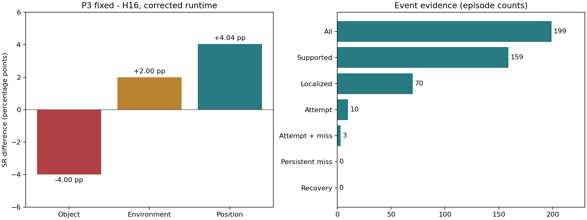

# P3 после исправления runtime: полный результат S0

Проверено 15 сентября 2026 после завершения расчётов. Это **новая полная
серия на snapshot v2**, не объединение со старой v1 и не новый метод.

## Статус и время

- Завершено **995/995 main rollout, 199/199 парных случаев**, все пять arms.
- До main прошли 18/18 smoke, включая случай прежнего parity-сбоя.
- Завершение: **13:04:37 МСК**, до предела 15:05:39.
- От возобновления в 11:19:45 прошло около **1 часа 45 минут**; от первого
  старта в 11:05:39 около **1 часа 59 минут**, включая smoke и перезапуск.
- Supervisor и workers этой очереди больше не работают. S1/S2 были отложены
  по бюджету до получения полной таблицы; они не выполнены и не считаются fail.
- Повторный серверный аудит всех 199 случаев прошёл при разборе результатов.

## Постановка

Frozen Cosmos Policy 2B, LIBERO-PRO: Object50, Environment50, Position99.
Одинаковый начальный snapshot внутри каждой пятисторонней пары. Генерация
16 действий, пять denoising steps, максимум 280 физических действий,
включая recovery. K1 использует один кандидат, остальные методы четыре.
Action/state/value генерируются совместно; это **не AR-планирование a→s→v**.
Кандидат выбирается по максимальному predicted value; P3 добавляет controller
восстановления захвата, а не uncertainty-reranking.

- **K1/H16:** один stochastic sample, исполняется до 16 действий.
- **Max-value K4/H16:** лучший по value из четырёх, исполнение до 16 действий.
- **H8 после t72:** тот же префикс до 72 физических шагов, затем новый query
  по свежему наблюдению и исполнение восьми действий за запрос.
- **P3 fixed:** на t72 проверяется RGB/геометрический gate; при допуске
  выполняется recovery, затем H8. Без physical recovery повторяет H8-control.
- **P3 event:** наблюдения проверяются на устойчивый miss после попытки
  захвата; без вмешательства должен точно повторять H16.

t72 сохраняется только как исторический контроль, не универсальный момент.
Support уже исследовался раньше: это не нетронутый task/init holdout.

## Основная таблица

| Метод | Object, % | Environment, % | Position, % | Macro-SR, % | Success/199 |
|---|---:|---:|---:|---:|---:|
| Cosmos K1 / H16 | 96.00 | 40.00 | 29.29 | **55.10** | **97/199** |
| Max-value K4 / H16 | 94.00 | 40.00 | 26.26 | 53.42 | 93/199 |
| H8 после t72 | 96.00 | 42.00 | 26.26 | 54.75 | 95/199 |
| P3 fixed / RGB recovery | 90.00 | 42.00 | 30.30 | 54.10 | 96/199 |
| P3 event | 94.00 | 40.00 | 26.26 | 53.42 | 93/199 |

$$
\mathrm{MacroSR}=\frac{1}{3}\left(\frac{s_O}{50}+\frac{s_E}{50}+\frac{s_P}{99}\right),
\qquad \mathrm{MicroSR}=\frac{s_O+s_E+s_P}{199}.
$$

Macro равновзвешивает три фактора, а не эпизоды. Поэтому 96/199 у P3
может соответствовать меньшему Macro-SR, чем 95/199 у H8.

## Парные эффекты

| Сравнение | Delta Macro, п.п. | 95% cluster CI, п.п. | Rescue / harm | Holm p |
|---|---:|---|---:|---:|
| P3 fixed − H16 | +0.6801 | [−2.9967; +4.3636] | 9 / 6 | 1.000 |
| P3 fixed − H8 | −0.6532 | [−3.7598; +2.6667] | 5 / 4 | 1.000 |
| P3 event − H16 | 0.0000 | [0; 0] | 0 / 0 | 1.000 |
| P3 event − P3 fixed | −0.6801 | [−4.3636; +2.9967] | 6 / 9 | 1.000 |

5000 bootstrap draws task/init-кластеров внутри факторов; Position levels
одного task/init остаются вместе. 110 кластеров, 20000 sign-flips с plus-one
correction, Holm по четырём заранее заданным contrasts.
**Общее превосходство P3 не подтверждено.** Это не доказательство равенства
методов в популяции. Лучший point estimate у K1, но его статистическое
превосходство данными четырьмя contrasts не проверялось.

## Где появляется выигрыш и вред

| Фактор | H16 | H8 | P3 fixed | P3 − H16, п.п. |
|---|---:|---:|---:|---:|
| Object | 47/50 | 48/50 | 45/50 | −4.00 |
| Environment | 20/50 | 21/50 | 21/50 | +2.00 |
| Position | 26/99 | 26/99 | 30/99 | +4.04 |

P3 физически вмешался в 33 эпизодах: девять Object и 24 Position.
В Environment recovery не выполнялся: прибавка совпадает с H8, её нельзя
приписать перезахвату. По этим данным recovery применим не одинаково ко всем
OOD-факторам. Возможное разрушение уже полезного контакта и неточная
локализация являются объяснениями для проверки, а не доказанными причинами
каждого из шести harms. Для причинного вывода нужен просмотр парных trace.

## Почему event не улучшил результат

| Online evidence хотя бы один раз в эпизоде | Cases / 199 |
|---|---:|
| Целевой объект поддерживается локализатором | 159 |
| Есть валидная локализация | 70 |
| Зафиксирована close-near попытка захвата | 10 |
| Есть mask-miss | 24 |
| Попытка и miss одновременно | 3 |
| Persistent miss | 0 |
| Physical recovery | 0 |

Текущий detector не доходит до условия запуска. Это **нулевое покрытие
вмешательств**, а не экспериментальное доказательство бесполезности adaptive
recovery. Простое понижение порогов на этих тестовых результатах с последующим
объявлением нового SR независимой проверкой было бы некорректно.

## Что исправление runtime изменило в выводах

В v2 сохраняются integration state MuJoCo, включая warmstart, а также clocks
и cache сенсоров robosuite. Предыдущий проблемный smoke теперь проходит
closed-loop проверку с точным совпадением H16/event без вмешательства.
Полная S0 также прошла strict audit; допуски не ослаблялись.

Старые counts сохраняются как v1: H8 был 94/199, P3 fixed 95/199.
В v2 они 95/199 и 96/199. K1, H16 и event имеют прежние aggregate counts.
P3−H16 Macro delta изменился с +0.0135 до +0.6801 п.п., но научный вывод
тот же: широкое преимущество не установлено. Не объединять эти версии
в две независимые seed-репликации: изменён runtime, seeds не новые.

Проверка raw records обнаружила ровно два изменения terminal outcome:
`object__t0_i3`, H8 и P3 fixed, оба false → true. Это один случай, не два
новых независимых успеха. Проверены SHA всех 995 MP4 и 995 NPZ. У H16/event
на всех 199 случаях совпали query-input hashes и SHA видео; локально полное
декодирование всех видео повторно не выполнялось.

Стоимость: P3 fixed в среднем 22.995 query против 13.859 у H16, около 1.66×.
Whole-episode drop proxy встречается в 11 эпизодах против четырёх у H16.
Это дополнительный сигнал возможного вреда, не доказательство причинности
и не метрика официального LIBERO-Safety.

## Следующее решение

1. Для текущей общей P3-таблицы использовать S0-v2, старую v1 оставить
   исторической. Не запускать автоматически S1/S2 ради поиска лучшего seed.
2. Для статьи приоритетнее отдельно воспроизвести положительный scoped
   recovery-результат (исторические 16/64 → 41/64) на исправленном runtime
   с теми же frozen settings и обоими контролями H8/H16. S0-v2 этот эффект
   автоматически не проверяет.
3. Дальнейшее улучшение метода: на development-сценах разделить наблюдаемую
   неудачу захвата, геометрическую допустимость и ожидаемую пользу recovery.
   После заморозки правила проверять на отдельном task/init/seed split.
4. Пока нет оснований объявлять универсальный failure detector, общий OOD
   gain или SOTA. Это законченный отрицательный broad transfer result и
   инженерная проверка корректности, а не новый большой положительный эффект.

Новые GPU-эксперименты этим разбором не запускались.

## Где смотреть

- [Итоговая таблица CSV](campaigns/p3_benchmark_runtime_v2_20260915_s0/analysis/benchmark_table.csv)
- [Парные эффекты, CI и p](campaigns/p3_benchmark_runtime_v2_20260915_s0/analysis/paired_effects.csv)
- [График SR по факторам](campaigns/p3_benchmark_runtime_v2_20260915_s0/analysis/factor_success_rates.png)
- [Query-level метрики](campaigns/p3_benchmark_runtime_v2_20260915_s0/analysis/query_metrics.csv)
- [Все 199 случаев: пять видео рядом](campaigns/p3_benchmark_runtime_v2_20260915_s0/analysis/videos.html)
- [Только случаи с различными исходами методов](runtime_replay_v2/operations/publication_audit/comparison_videos.html)
- [Стоимость и whole-episode drop proxies](runtime_replay_v2/operations/review_20260915/cost_and_episode_proxies.csv)
- [Изменившиеся v1/v2 outcomes](runtime_replay_v2/operations/review_20260915/v1_v2_outcome_changes.csv)
- [Локальная проверка исходников результатов](runtime_replay_v2/operations/review_20260915/validation.json)
- [Воспроизводимый CPU-разбор](runtime_replay_v2/operations/review_results.py)

Видеофайлы MP4 и raw JSON/NPZ загружены локально. Drop proxies не являются
официальными LIBERO-Safety метриками. Logical model calls нельзя подменять
wall-time сравнением: между paired arms используются кэшированные candidate
pools для точно одинаковых входов.
