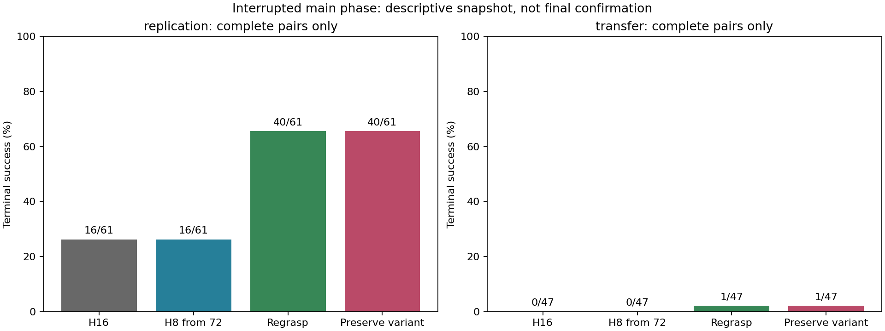
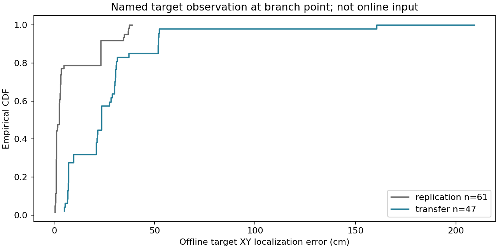

# Recovery confirmation: промежуточные результаты 13 сентября

**Серия прервана, main не завершён.** Ниже описательные результаты только
полностью сопоставленных случаев, без confirmatory p-values и CI. Новые
GPU-эксперименты этим анализом не запущены. Старые результаты не переписаны.

Позднее по следующему запросу серия была возобновлена:
[протокол resume и отдельной grounding диагностики](RECOVERY_GROUNDING_DIAGNOSTIC_PROTOCOL_20260913.md).
Этот документ остаётся историческим срезом до возобновления. Источники
заархивированы в `analysis/interim_20260913/`; текущий прогресс находится
в live status и новых `analysis/main/`, `analysis/timing/`.

## 1. Что фактически посчитано

Источник: `campaigns/recovery_confirmation_20260913`.
[Замороженный протокол](RECOVERY_TWO_DAY_PLAN_20260913.md),
[аудит main](campaigns/recovery_confirmation_20260913/analysis/interim_20260913/summary.json),
[воспроизводимая описательная сводка](campaigns/recovery_confirmation_20260913/analysis/interim_20260913/review/summary.json).

| Этап | Сохранено | Запланировано | Использование |
|---|---:|---:|---|
| Technical smoke | 9 | 9 | Технические проверки, вне SR |
| Main | 441 | 512 | 432 исхода из 108 полных четырёхсторонних сравнений |
| Timing t56/t88 | 0 | 768 | Результатов нет |
| Всего | 450 | 1289 | Это исходы ветвей, не столько независимых задач |

Ещё 9 сохранённых исходов относятся к четырём частично выполненным cases
и исключены из matched-таблиц, а не записаны как fail. До окончания main
осталась **71 ветвь в 20 случаях**: [точный список](campaigns/recovery_confirmation_20260913/analysis/interim_20260913/review/remaining_main.json).
Полностью сопоставлены 108/128 случаев: 61 replication и 47 transfer.

**Операционный статус.** При проверке 13 сентября в 11:59 MSK dispatcher
и все шесть PID из последнего status-файла отсутствовали. Последние batch-логи
останавливаются около **02:50 MSK**, хотя исходный девятичасовой deadline был
**10:27 MSK**. Пять последних логов заканчиваются `Campaign deadline or requested stop`;
один обрывается во время обычного inference. В просмотренных batch-логах нет
Traceback/OOM/CUDA error. Кто и почему инициировал остановку, не установлено;
проверка uptime не показывает перезагрузки всего сервера этой ночью.

`sequence_status.json` остался со старым `running` и не является доказательством
живого процесса. Сохранён отдельный [аудит статуса](campaigns/recovery_confirmation_20260913/analysis/interim_20260913/review/operational_status.json);
исходный status оставлен как свидетельство. Простое повторение `--launch`
не продлевает истёкший бюджет: продолжению нужен явный новый ресурсный бюджет,
но не изменение научного config, seeds или уже полученных исходов.

## 2. Задача и методы

Это **LIBERO-PRO Position perturbations задач Object suite**, не полный
benchmark Object/Environment/Position и не официальный LIBERO-Safety.
Replication: восемь прежних сложных cells, x0.2/tasks5,6,9;
y0.2/tasks4,6,9; y0.3/tasks1,5. Transfer: x0.3/tasks1,2,4,5,6,7,8,9,
вне calibration локализатора. Предметы ему знакомы. Init25-32 исключены из
его calibration, но частично встречались в прошлых исследованиях;
это новые заранее заданные seeds, **не глобально untouched-init holdout**.

Frozen Cosmos Policy: K4, пять denoising steps, joint/parallel генерация
action/future/value, выбор max-value. Генерируется 16 действий.
Общий невмешанный H16 prefix, ветвление при **t=72 выполненных действиях**:

| Arm | Что меняется после общего prefix |
|---|---|
| `baseline_h16` | Исходный непрерывный rollout, execute16 |
| `continue_h8` | Fresh query в t72, затем execute8 до конца |
| `physical_regrasp` | При разрешении frozen RGB gate: открыть, отвести, повторно локализовать, подойти, закрыть, поднять; затем H8 |
| `refresh_preserve_only` | Тот же recovery при старом gate; иначе допустимая проба до 3 шагов вверх с сохранённой командой gripper, без нового regrasp после пробы; затем H8 |

Все действия recovery входят в общий лимит 280 после 10 settling steps.
Полный regrasp занимает 25 действий. Preserve-only **не является** новым
held-veto и не запрещает исходный regrasp. Это не новые event-based методы.
H8 здесь сохраняется до конца; прежний положительный shared-prefix опыт
Object/task0 возвращался к H16 после одноразового fresh8. Его SR нельзя
приписывать нынешнему H8 arm.

## 3. Результаты

SR ниже micro по полным matched cases. Из-за прерывания размеры отдельных
cells пока различаются; macro по cells приведён отдельно.

| Метод | Знакомые cells, n=61 | Transfer x0.3, n=47 |
|---|---:|---:|
| H16 max-value | 16/61 = **26.2%** | 0/47 = **0%** |
| H8 после t72 | 16/61 = **26.2%** | 0/47 = **0%** |
| RGB physical regrasp | 40/61 = **65.6%** | 1/47 = **2.1%** |
| Preserve-only вариант | 40/61 = **65.6%** | 1/47 = **2.1%** |



**На знакомых cells recovery имеет +39.3 п.п. micro SR против H8.**
В парном сравнении: 26 rescue и 2 harm. Против H16: 28 rescue и 4 harm.
Это сильное предварительное воспроизведение локального эффекта P3,
но не законченная confirmatory проверка и не выигрыш на всём LIBERO-PRO.

Preserve-only против physical: **1 rescue / 1 harm**, net 0.
Прежняя post-hoc гипотеза о его добавочном выигрыше пока не воспроизводится.
H8 против H16: **11 rescue / 11 harm**, net 0; одинаковый SR не означает
одинаковые траектории. На x0.3 recovery спасает всего один случай.

| Macro-SR по cells | H16 | H8 | Physical | Preserve |
|---|---:|---:|---:|---:|
| Replication | 26.12% | 25.67% | 64.96% | 64.73% |
| Transfer | 0% | 0% | 2.08% | 2.08% |

[Таблица по каждой cell](campaigns/recovery_confirmation_20260913/analysis/interim_20260913/review/cell_scores.csv),
[парные rescue/harm](campaigns/recovery_confirmation_20260913/analysis/interim_20260913/review/descriptive_paired_counts.csv),
[cohort micro/macro](campaigns/recovery_confirmation_20260913/analysis/interim_20260913/review/cohort_scores.csv).
В частности, y0.2/task4 остаётся 0/8 у всех arms, а x0.2/task9 не показывает
общего выигрыша recovery. Усреднение не должно скрывать эту неоднородность.

## 4. Почему перенос почти отсутствует: новая offline-диагностика

Для каждого из 108 исходных состояний сравнили начальную RGB-локализацию
целевого предмета с его **именованным** simulator observation в prefix t72:

$$
e^{XY}_j=\left\|\hat p^{RGB}_{j,xy}-p^{GT}_{j,xy}\right\|_2.
$$

GT используется **только после rollout для анализа**, не как вход метода.
Проверен SHA prefix; берётся `obs__<target_object>_pos`, а не предположенный
индекс в массиве всех объектов. Метрика измеряет положение центра цели,
а не контактную точку захвата или ошибку Cosmos future prediction.

| Подмножество | n | Медианная XY-ошибка | Ошибка >5 см |
|---|---:|---:|---:|
| Знакомые cells, все | 61 | **2.53 см** | 14/61 |
| Знакомые cells, исходный gate разрешил recovery | 40 | **1.12 см** | **0/40** |
| x0.3, все | 47 | **23.50 см** | 46/47 |
| x0.3, исходный gate разрешил recovery | 18 | **19.80 см** | **18/18** |



На знакомых cells gate отсекает большую ошибку локализации; на x0.3 он
**разрешает 18 вмешательств при ошибке более 5 см во всех 18 состояниях**.
Полный regrasp выполнен в 15 из них, успешен 1/15. На знакомых cells полный
regrasp выполнен 40 раз, успешен 35/40. Это conditional описания, не эффект
случайно назначенного лечения: разрешённые gate случаи отобраны самим gate.

Пример `x0.3_t1_i25`, команда взять cream cheese и положить в basket:
RGB XY примерно `(0.049, 0.120)`, GT XY `(-0.164, -0.104)` метра,
ошибка около **31 см**. Confidence и geometry gate разрешили regrasp;
эпизод завершился без успеха. Поэтому confidence локализатора не равен
надёжности его координат на новом распределении.

**Ограничение вывода:** ошибка измерена перед вмешательством. Локализатор
запускается ещё раз после retreat, поэтому эта таблица не измеряет все
исполненные waypoints и не доказывает единственную причину каждого fail.
Нужно разделить неверную pixel detection, pixel-to-world преобразование,
смещение предположенной плоскости и физическую выполнимость recovery.
Систематическая ошибка координат ещё не исключена отдельным projection audit.
Просто снизить порог confidence или заменить t72 на событие недостаточно.

Из 46 transfer failures physical-arm: 20 `timeout_no_goal`, 19
`kinematic_deadlock_candidate`, 5 `wrong_object_interaction_candidate`,
2 `target_drop_candidate`. Это suffix-only автоматические proxies, не
ручные причины неудач и не официальные нарушения LIBERO-Safety. Нельзя
сопоставлять их частоты с full-episode baseline как один и тот же endpoint.

[Полная диагностика](campaigns/recovery_confirmation_20260913/analysis/interim_20260913/review/diagnostic_rows.json),
[ошибки локализации](campaigns/recovery_confirmation_20260913/analysis/interim_20260913/review/offline_localization_error.csv),
[gate counts](campaigns/recovery_confirmation_20260913/analysis/interim_20260913/review/gate_counts.csv),
[failure proxies](campaigns/recovery_confirmation_20260913/analysis/interim_20260913/review/suffix_failure_proxies.csv).

## 5. Куда двигаться: порядок и критерии решения

1. **Закончить frozen main без изменения метода.** Досчитать 71 отсутствующую
   ветвь; не пересэмплировать неудобные исходы. Перед возобновлением проверить
   остановку launcher и выделить явный новый ресурсный бюджет. После 128/128
   matched cases провести исходные macro/paired анализы и четыре Holm contrasts.
   Timing 56/88 остаётся контролем чувствительности, а не поиском нового
   универсального магического числа; пока результатов нет.
2. **Дешёвый аудит геометрии перед большим sweep.** На сохранённых prefixes
   проектировать именованный GT target в обе камеры, сопоставлять с pixel
   prediction, проверять RGB orientation, camera matrices и обратную проекцию.
   Если найден frame/plane bug, исправлять в новой версии, не перезаписывать
   эти результаты. Нулевая pixel-error при большой XY-error указала бы на
   проблему геометрии; большая pixel-error при верной геометрии на localizer.
3. **Малый matched oracle diagnostic для причинности.** На тех же prefixes,
   suffix seeds, action budget и primitive сравнить RGB waypoint с GT waypoint.
   В первом контрасте держать eligibility gate фиксированным; отдельно проверить
   GT feasibility/coverage. Учитывать физические safety limits в обоих arms.
   GT не объявлять новым deployable методом. Если локализация даёт большой
   rescue gain, приоритет зрению; если нет, проверять фазу контакта и primitive.
4. **Новый переносимый controller после диагностики.** Shadow smoke уже
   реализованного event-controller; object-grounded/two-view evidence,
   память согласованных локализаций, явный `unknown` и veto ненужного release.
   Калибровка только на development groups; новая независимая проверка cells.
   Разнести вклад нового локализатора и timing отдельными ablations, сравнить
   с H16, H8 и frozen recovery при одинаковом action/model-call бюджете.
5. **Не расширять сейчас сетку preserve/consensus/value коэффициентов.**
   Preserve не дал добавочного SR в этом срезе, а предыдущие широкие selector
   проверки не показали преимущества. Главный открытый вопрос: надёжная
   локализация цели и уместность физического вмешательства на OOD.

Рабочая гипотеза: recovery полезен, когда одновременно правильно определена
цель, подходит фаза контакта и выполним primitive. Обнаружить риск, знать
координаты цели и выбрать безопасное исправление являются разными задачами.
Это направление для проверки, а не уже доказанный универсальный алгоритм.

## 6. Воспроизводимость и границы аудита

Frozen analyzer проверил 432 matched sets JSON/NPZ/MP4, 85050 selected policy
actions, 324 общих prefixes и 55 no-intervention parity comparisons.
Main-видео проверены по hash и учёту кадров в массивах; полный повторный decode
всех main MP4 этим разбором не выполнялся. Technical smoke проверял replay/decode.
Основные MP4 и большие prefix snapshots сохранены на сервере; локально
синхронизированы JSON, arm NPZ, логи, CSV и графики. Локальный `videos.html`
без загрузки MP4 не является рабочей полной галереей.

Новый review-скрипт не входит в замороженные зависимости collector и не
изменяет policy, config или checkpoint:

```bash
# На сервере, из корня проекта; только CPU-анализ, не запуск rollout.
.venv-cosmos/bin/python scripts/analyze_recovery_confirmation.py \
  --campaign experiments/campaigns/recovery_confirmation_20260913 --phase main
.venv-cosmos/bin/python scripts/review_recovery_confirmation_results.py \
  --campaign experiments/campaigns/recovery_confirmation_20260913 --prefix-audit
```

SHA архивных исходных analysis-файлов записаны в `analysis/interim_20260913/review/summary.json`.
Тесты проверки пар, именованных координат и integrity prefix добавлены в
`tests/test_recovery_confirmation_review.py`.
Новые event-методы имеют CPU-тесты, но **не новые measured SR**: в каталоге
`event_feedback_20260913` пока только параметры и smoke cases.
