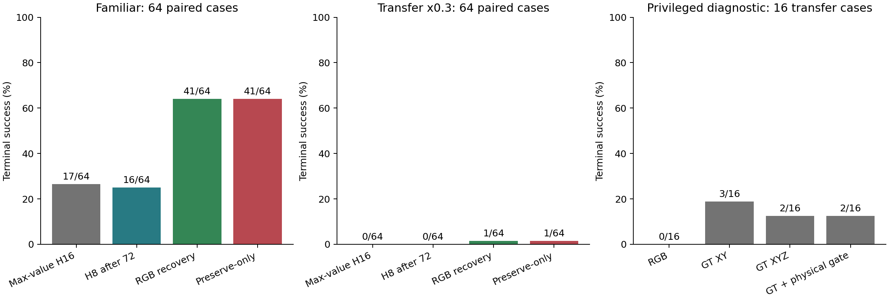

# Recovery: final confirmation and grounding diagnostic

Audited on 14 September 2026. This supersedes the numerical snapshot in
[the interim report](RECOVERY_CONFIRMATION_INTERIM_RESULTS_20260913.md).
The original frozen outcomes were retained; missing branches were completed.

Evening follow-up: [independent local count check and cell-level interpretation](EXPERIMENT_REVIEW_20260914_EVENING.md).
All 512 outcome records agree with the 64 cohort/cell/arm aggregates.
Fresh results from the separate valid199 campaign remain inaccessible through
SSH; this completed recovery table is not its result.

## Completion and a correction

- Confirmation: 512/512 main branches, 768/768 timing branches, 9/9 smoke branches.
- Grounding: 32/32 geometry cases and **128/128 oracle/replay branches**.
- The old event-shadow stage failed before completion because the imported
  `cosmos_policy` is a namespace package and `__file__` is `None`.

The previous conversational summary incorrectly described grounding as
2/128 with no matched cases. That was a stale local report. The server's
completed oracle table has 32 matched cases; only shadow failed.
The new collector resolves the policy source through its namespace search path.

## What was evaluated

LIBERO-PRO **Position perturbations of Object-suite tasks**. Replication:
eight previously studied cells; transfer: eight x0.3 cells absent from localizer
calibration. Each cell contributes init25-32 with new preregistered rollout seeds.
These are calibration-disjoint initial states, not globally untouched cases.

Cosmos Policy is frozen: joint/parallel action/future/value prediction, K4,
five denoising steps, max-value selection, generated horizon16. The reference
executes H16 throughout. Other branches share its uninterrupted prefix and
switch to H8 after a decision at t72. All physical recovery steps count toward
the same 280-action limit; failed post-retreat guards retain the real state.
This is a recovery experiment, not the paper's autoregressive planning protocol.

## Final main results

The old diagnostic-review plotting script retains an "Interrupted" title even
when fed the completed data. The figure above was generated for the completed
data audit. The current publication build produces focused recovery figures
from the same audited tables; the previous build is preserved in the publication
archive, rather than overwritten with a new interpretation of the results.

| Arm | Replication, n=64 | Transfer x0.3, n=64 |
|---|---:|---:|
| Max-value H16 | 17/64 = 26.56% | 0/64 = 0% |
| H8 after t72 | 16/64 = 25.00% | 0/64 = 0% |
| RGB physical regrasp | **41/64 = 64.06%** | 1/64 = 1.56% |
| Preserve-only extension | 41/64 = 64.06% | 1/64 = 1.56% |

On replication, regrasp versus H8 has **27 rescues / 2 harms**, a +39.06 pp
effect and frozen init-cluster 95% CI [29.69, 48.44] pp. Against H16 it has
28 rescues / 4 harms, net +37.50 pp. This is the strongest new positive
replication of the recovery mechanism. It applies to the selected cells.

Across both cohorts, regrasp versus H16 is +19.53 pp,
95% CI [14.06, 25.00], 29 rescues / 4 harms, Holm p=.00015.
Pooling these cohorts must not hide the near-zero transfer performance.
The old analyzer can print Monte Carlo p=0 when no sampled permutation
exceeds the observed statistic. This is finite simulation resolution, not a
mathematically zero p-value; the new benchmark uses the plus-one correction.

Preserve-only versus regrasp: 1 rescue / 1 harm across128 cases, net0,
95% CI [-2.34, 2.34] pp. Its previously promising development gain did not
replicate. H8 versus H16 on replication: 11 rescues / 12 harms.

The evening per-cell check clarifies this last comparison. Recovery has a
positive point estimate in 6/8 cells versus H8, but 5/8 versus H16. On
x0.2/task6 the counts are H16=6, H8=4, recovery=5 out of eight: the sign
depends on the comparator. H16-to-H8 also changes 4/8 to 0/8 on each of
y0.2/task9 and y0.3/task1, but 1/8 to 6/8 on x0.2/task5. Similar aggregate
scores therefore do not imply equivalent local behavior. Both controls
remain necessary; this is a descriptive breakdown, not new independent data.

Sources: [main results](campaigns/recovery_confirmation_20260913/analysis/main/RESULTS.md),
[paired effects](campaigns/recovery_confirmation_20260913/analysis/main/paired_effects.csv),
[updated diagnostic review](campaigns/recovery_confirmation_20260913/analysis/review/summary.json).

## Timing sensitivity

| Decision step | Replication H8 | Replication regrasp | Delta | Transfer regrasp |
|---|---:|---:|---:|---:|
| 56 | 16/64 = 25.00% | 31/64 = 48.44% | +23.44 pp | 0/64 |
| 72 | 16/64 = 25.00% | 41/64 = 64.06% | +39.06 pp | 1/64 |
| 88 | 18/64 = 28.13% | 34/64 = 53.13% | +25.00 pp | 0/64 |

The sign of the replication effect survives earlier/later intervention.
Its size is timing-sensitive. These are correlated branches from the same
reference trajectories, not 192 independent new tasks. t72 remains a historical
control; it must not become a universal learned trigger through hindsight.
[Timing report](campaigns/recovery_confirmation_20260913/analysis/timing/RESULTS.md).

## What limits transfer

The completed offline review has64 cases per cohort. Among cases passing
the initial gate, median XY localization error is **1.12 cm** on replication
(0/42 above5cm) versus **9.56 cm** on transfer (24/24 above5cm).
The transfer median differs from the interim 19.8cm because the remaining
cases have now been included. All-case medians are2.53cm and23.50cm.

The 32-prefix projection diagnostic further separates detection and geometry:

| External-camera median | Replication, n=16 | Transfer, n=16 |
|---|---:|---:|
| Pixel distance to projected object center | 2.86 px | 58.09 px |
| Pixel distance to target mask | 0 px | 43.86 px |
| XY error | 2.06 cm | 25.45 cm |
| XY error after substituting true plane height | 1.16 cm | 34.47 cm |

Saved world reconstruction error is zero, GT roundtrip error is at most
6.13e-16m. Native-render MAE is approximately0.31 intensity units versus
56 after flipping. These checks do not indicate a simple projection/flip bug.
Transfer has a large semantic pixel-localization error; replacing plane height
alone does not solve it. Pixel-to-mask distance also avoids equating the
visible-mask centroid with the object's geometric center.

## Privileged oracle experiment

The primitive, prefix and suffix seeds are fixed. GT inputs are explicitly
privileged diagnostics, not a proposed deployable method or holdout result.

| Waypoint / eligibility | Replication | Transfer |
|---|---:|---:|
| Original RGB replay | 10/16 = 62.50% | 0/16 = 0% |
| GT XY, original RGB gate and Z | 11/16 = 68.75% | **3/16 = 18.75%** |
| GT XYZ, original RGB gate | 10/16 = 62.50% | 2/16 = 12.50% |
| GT XYZ, physical eligibility gate | 12/16 = 75.00% | 2/16 = 12.50% |

Correcting XY rescues3 transfer cases with no new harms. It leaves13/16
unsuccessful. Better grounding is relevant but is insufficient under this
fixed primitive, timing and gating. GT-center Z is not automatically the best
contact waypoint; eligibility, contact phase, orientation and continuation
remain plausible limitations. These alternative causes have not been isolated.

Sources: [oracle results](campaigns/recovery_grounding_diagnostic_20260913/analysis/RESULTS.md),
[geometry](campaigns/recovery_grounding_diagnostic_20260913/analysis/geometry.csv),
[paired diagnostic counts](campaigns/recovery_grounding_diagnostic_20260913/analysis/paired_descriptive.csv).

## Scientific claims to retain

1. Physical, object-directed recovery has a reproducible local terminal-SR gain.
   The new64-case replication and old P3c holdout agree on the positive sign.
2. More frequent queries alone do not account for this gain. Past retreat-only
   controls and the current H8 control are materially weaker.
3. Localization confidence does not certify OOD coordinate accuracy. The
   permissive transfer gate accepted24 initial locations all wrong by over5cm.
4. Improved perception is not sufficient by itself: privileged coordinates
   leave most transfer failures unresolved under the current recovery policy.
5. Added complexity needs its own comparator: preserve-only has no measured
   benefit over the simpler physical recovery in the completed confirmation.

For publication, primary metrics should be factor-macro terminal SR and paired
delta/CI, with per-factor SR, rescue/harm and cost. Drop and wrong-object flags
are diagnostic proxies. No uncertainty metric is currently established as a
universal pre-failure predictor or a better candidate selector.

The missing common-benchmark P3 row is addressed by
[the one-day closure protocol](P3_BENCHMARK_CLOSURE_PROTOCOL_20260914.md).
Full videos remain on the server; downloading only analysis HTML does not copy
the videos it references.
