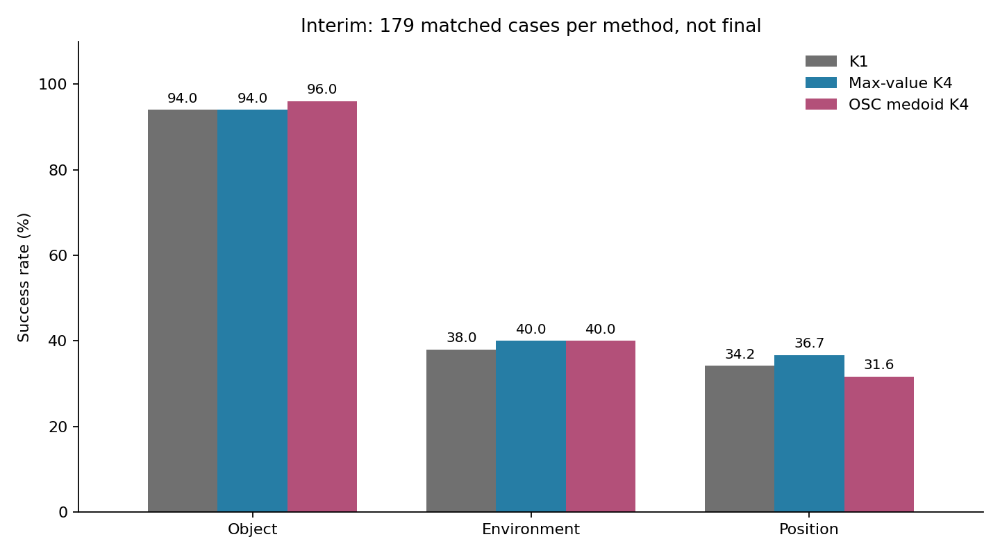
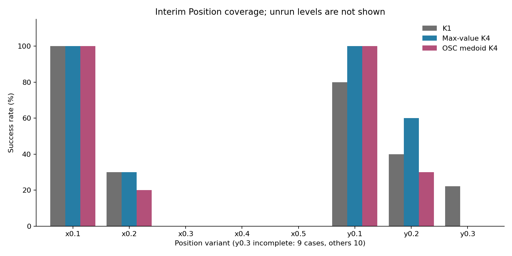

# OSC trajectory medoid: промежуточный результат и сравнение со статьями

Срез сервера: **8 сентября 2026, 18:30:33 MSK**. Это не финальный результат.

## 1. Состояние экспериментов

- `trajectory_consensus_20260908_compact`: **539/600 rollout**, 299/360 jobs.
  Кампания не завершена, итоговый анализ ещё не запускался.
- Object и Environment завершены: по 50 эпизодов на каждый из трёх методов.
- Position: K1 80/100, max-value 80/100, medoid 79/100.
- `consensus_references_20260908`: **waiting_for_compact**, 0/600 новых
  reference-rollout. KeyStone/KDPE closed-loop результаты пока отсутствуют.
  Следующая цепочка включает 3 integration smoke и 600 основных rollout.

На сервере scheduler продолжает ожидать доступные GPU 3-7; в просмотренном
логе явно указан `waiting for free GPU`. Настройки, frozen runtime и очередь
не изменялись. Предыдущий full4500 заменён compact и не считается завершённым.

Новый анализ берёт только jobs с completion marker. Проверены уникальные и
непрерывные query, timeline от 0 до final_t, число queries, H16, parallel,
K1/K4 и наличие непустых video-файлов. Для сравнения оставлены только
**179 полных троек task/init/seed**, всего 537 эпизодов. Два уже завершённых
Position rollout без medoid-пары исключены из сравнительной таблицы.
Незавершённые эпизоды не записаны как fail. Исходные SHA256 сохранены.

## 2. Что проверяем

Замороженный Cosmos Policy; генерация и исполнение 16 действий, 5 denoising
steps, лимит 280 действий. На каждом query поступают реальные текущие
наблюдения. `parallel` означает совместную генерацию action/future/value,
а не авторегрессионный planning a -> s -> v.

- K1: исполняется единственный sample.
- Max-value K4: выбирается кандидат с максимальным predicted value.
- OSC medoid K4: выбирается реально сгенерированный chunk с минимальным
  средним расстоянием до остальных; value используется только при равенстве.

$$
i_V=\arg\max_i V_i,\qquad
i_M=\arg\min_i\frac1K\sum_j D_{\mathrm{OSC}}(A_i,A_j).
$$

В $D_{\mathrm{OSC}}$ сравниваются накопленные перемещения, повороты и знаки
команд захвата на всех 16 шагах, с временными весами $w_t\propto0.95^{t-1}$.
Это command-space приближение движения, не rollout физической модели.
Предсказанные изображения и состояния не входят в score выбранного medoid.
Подробная [формула](TRAJECTORY_CONSENSUS_ICLR_ASSESSMENT_20260908.md).

## 3. Текущие closed-loop результаты

SR ниже относится к одинаковым завершённым конфигурациям. Macro-SR есть
среднее трёх факторных SR; оно не равно success / 179.

| Метод | Object, n=50 | Environment, n=50 | Position, n=79 | Macro-SR | Success / 179 |
|---|---:|---:|---:|---:|---:|
| K1 | 47/50 = 94% | 19/50 = 38% | 27/79 = 34.18% | 55.39% | 93 |
| Max-value K4 | 47/50 = 94% | 20/50 = 40% | 29/79 = 36.71% | 56.90% | 96 |
| **OSC medoid K4** | **48/50 = 96%** | **20/50 = 40%** | **25/79 = 31.65%** | **55.88%** | **93** |

Medoid относительно max-value: **-1.02 п.п. macro-SR**, 3 rescue / 6 harm.
Описательный task/init-cluster bootstrap CI: **[-3.69; +1.65] п.п.**
Относительно K1: +0.49 п.п., 5 rescue / 5 harm, CI [-2.75; +3.87] п.п.
По pooled success medoid и K1 совпали; разница macro связана с весами факторов.

Это промежуточные, не sequentially adjusted интервалы. Position ещё не
покрыт целиком; результат зависит от порядка завершения конфигураций.
Порогов значимости, остановки или перенастройки метода по этому срезу нет.
Интервал Position отдельно ниже нуля в текущей bootstrap-выборке, но это
не финальное подтверждение ухудшения с поправкой на все сравнения.

### Где появился эффект

Object: единственный чистый прирост к max-value даёт task3, 4/5 -> 5/5.
Environment: 1 rescue и 1 harm взаимно компенсировались; факторный SR равен.
Position: 1 rescue и 5 harm, чистая потеря четырёх успехов.

| Уровень Position | K1 | Max-value | Medoid | Сопоставимых случаев |
|---|---:|---:|---:|---:|
| x0.1 | 10 | 10 | 10 | 10 |
| x0.2 | 3 | 3 | 2 | 10 |
| x0.3 | 0 | 0 | 0 | 10 |
| x0.4 | 0 | 0 | 0 | 10 |
| x0.5 | 0 | 0 | 0 | 10 |
| y0.1 | 8 | 10 | 10 | 10 |
| y0.2 | 4 | 6 | 3 | 10 |
| y0.3, частично | 2 | 0 | 0 | 9 |

y0.4/y0.5 и последний полный случай y0.3 в этот срез не входят.
Уровни обозначают variants из LIBERO-PRO, не новые ручные вмешательства.

## 4. Почему мог получиться такой результат

**Наблюдение 1: мало места для улучшения на Object.** Baseline уже 94%.
Один дополнительный успех даёт +2 п.п.; это пока не устойчивый новый эффект.

**Наблюдение 2: ошибки часто сохраняются при смене selector.** На Position
x0.3-x0.5 все три метода получили 0/30. На Environment задачи 0,2,6,7 дают
0/5 у всех методов. Это согласуется с гипотезой общего недостатка генерации
или восприятия, но само по себе не доказывает, что в каждом текущем pool
нет успешного кандидата: closed-loop траектории и следующие состояния разные.

**Отдельная проверка возможности выбора:** в завершённом common-pool анализе
на других, ранее открытых данных есть 194 точных K4-набора: 69 all-fail,
93 all-success, 32 mixed. Max-value выбирает 111 успешных ветвей, oracle 125,
medoid 104. Значит, относительно max-value потенциально исправимы только
14 случаев; medoid исправляет 5, но портит 12. На Position того набора
oracle и max-value совпадают: 61 успешная ветвь из 115 pools.
[Отдельный отчёт](CONSENSUS_COMMON_POOL_RESULTS_20260908.md).

Эти исходы относятся к выбранному chunk плюс фиксированной continuation
policy, а не к применению нового selector на каждом последующем query.
Их нельзя складывать с compact rollout или выдавать за один тест.

**Объясняющая гипотеза:** центральность в распределении модели не равна
правильности действия. В OOD-состоянии многие samples могут одинаково
ошибаться; полезный кандидат может быть редким. Геометрический medoid
не использует цель, predicted consequences или оценку контакта в своём score.
Замена value на consensus тогда может потерять полезный сигнал.

Для фиксированного pool и фиксированных исходов $Y_i$:

$$
\Delta_{M,V}=
\Pr(Y_{i_M}=1,Y_{i_V}=0)
-\Pr(Y_{i_M}=0,Y_{i_V}=1).
$$

То есть эффект есть rescue минус harm. Если все $Y_i=0$, перестановка
кандидатов не создаёт успешную ветвь. Это ограничение конкретного pool,
не доказательство физической нерешаемости задачи или бесполезности большего K.

**Предположения, ещё требующие проверки:** K4 может недостаточно описывать
моды; накопленные OSC-команды могут плохо отражать реальное движение при
контакте; глобальный medoid может уступать выбору отдельного кластера.
Ни одно из них не установлено как единственная причина текущего результата.
В offline ablations удаление rotation/gripper не изменило terminal исходы;
польза этих усложнений пока не показана.

Medoid активен: выбирает не max-value в 1852/2396 queries (77.30%).
Это частота выбора внутри его собственного pool, а не число причинно
вредных действий и не совпадение состояний между стратегиями.

## 5. Почему результаты статей нельзя переносить напрямую

### KeyStone

В статье тестируются несколько VLA и Fast-WAM на LIBERO, SimplerEnv и
RoboTwin 2.0, не наша связка Cosmos Policy / LIBERO-PRO. Основной comparator
есть K1, K=4 или 16 зависит от модели. На LIBERO прирост составляет +1.0 п.п.
для pi0.5 и +6.8 для SmolVLA; максимум +13.3 относится к GR00T на SimplerEnv.
Авторы повторяют полную оценку пять раз. Эти цифры не показывают выигрыш
над max-value Cosmos на наших perturbations.
[KeyStone, протокол и Table 1](https://arxiv.org/html/2605.08638v1#S4).

Наш medoid также не равен всему KeyStone: нет выбора крупнейшего кластера,
изменено расстояние. Проверка локальной KeyStone-style реализации ещё ждёт
очереди; shared-context batching и опубликованная latency не воспроизводятся.

### KDPE

В KDPE используются Diffusion Policy CNN/Transformer, RoboMimic/MimicGen,
100 samples и execution horizon 8. Основное сравнение с uniform выбором,
а не learned value. Средний SR CNN: 84.9% -> 88.2%; Transformer:
79.3% -> 81.2%. Visual OOD включает изменение цвета объектов. Более сложный
Tr-KDPE всей последовательности дал 84.2%/78.6%, то есть улучшения не показал.
[KDPE, Sections 4-5, Table 1](https://arxiv.org/html/2508.10511v2#S4).

Наш KDPE-control использует K4/H16 и induced OSC endpoint вместо исходных
pose actions. Это адаптация при равном бюджете Cosmos, не воспроизведение
авторского протокола с N100. Малый K, иной checkpoint, action representation
и иной OOD являются возможными факторами переноса, а не оправданием,
автоматически объясняющим отрицательный результат.

### Итого по постановке

Метрическая цель общая: terminal task success при цикле observation -> chunk
-> execution. Но отличаются модель, распределение задач, comparator,
sampling budget, представление действий и размер статистической проверки.
Положительный результат статей и отсутствие улучшения у нас не противоречат
друг другу. При этом прибавка medoid к K1 у нас тоже пока неубедительна:
только +0.49 п.п. на текущем частичном наборе.

## 6. Что нельзя заключать

- Пока не доказаны ни превосходство, ни эквивалентность medoid и max-value.
- Наши результаты не опровергают KeyStone/KDPE на их исходных моделях и данных.
- Все 86 medoid-fail дошли до t=280. Это условие завершения, не доказательство
  того, что робот выполнил бы задачу при большем лимите.
- Эвристические причины этих 86 fail: 47 timeout_no_goal, 27 wrong-object,
  10 deadlock, 2 drop. Это приоритетные proxy labels из safety_signals.py,
  не независимая визуальная разметка, причинный диагноз или LIBERO-Safety SR.
- Начальные simulator states совпадают у всех 179 пар. Q0 action pools
  medoid/max-value совпадают побитово в 84/179 парах. Это matched deployment,
  не чистый common-random-pool эксперимент. Поздние состояния расходятся.
- Свежие видео имеют файлы и непрерывные trace, но в этом анализе не
  проводилась покадровая проверка физической причины каждого fail.

## 7. Следующее решение

1. Закончить неизменённый compact600 и уже поставленные reference600.
   Не отбирать только удачные Position уровни и не менять веса по test.
2. Если преимущество не подтвердится, закрыть medoid как самостоятельный
   главный метод; сохранить как baseline и результат о границах consensus.
3. Для механизма отдельно проверять proposal opportunity и ranking regret:
   имеются ли успешные варианты, и способен ли selector их распознать.
4. Только затем фиксировать новый development-протокол: K4/K8/K16 на
   одинаковых состояниях, контролируемая проверка до/после OOD, сравнение
   consensus с consequence/outcome score. Final holdout держать отдельно.
5. При отсутствии успешных proposals приоритет имеют новые proposals,
   более частое наблюдение/recovery, а не ещё одна сумма тех же uncertainty.

Это план последующей проверки, не заявление о запуске дополнительных jobs.

## Артефакты среза

- [JSON, точное время и аудит SHA256](campaigns/trajectory_consensus_20260908_compact/interim_analysis_20260908_183033/summary.json).
- [Факторные метрики](campaigns/trajectory_consensus_20260908_compact/interim_analysis_20260908_183033/factor_scores_matched.csv).
- [Парные разницы и интервалы](campaigns/trajectory_consensus_20260908_compact/interim_analysis_20260908_183033/paired_effects.csv).
- [Метрики по задачам](campaigns/trajectory_consensus_20260908_compact/interim_analysis_20260908_183033/task_scores.csv).
- [Код извлечения среза, read-only для кампании](campaigns/trajectory_consensus_20260908_compact/interim_analysis_20260908_183033/extract_snapshot.py).

Повторный запуск extract_snapshot.py на сервере читает текущее состояние,
а не восстанавливает старый срез; для старого среза использовать сохранённый
JSON и trace_audit.csv. Финальная trajectory_analysis не перезаписывалась.
