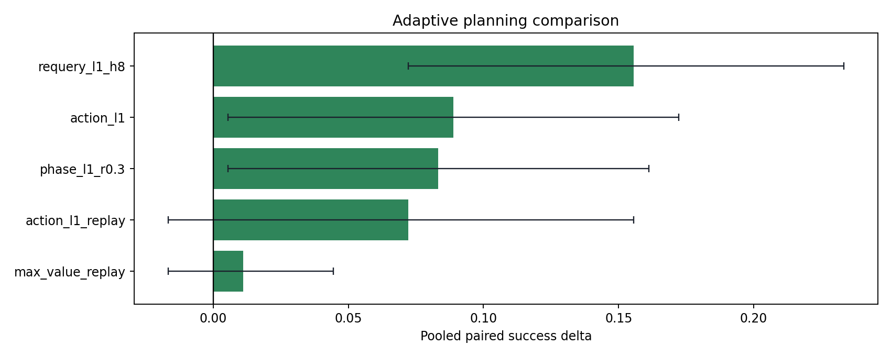
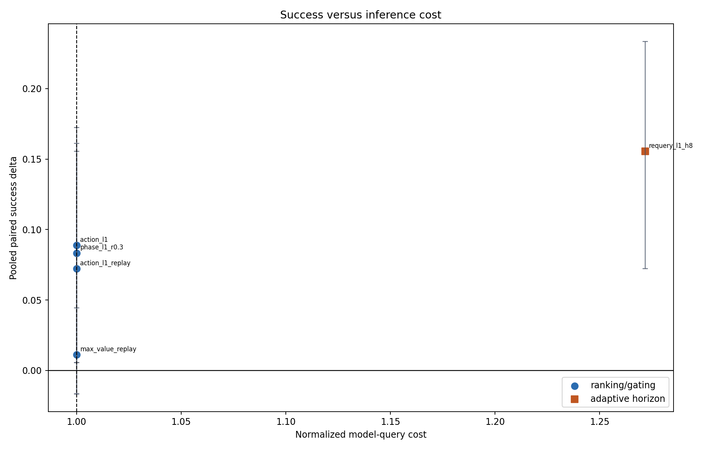
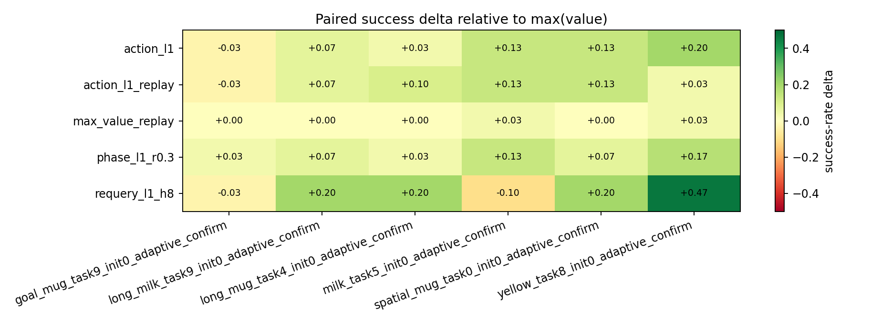
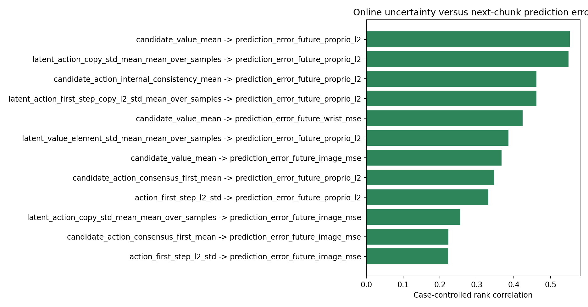
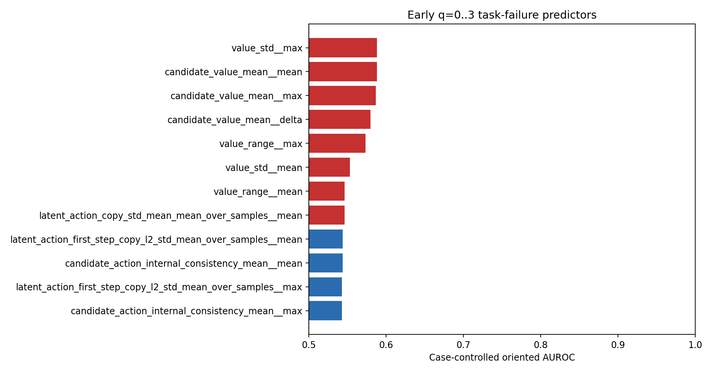

# Adaptive planning campaign

Sources: `experiments/campaigns/adaptive_confirmatory_20260813`.

Loaded 1080 strategy executions across 6 cases.

## Confirmatory interpretation

- **`requery_l1_h8`:** 143/180 success versus 115/180 for `max(value)`; delta +15.6 pp (95% paired bootstrap CI [+7.2, +23.3] pp), Holm p=0.001235, per-case delta [-10.0, +46.7] pp, normalized query cost 1.27x.
- **`phase_l1_r0.3`:** 130/180 success versus 115/180 for `max(value)`; delta +8.3 pp (95% paired bootstrap CI [+0.6, +16.1] pp), Holm p=0.04887, per-case delta [+3.3, +16.7] pp, normalized query cost 1.00x.
- Against fixed `action_l1`, `requery_l1_h8` has delta +6.7 pp (CI [-1.1, +13.9] pp; exact McNemar p=0.1263).
- Exact-replay outcome disagreement (empirical noise floor): `max_value` 4.4%, `action_l1` 9.4%.
- The best early q=0..3 failure feature is `value_std__max` with case-controlled oriented AUROC 0.588; current metrics are stronger as within-state ranking signals than as a universal episode-failure threshold.
- Strongest next-chunk mechanism association: `candidate_value_mean` versus `prediction_error_future_proprio_l2`, case-controlled rank correlation 0.552.

## Pooled paired ranking

| baseline_strategy_id   | strategy_id      |   num_cases |   paired_rollouts |   baseline_successes |   strategy_successes |   baseline_success_rate |   strategy_success_rate |   delta_success_rate |   delta_ci_low |   delta_ci_high |   min_case_delta |   max_case_delta |   wins |   losses |   ties |   mcnemar_exact_p |   baseline_mean_queries |   mean_queries |   query_overhead_ratio |   actual_query_count_ratio |   mean_requery_rate |
|:-----------------------|:-----------------|------------:|------------------:|---------------------:|---------------------:|------------------------:|------------------------:|---------------------:|---------------:|----------------:|-----------------:|-----------------:|-------:|---------:|-------:|------------------:|------------------------:|---------------:|-----------------------:|---------------------------:|--------------------:|
| max_value              | requery_l1_h8    |           6 |               180 |                  115 |                  143 |                0.638889 |                0.794444 |            0.155556  |     0.0722222  |       0.233333  |       -0.1       |        0.466667  |     46 |       18 |    116 |       0.000617378 |                 14.2778 |        15.2389 |                1.27169 |                   1.06732  |            0.421175 |
| max_value              | action_l1        |           6 |               180 |                  115 |                  131 |                0.638889 |                0.727778 |            0.0888889 |     0.00555556 |       0.172222  |       -0.0333333 |        0.2       |     39 |       23 |    118 |       0.0558972   |                 14.2778 |        13.7444 |                1       |                   0.962646 |            0        |
| max_value              | phase_l1_r0.3    |           6 |               180 |                  115 |                  130 |                0.638889 |                0.722222 |            0.0833333 |     0.00555556 |       0.161111  |        0.0333333 |        0.166667  |     33 |       18 |    129 |       0.0488739   |                 14.2778 |        13.5611 |                1       |                   0.949805 |            0        |
| max_value              | action_l1_replay |           6 |               180 |                  115 |                  128 |                0.638889 |                0.711111 |            0.0722222 |    -0.0166667  |       0.155556  |       -0.0333333 |        0.133333  |     38 |       25 |    117 |       0.129918    |                 14.2778 |        13.7056 |                1       |                   0.959922 |            0        |
| max_value              | max_value_replay |           6 |               180 |                  115 |                  117 |                0.638889 |                0.65     |            0.0111111 |    -0.0166667  |       0.0444444 |        0         |        0.0333333 |      5 |        3 |    172 |       0.726562    |                 14.2778 |        14.2111 |                1       |                   0.995331 |            0        |

## Per-case robustness

## Replay noise floor

| reference_id   | replay_id        |   paired_rollouts |   reference_success_rate |   replay_success_rate |   outcome_disagreements |   outcome_disagreement_rate |   q0_candidate_value_max_abs_diff_mean |   q0_candidate_value_max_abs_diff_max |
|:---------------|:-----------------|------------------:|-------------------------:|----------------------:|------------------------:|----------------------------:|---------------------------------------:|--------------------------------------:|
| max_value      | max_value_replay |               180 |                 0.638889 |              0.65     |                       8 |                   0.0444444 |                            0.000206398 |                            0.00177899 |
| action_l1      | action_l1_replay |               180 |                 0.727778 |              0.711111 |                      17 |                   0.0944444 |                            0.000190257 |                            0.00202864 |

## Frozen confirmatory strategies

| selection_category   | strategy_id   | baseline_strategy_id   |   num_cases |   paired_rollouts |   baseline_successes |   strategy_successes |   baseline_success_rate |   strategy_success_rate |   delta_success_rate |   delta_ci_low |   delta_ci_high |   min_case_delta |   max_case_delta |   wins |   losses |   ties |   mcnemar_exact_p |   baseline_mean_queries |   mean_queries |   query_overhead_ratio |   actual_query_count_ratio |   mean_requery_rate |   mcnemar_holm_p |
|:---------------------|:--------------|:-----------------------|------------:|------------------:|---------------------:|---------------------:|------------------------:|------------------------:|---------------------:|---------------:|----------------:|-----------------:|-----------------:|-------:|---------:|-------:|------------------:|------------------------:|---------------:|-----------------------:|---------------------------:|--------------------:|-----------------:|
| adaptive_horizon     | requery_l1_h8 | max_value              |           6 |               180 |                  115 |                  143 |                0.638889 |                0.794444 |            0.155556  |     0.0722222  |        0.233333 |       -0.1       |         0.466667 |     46 |       18 |    116 |       0.000617378 |                 14.2778 |        15.2389 |                1.27169 |                   1.06732  |            0.421175 |       0.00123476 |
| no_extra_inference   | phase_l1_r0.3 | max_value              |           6 |               180 |                  115 |                  130 |                0.638889 |                0.722222 |            0.0833333 |     0.00555556 |        0.161111 |        0.0333333 |         0.166667 |     33 |       18 |    129 |       0.0488739   |                 14.2778 |        13.5611 |                1       |                   0.949805 |            0        |       0.0488739  |

Strategies were frozen by the supplied screening selection file.

### Against fixed action penalty (lambda=1)

| selection_category   | strategy_id   | baseline_strategy_id   |   num_cases |   paired_rollouts |   baseline_successes |   strategy_successes |   baseline_success_rate |   strategy_success_rate |   delta_success_rate |   delta_ci_low |   delta_ci_high |   min_case_delta |   max_case_delta |   wins |   losses |   ties |   mcnemar_exact_p |   baseline_mean_queries |   mean_queries |   query_overhead_ratio |   actual_query_count_ratio |   mean_requery_rate |
|:---------------------|:--------------|:-----------------------|------------:|------------------:|---------------------:|---------------------:|------------------------:|------------------------:|---------------------:|---------------:|----------------:|-----------------:|-----------------:|-------:|---------:|-------:|------------------:|------------------------:|---------------:|-----------------------:|---------------------------:|--------------------:|
| adaptive_horizon     | requery_l1_h8 | action_l1              |           6 |               180 |                  131 |                  143 |                0.727778 |                0.794444 |           0.0666667  |     -0.0111111 |       0.138889  |       -0.233333  |        0.266667  |     32 |       20 |    128 |          0.126347 |                 13.7444 |        15.2389 |                1.27169 |                   1.10873  |            0.421175 |
| no_extra_inference   | phase_l1_r0.3 | action_l1              |           6 |               180 |                  131 |                  130 |                0.727778 |                0.722222 |          -0.00555556 |     -0.05      |       0.0444444 |       -0.0666667 |        0.0666667 |      9 |       10 |    161 |          1        |                 13.7444 |        13.5611 |                1       |                   0.986661 |            0        |

## Results by confirmatory stratum

| case_stratum    | baseline_strategy_id   | strategy_id      |   num_cases |   paired_rollouts |   baseline_successes |   strategy_successes |   baseline_success_rate |   strategy_success_rate |   delta_success_rate |   delta_ci_low |   delta_ci_high |   min_case_delta |   max_case_delta |   wins |   losses |   ties |   mcnemar_exact_p |   baseline_mean_queries |   mean_queries |   query_overhead_ratio |   actual_query_count_ratio |   mean_requery_rate |
|:----------------|:-----------------------|:-----------------|------------:|------------------:|---------------------:|---------------------:|------------------------:|------------------------:|---------------------:|---------------:|----------------:|-----------------:|-----------------:|-------:|---------:|-------:|------------------:|------------------------:|---------------:|-----------------------:|---------------------------:|--------------------:|
| known_boundary  | max_value              | requery_l1_h8    |           3 |                90 |                   44 |                   61 |                0.488889 |                0.677778 |            0.188889  |      0.0666667 |       0.311111  |       -0.1       |        0.466667  |     29 |       12 |     49 |         0.0115078 |                 14.5889 |        15.3333 |                1.28044 |                   1.05103  |            0.426199 |
| known_boundary  | max_value              | action_l1        |           3 |                90 |                   44 |                   55 |                0.488889 |                0.611111 |            0.122222  |      0         |       0.244444  |        0.0333333 |        0.2       |     23 |       12 |     55 |         0.0895311 |                 14.5889 |        13.7556 |                1       |                   0.942879 |            0        |
| known_boundary  | max_value              | phase_l1_r0.3    |           3 |                90 |                   44 |                   54 |                0.488889 |                0.6      |            0.111111  |      0         |       0.222222  |        0.0333333 |        0.166667  |     19 |        9 |     62 |         0.0871586 |                 14.5889 |        13.8889 |                1       |                   0.952018 |            0        |
| known_boundary  | max_value              | action_l1_replay |           3 |                90 |                   44 |                   52 |                0.488889 |                0.577778 |            0.0888889 |     -0.0444444 |       0.222222  |        0.0333333 |        0.133333  |     22 |       14 |     54 |         0.242985  |                 14.5889 |        13.6778 |                1       |                   0.937548 |            0        |
| known_boundary  | max_value              | max_value_replay |           3 |                90 |                   44 |                   46 |                0.488889 |                0.511111 |            0.0222222 |     -0.0333333 |       0.0888889 |        0         |        0.0333333 |      5 |        3 |     82 |         0.726562  |                 14.5889 |        14.4556 |                1       |                   0.990861 |            0        |
| new_ood_holdout | max_value              | requery_l1_h8    |           3 |                90 |                   71 |                   82 |                0.788889 |                0.911111 |            0.122222  |      0.0222222 |       0.222222  |       -0.0333333 |        0.2       |     17 |        6 |     67 |         0.0346897 |                 13.9667 |        15.1444 |                1.26295 |                   1.08433  |            0.416151 |
| new_ood_holdout | max_value              | phase_l1_r0.3    |           3 |                90 |                   71 |                   76 |                0.788889 |                0.844444 |            0.0555556 |     -0.0444444 |       0.155556  |        0.0333333 |        0.0666667 |     14 |        9 |     67 |         0.404873  |                 13.9667 |        13.2333 |                1       |                   0.947494 |            0        |
| new_ood_holdout | max_value              | action_l1        |           3 |                90 |                   71 |                   76 |                0.788889 |                0.844444 |            0.0555556 |     -0.0555556 |       0.166667  |       -0.0333333 |        0.133333  |     16 |       11 |     63 |         0.442068  |                 13.9667 |        13.7333 |                1       |                   0.983294 |            0        |
| new_ood_holdout | max_value              | action_l1_replay |           3 |                90 |                   71 |                   76 |                0.788889 |                0.844444 |            0.0555556 |     -0.0555556 |       0.166667  |       -0.0333333 |        0.133333  |     16 |       11 |     63 |         0.442068  |                 13.9667 |        13.7333 |                1       |                   0.983294 |            0        |
| new_ood_holdout | max_value              | max_value_replay |           3 |                90 |                   71 |                   71 |                0.788889 |                0.788889 |            0         |      0         |       0         |        0         |        0         |      0 |        0 |     90 |         1         |                 13.9667 |        13.9667 |                1       |                   1        |            0        |

## Difficulty-gate diagnostic

| case_id                                  |   paired_rollouts |   difficulty_gate_rate |   baseline_success_rate |   action_success_rate |   counterfactual_gate_success_rate |   counterfactual_delta_vs_baseline |
|:-----------------------------------------|------------------:|-----------------------:|------------------------:|----------------------:|-----------------------------------:|-----------------------------------:|
| goal_mug_task9_init0_adaptive_confirm    |                30 |               1        |                0.933333 |              0.9      |                           0.9      |                         -0.0333333 |
| long_milk_task9_init0_adaptive_confirm   |                30 |               1        |                0.7      |              0.766667 |                           0.766667 |                          0.0666667 |
| long_mug_task4_init0_adaptive_confirm    |                30 |               0.433333 |                0.766667 |              0.8      |                           0.833333 |                          0.0666667 |
| milk_task5_init0_adaptive_confirm        |                30 |               1        |                0.466667 |              0.6      |                           0.6      |                          0.133333  |
| spatial_mug_task0_init0_adaptive_confirm |                30 |               1        |                0.733333 |              0.866667 |                           0.866667 |                          0.133333  |
| yellow_task8_init0_adaptive_confirm      |                30 |               1        |                0.233333 |              0.433333 |                           0.433333 |                          0.2       |
| POOLED                                   |               180 |               0.905556 |                0.638889 |              0.727778 |                           0.733333 |                          0.0944444 |

`counterfactual_gate` combines separately executed max-value/action outcomes;
`actual_gate` is the online gated policy and is the causal rollout result.

## Mechanism diagnostics

Top case-controlled correlations between online uncertainty and next-chunk error:

| online_metric                                          | prediction_error                   |   queries |   cases |   raw_spearman |   case_controlled_rank_correlation |
|:-------------------------------------------------------|:-----------------------------------|----------:|--------:|---------------:|-----------------------------------:|
| candidate_value_mean                                   | prediction_error_future_proprio_l2 |      2570 |       6 |       0.514164 |                           0.552104 |
| latent_action_copy_std_mean_mean_over_samples          | prediction_error_future_proprio_l2 |      2570 |       6 |       0.629131 |                           0.548414 |
| candidate_action_internal_consistency_mean             | prediction_error_future_proprio_l2 |      2570 |       6 |       0.566997 |                           0.461611 |
| latent_action_first_step_copy_l2_std_mean_over_samples | prediction_error_future_proprio_l2 |      2570 |       6 |       0.566997 |                           0.461611 |
| candidate_value_mean                                   | prediction_error_future_wrist_mse  |      2570 |       6 |       0.41819  |                           0.424381 |
| latent_value_element_std_mean_mean_over_samples        | prediction_error_future_proprio_l2 |      2570 |       6 |       0.433901 |                           0.385455 |
| candidate_value_mean                                   | prediction_error_future_image_mse  |      2570 |       6 |       0.133878 |                           0.36718  |
| candidate_action_consensus_first_mean                  | prediction_error_future_proprio_l2 |      2570 |       6 |       0.426728 |                           0.347136 |
| action_first_step_l2_std                               | prediction_error_future_proprio_l2 |      2570 |       6 |       0.414521 |                           0.331153 |
| latent_action_copy_std_mean_mean_over_samples          | prediction_error_future_image_mse  |      2570 |       6 |       0.320195 |                           0.254698 |
| candidate_action_consensus_first_mean                  | prediction_error_future_image_mse  |      2570 |       6 |       0.175565 |                           0.223008 |
| action_first_step_l2_std                               | prediction_error_future_image_mse  |      2570 |       6 |       0.172834 |                           0.22213  |

Top early q=0..3 task-failure predictors:

| feature                                                      |   episodes |   failures |   cases |   raw_auc_high_predicts_fail |   case_controlled_auc_high_predicts_fail |   case_controlled_oriented_auc | risk_direction   |
|:-------------------------------------------------------------|-----------:|-----------:|--------:|-----------------------------:|-----------------------------------------:|-------------------------------:|:-----------------|
| value_std__max                                               |        180 |         65 |       6 |                     0.622475 |                                 0.588227 |                       0.588227 | high             |
| candidate_value_mean__mean                                   |        180 |         65 |       6 |                     0.62796  |                                 0.58796  |                       0.58796  | high             |
| candidate_value_mean__max                                    |        180 |         65 |       6 |                     0.628094 |                                 0.586756 |                       0.586756 | high             |
| candidate_value_mean__delta                                  |        180 |         65 |       6 |                     0.637324 |                                 0.579532 |                       0.579532 | high             |
| value_range__max                                             |        180 |         65 |       6 |                     0.618462 |                                 0.572977 |                       0.572977 | high             |
| value_std__mean                                              |        180 |         65 |       6 |                     0.615652 |                                 0.552776 |                       0.552776 | high             |
| value_range__mean                                            |        180 |         65 |       6 |                     0.614783 |                                 0.546221 |                       0.546221 | high             |
| latent_action_copy_std_mean_mean_over_samples__mean          |        180 |         65 |       6 |                     0.47893  |                                 0.546087 |                       0.546087 | high             |
| latent_action_first_step_copy_l2_std_mean_over_samples__mean |        180 |         65 |       6 |                     0.50301  |                                 0.456455 |                       0.543545 | low              |
| candidate_action_internal_consistency_mean__mean             |        180 |         65 |       6 |                     0.50301  |                                 0.456455 |                       0.543545 | low              |
| latent_action_first_step_copy_l2_std_mean_over_samples__max  |        180 |         65 |       6 |                     0.460736 |                                 0.457258 |                       0.542742 | low              |
| candidate_action_internal_consistency_mean__max              |        180 |         65 |       6 |                     0.460736 |                                 0.457258 |                       0.542742 | low              |

These mechanism tables are exploratory. In particular, they are not used to
change the preregistered screening utility or confirmatory strategies.

This is a frozen confirmatory evaluation on disjoint seeds: the two adaptive strategies and all hyperparameters were selected before these outcomes were observed.
