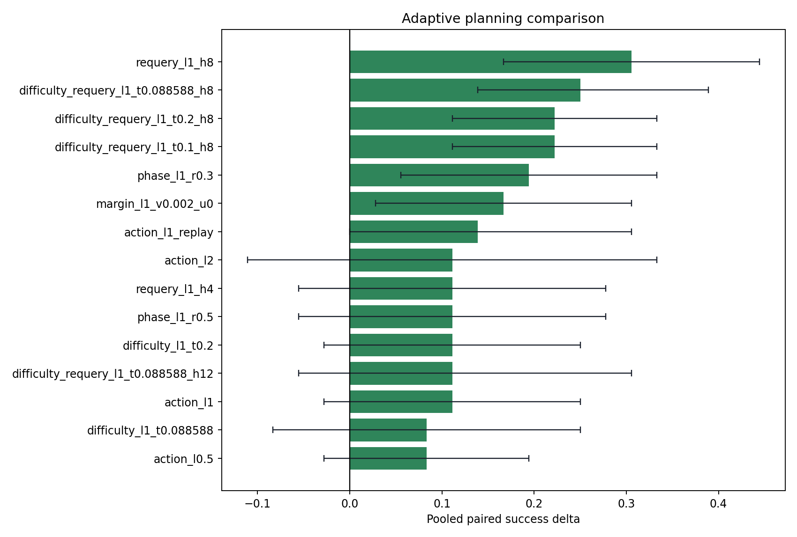
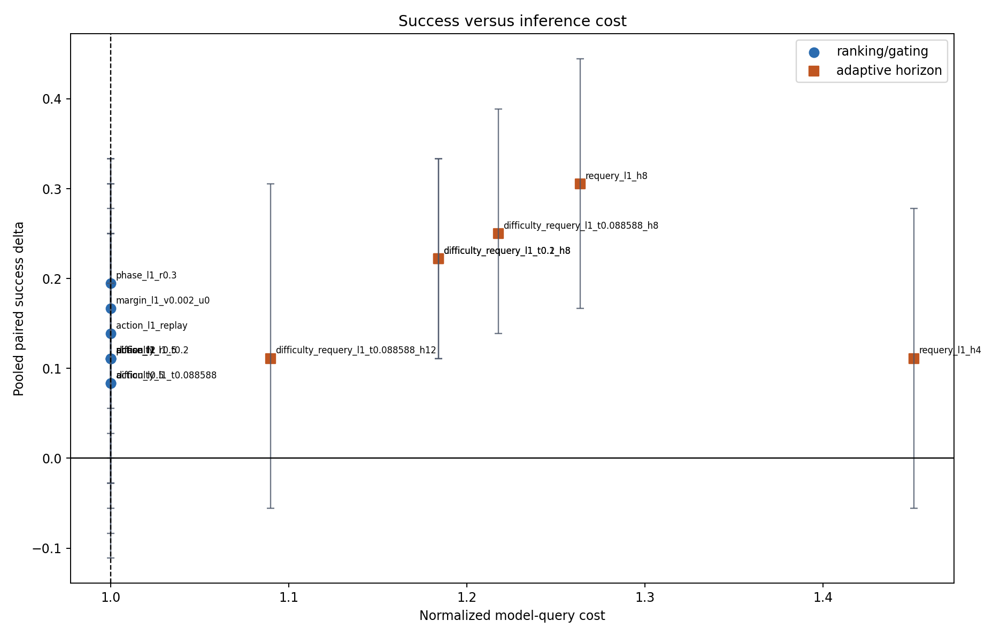
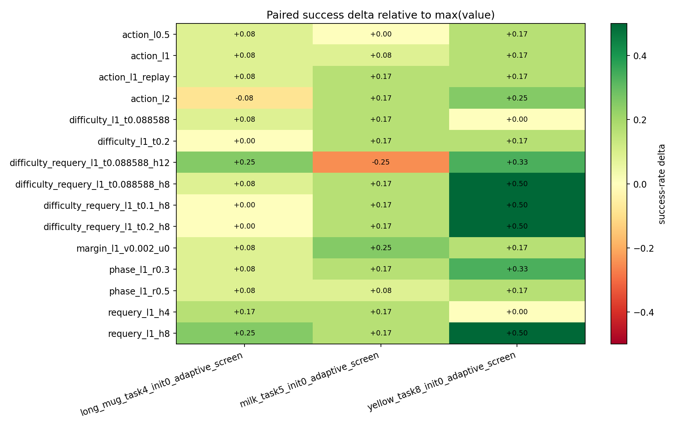
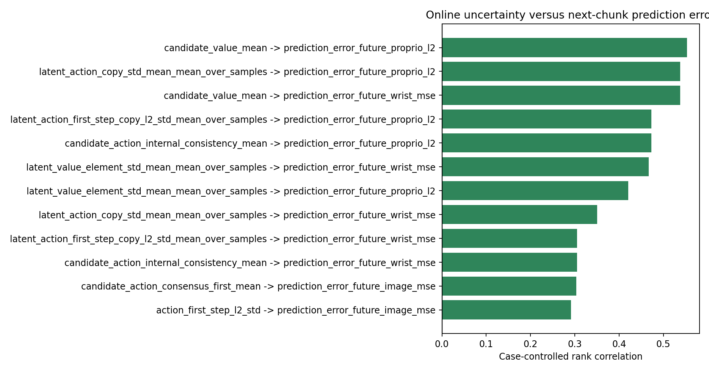
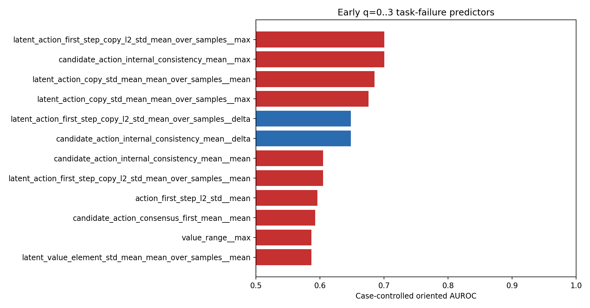

# Adaptive planning campaign

Sources: `experiments/campaigns/adaptive_screening_20260813`, `experiments/campaigns/adaptive_regime_threshold_20260813`.

Loaded 900 strategy executions across 3 cases.

## Calibration interpretation

- Calibration selected **`requery_l1_h8`** for `adaptive_horizon`: delta +30.6 pp, worst-case delta +16.7 pp, normalized query cost 1.26x, selection utility J=0.384.
- Calibration selected **`phase_l1_r0.3`** for `no_extra_inference`: delta +19.4 pp, worst-case delta +8.3 pp, normalized query cost 1.00x, selection utility J=0.236.

## Pooled paired ranking

| baseline_strategy_id   | strategy_id                        |   num_cases |   paired_rollouts |   baseline_successes |   strategy_successes |   baseline_success_rate |   strategy_success_rate |   delta_success_rate |   delta_ci_low |   delta_ci_high |   min_case_delta |   max_case_delta |   wins |   losses |   ties |   mcnemar_exact_p |   baseline_mean_queries |   mean_queries |   query_overhead_ratio |   actual_query_count_ratio |   mean_requery_rate |
|:-----------------------|:-----------------------------------|------------:|------------------:|---------------------:|---------------------:|------------------------:|------------------------:|---------------------:|---------------:|----------------:|-----------------:|-----------------:|-------:|---------:|-------:|------------------:|------------------------:|---------------:|-----------------------:|---------------------------:|--------------------:|
| max_value              | requery_l1_h8                      |           3 |                36 |                   18 |                   29 |                     0.5 |                0.805556 |             0.305556 |      0.166667  |        0.444444 |        0.166667  |         0.5      |     11 |        0 |     25 |       0.000976562 |                 14.6944 |        14.0556 |                1.26365 |                   0.956522 |            0.409723 |
| max_value              | difficulty_requery_l1_t0.088588_h8 |           3 |                36 |                   18 |                   27 |                     0.5 |                0.75     |             0.25     |      0.138889  |        0.388889 |        0.0833333 |         0.5      |      9 |        0 |     27 |       0.00390625  |                 14.6944 |        14.4722 |                1.21761 |                   0.984877 |            0.330706 |
| max_value              | difficulty_requery_l1_t0.1_h8      |           3 |                36 |                   18 |                   26 |                     0.5 |                0.722222 |             0.222222 |      0.111111  |        0.333333 |        0         |         0.5      |      8 |        0 |     28 |       0.0078125   |                 14.6944 |        14.6389 |                1.18388 |                   0.996219 |            0.274876 |
| max_value              | difficulty_requery_l1_t0.2_h8      |           3 |                36 |                   18 |                   26 |                     0.5 |                0.722222 |             0.222222 |      0.111111  |        0.333333 |        0         |         0.5      |      8 |        0 |     28 |       0.0078125   |                 14.6944 |        14.6389 |                1.18388 |                   0.996219 |            0.274876 |
| max_value              | phase_l1_r0.3                      |           3 |                36 |                   18 |                   25 |                     0.5 |                0.694444 |             0.194444 |      0.0555556 |        0.333333 |        0.0833333 |         0.333333 |      8 |        1 |     27 |       0.0390625   |                 14.6944 |        13.5278 |                1       |                   0.920605 |            0        |
| max_value              | margin_l1_v0.002_u0                |           3 |                36 |                   18 |                   24 |                     0.5 |                0.666667 |             0.166667 |      0.0277778 |        0.305556 |        0.0833333 |         0.25     |      7 |        1 |     28 |       0.0703125   |                 14.6944 |        13.75   |                1       |                   0.935728 |            0        |
| max_value              | action_l1_replay                   |           3 |                36 |                   18 |                   23 |                     0.5 |                0.638889 |             0.138889 |      0         |        0.305556 |        0.0833333 |         0.166667 |      7 |        2 |     27 |       0.179688    |                 14.6944 |        14.0278 |                1       |                   0.954631 |            0        |
| max_value              | action_l1                          |           3 |                36 |                   18 |                   22 |                     0.5 |                0.611111 |             0.111111 |     -0.0277778 |        0.25     |        0.0833333 |         0.166667 |      6 |        2 |     28 |       0.289062    |                 14.6944 |        13.9722 |                1       |                   0.950851 |            0        |
| max_value              | phase_l1_r0.5                      |           3 |                36 |                   18 |                   22 |                     0.5 |                0.611111 |             0.111111 |     -0.0555556 |        0.277778 |        0.0833333 |         0.166667 |      7 |        3 |     26 |       0.34375     |                 14.6944 |        14.0556 |                1       |                   0.956522 |            0        |
| max_value              | difficulty_l1_t0.2                 |           3 |                36 |                   18 |                   22 |                     0.5 |                0.611111 |             0.111111 |     -0.0277778 |        0.25     |        0         |         0.166667 |      6 |        2 |     28 |       0.289062    |                 14.6944 |        14.5278 |                1       |                   0.988658 |            0        |
| max_value              | requery_l1_h4                      |           3 |                36 |                   18 |                   22 |                     0.5 |                0.611111 |             0.111111 |     -0.0555556 |        0.277778 |        0         |         0.166667 |      8 |        4 |     24 |       0.387695    |                 14.6944 |        18.6667 |                1.45106 |                   1.27032  |            0.396142 |
| max_value              | action_l2                          |           3 |                36 |                   18 |                   22 |                     0.5 |                0.611111 |             0.111111 |     -0.111111  |        0.333333 |       -0.0833333 |         0.25     |     12 |        8 |     16 |       0.503445    |                 14.6944 |        14.5278 |                1       |                   0.988658 |            0        |

## Per-case robustness

## Replay noise floor

| reference_id   | replay_id        |   paired_rollouts |   reference_success_rate |   replay_success_rate |   outcome_disagreements |   outcome_disagreement_rate |   q0_candidate_value_max_abs_diff_mean |   q0_candidate_value_max_abs_diff_max |
|:---------------|:-----------------|------------------:|-------------------------:|----------------------:|------------------------:|----------------------------:|---------------------------------------:|--------------------------------------:|
| max_value      | max_value_replay |                36 |                 0.5      |              0.527778 |                       3 |                   0.0833333 |                            0.000250087 |                           0.0014154   |
| action_l1      | action_l1_replay |                36 |                 0.611111 |              0.638889 |                       5 |                   0.138889  |                            0.000129538 |                           0.000883549 |

## Preregistered strategy selection

| selection_category   | strategy_id   |   selection_utility |   delta_success_rate |   min_case_delta |   query_overhead_ratio |
|:---------------------|:--------------|--------------------:|---------------------:|-----------------:|-----------------------:|
| adaptive_horizon     | requery_l1_h8 |            0.383616 |             0.305556 |        0.166667  |                1.26365 |
| no_extra_inference   | phase_l1_r0.3 |            0.236111 |             0.194444 |        0.0833333 |                1       |

The full eligible screening ranking is saved in `selection_candidates.csv`.

### Against fixed action penalty (lambda=1)

Paired fixed-penalty comparison is unavailable.

## Results by confirmatory stratum

| case_stratum   | baseline_strategy_id   | strategy_id                         |   num_cases |   paired_rollouts |   baseline_successes |   strategy_successes |   baseline_success_rate |   strategy_success_rate |   delta_success_rate |   delta_ci_low |   delta_ci_high |   min_case_delta |   max_case_delta |   wins |   losses |   ties |   mcnemar_exact_p |   baseline_mean_queries |   mean_queries |   query_overhead_ratio |   actual_query_count_ratio |   mean_requery_rate |
|:---------------|:-----------------------|:------------------------------------|------------:|------------------:|---------------------:|---------------------:|------------------------:|------------------------:|---------------------:|---------------:|----------------:|-----------------:|-----------------:|-------:|---------:|-------:|------------------:|------------------------:|---------------:|-----------------------:|---------------------------:|--------------------:|
| known_boundary | max_value              | requery_l1_h8                       |           3 |                36 |                   18 |                   29 |                     0.5 |                0.805556 |            0.305556  |      0.166667  |        0.444444 |        0.166667  |        0.5       |     11 |        0 |     25 |       0.000976562 |                 14.6944 |        14.0556 |                1.26365 |                   0.956522 |            0.409723 |
| known_boundary | max_value              | difficulty_requery_l1_t0.088588_h8  |           3 |                36 |                   18 |                   27 |                     0.5 |                0.75     |            0.25      |      0.138889  |        0.388889 |        0.0833333 |        0.5       |      9 |        0 |     27 |       0.00390625  |                 14.6944 |        14.4722 |                1.21761 |                   0.984877 |            0.330706 |
| known_boundary | max_value              | difficulty_requery_l1_t0.1_h8       |           3 |                36 |                   18 |                   26 |                     0.5 |                0.722222 |            0.222222  |      0.111111  |        0.333333 |        0         |        0.5       |      8 |        0 |     28 |       0.0078125   |                 14.6944 |        14.6389 |                1.18388 |                   0.996219 |            0.274876 |
| known_boundary | max_value              | difficulty_requery_l1_t0.2_h8       |           3 |                36 |                   18 |                   26 |                     0.5 |                0.722222 |            0.222222  |      0.111111  |        0.333333 |        0         |        0.5       |      8 |        0 |     28 |       0.0078125   |                 14.6944 |        14.6389 |                1.18388 |                   0.996219 |            0.274876 |
| known_boundary | max_value              | phase_l1_r0.3                       |           3 |                36 |                   18 |                   25 |                     0.5 |                0.694444 |            0.194444  |      0.0555556 |        0.333333 |        0.0833333 |        0.333333  |      8 |        1 |     27 |       0.0390625   |                 14.6944 |        13.5278 |                1       |                   0.920605 |            0        |
| known_boundary | max_value              | margin_l1_v0.002_u0                 |           3 |                36 |                   18 |                   24 |                     0.5 |                0.666667 |            0.166667  |      0.0277778 |        0.305556 |        0.0833333 |        0.25      |      7 |        1 |     28 |       0.0703125   |                 14.6944 |        13.75   |                1       |                   0.935728 |            0        |
| known_boundary | max_value              | action_l1_replay                    |           3 |                36 |                   18 |                   23 |                     0.5 |                0.638889 |            0.138889  |      0         |        0.305556 |        0.0833333 |        0.166667  |      7 |        2 |     27 |       0.179688    |                 14.6944 |        14.0278 |                1       |                   0.954631 |            0        |
| known_boundary | max_value              | action_l1                           |           3 |                36 |                   18 |                   22 |                     0.5 |                0.611111 |            0.111111  |     -0.0277778 |        0.25     |        0.0833333 |        0.166667  |      6 |        2 |     28 |       0.289062    |                 14.6944 |        13.9722 |                1       |                   0.950851 |            0        |
| known_boundary | max_value              | phase_l1_r0.5                       |           3 |                36 |                   18 |                   22 |                     0.5 |                0.611111 |            0.111111  |     -0.0555556 |        0.277778 |        0.0833333 |        0.166667  |      7 |        3 |     26 |       0.34375     |                 14.6944 |        14.0556 |                1       |                   0.956522 |            0        |
| known_boundary | max_value              | difficulty_l1_t0.2                  |           3 |                36 |                   18 |                   22 |                     0.5 |                0.611111 |            0.111111  |     -0.0277778 |        0.25     |        0         |        0.166667  |      6 |        2 |     28 |       0.289062    |                 14.6944 |        14.5278 |                1       |                   0.988658 |            0        |
| known_boundary | max_value              | requery_l1_h4                       |           3 |                36 |                   18 |                   22 |                     0.5 |                0.611111 |            0.111111  |     -0.0555556 |        0.277778 |        0         |        0.166667  |      8 |        4 |     24 |       0.387695    |                 14.6944 |        18.6667 |                1.45106 |                   1.27032  |            0.396142 |
| known_boundary | max_value              | action_l2                           |           3 |                36 |                   18 |                   22 |                     0.5 |                0.611111 |            0.111111  |     -0.111111  |        0.333333 |       -0.0833333 |        0.25      |     12 |        8 |     16 |       0.503445    |                 14.6944 |        14.5278 |                1       |                   0.988658 |            0        |
| known_boundary | max_value              | difficulty_requery_l1_t0.088588_h12 |           3 |                36 |                   18 |                   22 |                     0.5 |                0.611111 |            0.111111  |     -0.0555556 |        0.305556 |       -0.25      |        0.333333  |      9 |        5 |     22 |       0.42395     |                 14.6944 |        13.7778 |                1.08962 |                   0.937618 |            0.33588  |
| known_boundary | max_value              | action_l0.5                         |           3 |                36 |                   18 |                   21 |                     0.5 |                0.583333 |            0.0833333 |     -0.0277778 |        0.194444 |        0         |        0.166667  |      4 |        1 |     31 |       0.375       |                 14.6944 |        13.9444 |                1       |                   0.94896  |            0        |
| known_boundary | max_value              | difficulty_l1_t0.088588             |           3 |                36 |                   18 |                   21 |                     0.5 |                0.583333 |            0.0833333 |     -0.0833333 |        0.25     |        0         |        0.166667  |      6 |        3 |     27 |       0.507812    |                 14.6944 |        14.1667 |                1       |                   0.964083 |            0        |
| known_boundary | max_value              | difficulty_requery_l1_t0.088588_h4  |           3 |                36 |                   18 |                   21 |                     0.5 |                0.583333 |            0.0833333 |     -0.0833333 |        0.25     |        0         |        0.166667  |      7 |        4 |     25 |       0.548828    |                 14.6944 |        17.5833 |                1.36369 |                   1.1966   |            0.316137 |
| known_boundary | max_value              | consensus_l2                        |           3 |                36 |                   18 |                   20 |                     0.5 |                0.555556 |            0.0555556 |     -0.138889  |        0.25     |        0         |        0.0833333 |      7 |        5 |     24 |       0.774414    |                 14.6944 |        14.3611 |                1       |                   0.977316 |            0        |
| known_boundary | max_value              | difficulty_l1_t0.1                  |           3 |                36 |                   18 |                   20 |                     0.5 |                0.555556 |            0.0555556 |     -0.111111  |        0.222222 |        0         |        0.166667  |      6 |        4 |     26 |       0.753906    |                 14.6944 |        14.5    |                1       |                   0.986767 |            0        |
| known_boundary | max_value              | margin_l1_v0.0005_u0                |           3 |                36 |                   18 |                   20 |                     0.5 |                0.555556 |            0.0555556 |     -0.0833333 |        0.222222 |        0         |        0.0833333 |      5 |        3 |     28 |       0.726562    |                 14.6944 |        14.1111 |                1       |                   0.960302 |            0        |
| known_boundary | max_value              | consensus_l0.5                      |           3 |                36 |                   18 |                   20 |                     0.5 |                0.555556 |            0.0555556 |     -0.0555556 |        0.166667 |       -0.166667  |        0.25      |      4 |        2 |     30 |       0.6875      |                 14.6944 |        14.0278 |                1       |                   0.954631 |            0        |
| known_boundary | max_value              | requery_l1_h12                      |           3 |                36 |                   18 |                   20 |                     0.5 |                0.555556 |            0.0555556 |     -0.138889  |        0.25     |       -0.25      |        0.25      |      8 |        6 |     22 |       0.790527    |                 14.6944 |        14.4167 |                1.10643 |                   0.981096 |            0.406162 |
| known_boundary | max_value              | max_value_replay                    |           3 |                36 |                   18 |                   19 |                     0.5 |                0.527778 |            0.0277778 |     -0.0555556 |        0.111111 |        0         |        0.0833333 |      2 |        1 |     33 |       1           |                 14.6944 |        14.5278 |                1       |                   0.988658 |            0        |
| known_boundary | max_value              | consensus_l1                        |           3 |                36 |                   18 |                   17 |                     0.5 |                0.472222 |           -0.0277778 |     -0.222222  |        0.166667 |       -0.25      |        0.0833333 |      6 |        7 |     23 |       1           |                 14.6944 |        14.4444 |                1       |                   0.982987 |            0        |
| known_boundary | max_value              | margin_l1_v0.002_u0.5               |           1 |                12 |                    6 |                    9 |                     0.5 |                0.75     |            0.25      |     -0.0833333 |        0.583333 |        0.25      |        0.25      |      4 |        1 |      7 |       0.375       |                 11.6667 |        11.1667 |                1       |                   0.957143 |            0        |
| known_boundary | max_value              | margin_l1_v0.01_u0                  |           1 |                12 |                    6 |                    8 |                     0.5 |                0.666667 |            0.166667  |     -0.166667  |        0.5      |        0.166667  |        0.166667  |      3 |        1 |      8 |       0.625       |                 11.6667 |        11.25   |                1       |                   0.964286 |            0        |
| known_boundary | max_value              | phase_l1_r0.7                       |           1 |                12 |                    6 |                    8 |                     0.5 |                0.666667 |            0.166667  |     -0.166667  |        0.5      |        0.166667  |        0.166667  |      3 |        1 |      8 |       0.625       |                 11.6667 |        11.5833 |                1       |                   0.992857 |            0        |

## Difficulty-gate diagnostic

| case_id                              |   paired_rollouts |   difficulty_gate_rate |   baseline_success_rate |   action_success_rate |   counterfactual_gate_success_rate |   counterfactual_delta_vs_baseline |   actual_gate_paired_rollouts |   actual_gate_success_rate |   actual_gate_delta_vs_baseline |
|:-------------------------------------|------------------:|-----------------------:|------------------------:|----------------------:|-----------------------------------:|-----------------------------------:|------------------------------:|---------------------------:|--------------------------------:|
| long_mug_task4_init0_adaptive_screen |                12 |               0.416667 |                    0.75 |              0.833333 |                           0.75     |                          0         |                            12 |                   0.833333 |                       0.0833333 |
| milk_task5_init0_adaptive_screen     |                12 |               1        |                    0.5  |              0.583333 |                           0.583333 |                          0.0833333 |                            12 |                   0.666667 |                       0.166667  |
| yellow_task8_init0_adaptive_screen   |                12 |               1        |                    0.25 |              0.416667 |                           0.416667 |                          0.166667  |                            12 |                   0.25     |                       0         |
| POOLED                               |                36 |               0.805556 |                    0.5  |              0.611111 |                           0.583333 |                          0.0833333 |                            36 |                   0.583333 |                       0.0833333 |

`counterfactual_gate` combines separately executed max-value/action outcomes;
`actual_gate` is the online gated policy and is the causal rollout result.

## Mechanism diagnostics

Top case-controlled correlations between online uncertainty and next-chunk error:

| online_metric                                          | prediction_error                   |   queries |   cases |   raw_spearman |   case_controlled_rank_correlation |
|:-------------------------------------------------------|:-----------------------------------|----------:|--------:|---------------:|-----------------------------------:|
| candidate_value_mean                                   | prediction_error_future_proprio_l2 |       529 |       3 |       0.538106 |                           0.55348  |
| latent_action_copy_std_mean_mean_over_samples          | prediction_error_future_proprio_l2 |       529 |       3 |       0.654543 |                           0.537926 |
| candidate_value_mean                                   | prediction_error_future_wrist_mse  |       529 |       3 |       0.47476  |                           0.537551 |
| latent_action_first_step_copy_l2_std_mean_over_samples | prediction_error_future_proprio_l2 |       529 |       3 |       0.607581 |                           0.47318  |
| candidate_action_internal_consistency_mean             | prediction_error_future_proprio_l2 |       529 |       3 |       0.607588 |                           0.47318  |
| latent_value_element_std_mean_mean_over_samples        | prediction_error_future_wrist_mse  |       529 |       3 |       0.447984 |                           0.466505 |
| latent_value_element_std_mean_mean_over_samples        | prediction_error_future_proprio_l2 |       529 |       3 |       0.422997 |                           0.421068 |
| latent_action_copy_std_mean_mean_over_samples          | prediction_error_future_wrist_mse  |       529 |       3 |       0.717144 |                           0.350771 |
| latent_action_first_step_copy_l2_std_mean_over_samples | prediction_error_future_wrist_mse  |       529 |       3 |       0.677318 |                           0.304702 |
| candidate_action_internal_consistency_mean             | prediction_error_future_wrist_mse  |       529 |       3 |       0.677319 |                           0.304702 |
| candidate_action_consensus_first_mean                  | prediction_error_future_image_mse  |       529 |       3 |       0.417394 |                           0.303002 |
| action_first_step_l2_std                               | prediction_error_future_image_mse  |       529 |       3 |       0.413137 |                           0.29148  |

Top early q=0..3 task-failure predictors:

| feature                                                       |   episodes |   failures |   cases |   raw_auc_high_predicts_fail |   case_controlled_auc_high_predicts_fail |   case_controlled_oriented_auc | risk_direction   |
|:--------------------------------------------------------------|-----------:|-----------:|--------:|-----------------------------:|-----------------------------------------:|-------------------------------:|:-----------------|
| latent_action_first_step_copy_l2_std_mean_over_samples__max   |         36 |         18 |       3 |                     0.799383 |                                 0.700617 |                       0.700617 | high             |
| candidate_action_internal_consistency_mean__max               |         36 |         18 |       3 |                     0.799383 |                                 0.700617 |                       0.700617 | high             |
| latent_action_copy_std_mean_mean_over_samples__mean           |         36 |         18 |       3 |                     0.79321  |                                 0.685185 |                       0.685185 | high             |
| latent_action_copy_std_mean_mean_over_samples__max            |         36 |         18 |       3 |                     0.799383 |                                 0.675926 |                       0.675926 | high             |
| latent_action_first_step_copy_l2_std_mean_over_samples__delta |         36 |         18 |       3 |                     0.490741 |                                 0.351852 |                       0.648148 | low              |
| candidate_action_internal_consistency_mean__delta             |         36 |         18 |       3 |                     0.490741 |                                 0.351852 |                       0.648148 | low              |
| candidate_action_internal_consistency_mean__mean              |         36 |         18 |       3 |                     0.746914 |                                 0.604938 |                       0.604938 | high             |
| latent_action_first_step_copy_l2_std_mean_over_samples__mean  |         36 |         18 |       3 |                     0.746914 |                                 0.604938 |                       0.604938 | high             |
| action_first_step_l2_std__mean                                |         36 |         18 |       3 |                     0.444444 |                                 0.595679 |                       0.595679 | high             |
| candidate_action_consensus_first_mean__mean                   |         36 |         18 |       3 |                     0.459877 |                                 0.592593 |                       0.592593 | high             |
| value_range__max                                              |         36 |         18 |       3 |                     0.709877 |                                 0.58642  |                       0.58642  | high             |
| latent_value_element_std_mean_mean_over_samples__mean         |         36 |         18 |       3 |                     0.432099 |                                 0.58642  |                       0.58642  | high             |

These mechanism tables are exploratory. In particular, they are not used to
change the preregistered screening utility or confirmatory strategies.

These are calibration/screening results. A strategy becomes confirmatory only after its hyperparameters are frozen and rerun on disjoint seeds.
