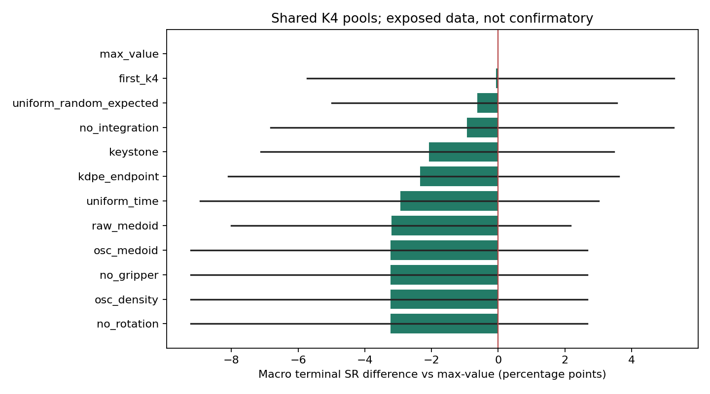

# Consensus common-pool diagnostic

{
  "status": "completed",
  "interpretation": "exploratory_already_exposed_P4b_not_new_holdout",
  "source": "/mnt/d/projects/ysda/ysda_word_models_pp/experiments/campaigns/p4b_residual_risk_20260907/terminal_holdout_analysis/candidate_scores.parquet",
  "source_sha256": "1ebd6c41a6d63b47492e274390b8f494229149dad0b94f338e22fcb8187c5521",
  "strict_pools": 194,
  "excluded_pools": 6,
  "methods": 12,
  "source_code_sha256": {
    "geometry": "e930de71133b2b7eaadc03e2192897a1a43c28902acf73bf69205a63332f6c46",
    "consensus": "a6dc6b388cce6731aae4163da87ff92f2389341c4ea0150983f2285f2f8c3923"
  }
}

One fixed candidate is executed, followed by the original shared continuation policy.
These are real terminal branches but not new closed-loop selector episodes.
P4b labels were previously opened: all effects and ablations here are exploratory.

## Available opportunity
| factor      |   all_fail |   all_success |   mixed |
|:------------|-----------:|--------------:|--------:|
| Environment |          3 |            30 |       7 |
| Object      |         12 |            10 |      17 |
| Position    |         54 |            53 |       8 |

## Fixed methods
| method                  | scope   |   snapshots |   macro_sr |   pooled_sr |   macro_delta |   ci95_low |   ci95_high |   rescues |    harms |   mcnemar_p |   oracle_sr |   macro_regret |   macro_drop_rate |   within_pool_concordance |   mixed_candidate_pairs |
|:------------------------|:--------|------------:|-----------:|------------:|--------------:|-----------:|------------:|----------:|---------:|------------:|------------:|---------------:|------------------:|--------------------------:|------------------------:|
| no_rotation             | All     |         194 |     0.5653 |      0.5361 |       -0.0322 |    -0.0922 |      0.0267 |    5.0000 |  12.0000 |      0.1435 |      0.7159 |         0.1506 |            0.0454 |                    0.4091 |                     110 |
| osc_density             | All     |         194 |     0.5653 |      0.5361 |       -0.0322 |    -0.0922 |      0.0267 |    5.0000 |  12.0000 |      0.1435 |      0.7159 |         0.1506 |            0.0454 |                    0.4000 |                     110 |
| no_gripper              | All     |         194 |     0.5653 |      0.5361 |       -0.0322 |    -0.0922 |      0.0267 |    5.0000 |  12.0000 |      0.1435 |      0.7159 |         0.1506 |            0.0454 |                    0.4000 |                     110 |
| osc_medoid              | All     |         194 |     0.5653 |      0.5361 |       -0.0322 |    -0.0922 |      0.0267 |    5.0000 |  12.0000 |      0.1435 |      0.7159 |         0.1506 |            0.0454 |                    0.4000 |                     110 |
| raw_medoid              | All     |         194 |     0.5655 |      0.5361 |       -0.0320 |    -0.0801 |      0.0217 |    3.0000 |  10.0000 |      0.0923 |      0.7159 |         0.1504 |            0.0452 |                    0.4091 |                     110 |
| uniform_time            | All     |         194 |     0.5682 |      0.5412 |       -0.0293 |    -0.0894 |      0.0301 |    5.0000 |  11.0000 |      0.2101 |      0.7159 |         0.1477 |            0.0454 |                    0.4364 |                     110 |
| kdpe_endpoint           | All     |         194 |     0.5741 |      0.5412 |       -0.0235 |    -0.0809 |      0.0362 |    6.0000 |  12.0000 |      0.2379 |      0.7159 |         0.1418 |            0.0483 |                    0.4091 |                     110 |
| keystone                | All     |         194 |     0.5768 |      0.5464 |       -0.0208 |    -0.0712 |      0.0347 |    4.0000 |   9.0000 |      0.2668 |      0.7159 |         0.1392 |            0.0594 |                  nan      |                       0 |
| no_integration          | All     |         194 |     0.5882 |      0.5567 |       -0.0093 |    -0.0682 |      0.0526 |    6.0000 |   9.0000 |      0.6072 |      0.7159 |         0.1277 |            0.0340 |                    0.4636 |                     110 |
| uniform_random_expected | All     |         194 |     0.5912 |      0.5567 |       -0.0063 |    -0.0498 |      0.0355 |  nan      | nan      |    nan      |      0.7159 |         0.1247 |            0.0453 |                  nan      |                       0 |
| first_k4                | All     |         194 |     0.5970 |      0.5619 |       -0.0006 |    -0.0573 |      0.0527 |    6.0000 |   8.0000 |      0.7905 |      0.7159 |         0.1190 |            0.0454 |                  nan      |                       0 |
| max_value               | All     |         194 |     0.5975 |      0.5722 |        0.0000 |     0.0000 |      0.0000 |    0.0000 |   0.0000 |      1.0000 |      0.7159 |         0.1184 |            0.0590 |                    0.5273 |                     110 |

Uniform random is the exact expectation over the four measured outcomes, not a sampled episode.
McNemar is omitted for this fractional control. Bootstrap resamples task/init clusters per factor.
Within-pool concordance compares scores only across success/fail candidate pairs; ties count 0.5.
Keystone has no scalar per-candidate ranking exported here, so its concordance is undefined.
KDPE uses the paper bandwidths on induced OSC endpoints; it is explicitly an adaptation.
No candidate outcomes or realized prediction errors enter any selector.
