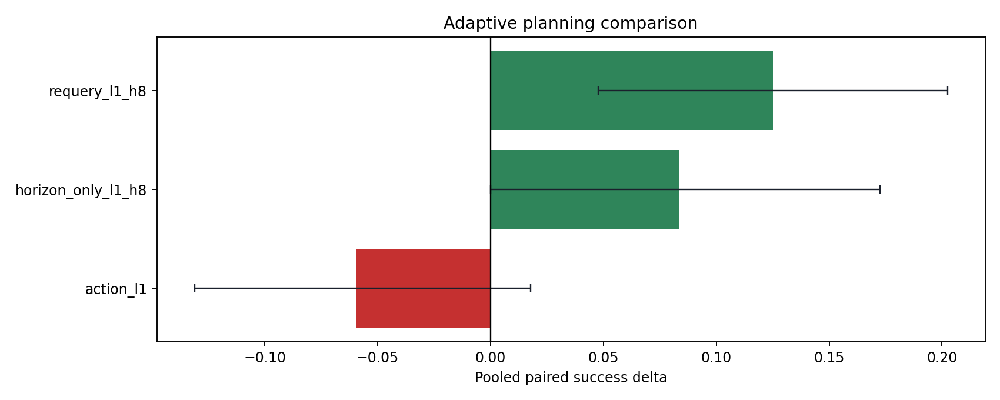
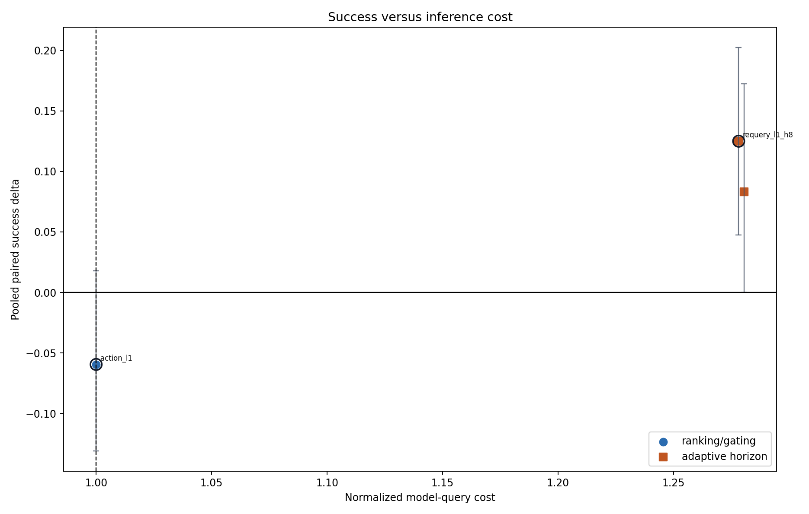
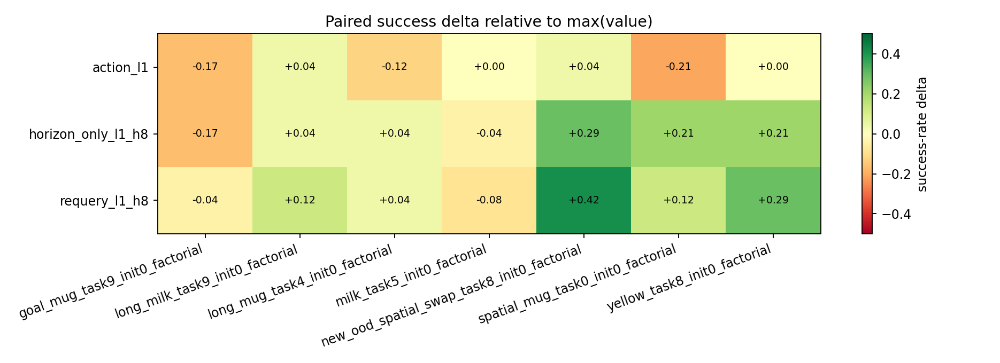
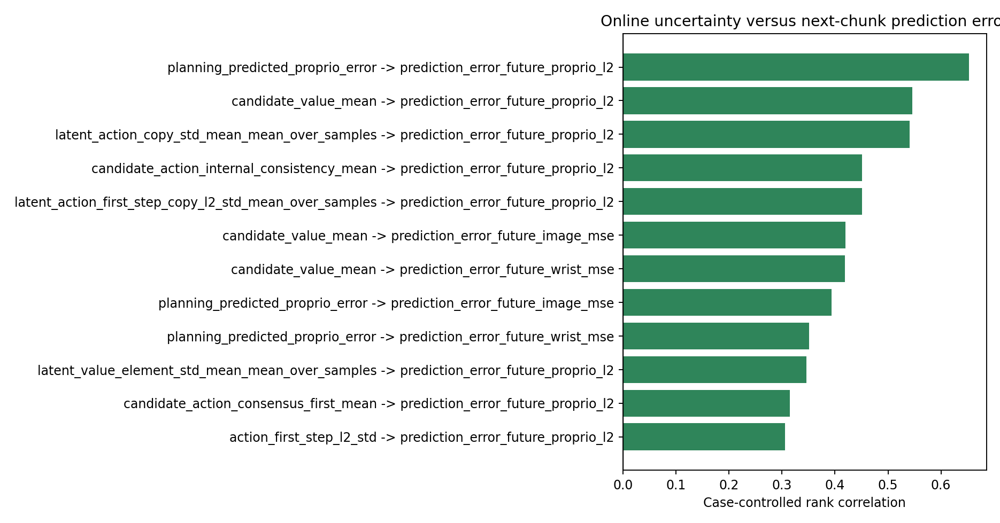
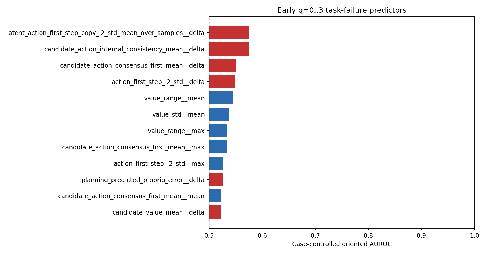

# Adaptive planning campaign

Sources: `experiments/campaigns/factorial_selection_horizon_20260820`.

Loaded 672 strategy executions across 7 cases.

## Calibration interpretation

- Calibration selected **`requery_l1_h8`** for `non_surrogate_adaptive`: delta +12.5 pp, worst-case delta -8.3 pp, normalized query cost 1.28x, selection utility J=0.078.

## Pooled paired ranking

| baseline_strategy_id   | strategy_id        |   num_cases |   paired_rollouts |   baseline_successes |   strategy_successes |   baseline_success_rate |   strategy_success_rate |   delta_success_rate |   delta_ci_low |   delta_ci_high |   min_case_delta |   max_case_delta |   wins |   losses |   ties |   mcnemar_exact_p |   baseline_mean_queries |   mean_queries |   query_overhead_ratio |   actual_query_count_ratio |   mean_requery_rate |   mean_surrogate_alarm_rate |
|:-----------------------|:-------------------|------------:|------------------:|---------------------:|---------------------:|------------------------:|------------------------:|---------------------:|---------------:|----------------:|-----------------:|-----------------:|-------:|---------:|-------:|------------------:|------------------------:|---------------:|-----------------------:|---------------------------:|--------------------:|----------------------------:|
| max_value              | requery_l1_h8      |           7 |               168 |                  100 |                  121 |                0.595238 |                0.720238 |            0.125     |       0.047619 |       0.202381  |       -0.0833333 |        0.416667  |     38 |       17 |    113 |         0.0064558 |                 13.6488 |        15.7917 |                1.27819 |                    1.157   |            0.42685  |                    0.165883 |
| max_value              | horizon_only_l1_h8 |           7 |               168 |                  100 |                  114 |                0.595238 |                0.678571 |            0.0833333 |       0        |       0.172619  |       -0.166667  |        0.291667  |     36 |       22 |    110 |         0.0869489 |                 13.6488 |        16.1964 |                1.28054 |                    1.18666 |            0.426053 |                    0.164764 |
| max_value              | action_l1          |           7 |               168 |                  100 |                   90 |                0.595238 |                0.535714 |           -0.0595238 |      -0.131101 |       0.0178571 |       -0.208333  |        0.0416667 |     17 |       27 |    124 |         0.174171  |                 13.6488 |        14.3393 |                1       |                    1.05059 |            0        |                    0.207808 |

## Per-case robustness

## Replay noise floor

Replay controls are not complete yet.

## Preregistered strategy selection

| selection_category     | strategy_id   |   selection_utility |   delta_success_rate |   min_case_delta |   query_overhead_ratio |
|:-----------------------|:--------------|--------------------:|---------------------:|-----------------:|-----------------------:|
| non_surrogate_adaptive | requery_l1_h8 |           0.0777696 |                0.125 |       -0.0833333 |                1.27819 |

The full eligible screening ranking is saved in `selection_candidates.csv`.

### Against fixed action penalty (lambda=1)

Paired fixed-penalty comparison is unavailable.

## Results by confirmatory stratum

| case_stratum    | baseline_strategy_id   | strategy_id        |   num_cases |   paired_rollouts |   baseline_successes |   strategy_successes |   baseline_success_rate |   strategy_success_rate |   delta_success_rate |   delta_ci_low |   delta_ci_high |   min_case_delta |   max_case_delta |   wins |   losses |   ties |   mcnemar_exact_p |   baseline_mean_queries |   mean_queries |   query_overhead_ratio |   actual_query_count_ratio |   mean_requery_rate |   mean_surrogate_alarm_rate |
|:----------------|:-----------------------|:-------------------|------------:|------------------:|---------------------:|---------------------:|------------------------:|------------------------:|---------------------:|---------------:|----------------:|-----------------:|-----------------:|-------:|---------:|-------:|------------------:|------------------------:|---------------:|-----------------------:|---------------------------:|--------------------:|----------------------------:|
| known_boundary  | max_value              | requery_l1_h8      |           3 |                72 |                   42 |                   48 |                0.583333 |                0.666667 |            0.0833333 |     -0.0555556 |       0.222222  |       -0.0833333 |        0.291667  |     18 |       12 |     42 |        0.361595   |                 13.6944 |        15.8333 |                1.27662 |                    1.15619 |            0.422263 |                    0.151306 |
| known_boundary  | max_value              | horizon_only_l1_h8 |           3 |                72 |                   42 |                   47 |                0.583333 |                0.652778 |            0.0694444 |     -0.0694444 |       0.208333  |       -0.0416667 |        0.208333  |     17 |       12 |     43 |        0.458258   |                 13.6944 |        16.0139 |                1.27871 |                    1.16937 |            0.422729 |                    0.162007 |
| known_boundary  | max_value              | action_l1          |           3 |                72 |                   42 |                   39 |                0.583333 |                0.541667 |           -0.0416667 |     -0.152778  |       0.0694444 |       -0.125     |        0         |      7 |       10 |     55 |        0.629059   |                 13.6944 |        14.3889 |                1       |                    1.05071 |            0        |                    0.216037 |
| new_ood_holdout | max_value              | requery_l1_h8      |           4 |                96 |                   58 |                   73 |                0.604167 |                0.760417 |            0.15625   |      0.0625    |       0.25      |       -0.0416667 |        0.416667  |     20 |        5 |     71 |        0.00407732 |                 13.6146 |        15.7604 |                1.27936 |                    1.15761 |            0.43029  |                    0.176816 |
| new_ood_holdout | max_value              | horizon_only_l1_h8 |           4 |                96 |                   58 |                   67 |                0.604167 |                0.697917 |            0.09375   |     -0.0104167 |       0.197917  |       -0.166667  |        0.291667  |     19 |       10 |     67 |        0.136046   |                 13.6146 |        16.3333 |                1.28191 |                    1.19969 |            0.428546 |                    0.166832 |
| new_ood_holdout | max_value              | action_l1          |           4 |                96 |                   58 |                   51 |                0.604167 |                0.53125  |           -0.0729167 |     -0.177083  |       0.03125   |       -0.208333  |        0.0416667 |     10 |       17 |     69 |        0.247789   |                 13.6146 |        14.3021 |                1       |                    1.0505  |            0        |                    0.201636 |

## Paired failure-mode diagnostics

| baseline_strategy_id   | strategy_id        | event                              |   paired_rollouts |   baseline_event_count |   strategy_event_count |   baseline_event_rate |   strategy_event_rate |   delta_event_rate |   event_reduced |   event_increased |   event_unchanged |   mcnemar_exact_p |
|:-----------------------|:-------------------|:-----------------------------------|------------------:|-----------------------:|-----------------------:|----------------------:|----------------------:|-------------------:|----------------:|------------------:|------------------:|------------------:|
| max_value              | action_l1          | target_drop_candidate              |               168 |                     66 |                     71 |            0.392857   |            0.422619   |         0.0297619  |              13 |                18 |               137 |       0.47313     |
| max_value              | action_l1          | wrong_object_interaction_candidate |               168 |                      1 |                      2 |            0.00595238 |            0.0119048  |         0.00595238 |               1 |                 2 |               165 |       1           |
| max_value              | action_l1          | timeout_no_goal                    |               168 |                     18 |                     21 |            0.107143   |            0.125      |         0.0178571  |               7 |                10 |               151 |       0.629059    |
| max_value              | action_l1          | kinematic_deadlock_candidate       |               168 |                      4 |                      3 |            0.0238095  |            0.0178571  |        -0.00595238 |               4 |                 3 |               161 |       1           |
| max_value              | horizon_only_l1_h8 | target_drop_candidate              |               168 |                     66 |                     35 |            0.392857   |            0.208333   |        -0.184524   |              38 |                 7 |               123 |       3.12131e-06 |
| max_value              | horizon_only_l1_h8 | wrong_object_interaction_candidate |               168 |                      1 |                      1 |            0.00595238 |            0.00595238 |         0          |               1 |                 1 |               166 |       1           |
| max_value              | horizon_only_l1_h8 | timeout_no_goal                    |               168 |                     18 |                     35 |            0.107143   |            0.208333   |         0.10119    |              12 |                29 |               127 |       0.0115078   |
| max_value              | horizon_only_l1_h8 | kinematic_deadlock_candidate       |               168 |                      4 |                      0 |            0.0238095  |            0          |        -0.0238095  |               4 |                 0 |               164 |       0.125       |
| max_value              | requery_l1_h8      | target_drop_candidate              |               168 |                     66 |                     37 |            0.392857   |            0.220238   |        -0.172619   |              35 |                 6 |               127 |       4.8736e-06  |
| max_value              | requery_l1_h8      | wrong_object_interaction_candidate |               168 |                      1 |                      1 |            0.00595238 |            0.00595238 |         0          |               0 |                 0 |               168 |       1           |
| max_value              | requery_l1_h8      | timeout_no_goal                    |               168 |                     18 |                     29 |            0.107143   |            0.172619   |         0.0654762  |              10 |                21 |               137 |       0.0707555   |
| max_value              | requery_l1_h8      | kinematic_deadlock_candidate       |               168 |                      4 |                      2 |            0.0238095  |            0.0119048  |        -0.0119048  |               3 |                 1 |               164 |       0.625       |

These labels are exploratory LIBERO-PRO heuristics, not official LIBERO-Safety constraints. Their unadjusted exact tests describe a possible change in failure mode and are not additional primary endpoints.

## Difficulty-gate diagnostic

| case_id                                    |   paired_rollouts |   difficulty_gate_rate |   baseline_success_rate |   action_success_rate |   counterfactual_gate_success_rate |   counterfactual_delta_vs_baseline |
|:-------------------------------------------|------------------:|-----------------------:|------------------------:|----------------------:|-----------------------------------:|-----------------------------------:|
| goal_mug_task9_init0_factorial             |                24 |               1        |                0.958333 |             0.791667  |                          0.791667  |                         -0.166667  |
| long_milk_task9_init0_factorial            |                24 |               1        |                0.708333 |             0.75      |                          0.75      |                          0.0416667 |
| long_mug_task4_init0_factorial             |                24 |               0.5      |                0.875    |             0.75      |                          0.875     |                          0         |
| milk_task5_init0_factorial                 |                24 |               1        |                0.416667 |             0.416667  |                          0.416667  |                          0         |
| new_ood_spatial_swap_task8_init0_factorial |                24 |               1        |                0        |             0.0416667 |                          0.0416667 |                          0.0416667 |
| spatial_mug_task0_init0_factorial          |                24 |               1        |                0.75     |             0.541667  |                          0.541667  |                         -0.208333  |
| yellow_task8_init0_factorial               |                24 |               1        |                0.458333 |             0.458333  |                          0.458333  |                          0         |
| POOLED                                     |               168 |               0.928571 |                0.595238 |             0.535714  |                          0.553571  |                         -0.0416667 |

`counterfactual_gate` combines separately executed max-value/action outcomes;
`actual_gate` is the online gated policy and is the causal rollout result.

## Mechanism diagnostics

### Frozen future-proprio surrogate transfer

| case_stratum    |   queries |   cases |   raw_spearman |   case_controlled_rank_correlation |   case_relative_top_quartile_auc |   alarm_rate |   alarm_precision_top_quartile |   alarm_recall_top_quartile |   median_predicted_error |   median_actual_error |   median_prediction_to_actual_ratio |   median_actual_error_alarm |   median_actual_error_no_alarm |   alarm_actual_error_lift |   mean_absolute_log_error |
|:----------------|----------:|--------:|---------------:|-----------------------------------:|---------------------------------:|-------------:|-------------------------------:|----------------------------:|-------------------------:|----------------------:|------------------------------------:|----------------------------:|-------------------------------:|--------------------------:|--------------------------:|
| all             |      2293 |       7 |       0.698132 |                           0.653012 |                         0.762545 |     0.212386 |                       0.554415 |                    0.469565 |                0.0515069 |             0.0526578 |                            0.978144 |                    0.144591 |                      0.0369817 |                   3.90979 |                  0.715563 |
| known_boundary  |       986 |       3 |       0.751121 |                           0.657464 |                         0.774643 |     0.228195 |                       0.56     |                    0.510121 |                0.0493224 |             0.043332  |                            1.13825  |                    0.130781 |                      0.0240058 |                   5.4479  |                  0.70037  |
| new_ood_holdout |      1307 |       4 |       0.663507 |                           0.649653 |                         0.750452 |     0.200459 |                       0.549618 |                    0.439024 |                0.0527867 |             0.0584768 |                            0.902696 |                    0.1659   |                      0.0429758 |                   3.86032 |                  0.727024 |

Top case-controlled correlations between online uncertainty and next-chunk error:

| online_metric                                          | prediction_error                   |   queries |   cases |   raw_spearman |   case_controlled_rank_correlation |
|:-------------------------------------------------------|:-----------------------------------|----------:|--------:|---------------:|-----------------------------------:|
| planning_predicted_proprio_error                       | prediction_error_future_proprio_l2 |      2293 |       7 |       0.698132 |                           0.653012 |
| candidate_value_mean                                   | prediction_error_future_proprio_l2 |      2293 |       7 |       0.545144 |                           0.545664 |
| latent_action_copy_std_mean_mean_over_samples          | prediction_error_future_proprio_l2 |      2293 |       7 |       0.621087 |                           0.540844 |
| candidate_action_internal_consistency_mean             | prediction_error_future_proprio_l2 |      2293 |       7 |       0.552503 |                           0.451226 |
| latent_action_first_step_copy_l2_std_mean_over_samples | prediction_error_future_proprio_l2 |      2293 |       7 |       0.552503 |                           0.451224 |
| candidate_value_mean                                   | prediction_error_future_image_mse  |      2293 |       7 |       0.189    |                           0.42001  |
| candidate_value_mean                                   | prediction_error_future_wrist_mse  |      2293 |       7 |       0.425306 |                           0.418409 |
| planning_predicted_proprio_error                       | prediction_error_future_image_mse  |      2293 |       7 |       0.263119 |                           0.393864 |
| planning_predicted_proprio_error                       | prediction_error_future_wrist_mse  |      2293 |       7 |       0.431226 |                           0.351586 |
| latent_value_element_std_mean_mean_over_samples        | prediction_error_future_proprio_l2 |      2293 |       7 |       0.414936 |                           0.346097 |
| candidate_action_consensus_first_mean                  | prediction_error_future_proprio_l2 |      2293 |       7 |       0.383923 |                           0.314384 |
| action_first_step_l2_std                               | prediction_error_future_proprio_l2 |      2293 |       7 |       0.373061 |                           0.305626 |

Top early q=0..3 task-failure predictors:

| feature                                                       |   episodes |   failures |   cases |   raw_auc_high_predicts_fail |   case_controlled_auc_high_predicts_fail |   case_controlled_oriented_auc | risk_direction   |
|:--------------------------------------------------------------|-----------:|-----------:|--------:|-----------------------------:|-----------------------------------------:|-------------------------------:|:-----------------|
| latent_action_first_step_copy_l2_std_mean_over_samples__delta |        168 |         68 |       7 |                     0.734265 |                                 0.574559 |                       0.574559 | high             |
| candidate_action_internal_consistency_mean__delta             |        168 |         68 |       7 |                     0.734265 |                                 0.574559 |                       0.574559 | high             |
| candidate_action_consensus_first_mean__delta                  |        168 |         68 |       7 |                     0.451618 |                                 0.550441 |                       0.550441 | high             |
| action_first_step_l2_std__delta                               |        168 |         68 |       7 |                     0.448676 |                                 0.549706 |                       0.549706 | high             |
| value_range__mean                                             |        168 |         68 |       7 |                     0.580147 |                                 0.454265 |                       0.545735 | low              |
| value_std__mean                                               |        168 |         68 |       7 |                     0.592059 |                                 0.463235 |                       0.536765 | low              |
| value_range__max                                              |        168 |         68 |       7 |                     0.575441 |                                 0.465441 |                       0.534559 | low              |
| candidate_action_consensus_first_mean__max                    |        168 |         68 |       7 |                     0.565441 |                                 0.467059 |                       0.532941 | low              |
| action_first_step_l2_std__max                                 |        168 |         68 |       7 |                     0.567353 |                                 0.473529 |                       0.526471 | low              |
| planning_predicted_proprio_error__delta                       |        168 |         68 |       7 |                     0.754412 |                                 0.525882 |                       0.525882 | high             |
| candidate_action_consensus_first_mean__mean                   |        168 |         68 |       7 |                     0.578088 |                                 0.477206 |                       0.522794 | low              |
| candidate_value_mean__delta                                   |        168 |         68 |       7 |                     0.746471 |                                 0.522206 |                       0.522206 | high             |

These mechanism tables are exploratory. In particular, they are not used to
change the preregistered screening utility or confirmatory strategies.

These are calibration/screening results. A strategy becomes confirmatory only after its hyperparameters are frozen and rerun on disjoint seeds.
