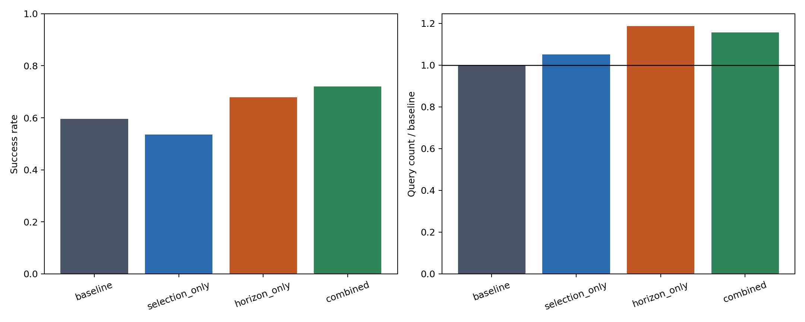
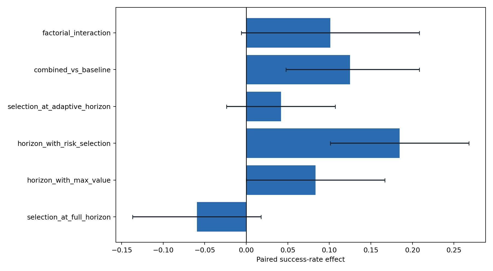

# Candidate selection x feedback horizon

Matched 2x2 experiment on identical task, initial state, and rollout seed.

- baseline: max(value), execute 16 actions
- selection only: risk-aware candidate, execute 16 actions
- horizon only: max(value) candidate, but execute 8 actions on disagreement
- combined: risk-aware candidate and execute 8 actions on disagreement

## Main causal contrasts

- Selection alone: -6.0 pp (95% CI -13.7 to +1.8).
- Adaptive feedback alone: +8.3 pp (95% CI +0.0 to +16.7).
- Combined policy: +12.5 pp (95% CI +4.8 to +20.8).
- Factorial interaction: +10.1 pp (95% CI -0.6 to +20.8).

The interaction is exploratory; simple pairwise contrasts use exact McNemar tests,
and all intervals use a case-stratified paired bootstrap.

## Strategy summary

| role           | strategy_id        |   rollouts |   successes |   success_rate |   mean_queries |   query_count_ratio_vs_baseline |
|:---------------|:-------------------|-----------:|------------:|---------------:|---------------:|--------------------------------:|
| baseline       | max_value          |        168 |         100 |       0.595238 |        13.6488 |                         1       |
| selection_only | action_l1          |        168 |          90 |       0.535714 |        14.3393 |                         1.05059 |
| horizon_only   | horizon_only_l1_h8 |        168 |         114 |       0.678571 |        16.1964 |                         1.18666 |
| combined       | requery_l1_h8      |        168 |         121 |       0.720238 |        15.7917 |                         1.157   |

## Pooled effects

| effect                        |   paired_rollouts |   mean_effect |      ci_low |   ci_high |   wins |   losses |   ties |   mcnemar_exact_p |
|:------------------------------|------------------:|--------------:|------------:|----------:|-------:|---------:|-------:|------------------:|
| selection_at_full_horizon     |               168 |    -0.0595238 | -0.136905   | 0.0178571 |     17 |       27 |    124 |       0.174171    |
| horizon_with_max_value        |               168 |     0.0833333 |  0          | 0.166667  |     36 |       22 |    110 |       0.0869489   |
| horizon_with_risk_selection   |               168 |     0.184524  |  0.10119    | 0.267857  |     45 |       14 |    109 |       6.53063e-05 |
| selection_at_adaptive_horizon |               168 |     0.0416667 | -0.0238095  | 0.107143  |     20 |       13 |    135 |       0.296206    |
| combined_vs_baseline          |               168 |     0.125     |  0.047619   | 0.208333  |     38 |       17 |    113 |       0.0064558   |
| factorial_interaction         |               168 |     0.10119   | -0.00595238 | 0.208333  |    nan |      nan |    nan |     nan           |

## Effects by case

| case_id                                    | effect                        |   paired_rollouts |   mean_effect |
|:-------------------------------------------|:------------------------------|------------------:|--------------:|
| goal_mug_task9_init0_factorial             | selection_at_full_horizon     |                24 |    -0.166667  |
| goal_mug_task9_init0_factorial             | horizon_with_max_value        |                24 |    -0.166667  |
| goal_mug_task9_init0_factorial             | horizon_with_risk_selection   |                24 |     0.125     |
| goal_mug_task9_init0_factorial             | selection_at_adaptive_horizon |                24 |     0.125     |
| goal_mug_task9_init0_factorial             | combined_vs_baseline          |                24 |    -0.0416667 |
| goal_mug_task9_init0_factorial             | factorial_interaction         |                24 |     0.291667  |
| long_milk_task9_init0_factorial            | selection_at_full_horizon     |                24 |     0.0416667 |
| long_milk_task9_init0_factorial            | horizon_with_max_value        |                24 |     0.0416667 |
| long_milk_task9_init0_factorial            | horizon_with_risk_selection   |                24 |     0.0833333 |
| long_milk_task9_init0_factorial            | selection_at_adaptive_horizon |                24 |     0.0833333 |
| long_milk_task9_init0_factorial            | combined_vs_baseline          |                24 |     0.125     |
| long_milk_task9_init0_factorial            | factorial_interaction         |                24 |     0.0416667 |
| long_mug_task4_init0_factorial             | selection_at_full_horizon     |                24 |    -0.125     |
| long_mug_task4_init0_factorial             | horizon_with_max_value        |                24 |     0.0416667 |
| long_mug_task4_init0_factorial             | horizon_with_risk_selection   |                24 |     0.166667  |
| long_mug_task4_init0_factorial             | selection_at_adaptive_horizon |                24 |     0         |
| long_mug_task4_init0_factorial             | combined_vs_baseline          |                24 |     0.0416667 |
| long_mug_task4_init0_factorial             | factorial_interaction         |                24 |     0.125     |
| milk_task5_init0_factorial                 | selection_at_full_horizon     |                24 |     0         |
| milk_task5_init0_factorial                 | horizon_with_max_value        |                24 |    -0.0416667 |
| milk_task5_init0_factorial                 | horizon_with_risk_selection   |                24 |    -0.0833333 |
| milk_task5_init0_factorial                 | selection_at_adaptive_horizon |                24 |    -0.0416667 |
| milk_task5_init0_factorial                 | combined_vs_baseline          |                24 |    -0.0833333 |
| milk_task5_init0_factorial                 | factorial_interaction         |                24 |    -0.0416667 |
| new_ood_spatial_swap_task8_init0_factorial | selection_at_full_horizon     |                24 |     0.0416667 |
| new_ood_spatial_swap_task8_init0_factorial | horizon_with_max_value        |                24 |     0.291667  |
| new_ood_spatial_swap_task8_init0_factorial | horizon_with_risk_selection   |                24 |     0.375     |
| new_ood_spatial_swap_task8_init0_factorial | selection_at_adaptive_horizon |                24 |     0.125     |
| new_ood_spatial_swap_task8_init0_factorial | combined_vs_baseline          |                24 |     0.416667  |
| new_ood_spatial_swap_task8_init0_factorial | factorial_interaction         |                24 |     0.0833333 |
| spatial_mug_task0_init0_factorial          | selection_at_full_horizon     |                24 |    -0.208333  |
| spatial_mug_task0_init0_factorial          | horizon_with_max_value        |                24 |     0.208333  |
| spatial_mug_task0_init0_factorial          | horizon_with_risk_selection   |                24 |     0.333333  |
| spatial_mug_task0_init0_factorial          | selection_at_adaptive_horizon |                24 |    -0.0833333 |
| spatial_mug_task0_init0_factorial          | combined_vs_baseline          |                24 |     0.125     |
| spatial_mug_task0_init0_factorial          | factorial_interaction         |                24 |     0.125     |
| yellow_task8_init0_factorial               | selection_at_full_horizon     |                24 |     0         |
| yellow_task8_init0_factorial               | horizon_with_max_value        |                24 |     0.208333  |
| yellow_task8_init0_factorial               | horizon_with_risk_selection   |                24 |     0.291667  |
| yellow_task8_init0_factorial               | selection_at_adaptive_horizon |                24 |     0.0833333 |
| yellow_task8_init0_factorial               | combined_vs_baseline          |                24 |     0.291667  |
| yellow_task8_init0_factorial               | factorial_interaction         |                24 |     0.0833333 |
