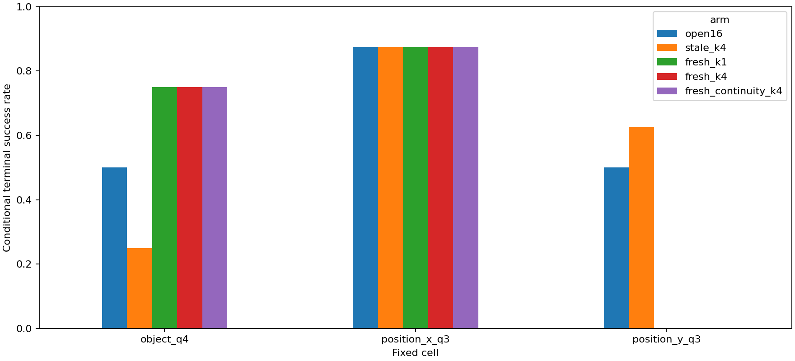

# Matched feedback controls

Status: completed; 120/120 branches in complete cases.
Mechanism screen, not confirmatory transfer evidence. All prefix and suffix policies use K4/H16.
K1 is candidate zero of the same fresh K4 pool. Shared generation reduces collection cost; logical policy costs differ.
Stale-tail control is not conditioned on the executed first eight actions.
Videos start at t=48 or t=64, not at episode reset. Safety columns are local project proxies.

| cell          | arm                 |   n |   successes |    sr |   drop_proxy |   final_t |   logical_suffix_candidates |   logical_requery_candidates |
|:--------------|:--------------------|----:|------------:|------:|-------------:|----------:|----------------------------:|-----------------------------:|
| object_q4     | fresh_continuity_k4 |   8 |           6 | 0.75  |        0     |   207.25  |                        33.5 |                            4 |
| object_q4     | fresh_k1            |   8 |           6 | 0.75  |        0     |   201.625 |                        32   |                            1 |
| object_q4     | fresh_k4            |   8 |           6 | 0.75  |        0     |   209     |                        34   |                            4 |
| object_q4     | open16              |   8 |           4 | 0.5   |        0     |   230.625 |                        39.5 |                            0 |
| object_q4     | stale_k4            |   8 |           2 | 0.25  |        0.25  |   256.25  |                        46   |                            4 |
| position_x_q3 | fresh_continuity_k4 |   8 |           7 | 0.875 |        0     |   201.625 |                        36   |                            4 |
| position_x_q3 | fresh_k1            |   8 |           7 | 0.875 |        0     |   203.5   |                        36   |                            1 |
| position_x_q3 | fresh_k4            |   8 |           7 | 0.875 |        0     |   201.625 |                        36   |                            4 |
| position_x_q3 | open16              |   8 |           7 | 0.875 |        0     |   199.375 |                        35   |                            0 |
| position_x_q3 | stale_k4            |   8 |           7 | 0.875 |        0     |   203.125 |                        36   |                            4 |
| position_y_q3 | fresh_continuity_k4 |   8 |           0 | 0     |        0     |   280     |                        56   |                            4 |
| position_y_q3 | fresh_k1            |   8 |           0 | 0     |        0     |   280     |                        56   |                            1 |
| position_y_q3 | fresh_k4            |   8 |           0 | 0     |        0     |   280     |                        56   |                            4 |
| position_y_q3 | open16              |   8 |           4 | 0.5   |        0     |   233.5   |                        44.5 |                            0 |
| position_y_q3 | stale_k4            |   8 |           5 | 0.625 |        0.125 |   246.75  |                        48   |                            4 |

| left                | right    |   pairs |   clusters |      delta |    ci_low |   ci_high |   rescues |   harms |   cluster_sign_p |   holm_p |
|:--------------------|:---------|--------:|-----------:|-----------:|----------:|----------:|----------:|--------:|-----------------:|---------:|
| fresh_k4            | open16   |      24 |         12 | -0.0833333 | -0.208333 | 0.0416667 |         2 |       4 |             0.75 |        1 |
| fresh_k4            | fresh_k1 |      24 |         12 |  0         |  0        | 0         |         0 |       0 |             1    |        1 |
| fresh_continuity_k4 | fresh_k4 |      24 |         12 |  0         |  0        | 0         |         0 |       0 |             1    |        1 |

[Videos](videos.html)

No controller or coefficient is promoted automatically; inspect harms and plan an independent confirmation.
