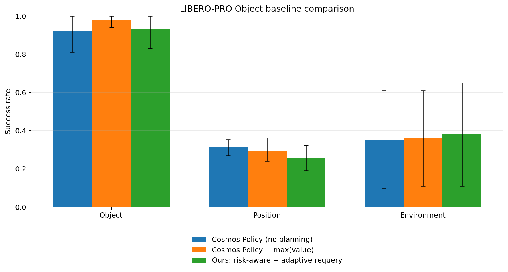
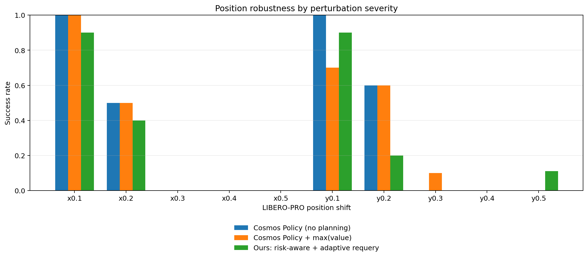

# LIBERO-PRO Object baseline results

Campaign: `experiments/campaigns/pro_object_baselines_pilot_20260825`

Status: **complete over scorable cells** (897/897 scorable method-episodes; 3/900 planned method-episodes excluded as unavailable).

## Primary leaderboard

| method                              | Object   | Position   | Environment   | Mean   |
|:------------------------------------|:---------|:-----------|:--------------|:-------|
| Cosmos Policy (no planning)         | 92.0%    | 31.3%      | 35.0%         | 52.8%  |
| Cosmos Policy + max(value)          | 98.0%    | 29.6%      | 36.0%         | 54.5%  |
| Ours: risk-aware + adaptive requery | 93.0%    | 25.4%      | 38.0%         | 52.1%  |

`Position` is the equal-weight macro-average over x/y shifts 0.1...0.5; `Mean` is the equal-weight mean of Object, Position, and Environment.

## Factor uncertainty

| method                              | factor      | success_rate   | ci95_low   | ci95_high   |   successes |   episodes |
|:------------------------------------|:------------|:---------------|:-----------|:------------|------------:|-----------:|
| Cosmos Policy (no planning)         | Environment | 35.0%          | 10.0%      | 61.0%       |          35 |        100 |
| Cosmos Policy (no planning)         | Object      | 92.0%          | 81.0%      | 100.0%      |          92 |        100 |
| Cosmos Policy (no planning)         | Position    | 31.3%          | 27.0%      | 35.3%       |          31 |         99 |
| Cosmos Policy + max(value)          | Environment | 36.0%          | 11.0%      | 61.0%       |          36 |        100 |
| Cosmos Policy + max(value)          | Object      | 98.0%          | 94.0%      | 100.0%      |          98 |        100 |
| Cosmos Policy + max(value)          | Position    | 29.6%          | 24.0%      | 36.2%       |          29 |         99 |
| Ours: risk-aware + adaptive requery | Environment | 38.0%          | 11.0%      | 65.0%       |          38 |        100 |
| Ours: risk-aware + adaptive requery | Object      | 93.0%          | 83.0%      | 100.0%      |          93 |        100 |
| Ours: risk-aware + adaptive requery | Position    | 25.4%          | 19.0%      | 32.3%       |          25 |         99 |

## Position severity

| position_level   | Cosmos Policy (no planning)   | Cosmos Policy + max(value)   | Ours: risk-aware + adaptive requery   |
|:-----------------|:------------------------------|:-----------------------------|:--------------------------------------|
| x0.1             | 100.0%                        | 100.0%                       | 90.0%                                 |
| x0.2             | 50.0%                         | 50.0%                        | 40.0%                                 |
| x0.3             | 0.0%                          | 0.0%                         | 0.0%                                  |
| x0.4             | 0.0%                          | 0.0%                         | 0.0%                                  |
| x0.5             | 0.0%                          | 0.0%                         | 0.0%                                  |
| y0.1             | 100.0%                        | 70.0%                        | 90.0%                                 |
| y0.2             | 60.0%                         | 60.0%                        | 20.0%                                 |
| y0.3             | 0.0%                          | 10.0%                        | 0.0%                                  |
| y0.4             | 0.0%                          | 0.0%                         | 0.0%                                  |
| y0.5             | 0.0%                          | 0.0%                         | 11.1%                                 |

Each position cell contains one rollout per available task; `y0.5/task1/init0` is unavailable upstream and is not counted as a failure.

## Paired comparisons by factor

| factor      | candidate                           | reference                   |   paired_episodes | delta_success_rate   | ci95_low   | ci95_high   |   wins |   losses |   ties |   mcnemar_p |
|:------------|:------------------------------------|:----------------------------|------------------:|:---------------------|:-----------|:------------|-------:|---------:|-------:|------------:|
| Object      | Cosmos Policy + max(value)          | Cosmos Policy (no planning) |               100 | 6.0%                 | 0.0%       | 13.0%       |      7 |        1 |     92 |   0.0703125 |
| Object      | Ours: risk-aware + adaptive requery | Cosmos Policy (no planning) |               100 | 1.0%                 | -4.0%      | 6.0%        |      6 |        5 |     89 |   1         |
| Object      | Ours: risk-aware + adaptive requery | Cosmos Policy + max(value)  |               100 | -5.0%                | -11.0%     | 0.0%        |      0 |        5 |     95 |   0.0625    |
| Position    | Cosmos Policy + max(value)          | Cosmos Policy (no planning) |                99 | -1.8%                | -7.0%      | 4.7%        |      2 |        4 |     93 |   0.6875    |
| Position    | Ours: risk-aware + adaptive requery | Cosmos Policy (no planning) |                99 | -5.9%                | -13.9%     | 1.3%        |      2 |        8 |     89 |   0.109375  |
| Position    | Ours: risk-aware + adaptive requery | Cosmos Policy + max(value)  |                99 | -4.1%                | -10.3%     | 2.0%        |      3 |        7 |     89 |   0.34375   |
| Environment | Cosmos Policy + max(value)          | Cosmos Policy (no planning) |               100 | 1.0%                 | -2.0%      | 4.0%        |      3 |        2 |     95 |   1         |
| Environment | Ours: risk-aware + adaptive requery | Cosmos Policy (no planning) |               100 | 3.0%                 | -1.0%      | 8.0%        |      5 |        2 |     93 |   0.453125  |
| Environment | Ours: risk-aware + adaptive requery | Cosmos Policy + max(value)  |               100 | 2.0%                 | 0.0%       | 5.0%        |      3 |        1 |     96 |   0.625     |

## Overall paired comparisons

| candidate                           | reference                   |   paired_episodes | delta_success_rate   | ci95_low   | ci95_high   |   wins |   losses |   ties |   mcnemar_p |
|:------------------------------------|:----------------------------|------------------:|:---------------------|:-----------|:------------|-------:|---------:|-------:|------------:|
| Cosmos Policy + max(value)          | Cosmos Policy (no planning) |               299 | 1.7%                 | -1.0%      | 4.9%        |     12 |        7 |    280 |    0.359283 |
| Ours: risk-aware + adaptive requery | Cosmos Policy (no planning) |               299 | -0.6%                | -4.0%      | 2.7%        |     13 |       15 |    271 |    0.850554 |
| Ours: risk-aware + adaptive requery | Cosmos Policy + max(value)  |               299 | -2.4%                | -5.4%      | 0.3%        |      6 |       13 |    280 |    0.167068 |

The overall delta gives equal weight to the three perturbation factors and then to tasks within each factor.

## Compute cost

| method                              |   episodes |   mean_queries |   mean_candidate_generations |   mean_adaptive_requeries |   mean_query_multiplier_vs_h16 |   mean_executed_steps |
|:------------------------------------|-----------:|---------------:|-----------------------------:|--------------------------:|-------------------------------:|----------------------:|
| Cosmos Policy (no planning)         |        299 |          13.37 |                        13.37 |                      0    |                           1    |                206.24 |
| Cosmos Policy + max(value)          |        299 |          13.26 |                        53.06 |                      0    |                           1    |                204.42 |
| Ours: risk-aware + adaptive requery |        299 |          16.96 |                        67.84 |                      7.32 |                           1.26 |                207.88 |

## Risk-aware behavior

| factor      |   queries | candidate_switch_rate   | requery_rate   | surrogate_alarm_rate   |   mean_value_gap_when_switched |   median_value_gap_when_switched |   mean_uncertainty_gain_z_when_switched |
|:------------|----------:|:------------------------|:---------------|:-----------------------|-------------------------------:|---------------------------------:|----------------------------------------:|
| Object      |      1195 | 43.4%                   | 43.4%          | 4.3%                   |                         0.0008 |                           0.0002 |                                  1.9258 |
| Position    |      2018 | 43.3%                   | 43.3%          | 12.7%                  |                         0.002  |                           0.0006 |                                  1.9553 |
| Environment |      1858 | 42.9%                   | 42.9%          | 11.0%                  |                         0.0047 |                           0.0006 |                                  1.9675 |

## Interpretation

- The highest factor-macro score is **Cosmos Policy + max(value)** at **54.5%**.
- Relative to `max(value)`, our frozen transfer strategy changes SR by Object -5.0%, Position -4.1%, Environment 2.0%.
- Its overall paired delta versus `max(value)` is **-2.4%** (95% CI -5.4% to 0.3%; McNemar p=0.167).
- It uses 1.28x as many policy queries and 1.28x as many candidate generations as `max(value)`.
- No method comparison reaches p<0.05 in this pilot. The broad LIBERO-PRO transfer therefore does not reproduce the earlier gain on selected hard cases; the current uncertainty penalty intervenes too often to serve as a universal replacement for `max(value)`.

## Declared exclusions

| job                              | factor   | position_level   |   task_id |   init_state_id |   method_episodes | reason                                                                               |
|:---------------------------------|:---------|:-----------------|----------:|----------------:|------------------:|:-------------------------------------------------------------------------------------|
| position_no_planning_y0p5        | Position | y0.5             |         1 |               0 |                 1 | LIBERO-PRO reports zero available init states for libero_object_temp task 1 at y0.5. |
| position_max_value_y0p5          | Position | y0.5             |         1 |               0 |                 1 | LIBERO-PRO reports zero available init states for libero_object_temp task 1 at y0.5. |
| position_ours_requery_l1_h8_y0p5 | Position | y0.5             |         1 |               0 |                 1 | LIBERO-PRO reports zero available init states for libero_object_temp task 1 at y0.5. |

Intervals use a 10,000-sample task-cluster bootstrap. McNemar p-values use only paired discordant outcomes and are descriptive until the benchmark protocol is confirmed.
