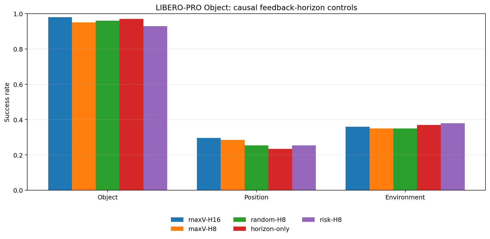
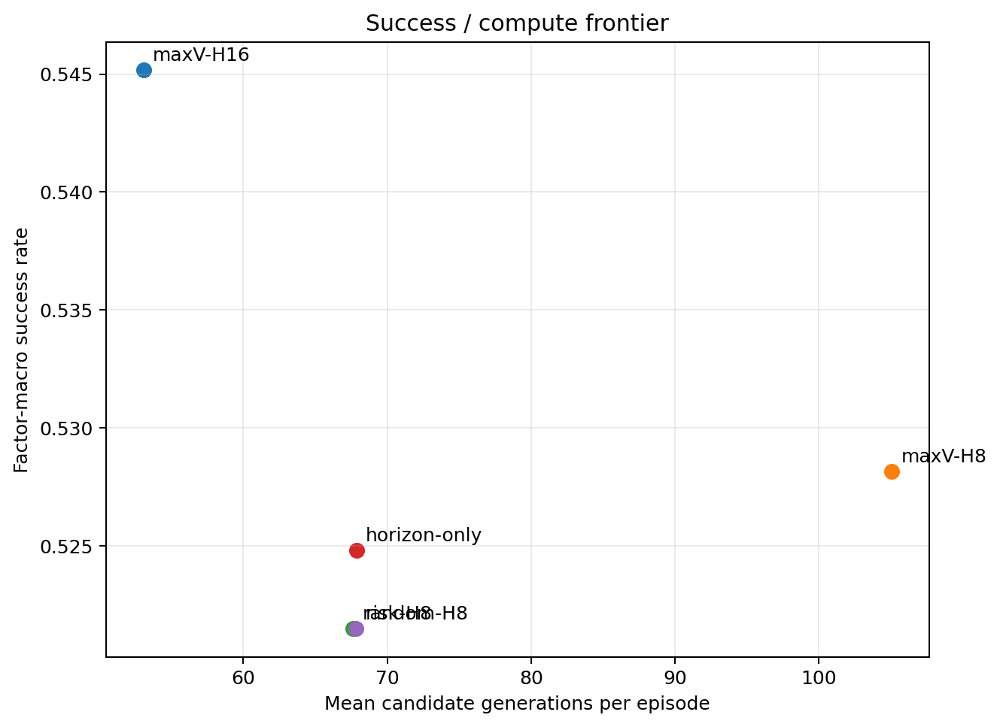

# P0 broad causal horizon controls

## Leaderboard

| method       | Object   | Position   | Environment   | Mean   |
|:-------------|:---------|:-----------|:--------------|:-------|
| maxV-H16     | 98.0%    | 29.6%      | 36.0%         | 54.5%  |
| maxV-H8      | 95.0%    | 28.4%      | 35.0%         | 52.8%  |
| random-H8    | 96.0%    | 25.4%      | 35.0%         | 52.1%  |
| horizon-only | 97.0%    | 23.4%      | 37.0%         | 52.5%  |
| risk-H8      | 93.0%    | 25.4%      | 38.0%         | 52.1%  |

## Frozen overall contrasts

| factor   | candidate    | reference    |   paired_episodes | delta_success_rate   | ci95_low   | ci95_high   |   wins |   losses |   ties |   mcnemar_p |
|:---------|:-------------|:-------------|------------------:|:---------------------|:-----------|:------------|-------:|---------:|-------:|------------:|
| Overall  | maxV-H8      | maxV-H16     |               299 | -1.7%                | -4.8%      | 1.3%        |      9 |       14 |    276 |    0.404873 |
| Overall  | horizon-only | maxV-H16     |               299 | -2.0%                | -3.7%      | -0.4%       |      8 |       14 |    277 |    0.286279 |
| Overall  | random-H8    | maxV-H16     |               299 | -2.4%                | -5.1%      | 0.3%        |      7 |       14 |    278 |    0.189247 |
| Overall  | horizon-only | random-H8    |               299 | 0.3%                 | -2.0%      | 3.0%        |     11 |       10 |    278 |    1        |
| Overall  | risk-H8      | horizon-only |               299 | -0.3%                | -3.0%      | 2.3%        |     10 |       11 |    278 |    1        |
| Overall  | risk-H8      | maxV-H16     |               299 | -2.4%                | -5.4%      | 0.3%        |      6 |       13 |    280 |    0.167068 |

## Compute

| method       |   episodes |   mean_queries |   mean_candidate_generations |   mean_requeries |   mean_query_multiplier |   mean_steps |
|:-------------|-----------:|---------------:|-----------------------------:|-----------------:|------------------------:|-------------:|
| maxV-H16     |        299 |          13.26 |                        53.06 |             0    |                    1    |       204.42 |
| maxV-H8      |        299 |          26.26 |                       105.04 |             0    |                    1.94 |       208.42 |
| random-H8    |        299 |          16.9  |                        67.61 |             7.48 |                    1.27 |       206.38 |
| horizon-only |        299 |          16.96 |                        67.85 |             7.28 |                    1.26 |       208.72 |
| risk-H8      |        299 |          16.96 |                        67.84 |             7.32 |                    1.26 |       207.88 |

Primary score gives equal weight to Object, Position, and Environment. Position gives equal weight to all available shift/task cells.
