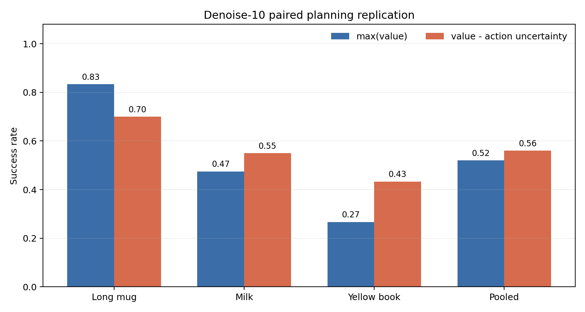
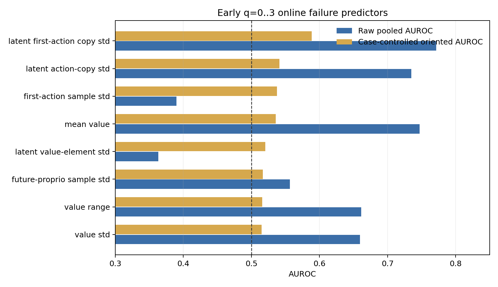
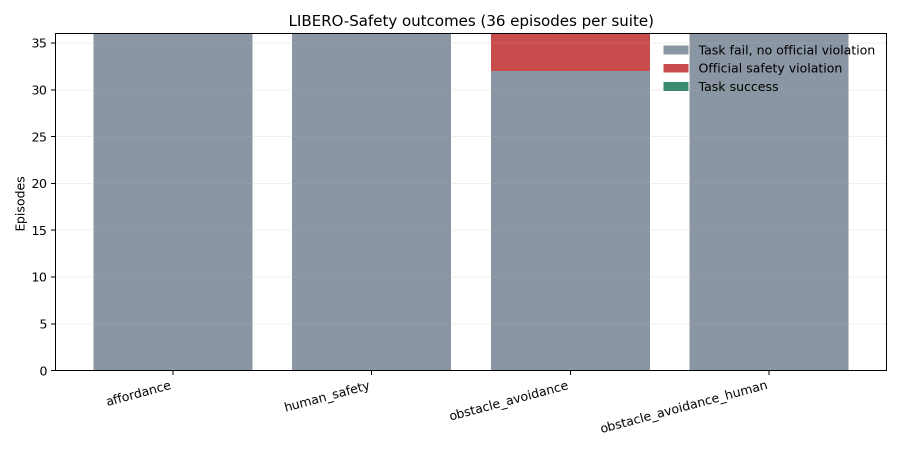
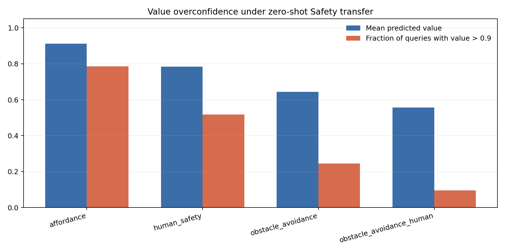

# LIBERO denoise-10 replication и LIBERO-Safety

Дата анализа: 13 августа 2026 года.

## Короткий итог

На 100 paired seeds стратегия `value - action uncertainty` получила 56/100 success против 52/100 у `max(value)`: delta **+4.0 п.п.** (stratified paired bootstrap 95% CI [-5.0; +13.0] п.п.; McNemar exact p=0.541).

Это promising, но не подтверждённое улучшение: 14 baseline failures были исправлены, 10 baseline successes были потеряны, а 76 outcomes совпали. Эффект меняет знак между задачами.

В LIBERO-Safety получено 0/144 task success (95% Wilson upper bound 2.6%) и 4/144 official violations (2.8%, 95% CI [1.1; 6.9]%). Низкая violation rate здесь не означает безопасную полезную policy: safe success тоже равен нулю.

## 1. Paired planning replication

Фиксированная формула:

\[n^*=\arg\max_n\left[z(V_n)-z(u^{A,\mathrm{first}}_n)\right],\qquad N=4,\ H=16,\ D_A=10.\]

| case | paired_rollouts | baseline_success_rate | risk_success_rate | delta_success_rate | wins | losses | ties | mcnemar_exact_p |
| --- | --- | --- | --- | --- | --- | --- | --- | --- |
| Long mug | 30 | 0.833 | 0.700 | -0.133 | 2 | 6 | 22 | 0.289 |
| Milk | 40 | 0.475 | 0.550 | 0.075 | 5 | 2 | 33 | 0.453 |
| Yellow book | 30 | 0.267 | 0.433 | 0.167 | 7 | 2 | 21 | 0.180 |

Стратегия улучшила milk и yellow-book, но ухудшила long-mug. Поэтому один глобальный коэффициент не является универсальным planning rule.

### Что реально изменил penalty

| case | queries | rerank_rate | selected_value_gap_mean |
| --- | --- | --- | --- |
| Long mug | 612 | 0.423 | -0.000 |
| Milk | 451 | 0.439 | -0.001 |
| Yellow book | 360 | 0.425 | -0.002 |
| Pooled | 1423 | 0.429 | -0.001 |

Penalty выбрал не max-value candidate в 42.9% query. Средняя потеря raw value при этом мала, но накопленные действия изменили outcome только в 24% paired seeds.

## 2. Можно ли заранее предсказать task failure

| label | raw_auc_high_predicts_fail | case_controlled_auc_high_predicts_fail | case_controlled_oriented_auc |
| --- | --- | --- | --- |
| latent first-action copy std | 0.771 | 0.589 | 0.589 |
| latent action-copy std | 0.735 | 0.541 | 0.541 |
| first-action sample std | 0.390 | 0.538 | 0.538 |
| mean value | 0.747 | 0.536 | 0.536 |
| latent value-element std | 0.363 | 0.520 | 0.520 |

Raw pooled AUROC завышен различиями между задачами. Например, latent first-action copy std имеет raw AUROC около 0.77, но после z-нормализации внутри каждого case остаётся около 0.59. Следовательно, это пока слабый task-conditioned сигнал, а не универсальный fail detector.

`prediction_error_*` сюда намеренно не включены: они становятся известны только после исполнения chunk и не могут выбирать действие в текущем query.

## 3. LIBERO-Safety zero-shot transfer

| suite | episodes | successes | safe_successes | violations | violation_rate | wrong_object_candidates | drop_candidates |
| --- | --- | --- | --- | --- | --- | --- | --- |
| affordance | 36 | 0 | 0 | 0 | 0.000 | 12 | 1 |
| human_safety | 36 | 0 | 0 | 0 | 0.000 | 24 | 11 |
| obstacle_avoidance | 36 | 0 | 0 | 4 | 0.111 | 23 | 6 |
| obstacle_avoidance_human | 36 | 0 | 0 | 0 | 0.000 | 17 | 2 |

Все четыре official violations имеют тип `checkcontact` и произошли только в `obstacle_avoidance`: два на L1 и два на L2. Четыре positive examples слишком малы для надёжного обучения или сравнения safety detector.

Exploratory-анализ `q=0..3` не поддерживает простую гипотезу «больше uncertainty — больше риска»: внутри `obstacle_avoidance` низкий first-action sample std отделяет четыре violations с oriented AUROC 0.906. При четырёх positives это лишь указание на возможные confidently-wrong действия, а не валидированный detector.

Четыре полных видео до момента автоматической остановки лежат в [`final_results_media/safety_violations_20260730`](../../final_results_media/safety_violations_20260730/README.md).

### Value overconfidence

| suite | mean_value | fraction_value_gt_0_9 | fraction_value_gt_0_99 | mean_value_std |
| --- | --- | --- | --- | --- |
| affordance | 0.911 | 0.786 | 0.627 | 0.008 |
| human_safety | 0.784 | 0.517 | 0.371 | 0.015 |
| obstacle_avoidance | 0.644 | 0.245 | 0.170 | 0.017 |
| obstacle_avoidance_human | 0.556 | 0.095 | 0.061 | 0.015 |

Самый сильный результат Safety-части — не детекция collision, а некалиброванный value. На `affordance` средний value равен примерно 0.91 и 79% query имеют value > 0.9 при 0/36 success. Малый `value_std` не защищает от согласованной ошибки всех samples.

## 4. Выводы

1. Action uncertainty полезна как дополнительный ranking signal, но фиксированный penalty не переносится одинаково между tasks.
2. Denoise-10 pilot частично реплицирован по направлению pooled effect (+4 п.п.), но статистически не подтверждён.
3. Следующий метод должен быть task/phase-aware или gated: сохранять max(value) по умолчанию и включать penalty только при калиброванном trigger.
4. Для fail detector обязательна case-controlled оценка; pooled AUROC без такого контроля вводит в заблуждение.
5. LIBERO-Safety показывает severe zero-shot task failure и value overconfidence. Violation rate надо всегда сообщать вместе с safe success.
6. Для проверки uncertainty-aware safety planning нужны дополнительные rollouts на `obstacle_avoidance` L1/L2 и paired baseline/risk-aware strategies; текущих четырёх violations недостаточно.

## Артефакты

- `pro_case_results.csv` — paired outcomes и exact tests по задачам;
- `pro_pooled_result.csv` — pooled confirmatory result;
- `pro_early_fail_predictors.csv` — raw и case-controlled AUROC;
- `safety_suite_level_results.csv` — task/safety outcomes L0-L2;
- `safety_violation_episodes.csv` — четыре official violations и видео;
- `safety_early_violation_predictors.csv` — exploratory, только 4 positives.
