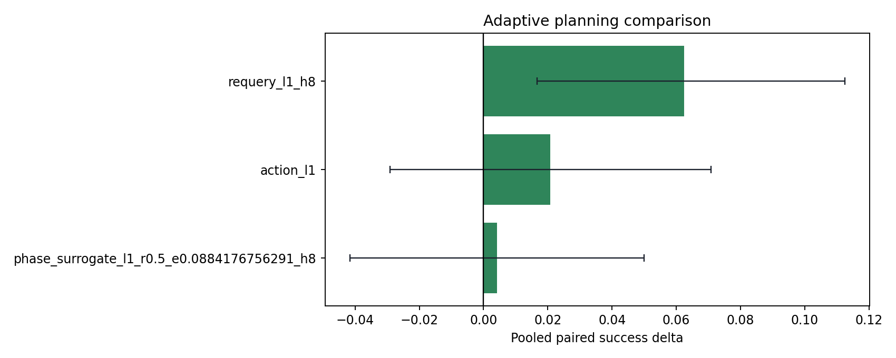
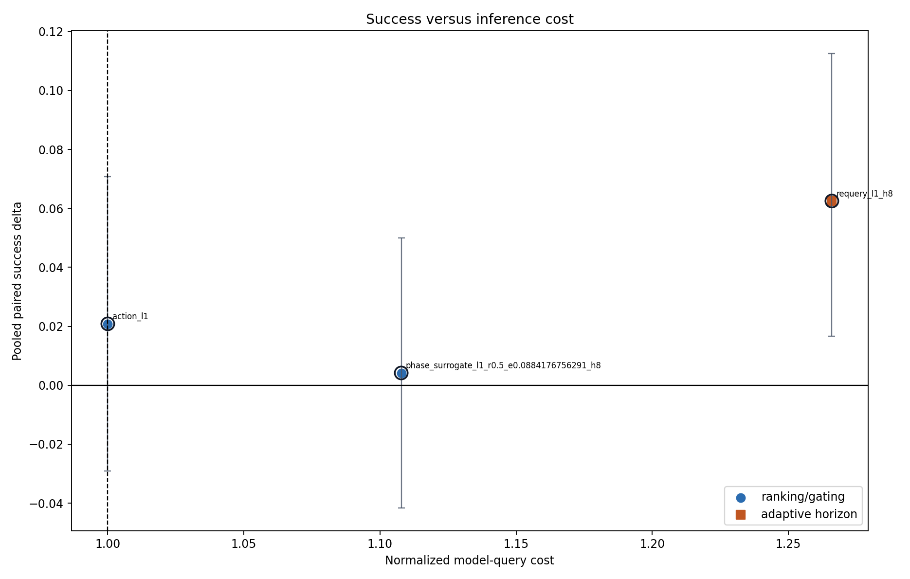
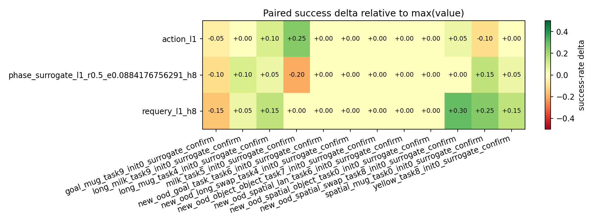
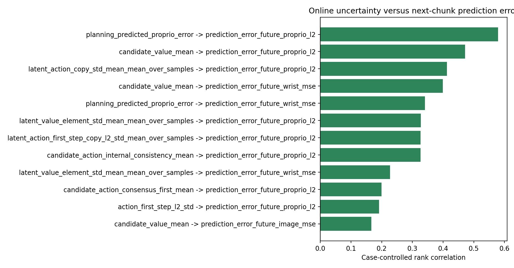
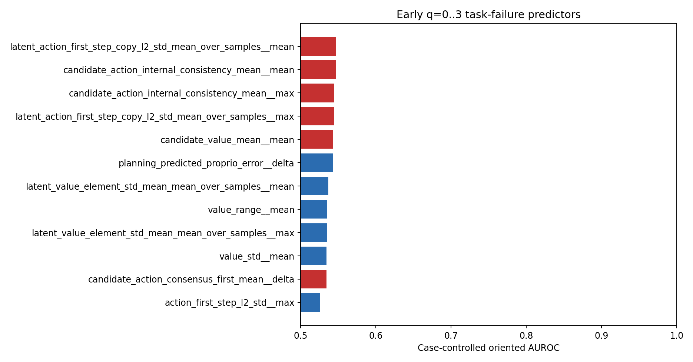

# Adaptive planning campaign

Sources: `experiments/campaigns/surrogate_confirmatory_20260819`.

Loaded 960 strategy executions across 12 cases.

## Confirmatory interpretation

- **`requery_l1_h8`:** 161/240 success versus 146/240 for `max(value)`; delta +6.2 pp (95% paired bootstrap CI [+1.7, +11.2] pp), Holm p=0.04741, per-case delta [-15.0, +30.0] pp, normalized query cost 1.27x.
- **`phase_surrogate_l1_r0.5_e0.0884176756291_h8`:** 147/240 success versus 146/240 for `max(value)`; delta +0.4 pp (95% paired bootstrap CI [-4.2, +5.0] pp), Holm p=1, per-case delta [-20.0, +15.0] pp, normalized query cost 1.11x.
- Against fixed `action_l1`, `requery_l1_h8` has delta +4.2 pp (CI [-0.4, +8.8] pp; exact McNemar p=0.1539).
- The best early q=0..3 failure feature is `latent_action_first_step_copy_l2_std_mean_over_samples__mean` with case-controlled oriented AUROC 0.547; current metrics are stronger as within-state ranking signals than as a universal episode-failure threshold.
- Strongest next-chunk mechanism association: `planning_predicted_proprio_error` versus `prediction_error_future_proprio_l2`, case-controlled rank correlation 0.579.
- Frozen future-proprio surrogate transfer: case-controlled rank correlation 0.579, case-relative top-quartile AUROC 0.731, alarm rate 16.1%, and median calibration ratio 1.12x.

## Pooled paired ranking

| baseline_strategy_id   | strategy_id                                 |   num_cases |   paired_rollouts |   baseline_successes |   strategy_successes |   baseline_success_rate |   strategy_success_rate |   delta_success_rate |   delta_ci_low |   delta_ci_high |   min_case_delta |   max_case_delta |   wins |   losses |   ties |   mcnemar_exact_p |   baseline_mean_queries |   mean_queries |   query_overhead_ratio |   actual_query_count_ratio |   mean_requery_rate |   mean_surrogate_alarm_rate |
|:-----------------------|:--------------------------------------------|------------:|------------------:|---------------------:|---------------------:|------------------------:|------------------------:|---------------------:|---------------:|----------------:|-----------------:|-----------------:|-------:|---------:|-------:|------------------:|------------------------:|---------------:|-----------------------:|---------------------------:|--------------------:|----------------------------:|
| max_value              | requery_l1_h8                               |          12 |               240 |                  146 |                  161 |                0.608333 |                0.670833 |           0.0625     |      0.0166667 |       0.1125    |            -0.15 |             0.3  |     27 |       12 |    201 |         0.0237027 |                 13.8833 |        16.9042 |                1.26601 |                   1.21759  |            0.410967 |                    0.147128 |
| max_value              | action_l1                                   |          12 |               240 |                  146 |                  151 |                0.608333 |                0.629167 |           0.0208333  |     -0.0291667 |       0.0708333 |            -0.1  |             0.25 |     22 |       17 |    201 |         0.522397  |                 13.8833 |        13.7292 |                1       |                   0.988896 |            0        |                    0.135068 |
| max_value              | phase_surrogate_l1_r0.5_e0.0884176756291_h8 |          12 |               240 |                  146 |                  147 |                0.608333 |                0.6125   |           0.00416667 |     -0.0416667 |       0.05      |            -0.2  |             0.15 |     17 |       16 |    207 |         1         |                 13.8833 |        15.6458 |                1.10781 |                   1.12695  |            0.17704  |                    0.17704  |

## Per-case robustness

## Replay noise floor

Replay controls are not complete yet.

## Frozen confirmatory strategies

| selection_category     | strategy_id                                 | baseline_strategy_id   |   num_cases |   paired_rollouts |   baseline_successes |   strategy_successes |   baseline_success_rate |   strategy_success_rate |   delta_success_rate |   delta_ci_low |   delta_ci_high |   min_case_delta |   max_case_delta |   wins |   losses |   ties |   mcnemar_exact_p |   baseline_mean_queries |   mean_queries |   query_overhead_ratio |   actual_query_count_ratio |   mean_requery_rate |   mean_surrogate_alarm_rate |   mcnemar_holm_p |
|:-----------------------|:--------------------------------------------|:-----------------------|------------:|------------------:|---------------------:|---------------------:|------------------------:|------------------------:|---------------------:|---------------:|----------------:|-----------------:|-----------------:|-------:|---------:|-------:|------------------:|------------------------:|---------------:|-----------------------:|---------------------------:|--------------------:|----------------------------:|-----------------:|
| non_surrogate_adaptive | requery_l1_h8                               | max_value              |          12 |               240 |                  146 |                  161 |                0.608333 |                0.670833 |           0.0625     |      0.0166667 |          0.1125 |            -0.15 |             0.3  |     27 |       12 |    201 |         0.0237027 |                 13.8833 |        16.9042 |                1.26601 |                    1.21759 |            0.410967 |                    0.147128 |        0.0474054 |
| surrogate_adaptive     | phase_surrogate_l1_r0.5_e0.0884176756291_h8 | max_value              |          12 |               240 |                  146 |                  147 |                0.608333 |                0.6125   |           0.00416667 |     -0.0416667 |          0.05   |            -0.2  |             0.15 |     17 |       16 |    207 |         1         |                 13.8833 |        15.6458 |                1.10781 |                    1.12695 |            0.17704  |                    0.17704  |        1         |

Strategies were frozen by the supplied screening selection file.

### Against fixed action penalty (lambda=1)

| selection_category     | strategy_id                                 | baseline_strategy_id   |   num_cases |   paired_rollouts |   baseline_successes |   strategy_successes |   baseline_success_rate |   strategy_success_rate |   delta_success_rate |   delta_ci_low |   delta_ci_high |   min_case_delta |   max_case_delta |   wins |   losses |   ties |   mcnemar_exact_p |   baseline_mean_queries |   mean_queries |   query_overhead_ratio |   actual_query_count_ratio |   mean_requery_rate |   mean_surrogate_alarm_rate |
|:-----------------------|:--------------------------------------------|:-----------------------|------------:|------------------:|---------------------:|---------------------:|------------------------:|------------------------:|---------------------:|---------------:|----------------:|-----------------:|-----------------:|-------:|---------:|-------:|------------------:|------------------------:|---------------:|-----------------------:|---------------------------:|--------------------:|----------------------------:|
| non_surrogate_adaptive | requery_l1_h8                               | action_l1              |          12 |               240 |                  151 |                  161 |                0.629167 |                0.670833 |            0.0416667 |    -0.00416667 |       0.0875    |            -0.25 |             0.35 |     25 |       15 |    200 |          0.15386  |                 13.7292 |        16.9042 |                1.26601 |                    1.23126 |            0.410967 |                    0.147128 |
| surrogate_adaptive     | phase_surrogate_l1_r0.5_e0.0884176756291_h8 | action_l1              |          12 |               240 |                  151 |                  147 |                0.629167 |                0.6125   |           -0.0166667 |    -0.0625     |       0.0291667 |            -0.45 |             0.25 |     16 |       20 |    204 |          0.617719 |                 13.7292 |        15.6458 |                1.10781 |                    1.13961 |            0.17704  |                    0.17704  |

## Results by confirmatory stratum

| case_stratum    | baseline_strategy_id   | strategy_id                                 |   num_cases |   paired_rollouts |   baseline_successes |   strategy_successes |   baseline_success_rate |   strategy_success_rate |   delta_success_rate |   delta_ci_low |   delta_ci_high |   min_case_delta |   max_case_delta |   wins |   losses |   ties |   mcnemar_exact_p |   baseline_mean_queries |   mean_queries |   query_overhead_ratio |   actual_query_count_ratio |   mean_requery_rate |   mean_surrogate_alarm_rate |
|:----------------|:-----------------------|:--------------------------------------------|------------:|------------------:|---------------------:|---------------------:|------------------------:|------------------------:|---------------------:|---------------:|----------------:|-----------------:|-----------------:|-------:|---------:|-------:|------------------:|------------------------:|---------------:|-----------------------:|---------------------------:|--------------------:|----------------------------:|
| known_boundary  | max_value              | requery_l1_h8                               |           6 |               120 |                   85 |                   94 |                0.708333 |                0.783333 |           0.075      |     -0.0166667 |       0.166667  |            -0.15 |             0.25 |     21 |       12 |     87 |          0.162756 |                 13.2917 |        15.2417 |                1.24994 |                   1.14671  |            0.388312 |                    0.160142 |
| known_boundary  | max_value              | action_l1                                   |           6 |               120 |                   85 |                   89 |                0.708333 |                0.741667 |           0.0333333  |     -0.0583333 |       0.125     |            -0.1  |             0.25 |     20 |       16 |     84 |          0.617719 |                 13.2917 |        12.975  |                1       |                   0.976176 |            0        |                    0.174496 |
| known_boundary  | max_value              | phase_surrogate_l1_r0.5_e0.0884176756291_h8 |           6 |               120 |                   85 |                   86 |                0.708333 |                0.716667 |           0.00833333 |     -0.075     |       0.1       |            -0.2  |             0.15 |     16 |       15 |     89 |          1        |                 13.2917 |        14.95   |                1.1252  |                   1.12476  |            0.203731 |                    0.203731 |
| new_ood_holdout | max_value              | requery_l1_h8                               |           6 |               120 |                   61 |                   67 |                0.508333 |                0.558333 |           0.05       |      0.0166667 |       0.0833333 |             0    |             0.3  |      6 |        0 |    114 |          0.03125  |                 14.475  |        18.5667 |                1.28208 |                   1.28267  |            0.433622 |                    0.134113 |
| new_ood_holdout | max_value              | action_l1                                   |           6 |               120 |                   61 |                   62 |                0.508333 |                0.516667 |           0.00833333 |     -0.0166667 |       0.0333333 |             0    |             0.05 |      2 |        1 |    117 |          1        |                 14.475  |        14.4833 |                1       |                   1.00058  |            0        |                    0.09564  |
| new_ood_holdout | max_value              | phase_surrogate_l1_r0.5_e0.0884176756291_h8 |           6 |               120 |                   61 |                   61 |                0.508333 |                0.508333 |           0          |     -0.025     |       0.025     |             0    |             0    |      1 |        1 |    118 |          1        |                 14.475  |        16.3417 |                1.09042 |                   1.12896  |            0.15035  |                    0.15035  |

## Paired failure-mode diagnostics

| baseline_strategy_id   | strategy_id                                 | event                              |   paired_rollouts |   baseline_event_count |   strategy_event_count |   baseline_event_rate |   strategy_event_rate |   delta_event_rate |   event_reduced |   event_increased |   event_unchanged |   mcnemar_exact_p |
|:-----------------------|:--------------------------------------------|:-----------------------------------|------------------:|-----------------------:|-----------------------:|----------------------:|----------------------:|-------------------:|----------------:|------------------:|------------------:|------------------:|
| max_value              | action_l1                                   | target_drop_candidate              |               240 |                     73 |                     75 |            0.304167   |            0.3125     |         0.00833333 |              10 |                12 |               218 |       0.831812    |
| max_value              | action_l1                                   | wrong_object_interaction_candidate |               240 |                     36 |                     37 |            0.15       |            0.154167   |         0.00416667 |               4 |                 5 |               231 |       1           |
| max_value              | action_l1                                   | timeout_no_goal                    |               240 |                     14 |                     14 |            0.0583333  |            0.0583333  |         0          |               6 |                 6 |               228 |       1           |
| max_value              | action_l1                                   | kinematic_deadlock_candidate       |               240 |                      2 |                      2 |            0.00833333 |            0.00833333 |         0          |               0 |                 0 |               240 |       1           |
| max_value              | phase_surrogate_l1_r0.5_e0.0884176756291_h8 | target_drop_candidate              |               240 |                     73 |                     57 |            0.304167   |            0.2375     |        -0.0666667  |              28 |                12 |               200 |       0.016589    |
| max_value              | phase_surrogate_l1_r0.5_e0.0884176756291_h8 | wrong_object_interaction_candidate |               240 |                     36 |                     35 |            0.15       |            0.145833   |        -0.00416667 |               6 |                 5 |               229 |       1           |
| max_value              | phase_surrogate_l1_r0.5_e0.0884176756291_h8 | timeout_no_goal                    |               240 |                     14 |                     37 |            0.0583333  |            0.154167   |         0.0958333  |               3 |                26 |               211 |       1.52364e-05 |
| max_value              | phase_surrogate_l1_r0.5_e0.0884176756291_h8 | kinematic_deadlock_candidate       |               240 |                      2 |                      2 |            0.00833333 |            0.00833333 |         0          |               2 |                 2 |               236 |       1           |
| max_value              | requery_l1_h8                               | target_drop_candidate              |               240 |                     73 |                     51 |            0.304167   |            0.2125     |        -0.0916667  |              28 |                 6 |               206 |       0.000195126 |
| max_value              | requery_l1_h8                               | wrong_object_interaction_candidate |               240 |                     36 |                     39 |            0.15       |            0.1625     |         0.0125     |               4 |                 7 |               229 |       0.548828    |
| max_value              | requery_l1_h8                               | timeout_no_goal                    |               240 |                     14 |                     24 |            0.0583333  |            0.1        |         0.0416667  |              10 |                20 |               210 |       0.0987371   |
| max_value              | requery_l1_h8                               | kinematic_deadlock_candidate       |               240 |                      2 |                      1 |            0.00833333 |            0.00416667 |        -0.00416667 |               2 |                 1 |               237 |       1           |

These labels are exploratory LIBERO-PRO heuristics, not official LIBERO-Safety constraints. Their unadjusted exact tests describe a possible change in failure mode and are not additional primary endpoints.

## Difficulty-gate diagnostic

| case_id                                              |   paired_rollouts |   difficulty_gate_rate |   baseline_success_rate |   action_success_rate |   counterfactual_gate_success_rate |   counterfactual_delta_vs_baseline |
|:-----------------------------------------------------|------------------:|-----------------------:|------------------------:|----------------------:|-----------------------------------:|-----------------------------------:|
| goal_mug_task9_init0_surrogate_confirm               |                20 |               1        |                1        |              0.95     |                           0.95     |                            -0.05   |
| long_milk_task9_init0_surrogate_confirm              |                20 |               1        |                0.8      |              0.8      |                           0.8      |                             0      |
| long_mug_task4_init0_surrogate_confirm               |                20 |               0.45     |                0.85     |              0.95     |                           0.85     |                             0      |
| milk_task5_init0_surrogate_confirm                   |                20 |               1        |                0.45     |              0.7      |                           0.7      |                             0.25   |
| new_ood_goal_task_task6_init0_surrogate_confirm      |                20 |               1        |                0        |              0        |                           0        |                             0      |
| new_ood_long_swap_task4_init0_surrogate_confirm      |                20 |               0        |                0        |              0        |                           0        |                             0      |
| new_ood_object_object_task7_init0_surrogate_confirm  |                20 |               1        |                1        |              1        |                           1        |                             0      |
| new_ood_spatial_lan_task6_init0_surrogate_confirm    |                20 |               1        |                1        |              1        |                           1        |                             0      |
| new_ood_spatial_object_task0_init0_surrogate_confirm |                20 |               1        |                1        |              1        |                           1        |                             0      |
| new_ood_spatial_swap_task8_init0_surrogate_confirm   |                20 |               1        |                0.05     |              0.1      |                           0.1      |                             0.05   |
| spatial_mug_task0_init0_surrogate_confirm            |                20 |               1        |                0.75     |              0.65     |                           0.65     |                            -0.1    |
| yellow_task8_init0_surrogate_confirm                 |                20 |               1        |                0.4      |              0.4      |                           0.4      |                             0      |
| POOLED                                               |               240 |               0.870833 |                0.608333 |              0.629167 |                           0.620833 |                             0.0125 |

`counterfactual_gate` combines separately executed max-value/action outcomes;
`actual_gate` is the online gated policy and is the causal rollout result.

## Mechanism diagnostics

### Frozen future-proprio surrogate transfer

| case_stratum    |   queries |   cases |   raw_spearman |   case_controlled_rank_correlation |   case_relative_top_quartile_auc |   alarm_rate |   alarm_precision_top_quartile |   alarm_recall_top_quartile |   median_predicted_error |   median_actual_error |   median_prediction_to_actual_ratio |   median_actual_error_alarm |   median_actual_error_no_alarm |   alarm_actual_error_lift |   mean_absolute_log_error |
|:----------------|----------:|--------:|---------------:|-----------------------------------:|---------------------------------:|-------------:|-------------------------------:|----------------------------:|-------------------------:|----------------------:|------------------------------------:|----------------------------:|-------------------------------:|--------------------------:|--------------------------:|
| all             |      3332 |      12 |       0.644137 |                           0.579195 |                         0.730826 |     0.161164 |                       0.540037 |                    0.34689  |                0.0523821 |             0.0469351 |                             1.11605 |                    0.120351 |                      0.0396766 |                   3.0333  |                  0.66696  |
| known_boundary  |      1595 |       6 |       0.679824 |                           0.638039 |                         0.752628 |     0.18558  |                       0.570946 |                    0.421446 |                0.0472501 |             0.0436112 |                             1.08344 |                    0.132852 |                      0.034315  |                   3.87154 |                  0.695746 |
| new_ood_holdout |      1737 |       6 |       0.600359 |                           0.525161 |                         0.705032 |     0.138745 |                       0.502075 |                    0.278161 |                0.0551609 |             0.0501955 |                             1.09892 |                    0.106552 |                      0.0430746 |                   2.47366 |                  0.640527 |

Top case-controlled correlations between online uncertainty and next-chunk error:

| online_metric                                          | prediction_error                   |   queries |   cases |   raw_spearman |   case_controlled_rank_correlation |
|:-------------------------------------------------------|:-----------------------------------|----------:|--------:|---------------:|-----------------------------------:|
| planning_predicted_proprio_error                       | prediction_error_future_proprio_l2 |      3332 |      12 |       0.644137 |                           0.579195 |
| candidate_value_mean                                   | prediction_error_future_proprio_l2 |      3332 |      12 |       0.438593 |                           0.471594 |
| latent_action_copy_std_mean_mean_over_samples          | prediction_error_future_proprio_l2 |      3332 |      12 |       0.482544 |                           0.412716 |
| candidate_value_mean                                   | prediction_error_future_wrist_mse  |      3332 |      12 |       0.235346 |                           0.398765 |
| planning_predicted_proprio_error                       | prediction_error_future_wrist_mse  |      3332 |      12 |       0.330661 |                           0.341351 |
| latent_value_element_std_mean_mean_over_samples        | prediction_error_future_proprio_l2 |      3332 |      12 |       0.419237 |                           0.327977 |
| latent_action_first_step_copy_l2_std_mean_over_samples | prediction_error_future_proprio_l2 |      3332 |      12 |       0.435852 |                           0.326662 |
| candidate_action_internal_consistency_mean             | prediction_error_future_proprio_l2 |      3332 |      12 |       0.435852 |                           0.326662 |
| latent_value_element_std_mean_mean_over_samples        | prediction_error_future_wrist_mse  |      3332 |      12 |       0.128127 |                           0.22693  |
| candidate_action_consensus_first_mean                  | prediction_error_future_proprio_l2 |      3332 |      12 |       0.290652 |                           0.199618 |
| action_first_step_l2_std                               | prediction_error_future_proprio_l2 |      3332 |      12 |       0.281379 |                           0.191551 |
| candidate_value_mean                                   | prediction_error_future_image_mse  |      3332 |      12 |      -0.175201 |                           0.166477 |

Top early q=0..3 task-failure predictors:

| feature                                                      |   episodes |   failures |   cases |   raw_auc_high_predicts_fail |   case_controlled_auc_high_predicts_fail |   case_controlled_oriented_auc | risk_direction   |
|:-------------------------------------------------------------|-----------:|-----------:|--------:|-----------------------------:|-----------------------------------------:|-------------------------------:|:-----------------|
| latent_action_first_step_copy_l2_std_mean_over_samples__mean |        240 |         94 |      12 |                     0.308073 |                                 0.546634 |                       0.546634 | high             |
| candidate_action_internal_consistency_mean__mean             |        240 |         94 |      12 |                     0.308073 |                                 0.546634 |                       0.546634 | high             |
| candidate_action_internal_consistency_mean__max              |        240 |         94 |      12 |                     0.309458 |                                 0.544666 |                       0.544666 | high             |
| latent_action_first_step_copy_l2_std_mean_over_samples__max  |        240 |         94 |      12 |                     0.309458 |                                 0.544666 |                       0.544666 | high             |
| candidate_value_mean__mean                                   |        240 |         94 |      12 |                     0.534392 |                                 0.542772 |                       0.542772 | high             |
| planning_predicted_proprio_error__delta                      |        240 |         94 |      12 |                     0.593486 |                                 0.457228 |                       0.542772 | low              |
| latent_value_element_std_mean_mean_over_samples__mean        |        240 |         94 |      12 |                     0.42371  |                                 0.463422 |                       0.536578 | low              |
| value_range__mean                                            |        240 |         94 |      12 |                     0.475372 |                                 0.464806 |                       0.535194 | low              |
| latent_value_element_std_mean_mean_over_samples__max         |        240 |         94 |      12 |                     0.490528 |                                 0.465462 |                       0.534538 | low              |
| value_std__mean                                              |        240 |         94 |      12 |                     0.475153 |                                 0.465753 |                       0.534247 | low              |
| candidate_action_consensus_first_mean__delta                 |        240 |         94 |      12 |                     0.4181   |                                 0.534028 |                       0.534028 | high             |
| action_first_step_l2_std__max                                |        240 |         94 |      12 |                     0.45016  |                                 0.473914 |                       0.526086 | low              |

These mechanism tables are exploratory. In particular, they are not used to
change the preregistered screening utility or confirmatory strategies.

This is a frozen confirmatory evaluation on disjoint seeds: the two adaptive strategies and all hyperparameters were selected before these outcomes were observed.
