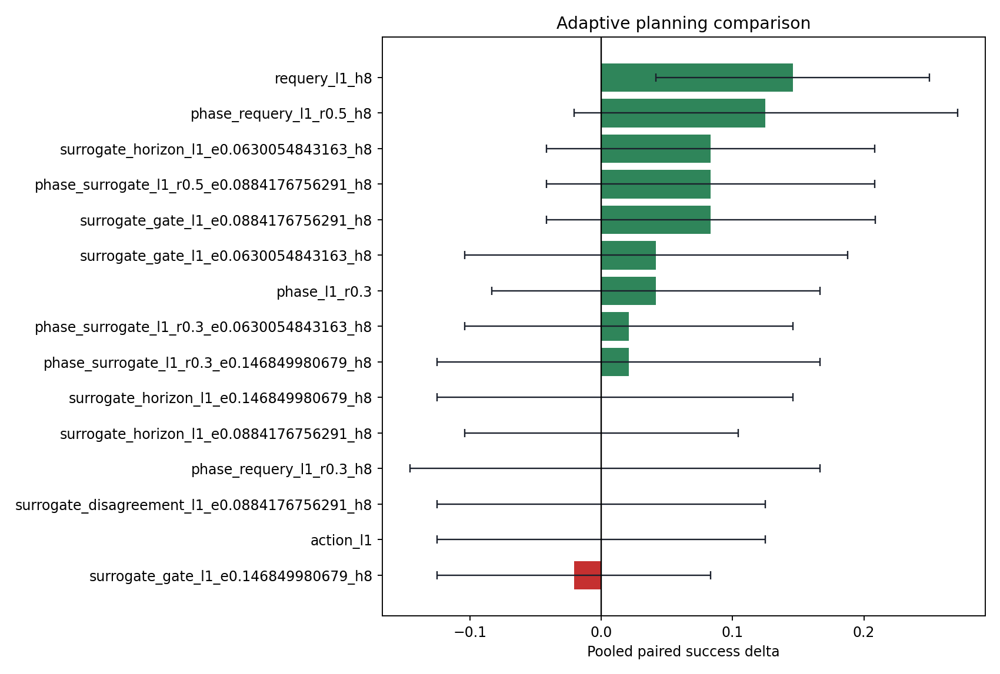
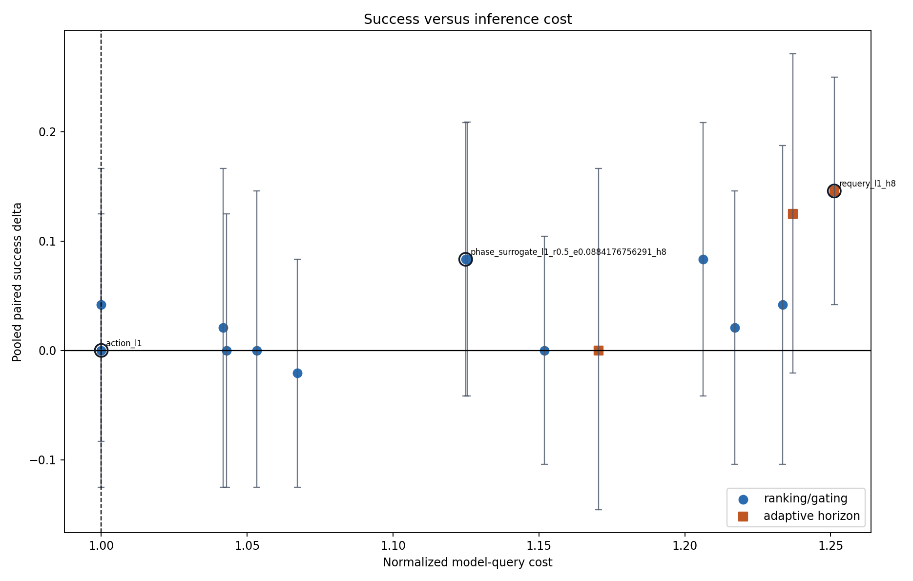
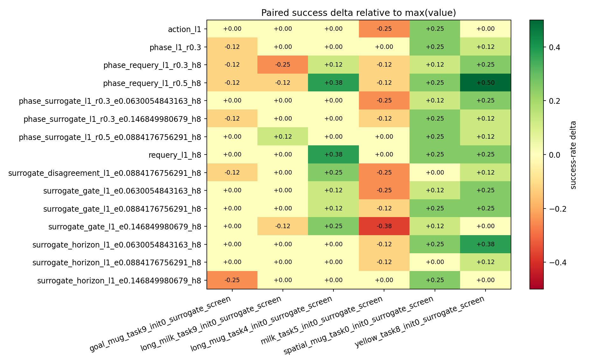
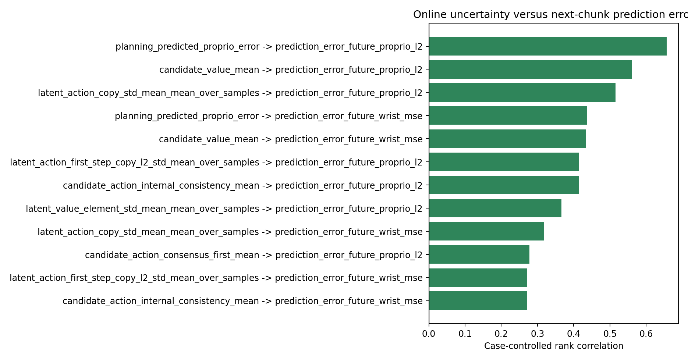
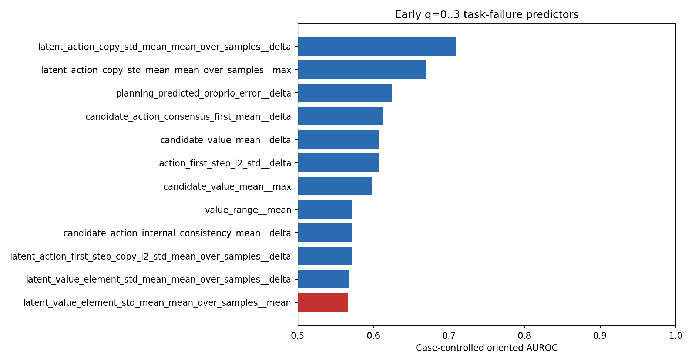

# Adaptive planning campaign

Sources: `experiments/campaigns/surrogate_screening_20260819`.

Loaded 816 strategy executions across 6 cases.

## Calibration interpretation

- Calibration selected **`requery_l1_h8`** for `non_surrogate_adaptive`: delta +14.6 pp, worst-case delta +0.0 pp, normalized query cost 1.25x, selection utility J=0.141.
- Calibration selected **`phase_surrogate_l1_r0.5_e0.0884176756291_h8`** for `surrogate_adaptive`: delta +8.3 pp, worst-case delta +0.0 pp, normalized query cost 1.12x, selection utility J=0.081.

## Pooled paired ranking

| baseline_strategy_id   | strategy_id                                 |   num_cases |   paired_rollouts |   baseline_successes |   strategy_successes |   baseline_success_rate |   strategy_success_rate |   delta_success_rate |   delta_ci_low |   delta_ci_high |   min_case_delta |   max_case_delta |   wins |   losses |   ties |   mcnemar_exact_p |   baseline_mean_queries |   mean_queries |   query_overhead_ratio |   actual_query_count_ratio |   mean_requery_rate |   mean_surrogate_alarm_rate |
|:-----------------------|:--------------------------------------------|------------:|------------------:|---------------------:|---------------------:|------------------------:|------------------------:|---------------------:|---------------:|----------------:|-----------------:|-----------------:|-------:|---------:|-------:|------------------:|------------------------:|---------------:|-----------------------:|---------------------------:|--------------------:|----------------------------:|
| max_value              | requery_l1_h8                               |           6 |                48 |                   32 |                   39 |                0.666667 |                0.8125   |            0.145833  |      0.0416667 |        0.25     |            0     |            0.375 |      8 |        1 |     39 |         0.0390625 |                 13.7292 |        14.6458 |                1.25124 |                   1.06677  |           0.394141  |                   0.13929   |
| max_value              | phase_requery_l1_r0.5_h8                    |           6 |                48 |                   32 |                   38 |                0.666667 |                0.791667 |            0.125     |     -0.0208333 |        0.271354 |           -0.125 |            0.5   |     12 |        6 |     30 |         0.237885  |                 13.7292 |        14.6875 |                1.23712 |                   1.0698   |           0.369118  |                   0.153011  |
| max_value              | phase_surrogate_l1_r0.5_e0.0884176756291_h8 |           6 |                48 |                   32 |                   36 |                0.666667 |                0.75     |            0.0833333 |     -0.0416667 |        0.208333 |            0     |            0.25  |      7 |        3 |     38 |         0.34375   |                 13.7292 |        14.7083 |                1.12489 |                   1.07132  |           0.200747  |                   0.200747  |
| max_value              | surrogate_gate_l1_e0.0884176756291_h8       |           6 |                48 |                   32 |                   36 |                0.666667 |                0.75     |            0.0833333 |     -0.0416667 |        0.208854 |           -0.125 |            0.25  |      8 |        4 |     36 |         0.387695  |                 13.7292 |        15.1667 |                1.1255  |                   1.1047   |           0.206291  |                   0.206291  |
| max_value              | surrogate_horizon_l1_e0.0630054843163_h8    |           6 |                48 |                   32 |                   36 |                0.666667 |                0.75     |            0.0833333 |     -0.0416667 |        0.208333 |           -0.125 |            0.375 |      8 |        4 |     36 |         0.387695  |                 13.7292 |        16.2292 |                1.20618 |                   1.18209  |           0.339365  |                   0.339365  |
| max_value              | phase_l1_r0.3                               |           6 |                48 |                   32 |                   34 |                0.666667 |                0.708333 |            0.0416667 |     -0.0833333 |        0.166667 |           -0.125 |            0.25  |      6 |        4 |     38 |         0.753906  |                 13.7292 |        13.5833 |                1       |                   0.989378 |           0         |                   0.160635  |
| max_value              | surrogate_gate_l1_e0.0630054843163_h8       |           6 |                48 |                   32 |                   34 |                0.666667 |                0.708333 |            0.0416667 |     -0.104167  |        0.1875   |           -0.25  |            0.25  |      8 |        6 |     34 |         0.790527  |                 13.7292 |        16.9375 |                1.23358 |                   1.23369  |           0.373608  |                   0.373608  |
| max_value              | phase_surrogate_l1_r0.3_e0.146849980679_h8  |           6 |                48 |                   32 |                   33 |                0.666667 |                0.6875   |            0.0208333 |     -0.125     |        0.166667 |           -0.125 |            0.25  |      7 |        6 |     35 |         1         |                 13.7292 |        14.3542 |                1.04181 |                   1.04552  |           0.0628851 |                   0.0628851 |
| max_value              | phase_surrogate_l1_r0.3_e0.0630054843163_h8 |           6 |                48 |                   32 |                   33 |                0.666667 |                0.6875   |            0.0208333 |     -0.104167  |        0.145833 |           -0.25  |            0.25  |      6 |        5 |     37 |         1         |                 13.7292 |        16.7292 |                1.21717 |                   1.21851  |           0.352967  |                   0.352967  |
| max_value              | surrogate_horizon_l1_e0.0884176756291_h8    |           6 |                48 |                   32 |                   32 |                0.666667 |                0.666667 |            0         |     -0.104167  |        0.104167 |           -0.125 |            0.125 |      3 |        3 |     42 |         1         |                 13.7292 |        16.125  |                1.15184 |                   1.17451  |           0.238244  |                   0.238244  |
| max_value              | action_l1                                   |           6 |                48 |                   32 |                   32 |                0.666667 |                0.666667 |            0         |     -0.125     |        0.125    |           -0.25  |            0.25  |      5 |        5 |     38 |         1         |                 13.7292 |        13.7292 |                1       |                   1        |           0         |                   0.17867   |
| max_value              | phase_requery_l1_r0.3_h8                    |           6 |                48 |                   32 |                   32 |                0.666667 |                0.666667 |            0         |     -0.145833  |        0.166667 |           -0.25  |            0.25  |      8 |        8 |     32 |         1         |                 13.7292 |        15.6042 |                1.17049 |                   1.13657  |           0.266718  |                   0.14746   |

## Per-case robustness

## Replay noise floor

Replay controls are not complete yet.

## Preregistered strategy selection

| selection_category     | strategy_id                                 |   selection_utility |   delta_success_rate |   min_case_delta |   query_overhead_ratio |
|:-----------------------|:--------------------------------------------|--------------------:|---------------------:|-----------------:|-----------------------:|
| non_surrogate_adaptive | requery_l1_h8                               |           0.140809  |            0.145833  |                0 |                1.25124 |
| surrogate_adaptive     | phase_surrogate_l1_r0.5_e0.0884176756291_h8 |           0.0808356 |            0.0833333 |                0 |                1.12489 |

The full eligible screening ranking is saved in `selection_candidates.csv`.

### Against fixed action penalty (lambda=1)

Paired fixed-penalty comparison is unavailable.

## Results by confirmatory stratum

| case_stratum    | baseline_strategy_id   | strategy_id                                   |   num_cases |   paired_rollouts |   baseline_successes |   strategy_successes |   baseline_success_rate |   strategy_success_rate |   delta_success_rate |   delta_ci_low |   delta_ci_high |   min_case_delta |   max_case_delta |   wins |   losses |   ties |   mcnemar_exact_p |   baseline_mean_queries |   mean_queries |   query_overhead_ratio |   actual_query_count_ratio |   mean_requery_rate |   mean_surrogate_alarm_rate |
|:----------------|:-----------------------|:----------------------------------------------|------------:|------------------:|---------------------:|---------------------:|------------------------:|------------------------:|---------------------:|---------------:|----------------:|-----------------:|-----------------:|-------:|---------:|-------:|------------------:|------------------------:|---------------:|-----------------------:|---------------------------:|--------------------:|----------------------------:|
| known_boundary  | max_value              | phase_requery_l1_r0.5_h8                      |           3 |                24 |                   11 |                   17 |                0.458333 |                0.708333 |            0.25      |      0         |       0.5       |           -0.125 |            0.5   |      9 |        3 |     12 |          0.145996 |                 15.4583 |        13.9583 |                1.22951 |                   0.902965 |           0.35132   |                   0.159219  |
| known_boundary  | max_value              | requery_l1_h8                                 |           3 |                24 |                   11 |                   16 |                0.458333 |                0.666667 |            0.208333  |      0.0416667 |       0.416667  |            0     |            0.375 |      6 |        1 |     17 |          0.125    |                 15.4583 |        14.7917 |                1.26091 |                   0.956873 |           0.383017  |                   0.159255  |
| known_boundary  | max_value              | phase_requery_l1_r0.3_h8                      |           3 |                24 |                   11 |                   13 |                0.458333 |                0.541667 |            0.0833333 |     -0.166667  |       0.333333  |           -0.125 |            0.25  |      6 |        4 |     14 |          0.753906 |                 15.4583 |        15.75   |                1.17938 |                   1.01887  |           0.250769  |                   0.144461  |
| known_boundary  | max_value              | surrogate_gate_l1_e0.0884176756291_h8         |           3 |                24 |                   11 |                   13 |                0.458333 |                0.541667 |            0.0833333 |     -0.125     |       0.291667  |           -0.125 |            0.25  |      5 |        3 |     16 |          0.726562 |                 15.4583 |        17.125  |                1.19509 |                   1.10782  |           0.287454  |                   0.287454  |
| known_boundary  | max_value              | surrogate_horizon_l1_e0.0630054843163_h8      |           3 |                24 |                   11 |                   13 |                0.458333 |                0.541667 |            0.0833333 |     -0.166667  |       0.333333  |           -0.125 |            0.375 |      6 |        4 |     14 |          0.753906 |                 15.4583 |        19.25   |                1.2756  |                   1.24528  |           0.407201  |                   0.407201  |
| known_boundary  | max_value              | phase_l1_r0.3                                 |           3 |                24 |                   11 |                   12 |                0.458333 |                0.5      |            0.0416667 |     -0.166667  |       0.25      |            0     |            0.125 |      4 |        3 |     17 |          1        |                 15.4583 |        15.0833 |                1       |                   0.975741 |           0         |                   0.207782  |
| known_boundary  | max_value              | phase_surrogate_l1_r0.5_e0.0884176756291_h8   |           3 |                24 |                   11 |                   12 |                0.458333 |                0.5      |            0.0416667 |     -0.166667  |       0.25      |            0     |            0.125 |      4 |        3 |     17 |          1        |                 15.4583 |        17.5417 |                1.17115 |                   1.13477  |           0.267416  |                   0.267416  |
| known_boundary  | max_value              | surrogate_disagreement_l1_e0.0884176756291_h8 |           3 |                24 |                   11 |                   12 |                0.458333 |                0.5      |            0.0416667 |     -0.166667  |       0.25      |           -0.25  |            0.25  |      4 |        3 |     17 |          1        |                 15.4583 |        15      |                1.05691 |                   0.97035  |           0.0979969 |                   0.246342  |
| known_boundary  | max_value              | surrogate_gate_l1_e0.0630054843163_h8         |           3 |                24 |                   11 |                   12 |                0.458333 |                0.5      |            0.0416667 |     -0.166667  |       0.291667  |           -0.25  |            0.25  |      5 |        4 |     15 |          1        |                 15.4583 |        19.25   |                1.3017  |                   1.24528  |           0.447656  |                   0.447656  |
| known_boundary  | max_value              | surrogate_horizon_l1_e0.146849980679_h8       |           3 |                24 |                   11 |                   11 |                0.458333 |                0.458333 |            0         |     -0.25      |       0.208333  |            0     |            0     |      4 |        4 |     16 |          1        |                 15.4583 |        16.2917 |                1.077   |                   1.05391  |           0.119341  |                   0.119341  |
| known_boundary  | max_value              | phase_surrogate_l1_r0.3_e0.146849980679_h8    |           3 |                24 |                   11 |                   11 |                0.458333 |                0.458333 |            0         |     -0.208333  |       0.208333  |           -0.125 |            0.125 |      4 |        4 |     16 |          1        |                 15.4583 |        16.2917 |                1.0744  |                   1.05391  |           0.103473  |                   0.103473  |
| known_boundary  | max_value              | surrogate_horizon_l1_e0.0884176756291_h8      |           3 |                24 |                   11 |                   11 |                0.458333 |                0.458333 |            0         |     -0.166667  |       0.166667  |           -0.125 |            0.125 |      2 |        2 |     20 |          1        |                 15.4583 |        18.25   |                1.18916 |                   1.18059  |           0.29353   |                   0.29353   |
| known_boundary  | max_value              | phase_surrogate_l1_r0.3_e0.0630054843163_h8   |           3 |                24 |                   11 |                   11 |                0.458333 |                0.458333 |            0         |     -0.25      |       0.25      |           -0.25  |            0.25  |      5 |        5 |     14 |          1        |                 15.4583 |        19.8333 |                1.29938 |                   1.28302  |           0.42906   |                   0.42906   |
| known_boundary  | max_value              | surrogate_gate_l1_e0.146849980679_h8          |           3 |                24 |                   11 |                   10 |                0.458333 |                0.416667 |           -0.0416667 |     -0.208333  |       0.166667  |           -0.375 |            0.25  |      3 |        4 |     17 |          1        |                 15.4583 |        15.9583 |                1.10119 |                   1.03235  |           0.155845  |                   0.155845  |
| known_boundary  | max_value              | action_l1                                     |           3 |                24 |                   11 |                    9 |                0.458333 |                0.375    |           -0.0833333 |     -0.291667  |       0.125     |           -0.25  |            0     |      3 |        5 |     16 |          0.726562 |                 15.4583 |        15.4583 |                1       |                   1        |           0         |                   0.2383    |
| known_boundary  | max_value              | phase_surrogate_l1_r0.3_e0.0884176756291_h8   |           3 |                24 |                   11 |                    9 |                0.458333 |                0.375    |           -0.0833333 |     -0.291667  |       0.125     |           -0.375 |            0.125 |      3 |        5 |     16 |          0.726562 |                 15.4583 |        18.2917 |                1.18955 |                   1.18329  |           0.2858    |                   0.2858    |
| new_ood_holdout | max_value              | phase_surrogate_l1_r0.5_e0.0884176756291_h8   |           3 |                24 |                   21 |                   24 |                0.875    |                1        |            0.125     |      0         |       0.25      |            0     |            0.25  |      3 |        0 |     21 |          0.25     |                 12      |        11.875  |                1.07862 |                   0.989583 |           0.134078  |                   0.134078  |
| new_ood_holdout | max_value              | action_l1                                     |           3 |                24 |                   21 |                   23 |                0.875    |                0.958333 |            0.0833333 |      0         |       0.208333  |            0     |            0.25  |      2 |        0 |     22 |          0.5      |                 12      |        12      |                1       |                   1        |           0         |                   0.119041  |
| new_ood_holdout | max_value              | requery_l1_h8                                 |           3 |                24 |                   21 |                   23 |                0.875    |                0.958333 |            0.0833333 |      0         |       0.208333  |            0     |            0.25  |      2 |        0 |     22 |          0.5      |                 12      |        14.5    |                1.24157 |                   1.20833  |           0.405266  |                   0.119325  |
| new_ood_holdout | max_value              | surrogate_gate_l1_e0.0884176756291_h8         |           3 |                24 |                   21 |                   23 |                0.875    |                0.958333 |            0.0833333 |     -0.0416667 |       0.25      |            0     |            0.25  |      3 |        1 |     20 |          0.625    |                 12      |        13.2083 |                1.05592 |                   1.10069  |           0.125127  |                   0.125127  |
| new_ood_holdout | max_value              | surrogate_horizon_l1_e0.0630054843163_h8      |           3 |                24 |                   21 |                   23 |                0.875    |                0.958333 |            0.0833333 |      0         |       0.208333  |            0     |            0.25  |      2 |        0 |     22 |          0.5      |                 12      |        13.2083 |                1.13676 |                   1.10069  |           0.271528  |                   0.271528  |
| new_ood_holdout | max_value              | phase_surrogate_l1_r0.3_e0.0630054843163_h8   |           3 |                24 |                   21 |                   22 |                0.875    |                0.916667 |            0.0416667 |      0         |       0.125     |            0     |            0.125 |      1 |        0 |     23 |          1        |                 12      |        13.625  |                1.13496 |                   1.13542  |           0.276874  |                   0.276874  |
| new_ood_holdout | max_value              | surrogate_gate_l1_e0.0630054843163_h8         |           3 |                24 |                   21 |                   22 |                0.875    |                0.916667 |            0.0416667 |     -0.125     |       0.208333  |            0     |            0.125 |      3 |        2 |     19 |          1        |                 12      |        14.625  |                1.16545 |                   1.21875  |           0.299559  |                   0.299559  |
| new_ood_holdout | max_value              | phase_l1_r0.3                                 |           3 |                24 |                   21 |                   22 |                0.875    |                0.916667 |            0.0416667 |     -0.0833333 |       0.166667  |           -0.125 |            0.25  |      2 |        1 |     21 |          1        |                 12      |        12.0833 |                1       |                   1.00694  |           0         |                   0.113488  |
| new_ood_holdout | max_value              | phase_surrogate_l1_r0.3_e0.146849980679_h8    |           3 |                24 |                   21 |                   22 |                0.875    |                0.916667 |            0.0416667 |     -0.125     |       0.208333  |           -0.125 |            0.25  |      3 |        2 |     19 |          1        |                 12      |        12.4167 |                1.00922 |                   1.03472  |           0.0222972 |                   0.0222972 |
| new_ood_holdout | max_value              | phase_surrogate_l1_r0.3_e0.0884176756291_h8   |           3 |                24 |                   21 |                   21 |                0.875    |                0.875    |            0         |     -0.166667  |       0.166667  |            0     |            0     |      2 |        2 |     20 |          1        |                 12      |        14.0417 |                1.10812 |                   1.17014  |           0.183166  |                   0.183166  |
| new_ood_holdout | max_value              | surrogate_horizon_l1_e0.0884176756291_h8      |           3 |                24 |                   21 |                   21 |                0.875    |                0.875    |            0         |     -0.125     |       0.125     |            0     |            0     |      1 |        1 |     22 |          1        |                 12      |        14      |                1.11452 |                   1.16667  |           0.182957  |                   0.182957  |
| new_ood_holdout | max_value              | phase_requery_l1_r0.5_h8                      |           3 |                24 |                   21 |                   21 |                0.875    |                0.875    |            0         |     -0.208333  |       0.208333  |           -0.125 |            0.25  |      3 |        3 |     18 |          1        |                 12      |        15.4167 |                1.24474 |                   1.28472  |           0.386917  |                   0.146803  |
| new_ood_holdout | max_value              | surrogate_gate_l1_e0.146849980679_h8          |           3 |                24 |                   21 |                   21 |                0.875    |                0.875    |            0         |     -0.125     |       0.125     |           -0.125 |            0.125 |      1 |        1 |     22 |          1        |                 12      |        13.375  |                1.03323 |                   1.11458  |           0.0645395 |                   0.0645395 |
| new_ood_holdout | max_value              | surrogate_horizon_l1_e0.146849980679_h8       |           3 |                24 |                   21 |                   21 |                0.875    |                0.875    |            0         |     -0.125     |       0.125     |           -0.25  |            0.25  |      2 |        2 |     20 |          1        |                 12      |        13.1667 |                1.02949 |                   1.09722  |           0.056106  |                   0.056106  |
| new_ood_holdout | max_value              | surrogate_disagreement_l1_e0.0884176756291_h8 |           3 |                24 |                   21 |                   20 |                0.875    |                0.833333 |           -0.0416667 |     -0.166667  |       0.0833333 |           -0.125 |            0     |      1 |        2 |     21 |          1        |                 12      |        13.2083 |                1.02909 |                   1.10069  |           0.0609717 |                   0.15736   |
| new_ood_holdout | max_value              | phase_requery_l1_r0.3_h8                      |           3 |                24 |                   21 |                   19 |                0.875    |                0.791667 |           -0.0833333 |     -0.25      |       0.125     |           -0.25  |            0.125 |      2 |        4 |     18 |          0.6875   |                 12      |        15.4583 |                1.16159 |                   1.28819  |           0.282668  |                   0.15046   |

## Difficulty-gate diagnostic

| case_id                                  |   paired_rollouts |   difficulty_gate_rate |   baseline_success_rate |   action_success_rate |   counterfactual_gate_success_rate |   counterfactual_delta_vs_baseline |
|:-----------------------------------------|------------------:|-----------------------:|------------------------:|----------------------:|-----------------------------------:|-----------------------------------:|
| goal_mug_task9_init0_surrogate_screen    |                 8 |               1        |                1        |              1        |                           1        |                               0    |
| long_milk_task9_init0_surrogate_screen   |                 8 |               1        |                0.875    |              0.875    |                           0.875    |                               0    |
| long_mug_task4_init0_surrogate_screen    |                 8 |               0        |                0.625    |              0.625    |                           0.625    |                               0    |
| milk_task5_init0_surrogate_screen        |                 8 |               1        |                0.5      |              0.25     |                           0.25     |                              -0.25 |
| spatial_mug_task0_init0_surrogate_screen |                 8 |               1        |                0.75     |              1        |                           1        |                               0.25 |
| yellow_task8_init0_surrogate_screen      |                 8 |               1        |                0.25     |              0.25     |                           0.25     |                               0    |
| POOLED                                   |                48 |               0.833333 |                0.666667 |              0.666667 |                           0.666667 |                               0    |

`counterfactual_gate` combines separately executed max-value/action outcomes;
`actual_gate` is the online gated policy and is the causal rollout result.

## Mechanism diagnostics

Top case-controlled correlations between online uncertainty and next-chunk error:

| online_metric                                          | prediction_error                   |   queries |   cases |   raw_spearman |   case_controlled_rank_correlation |
|:-------------------------------------------------------|:-----------------------------------|----------:|--------:|---------------:|-----------------------------------:|
| planning_predicted_proprio_error                       | prediction_error_future_proprio_l2 |       659 |       6 |       0.685804 |                           0.656566 |
| candidate_value_mean                                   | prediction_error_future_proprio_l2 |       659 |       6 |       0.484909 |                           0.560557 |
| latent_action_copy_std_mean_mean_over_samples          | prediction_error_future_proprio_l2 |       659 |       6 |       0.602874 |                           0.514768 |
| planning_predicted_proprio_error                       | prediction_error_future_wrist_mse  |       659 |       6 |       0.485955 |                           0.436669 |
| candidate_value_mean                                   | prediction_error_future_wrist_mse  |       659 |       6 |       0.314431 |                           0.433091 |
| latent_action_first_step_copy_l2_std_mean_over_samples | prediction_error_future_proprio_l2 |       659 |       6 |       0.522296 |                           0.41342  |
| candidate_action_internal_consistency_mean             | prediction_error_future_proprio_l2 |       659 |       6 |       0.522296 |                           0.41342  |
| latent_value_element_std_mean_mean_over_samples        | prediction_error_future_proprio_l2 |       659 |       6 |       0.394612 |                           0.366082 |
| latent_action_copy_std_mean_mean_over_samples          | prediction_error_future_wrist_mse  |       659 |       6 |       0.558214 |                           0.317004 |
| candidate_action_consensus_first_mean                  | prediction_error_future_proprio_l2 |       659 |       6 |       0.363146 |                           0.277264 |
| latent_action_first_step_copy_l2_std_mean_over_samples | prediction_error_future_wrist_mse  |       659 |       6 |       0.507203 |                           0.271079 |
| candidate_action_internal_consistency_mean             | prediction_error_future_wrist_mse  |       659 |       6 |       0.507203 |                           0.271079 |

Top early q=0..3 task-failure predictors:

| feature                                                       |   episodes |   failures |   cases |   raw_auc_high_predicts_fail |   case_controlled_auc_high_predicts_fail |   case_controlled_oriented_auc | risk_direction   |
|:--------------------------------------------------------------|-----------:|-----------:|--------:|-----------------------------:|-----------------------------------------:|-------------------------------:|:-----------------|
| latent_action_copy_std_mean_mean_over_samples__delta          |         48 |         16 |       6 |                     0.511719 |                                 0.291016 |                       0.708984 | low              |
| latent_action_copy_std_mean_mean_over_samples__max            |         48 |         16 |       6 |                     0.445312 |                                 0.330078 |                       0.669922 | low              |
| planning_predicted_proprio_error__delta                       |         48 |         16 |       6 |                     0.679688 |                                 0.375    |                       0.625    | low              |
| candidate_action_consensus_first_mean__delta                  |         48 |         16 |       6 |                     0.382812 |                                 0.386719 |                       0.613281 | low              |
| candidate_value_mean__delta                                   |         48 |         16 |       6 |                     0.617188 |                                 0.392578 |                       0.607422 | low              |
| action_first_step_l2_std__delta                               |         48 |         16 |       6 |                     0.378906 |                                 0.392578 |                       0.607422 | low              |
| candidate_value_mean__max                                     |         48 |         16 |       6 |                     0.615234 |                                 0.402344 |                       0.597656 | low              |
| value_range__mean                                             |         48 |         16 |       6 |                     0.582031 |                                 0.427734 |                       0.572266 | low              |
| candidate_action_internal_consistency_mean__delta             |         48 |         16 |       6 |                     0.591797 |                                 0.427734 |                       0.572266 | low              |
| latent_action_first_step_copy_l2_std_mean_over_samples__delta |         48 |         16 |       6 |                     0.591797 |                                 0.427734 |                       0.572266 | low              |
| latent_value_element_std_mean_mean_over_samples__delta        |         48 |         16 |       6 |                     0.46875  |                                 0.431641 |                       0.568359 | low              |
| latent_value_element_std_mean_mean_over_samples__mean         |         48 |         16 |       6 |                     0.365234 |                                 0.566406 |                       0.566406 | high             |

These mechanism tables are exploratory. In particular, they are not used to
change the preregistered screening utility or confirmatory strategies.

These are calibration/screening results. A strategy becomes confirmatory only after its hyperparameters are frozen and rerun on disjoint seeds.
