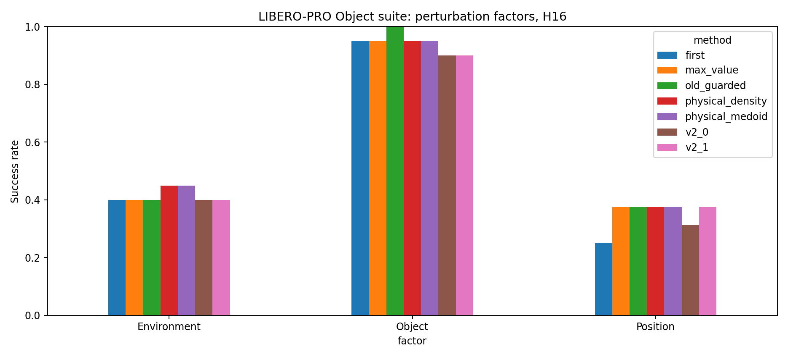

# Trajectory consensus campaign

Campaign: `trajectory_consensus_20260908_development`

Smoke is integration-only; its single-case intervals cannot establish efficacy. Development selects settings; only the frozen full stage tests them prospectively.

| factor      | method           |   episodes |   successes |     sr |   drops |   drop_rate |   mean_queries |   mean_final_t |
|:------------|:-----------------|-----------:|------------:|-------:|--------:|------------:|---------------:|---------------:|
| Environment | first            |         20 |           8 | 0.4000 |       1 |      0.0500 |        14.7500 |       227.8500 |
| Environment | max_value        |         20 |           8 | 0.4000 |       0 |      0.0000 |        14.2000 |       220.2500 |
| Environment | old_guarded      |         20 |           8 | 0.4000 |       0 |      0.0000 |        14.2000 |       220.0500 |
| Environment | physical_density |         20 |           9 | 0.4500 |       0 |      0.0000 |        13.7000 |       212.2000 |
| Environment | physical_medoid  |         20 |           9 | 0.4500 |       0 |      0.0000 |        13.8000 |       212.3500 |
| Environment | v2_0             |         20 |           8 | 0.4000 |       0 |      0.0000 |        14.2000 |       220.0500 |
| Environment | v2_1             |         20 |           8 | 0.4000 |       0 |      0.0000 |        14.2000 |       220.0000 |
| Object      | first            |         20 |          19 | 0.9500 |       1 |      0.0500 |         9.2500 |       141.1500 |
| Object      | max_value        |         20 |          19 | 0.9500 |       1 |      0.0500 |         9.5000 |       144.2500 |
| Object      | old_guarded      |         20 |          20 | 1.0000 |       0 |      0.0000 |         9.2500 |       140.6500 |
| Object      | physical_density |         20 |          19 | 0.9500 |       1 |      0.0500 |         9.3000 |       141.3500 |
| Object      | physical_medoid  |         20 |          19 | 0.9500 |       0 |      0.0000 |         9.3500 |       142.2000 |
| Object      | v2_0             |         20 |          18 | 0.9000 |       0 |      0.0000 |         9.7000 |       146.9000 |
| Object      | v2_1             |         20 |          18 | 0.9000 |       0 |      0.0000 |         9.6500 |       146.7500 |
| Position    | first            |         16 |           4 | 0.2500 |       0 |      0.0000 |        17.1875 |       267.6250 |
| Position    | max_value        |         16 |           6 | 0.3750 |       0 |      0.0000 |        16.3750 |       252.5625 |
| Position    | old_guarded      |         16 |           6 | 0.3750 |       0 |      0.0000 |        15.2500 |       236.1250 |
| Position    | physical_density |         16 |           6 | 0.3750 |       0 |      0.0000 |        16.1875 |       250.5625 |
| Position    | physical_medoid  |         16 |           6 | 0.3750 |       0 |      0.0000 |        16.0625 |       249.3125 |
| Position    | v2_0             |         16 |           5 | 0.3125 |       1 |      0.0625 |        16.3125 |       252.2500 |
| Position    | v2_1             |         16 |           6 | 0.3750 |       1 |      0.0625 |        16.3750 |       252.8750 |

[Matched videos, all rollouts](videos.html)

| reference        | method           | scope       |   episodes |   macro_delta |   ci95_low |   ci95_high |   rescues |   harms |   q0_action_pool_exact_rate |   mcnemar_exact_p |
|:-----------------|:-----------------|:------------|-----------:|--------------:|-----------:|------------:|----------:|--------:|----------------------------:|------------------:|
| first            | max_value        | All         |         56 |        0.0417 |    -0.0167 |      0.1000 |         4 |       2 |                      0.0000 |            0.6875 |
| first            | max_value        | Environment |         20 |        0.0000 |     0.0000 |      0.0000 |         0 |       0 |                      0.0000 |            1.0000 |
| first            | max_value        | Object      |         20 |        0.0000 |    -0.1500 |      0.1500 |         1 |       1 |                      0.0000 |            1.0000 |
| first            | max_value        | Position    |         16 |        0.1250 |     0.0000 |      0.2500 |         3 |       1 |                      0.0000 |            0.6250 |
| first            | old_guarded      | All         |         56 |        0.0583 |     0.0167 |      0.1125 |         4 |       1 |                      0.0000 |            0.3750 |
| first            | old_guarded      | Environment |         20 |        0.0000 |     0.0000 |      0.0000 |         0 |       0 |                      0.0000 |            1.0000 |
| first            | old_guarded      | Object      |         20 |        0.0500 |     0.0000 |      0.1500 |         1 |       0 |                      0.0000 |            1.0000 |
| first            | old_guarded      | Position    |         16 |        0.1250 |     0.0000 |      0.2500 |         3 |       1 |                      0.0000 |            0.6250 |
| first            | physical_density | All         |         56 |        0.0583 |     0.0167 |      0.1125 |         3 |       0 |                      0.0000 |            0.2500 |
| first            | physical_density | Environment |         20 |        0.0500 |     0.0000 |      0.1500 |         1 |       0 |                      0.0000 |            1.0000 |
| first            | physical_density | Object      |         20 |        0.0000 |     0.0000 |      0.0000 |         0 |       0 |                      0.0000 |            1.0000 |
| first            | physical_density | Position    |         16 |        0.1250 |     0.0000 |      0.2500 |         2 |       0 |                      0.0000 |            0.5000 |
| first            | physical_medoid  | All         |         56 |        0.0583 |     0.0167 |      0.1125 |         3 |       0 |                      0.0000 |            0.2500 |
| first            | physical_medoid  | Environment |         20 |        0.0500 |     0.0000 |      0.1500 |         1 |       0 |                      0.0000 |            1.0000 |
| first            | physical_medoid  | Object      |         20 |        0.0000 |     0.0000 |      0.0000 |         0 |       0 |                      0.0000 |            1.0000 |
| first            | physical_medoid  | Position    |         16 |        0.1250 |     0.0000 |      0.2500 |         2 |       0 |                      0.0000 |            0.5000 |
| first            | v2_0             | All         |         56 |        0.0042 |    -0.0500 |      0.0458 |         3 |       3 |                      0.0000 |            1.0000 |
| first            | v2_0             | Environment |         20 |        0.0000 |     0.0000 |      0.0000 |         0 |       0 |                      0.0000 |            1.0000 |
| first            | v2_0             | Object      |         20 |       -0.0500 |    -0.1500 |      0.0000 |         0 |       1 |                      0.0000 |            1.0000 |
| first            | v2_0             | Position    |         16 |        0.0625 |     0.0000 |      0.1875 |         3 |       2 |                      0.0000 |            1.0000 |
| first            | v2_1             | All         |         56 |        0.0250 |    -0.0292 |      0.0833 |         3 |       2 |                      0.0000 |            1.0000 |
| first            | v2_1             | Environment |         20 |        0.0000 |     0.0000 |      0.0000 |         0 |       0 |                      0.0000 |            1.0000 |
| first            | v2_1             | Object      |         20 |       -0.0500 |    -0.1500 |      0.0000 |         0 |       1 |                      0.0000 |            1.0000 |
| first            | v2_1             | Position    |         16 |        0.1250 |     0.0000 |      0.2500 |         3 |       1 |                      0.0000 |            0.6250 |
| max_value        | old_guarded      | All         |         56 |        0.0167 |    -0.0458 |      0.0833 |         2 |       1 |                      0.3393 |            1.0000 |
| max_value        | old_guarded      | Environment |         20 |        0.0000 |     0.0000 |      0.0000 |         0 |       0 |                      0.3000 |            1.0000 |
| max_value        | old_guarded      | Object      |         20 |        0.0500 |     0.0000 |      0.1500 |         1 |       0 |                      0.4000 |            1.0000 |
| max_value        | old_guarded      | Position    |         16 |        0.0000 |    -0.1875 |      0.1875 |         1 |       1 |                      0.3125 |            1.0000 |
| max_value        | physical_density | All         |         56 |        0.0167 |    -0.0333 |      0.0833 |         3 |       2 |                      0.4286 |            1.0000 |
| max_value        | physical_density | Environment |         20 |        0.0500 |     0.0000 |      0.1500 |         1 |       0 |                      0.5000 |            1.0000 |
| max_value        | physical_density | Object      |         20 |        0.0000 |    -0.1500 |      0.1500 |         1 |       1 |                      0.4000 |            1.0000 |
| max_value        | physical_density | Position    |         16 |        0.0000 |     0.0000 |      0.0000 |         1 |       1 |                      0.3750 |            1.0000 |
| max_value        | physical_medoid  | All         |         56 |        0.0167 |    -0.0333 |      0.0833 |         3 |       2 |                      0.3929 |            1.0000 |
| max_value        | physical_medoid  | Environment |         20 |        0.0500 |     0.0000 |      0.1500 |         1 |       0 |                      0.3000 |            1.0000 |
| max_value        | physical_medoid  | Object      |         20 |        0.0000 |    -0.1500 |      0.1500 |         1 |       1 |                      0.5000 |            1.0000 |
| max_value        | physical_medoid  | Position    |         16 |        0.0000 |     0.0000 |      0.0000 |         1 |       1 |                      0.3750 |            1.0000 |
| max_value        | v2_0             | All         |         56 |       -0.0375 |    -0.0917 |      0.0000 |         0 |       2 |                      0.4107 |            0.5000 |
| max_value        | v2_0             | Environment |         20 |        0.0000 |     0.0000 |      0.0000 |         0 |       0 |                      0.4000 |            1.0000 |
| max_value        | v2_0             | Object      |         20 |       -0.0500 |    -0.1500 |      0.0000 |         0 |       1 |                      0.5000 |            1.0000 |
| max_value        | v2_0             | Position    |         16 |       -0.0625 |    -0.1875 |      0.0000 |         0 |       1 |                      0.3125 |            1.0000 |
| max_value        | v2_1             | All         |         56 |       -0.0167 |    -0.0500 |      0.0000 |         0 |       1 |                      0.3393 |            1.0000 |
| max_value        | v2_1             | Environment |         20 |        0.0000 |     0.0000 |      0.0000 |         0 |       0 |                      0.3000 |            1.0000 |
| max_value        | v2_1             | Object      |         20 |       -0.0500 |    -0.1500 |      0.0000 |         0 |       1 |                      0.3000 |            1.0000 |
| max_value        | v2_1             | Position    |         16 |        0.0000 |     0.0000 |      0.0000 |         0 |       0 |                      0.4375 |            1.0000 |
| old_guarded      | physical_density | All         |         56 |        0.0000 |    -0.0750 |      0.0750 |         2 |       2 |                      0.5893 |            1.0000 |
| old_guarded      | physical_density | Environment |         20 |        0.0500 |     0.0000 |      0.1500 |         1 |       0 |                      0.4000 |            1.0000 |
| old_guarded      | physical_density | Object      |         20 |       -0.0500 |    -0.1500 |      0.0000 |         0 |       1 |                      0.7000 |            1.0000 |
| old_guarded      | physical_density | Position    |         16 |        0.0000 |    -0.1875 |      0.1875 |         1 |       1 |                      0.6875 |            1.0000 |
| old_guarded      | physical_medoid  | All         |         56 |        0.0000 |    -0.0750 |      0.0750 |         2 |       2 |                      0.4821 |            1.0000 |
| old_guarded      | physical_medoid  | Environment |         20 |        0.0500 |     0.0000 |      0.1500 |         1 |       0 |                      0.3000 |            1.0000 |
| old_guarded      | physical_medoid  | Object      |         20 |       -0.0500 |    -0.1500 |      0.0000 |         0 |       1 |                      0.5000 |            1.0000 |
| old_guarded      | physical_medoid  | Position    |         16 |        0.0000 |    -0.1875 |      0.1875 |         1 |       1 |                      0.6875 |            1.0000 |
| old_guarded      | v2_0             | All         |         56 |       -0.0542 |    -0.1208 |      0.0000 |         1 |       4 |                      0.3036 |            0.3750 |
| old_guarded      | v2_0             | Environment |         20 |        0.0000 |     0.0000 |      0.0000 |         0 |       0 |                      0.3000 |            1.0000 |
| old_guarded      | v2_0             | Object      |         20 |       -0.1000 |    -0.2500 |      0.0000 |         0 |       2 |                      0.2000 |            0.5000 |
| old_guarded      | v2_0             | Position    |         16 |       -0.0625 |    -0.1875 |      0.0000 |         1 |       2 |                      0.4375 |            1.0000 |
| old_guarded      | v2_1             | All         |         56 |       -0.0333 |    -0.1083 |      0.0417 |         1 |       3 |                      0.3929 |            0.6250 |
| old_guarded      | v2_1             | Environment |         20 |        0.0000 |     0.0000 |      0.0000 |         0 |       0 |                      0.4000 |            1.0000 |
| old_guarded      | v2_1             | Object      |         20 |       -0.1000 |    -0.2500 |      0.0000 |         0 |       2 |                      0.4000 |            0.5000 |
| old_guarded      | v2_1             | Position    |         16 |        0.0000 |    -0.1875 |      0.1875 |         1 |       1 |                      0.3750 |            1.0000 |
| physical_density | physical_medoid  | All         |         56 |        0.0000 |     0.0000 |      0.0000 |         0 |       0 |                      0.3571 |            1.0000 |
| physical_density | physical_medoid  | Environment |         20 |        0.0000 |     0.0000 |      0.0000 |         0 |       0 |                      0.4000 |            1.0000 |
| physical_density | physical_medoid  | Object      |         20 |        0.0000 |     0.0000 |      0.0000 |         0 |       0 |                      0.3000 |            1.0000 |
| physical_density | physical_medoid  | Position    |         16 |        0.0000 |     0.0000 |      0.0000 |         0 |       0 |                      0.3750 |            1.0000 |
| physical_density | v2_0             | All         |         56 |       -0.0542 |    -0.1208 |      0.0000 |         1 |       4 |                      0.3214 |            0.3750 |
| physical_density | v2_0             | Environment |         20 |       -0.0500 |    -0.1500 |      0.0000 |         0 |       1 |                      0.3000 |            1.0000 |
| physical_density | v2_0             | Object      |         20 |       -0.0500 |    -0.1500 |      0.0000 |         0 |       1 |                      0.2000 |            1.0000 |
| physical_density | v2_0             | Position    |         16 |       -0.0625 |    -0.1875 |      0.0000 |         1 |       2 |                      0.5000 |            1.0000 |
| physical_density | v2_1             | All         |         56 |       -0.0333 |    -0.0833 |      0.0000 |         1 |       3 |                      0.2500 |            0.6250 |
| physical_density | v2_1             | Environment |         20 |       -0.0500 |    -0.1500 |      0.0000 |         0 |       1 |                      0.3000 |            1.0000 |
| physical_density | v2_1             | Object      |         20 |       -0.0500 |    -0.1500 |      0.0000 |         0 |       1 |                      0.1000 |            1.0000 |
| physical_density | v2_1             | Position    |         16 |        0.0000 |     0.0000 |      0.0000 |         1 |       1 |                      0.3750 |            1.0000 |
| physical_medoid  | v2_0             | All         |         56 |       -0.0542 |    -0.1208 |      0.0000 |         1 |       4 |                      0.4107 |            0.3750 |
| physical_medoid  | v2_0             | Environment |         20 |       -0.0500 |    -0.1500 |      0.0000 |         0 |       1 |                      0.3000 |            1.0000 |
| physical_medoid  | v2_0             | Object      |         20 |       -0.0500 |    -0.1500 |      0.0000 |         0 |       1 |                      0.5000 |            1.0000 |
| physical_medoid  | v2_0             | Position    |         16 |       -0.0625 |    -0.1875 |      0.0000 |         1 |       2 |                      0.4375 |            1.0000 |
| physical_medoid  | v2_1             | All         |         56 |       -0.0333 |    -0.0833 |      0.0000 |         1 |       3 |                      0.5179 |            0.6250 |
| physical_medoid  | v2_1             | Environment |         20 |       -0.0500 |    -0.1500 |      0.0000 |         0 |       1 |                      0.5000 |            1.0000 |
| physical_medoid  | v2_1             | Object      |         20 |       -0.0500 |    -0.1500 |      0.0000 |         0 |       1 |                      0.6000 |            1.0000 |
| physical_medoid  | v2_1             | Position    |         16 |        0.0000 |     0.0000 |      0.0000 |         1 |       1 |                      0.4375 |            1.0000 |
| v2_0             | v2_1             | All         |         56 |        0.0208 |     0.0000 |      0.0625 |         1 |       0 |                      0.3929 |            1.0000 |
| v2_0             | v2_1             | Environment |         20 |        0.0000 |     0.0000 |      0.0000 |         0 |       0 |                      0.2000 |            1.0000 |
| v2_0             | v2_1             | Object      |         20 |        0.0000 |     0.0000 |      0.0000 |         0 |       0 |                      0.6000 |            1.0000 |
| v2_0             | v2_1             | Position    |         16 |        0.0625 |     0.0000 |      0.1875 |         1 |       0 |                      0.3750 |            1.0000 |

| method           |   job_seconds |   queries |   episodes |   switched |   switch_rate |   job_seconds_per_episode |   job_seconds_per_query |
|:-----------------|--------------:|----------:|-----------:|-----------:|--------------:|--------------------------:|------------------------:|
| first            |      9181.000 |       755 |         56 |          0 |         0.000 |                   163.946 |                  12.160 |
| max_value        |      6468.000 |       736 |         56 |          0 |         0.000 |                   115.500 |                   8.788 |
| old_guarded      |      7079.000 |       713 |         56 |        332 |         0.466 |                   126.411 |                   9.928 |
| physical_density |      5065.000 |       719 |         56 |        577 |         0.803 |                    90.446 |                   7.045 |
| physical_medoid  |      6237.000 |       720 |         56 |        574 |         0.797 |                   111.375 |                   8.662 |
| v2_0             |      4922.000 |       739 |         56 |         27 |         0.037 |                    87.893 |                   6.660 |
| v2_1             |      4974.000 |       739 |         56 |         28 |         0.038 |                    88.821 |                   6.731 |

Job wall time includes model loading, rendering, I/O and per-job analysis; not pure neural inference latency.
Complete episodes: 392. Query rows: 5121. Videos: 392.
Matched deployment init/seeds; not common-pool counterfactual branches. Intervals are stratified task/init bootstrap.
q0_action_pool_exact_rate audits bitwise action-pool matching; K1 and K4 pools differ by construction. Differences without any selector switch are not a selector benefit.
Official safety flags from LIBERO-PRO are not an official LIBERO-Safety evaluation.
