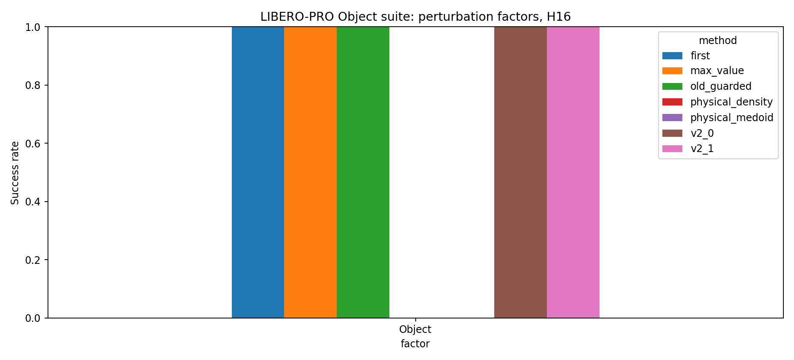

# Trajectory consensus campaign

Campaign: `trajectory_consensus_20260908_smoke`

Smoke is integration-only; its single-case intervals cannot establish efficacy. Development selects settings; only the frozen full stage tests them prospectively.

| factor   | method           |   episodes |   successes |     sr |   drops |   drop_rate |   mean_queries |   mean_final_t |
|:---------|:-----------------|-----------:|------------:|-------:|--------:|------------:|---------------:|---------------:|
| Object   | first            |          1 |           1 | 1.0000 |       0 |      0.0000 |        12.0000 |       181.0000 |
| Object   | max_value        |          1 |           1 | 1.0000 |       0 |      0.0000 |        11.0000 |       163.0000 |
| Object   | old_guarded      |          1 |           1 | 1.0000 |       0 |      0.0000 |        14.0000 |       221.0000 |
| Object   | physical_density |          1 |           0 | 0.0000 |       0 |      0.0000 |        18.0000 |       280.0000 |
| Object   | physical_medoid  |          1 |           0 | 0.0000 |       1 |      1.0000 |        18.0000 |       280.0000 |
| Object   | v2_0             |          1 |           1 | 1.0000 |       0 |      0.0000 |         9.0000 |       129.0000 |
| Object   | v2_1             |          1 |           1 | 1.0000 |       0 |      0.0000 |        11.0000 |       163.0000 |

[Matched videos, all rollouts](videos.html)

| reference        | method           | scope   |   episodes |   macro_delta |   ci95_low |   ci95_high |   rescues |   harms |   q0_action_pool_exact_rate |   mcnemar_exact_p |
|:-----------------|:-----------------|:--------|-----------:|--------------:|-----------:|------------:|----------:|--------:|----------------------------:|------------------:|
| first            | max_value        | All     |          1 |        0.0000 |     0.0000 |      0.0000 |         0 |       0 |                      0.0000 |            1.0000 |
| first            | max_value        | Object  |          1 |        0.0000 |     0.0000 |      0.0000 |         0 |       0 |                      0.0000 |            1.0000 |
| first            | old_guarded      | All     |          1 |        0.0000 |     0.0000 |      0.0000 |         0 |       0 |                      0.0000 |            1.0000 |
| first            | old_guarded      | Object  |          1 |        0.0000 |     0.0000 |      0.0000 |         0 |       0 |                      0.0000 |            1.0000 |
| first            | physical_density | All     |          1 |       -1.0000 |    -1.0000 |     -1.0000 |         0 |       1 |                      0.0000 |            1.0000 |
| first            | physical_density | Object  |          1 |       -1.0000 |    -1.0000 |     -1.0000 |         0 |       1 |                      0.0000 |            1.0000 |
| first            | physical_medoid  | All     |          1 |       -1.0000 |    -1.0000 |     -1.0000 |         0 |       1 |                      0.0000 |            1.0000 |
| first            | physical_medoid  | Object  |          1 |       -1.0000 |    -1.0000 |     -1.0000 |         0 |       1 |                      0.0000 |            1.0000 |
| first            | v2_0             | All     |          1 |        0.0000 |     0.0000 |      0.0000 |         0 |       0 |                      0.0000 |            1.0000 |
| first            | v2_0             | Object  |          1 |        0.0000 |     0.0000 |      0.0000 |         0 |       0 |                      0.0000 |            1.0000 |
| first            | v2_1             | All     |          1 |        0.0000 |     0.0000 |      0.0000 |         0 |       0 |                      0.0000 |            1.0000 |
| first            | v2_1             | Object  |          1 |        0.0000 |     0.0000 |      0.0000 |         0 |       0 |                      0.0000 |            1.0000 |
| max_value        | old_guarded      | All     |          1 |        0.0000 |     0.0000 |      0.0000 |         0 |       0 |                      1.0000 |            1.0000 |
| max_value        | old_guarded      | Object  |          1 |        0.0000 |     0.0000 |      0.0000 |         0 |       0 |                      1.0000 |            1.0000 |
| max_value        | physical_density | All     |          1 |       -1.0000 |    -1.0000 |     -1.0000 |         0 |       1 |                      1.0000 |            1.0000 |
| max_value        | physical_density | Object  |          1 |       -1.0000 |    -1.0000 |     -1.0000 |         0 |       1 |                      1.0000 |            1.0000 |
| max_value        | physical_medoid  | All     |          1 |       -1.0000 |    -1.0000 |     -1.0000 |         0 |       1 |                      0.0000 |            1.0000 |
| max_value        | physical_medoid  | Object  |          1 |       -1.0000 |    -1.0000 |     -1.0000 |         0 |       1 |                      0.0000 |            1.0000 |
| max_value        | v2_0             | All     |          1 |        0.0000 |     0.0000 |      0.0000 |         0 |       0 |                      0.0000 |            1.0000 |
| max_value        | v2_0             | Object  |          1 |        0.0000 |     0.0000 |      0.0000 |         0 |       0 |                      0.0000 |            1.0000 |
| max_value        | v2_1             | All     |          1 |        0.0000 |     0.0000 |      0.0000 |         0 |       0 |                      1.0000 |            1.0000 |
| max_value        | v2_1             | Object  |          1 |        0.0000 |     0.0000 |      0.0000 |         0 |       0 |                      1.0000 |            1.0000 |
| old_guarded      | physical_density | All     |          1 |       -1.0000 |    -1.0000 |     -1.0000 |         0 |       1 |                      1.0000 |            1.0000 |
| old_guarded      | physical_density | Object  |          1 |       -1.0000 |    -1.0000 |     -1.0000 |         0 |       1 |                      1.0000 |            1.0000 |
| old_guarded      | physical_medoid  | All     |          1 |       -1.0000 |    -1.0000 |     -1.0000 |         0 |       1 |                      0.0000 |            1.0000 |
| old_guarded      | physical_medoid  | Object  |          1 |       -1.0000 |    -1.0000 |     -1.0000 |         0 |       1 |                      0.0000 |            1.0000 |
| old_guarded      | v2_0             | All     |          1 |        0.0000 |     0.0000 |      0.0000 |         0 |       0 |                      0.0000 |            1.0000 |
| old_guarded      | v2_0             | Object  |          1 |        0.0000 |     0.0000 |      0.0000 |         0 |       0 |                      0.0000 |            1.0000 |
| old_guarded      | v2_1             | All     |          1 |        0.0000 |     0.0000 |      0.0000 |         0 |       0 |                      1.0000 |            1.0000 |
| old_guarded      | v2_1             | Object  |          1 |        0.0000 |     0.0000 |      0.0000 |         0 |       0 |                      1.0000 |            1.0000 |
| physical_density | physical_medoid  | All     |          1 |        0.0000 |     0.0000 |      0.0000 |         0 |       0 |                      0.0000 |            1.0000 |
| physical_density | physical_medoid  | Object  |          1 |        0.0000 |     0.0000 |      0.0000 |         0 |       0 |                      0.0000 |            1.0000 |
| physical_density | v2_0             | All     |          1 |        1.0000 |     1.0000 |      1.0000 |         1 |       0 |                      0.0000 |            1.0000 |
| physical_density | v2_0             | Object  |          1 |        1.0000 |     1.0000 |      1.0000 |         1 |       0 |                      0.0000 |            1.0000 |
| physical_density | v2_1             | All     |          1 |        1.0000 |     1.0000 |      1.0000 |         1 |       0 |                      1.0000 |            1.0000 |
| physical_density | v2_1             | Object  |          1 |        1.0000 |     1.0000 |      1.0000 |         1 |       0 |                      1.0000 |            1.0000 |
| physical_medoid  | v2_0             | All     |          1 |        1.0000 |     1.0000 |      1.0000 |         1 |       0 |                      1.0000 |            1.0000 |
| physical_medoid  | v2_0             | Object  |          1 |        1.0000 |     1.0000 |      1.0000 |         1 |       0 |                      1.0000 |            1.0000 |
| physical_medoid  | v2_1             | All     |          1 |        1.0000 |     1.0000 |      1.0000 |         1 |       0 |                      0.0000 |            1.0000 |
| physical_medoid  | v2_1             | Object  |          1 |        1.0000 |     1.0000 |      1.0000 |         1 |       0 |                      0.0000 |            1.0000 |
| v2_0             | v2_1             | All     |          1 |        0.0000 |     0.0000 |      0.0000 |         0 |       0 |                      0.0000 |            1.0000 |
| v2_0             | v2_1             | Object  |          1 |        0.0000 |     0.0000 |      0.0000 |         0 |       0 |                      0.0000 |            1.0000 |

| method           |   job_seconds |   queries |   episodes |   switched |   switch_rate |   job_seconds_per_episode |   job_seconds_per_query |
|:-----------------|--------------:|----------:|-----------:|-----------:|--------------:|--------------------------:|------------------------:|
| first            |       235.000 |        12 |          1 |          0 |         0.000 |                   235.000 |                  19.583 |
| max_value        |       291.000 |        11 |          1 |          0 |         0.000 |                   291.000 |                  26.455 |
| old_guarded      |       317.000 |        14 |          1 |          7 |         0.500 |                   317.000 |                  22.643 |
| physical_density |       273.000 |        18 |          1 |         17 |         0.944 |                   273.000 |                  15.167 |
| physical_medoid  |       341.000 |        18 |          1 |         13 |         0.722 |                   341.000 |                  18.944 |
| v2_0             |       186.000 |         9 |          1 |          0 |         0.000 |                   186.000 |                  20.667 |
| v2_1             |       131.000 |        11 |          1 |          0 |         0.000 |                   131.000 |                  11.909 |

Job wall time includes model loading, rendering, I/O and per-job analysis; not pure neural inference latency.
Complete episodes: 7. Query rows: 93. Videos: 7.
Matched deployment init/seeds; not common-pool counterfactual branches. Intervals are stratified task/init bootstrap.
q0_action_pool_exact_rate audits bitwise action-pool matching; K1 and K4 pools differ by construction. Differences without any selector switch are not a selector benefit.
Official safety flags from LIBERO-PRO are not an official LIBERO-Safety evaluation.
