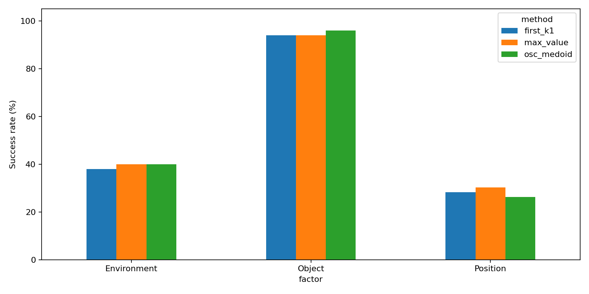

# Frozen consensus comparison on valid support

597 real closed-loop rollouts: 199 cases x 3 methods. The original 200-case grid was not completed.
The original y0.5/task1 init asset is empty. Its case is excluded symmetrically, without observing a policy outcome.
H16, joint parallel generation; K4 except K1. No selector settings were tuned on these outcomes.
KDPE is an induced-OSC endpoint adaptation, not the original N100 pose-action experiment.

| factor      | method     |   episodes |   successes |     sr |   drops |
|:------------|:-----------|-----------:|------------:|-------:|--------:|
| Environment | first_k1   |         50 |          19 | 0.3800 |       0 |
| Environment | max_value  |         50 |          20 | 0.4000 |       1 |
| Environment | osc_medoid |         50 |          20 | 0.4000 |       1 |
| Object      | first_k1   |         50 |          47 | 0.9400 |       2 |
| Object      | max_value  |         50 |          47 | 0.9400 |       0 |
| Object      | osc_medoid |         50 |          48 | 0.9600 |       1 |
| Position    | first_k1   |         99 |          28 | 0.2828 |       2 |
| Position    | max_value  |         99 |          30 | 0.3030 |       2 |
| Position    | osc_medoid |         99 |          26 | 0.2626 |       0 |

| method     | reference   | scope       |   pairs |   macro_delta |   ci95_low |   ci95_high |   rescues |   harms |   mcnemar_p |   q0_pool_exact_rate |   holm_macro_p |
|:-----------|:------------|:------------|--------:|--------------:|-----------:|------------:|----------:|--------:|------------:|---------------------:|---------------:|
| first_k1   | max_value   | All         |     199 |       -0.0134 |    -0.0500 |      0.0201 |         5 |       8 |      0.5811 |               0.0000 |         1.0000 |
| first_k1   | max_value   | Environment |      50 |       -0.0200 |    -0.1000 |      0.0400 |         1 |       2 |      1.0000 |               0.0000 |       nan      |
| first_k1   | max_value   | Object      |      50 |        0.0000 |    -0.0600 |      0.0600 |         1 |       1 |      1.0000 |               0.0000 |       nan      |
| first_k1   | max_value   | Position    |      99 |       -0.0202 |    -0.0808 |      0.0400 |         3 |       5 |      0.7266 |               0.0000 |       nan      |
| osc_medoid | max_value   | All         |     199 |       -0.0068 |    -0.0333 |      0.0199 |         3 |       6 |      0.5078 |               0.4573 |         1.0000 |
| osc_medoid | max_value   | Environment |      50 |        0.0000 |    -0.0600 |      0.0600 |         1 |       1 |      1.0000 |               0.4000 |       nan      |
| osc_medoid | max_value   | Object      |      50 |        0.0200 |     0.0000 |      0.0600 |         1 |       0 |      1.0000 |               0.6000 |       nan      |
| osc_medoid | max_value   | Position    |      99 |       -0.0404 |    -0.0707 |     -0.0101 |         1 |       5 |      0.2188 |               0.4141 |       nan      |

[All matched videos](videos.html)

Macro-SR weights factors equally. Bootstrap clusters task/init within factors.
Primary comparisons use Holm-adjusted McNemar p-values; per-factor tests are descriptive.
Q0 matching does not imply identical candidate pools at later queries. Job seconds are not pure inference latency.
