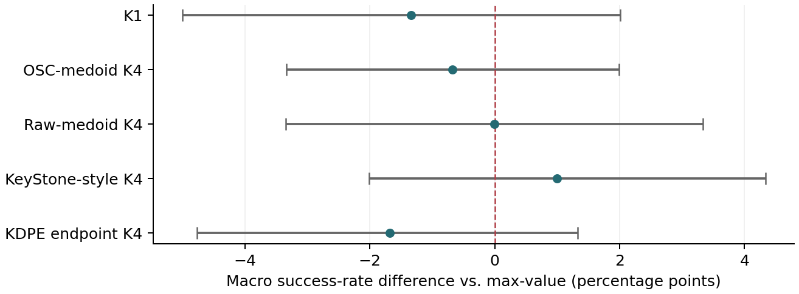
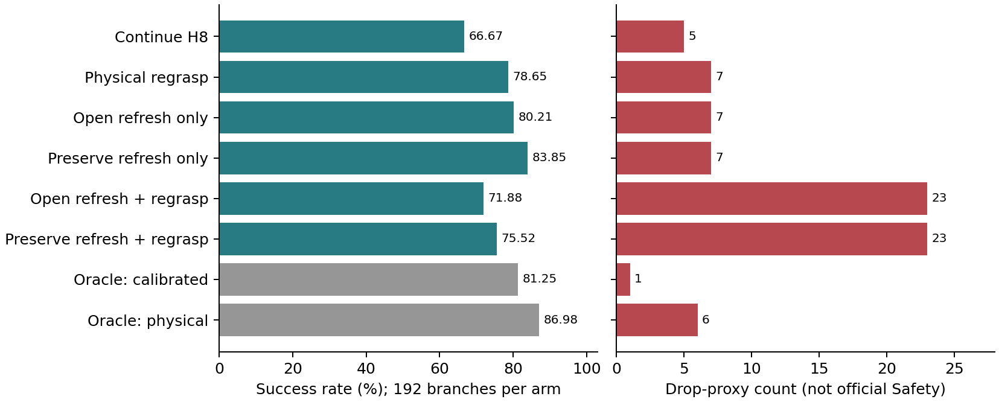
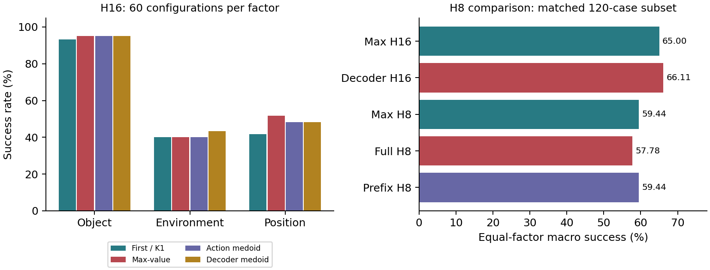

# Неопределённость, выбор действий и восстановление в world-action models

**Обновление 15 сентября:** [S0-v2 полностью завершена и проанализирована](../../experiments/P3_RUNTIME_V2_RESULTS_20260915.md).
995/995main,199cases,18smoke. P3fixed96/199 vsH16 93/199,
Macro54.10% vs53.42%, delta+0.6801п.п.,CI[-2.9967;4.3636].
Общего преимущества нет; event0interventions. Это corrected-runtime broad
test, не перепроверка положительного scoped16/64→41/64: она ещё нужна.
Статья теперь о physical state correction vs requery, с обновлённой
[редакционной картой](EDITORIAL_SELECTION.md) и [submission checklist](SUBMISSION_CHECKLIST.md).
Ниже сохранена полная историческая работа, без удаления слабых результатов.

**Это полный исследовательский отчёт, не текст текущей статьи.**
С 14 сентября чистовая рукопись сфокусирована на
[визуальном восстановлении захвата](PAPER_NARRATIVE.md).
[Другие эксперименты](OTHER_EXPERIMENTS.md) описаны отдельно; вся история,
включая отрицательные результаты, ниже сохранена.

## Полный исследовательский отчёт

**Дополнение 14 сентября:** завершённые результаты новых серий находятся в
[Recovery Final Results](../../experiments/RECOVERY_FINAL_RESULTS_20260914.md).
Main: 512/512 ветвей; timing: 768/768; oracle: 128/128. На знакомых cells
H8 16/64 -> RGB recovery 41/64 (+39.06 п.п., cluster CI [29.69; 48.44]);
на x0.3 0/64 ->1/64. Preserve-only не даёт дополнительного улучшения.
Oracle XY даёт 3/16 против RGB 0/16 на отдельной transfer-диагностике,
но не решает 13/16 случаев. Эти результаты уточняют механизм и границы
переноса; это не новая универсальная SOTA. Широкая пятистратегийная оценка P3
на valid199 описана в [протоколе](../../experiments/P3_BENCHMARK_CLOSURE_PROTOCOL_20260914.md).
Ниже сохранён отчёт на 12 сентября с исходными выборками и выводами.

**Период:** май - 12 сентября 2026 года. **Модель:** Cosmos Policy,
`Cosmos-Policy-LIBERO-Predict2-2B`. **Статус:** завершённый отчёт по имеющимся
данным, а не обещание результата следующего запуска.

[Краткие результаты](RESEARCH_SUMMARY.md) · [Рукопись LaTeX](manuscript/main.tex) ·
[ICLR PDF](build/iclr2027.pdf) · [Реестр проверенных утверждений](EVIDENCE_LEDGER.md) ·
[Каталог всех исходных отчётов](RESULTS_INDEX.md).

Это самостоятельное описание задачи, методов, протоколов, результатов и выводов.
Исторические отчёты и сырые данные не заменены. Для ранних серий использованы
сохранённые отчёты и аудиты; полный повторный аудит каждой старой траектории
не выполнялся. Для последних двух серий проверены все основные результаты,
видео и ключевые контракты исполнения. Все проценты ниже относятся к явно
указанной выборке. Разные эксперименты нельзя складывать в один общий SR.

## Содержание

1. Задача и научный вопрос.
2. Модель, наблюдения, латентное представление и управление.
3. Бенчмарки, OOD и определения неудачи.
4. Метрики: точные формулы и момент доступности.
5. Семейства проверенных методов.
6. Протоколы сравнения и статистика.
7. Начальные эксперименты и risk-aware planning.
8. Temporal overlap, surrogate и learned ranking.
9. Выбор момента нового наблюдения.
10. RGB recovery и перенос.
11. Consensus: полное широкое сравнение.
12. Candidate opportunity и stochastic continuation.
13. Проверка захвата и цена вмешательства.
14. Observation Contract: последние 1536 ветвей.
15. Decoder-medoid: последние 1440 rollout.
16. Общие объяснения результатов.
17. Связь с литературой и научная новизна.
18. Достоверность, воспроизводимость и видео.
19. Что действительно получено и что делать дальше.
20. Источники и материалы для публикации.

## 1. Задача и научный вопрос

Исходная идея: world-action model предсказывает не только действие, но и его
будущие последствия и value. Если взять несколько стохастических предсказаний
для одного наблюдаемого состояния, можно измерить их несогласованность.
Хотелось использовать её для раннего обнаружения ошибки и более надёжного
планирования вместо жадного выбора максимального predicted value.

Основной исследовательский вопрос:

> Можно ли без дообучения основной Cosmos Policy улучшить выполнение сложных
> OOD-задач за счёт анализа её предсказаний, выбора действий, частоты feedback
> и контролируемого восстановления после ошибки?

По мере работы вопрос разделился на четыре разных задачи:

| Задача | Что нужно предсказывать | Что требуется доказать экспериментально |
|---|---|---|
| Failure detection | Вероятность будущего fail из текущего наблюдения | Ранний сигнал до физической ошибки, на новых случаях |
| Candidate ranking | Какой action лучше других из того же pool | Лучший outcome при одинаковых состоянии, pool и бюджете |
| Feedback scheduling | Когда полезно новое наблюдение | Fresh observation лучше commit и compute-matched stale control |
| Recovery selection | Какое вмешательство поможет и не навредит | Выигрыш над сильным recovery control, а не только над бездействием |

**Главный итог:** эти задачи не эквивалентны. Хороший глобальный detector может
плохо ранжировать действия одного состояния. Большое disagreement не гарантирует
полезность нового наблюдения. Более точная проверка захвата не гарантирует
полезность следующего физического вмешательства.

### 1.1. Проверявшиеся гипотезы

| Гипотеза | Итог на текущих данных |
|---|---|
| Перед fail растёт stochastic/latent disagreement | Иногда видно на выбранных эпизодах; универсальный detector не подтверждён |
| Штраф uncertainty улучшает max-value planning | Широкое устойчивое улучшение не установлено |
| Более частое requery предотвращает ошибки | Есть локальный положительный эффект; общий H8 gain не подтверждён |
| Геометрический или latent consensus лучше max-value | На широких сравнениях убедительного превосходства нет |
| Независимый surrogate ошибки улучшает выбор | Offline improvement есть, closed-loop SR не улучшился |
| RGB recovery расширяет набор полезных действий | Подтверждено на новых init выбранных сложных cells |
| Проверка захвата перед recovery улучшает безопасность | Исправлены perception errors, но дополнительный SR gain не доказан |
| Вмешательство само способно вызвать fail | В последней paired-серии подробно задокументированы 16 таких потерь |

## 2. Архитектура и управление

### 2.1. Что поступает в модель

На query $q$ в физический момент $t_q$ формируется наблюдение

$$
x_q=(I^{ext}_{t_q}, I^{wrist}_{t_q}, p_{t_q}, e_{text}).
$$

Здесь внешняя камера и камера на захвате дают **реальные текущие RGB-кадры**
симулятора; $p$ содержит положение/ориентацию рабочего органа и состояние
захвата; $e_{text}$ является T5 embedding команды. В LIBERO proprio имеет
9 компонент: 3 координаты EEF, 4 компоненты quaternion и 2 положения пальцев.
Порядок конкатенации в используемом LIBERO adapter: сначала 2 gripper qpos,
затем 3 EEF position, затем 4 EEF quaternion.
Future proprio не содержит автоматически положения всех предметов сцены.

Изображения проходят предусмотренные репозиторием преобразования ориентации,
размера и нормализации, затем video tokenizer/VAE. Для каждого конкретного
запуска точные размеры и preprocessing задаёт сохранённый config. В проверенной
последней decoder-серии latent имеет форму `[1,16,9,28,28]`.
Нельзя переносить индексы осей или размеры между конфигурациями без проверки.

Предсказанные картинки используются для анализа/планирования, но **не подменяют
кадры симулятора на следующем обычном closed-loop query**. Новое реальное
наблюдение берётся после выполнения выбранного префикса действий.

### 2.2. Совместная генерация

В большинстве наших экспериментов:

$$
(A_q^{(i)},\widehat I_{q,T}^{(i)},\widehat p_{q,T}^{(i)},V_q^{(i)})
\sim p_\theta(\cdot\mid x_q;\xi_i),\qquad A_q^{(i)}\in\mathbb R^{16\times7}.
$$

Семь компонент действия: три translation-команды, три rotation-команды и
gripper. Они не являются гарантированной будущей позой робота: результат
зависит от OSC controller, контактов и динамики среды.

$\xi_i$ задаёт шум генерации. Несколько stochastic samples получают повторными
вызовами одного frozen checkpoint. Это не несколько независимо обученных
моделей и не чистая оценка epistemic uncertainty. Изначальная single-sample
policy не обязана сама строить весь наш аналитический ensemble.

### 2.3. Как матрица превращается в действие и value

Cosmos использует latent injection: нормированные низкоразмерные величины
тиражируются в выделенные latent frames. При генерации frame уже не обязан
содержать идеально одинаковые копии. Для action-frame:

$$
L^A\in\mathbb R^{C\times H_L\times W_L},\quad
B^A=\operatorname{reshape}(\operatorname{flat}(L^A)_{:R_A TD}),\quad
B^A\in\mathbb R^{R_A\times T\times D}.
$$

$$
\widetilde A_{h,d}=\frac1{R_A}\sum_rB^A_{r,h,d},\qquad
A=\operatorname{denormalize}(\widetilde A).
$$

Аналогично усредняются копии normalized future proprio; scalar value
извлекается усреднением элементов своего frame с предусмотренной моделью
декодировкой. RGB, в отличие от action-vector, декодируется через VAE.
Нужно различать внутренний нормированный latent и величины после
denormalization: их стандартные отклонения имеют разные единицы.

В последнем decoder-протоколе $16\cdot28\cdot28=12544$ элементов action-frame
образуют 112 полных копий вектора длины $16\cdot7=112$. Для 9D proprio
остаток после полных копий отбрасывается при вычислении copy metrics.

Это **не** 112 независимых модельных предсказаний: копии являются частями
одного совместно сгенерированного тензора. Их disagreement характеризует
самосогласованность представления, а не автоматически доверительный интервал.

### 2.4. Planning и receding horizon

$$
i_q^*=\arg\max_i S(x_q,A_q^{(i)}),\qquad
s_{t+1}=F(s_t,a_t),\quad t=t_q,\ldots,t_q+H-1.
$$

После $H\le T$ исполненных действий модель получает свежие наблюдения.
Широкий базовый протокол: $T=H=16$. H8-режим: предсказываем 16, исполняем
8, остаток отбрасываем или сохраняем для overlap diagnostics.

**Query не равен видеокадру.** При начале с $t=0$, без вмешательств и при
H16 query=3 начинается на $t=48$ и управляет действиями 48-63. Его outcome
после полного chunk доступен при $t=64$. Если предмет падает на 48-56,
post-chunk error уже не является предупреждением до этого падения.
После recovery и переменного H арифметика `query * 16` неверна: нужны
сохранённые timestamps. Settle steps и render FPS тоже не следует смешивать
с индексами физических управляющих действий.

### 2.5. Почему это не точное авторское planning

Основной baseline у нас: **joint-value best-of-K**, то есть value получено
совместно с action/future в одной генерации кандидата. В статье Cosmos
planning использует отдельную цепочку $a\to s'\to v$, повторные futures/value
и rollout-finetuned planning model в другой постановке.
Наш небольшой AR pilot не воспроизводит всю эту систему.

Следовательно, корректные названия в статье: single-sample Cosmos policy,
joint max-value selection и наши inference-time контроллеры. Нельзя писать,
что мы полностью воспроизвели и превзошли авторское Cosmos planning.
Источник: [Cosmos Policy, §5.3](https://arxiv.org/html/2601.16163v1),
[локальное сравнение постановок](RELATED_WORK_RESULTS.md).

## 3. Данные, OOD и определения fail

### 3.1. Какие среды использованы

| Среда | Роль в проекте | Ограничения вывода |
|---|---|---|
| Standard LIBERO | Проверка интеграции и ID control | Не стресс-тест PRO; высокий SR даёт ceiling |
| LIBERO-PRO | Основные OOD-эксперименты и найденные mixed success/fail cells | Набор задач, факторов и уровней задаётся manifest каждой серии |
| LIBERO-plus | Изучен как альтернативный OOD benchmark, подготовительные материалы | Не основа итоговых широких сравнений в этом отчёте |
| LIBERO-Safety | Отдельная официальная safety-проверка | Плохой task success и отсутствующие semantic assets ограничили полезность серии |
| Собственные PRO event proxies | Контакт, перенос, drop, progress, reach miss | Не являются официальными LIBERO-Safety scores |

Основная поздняя постановка: **Object task suite LIBERO-PRO** с тремя
факторами **Object / Environment / Position**. Название suite и фактор
возмущения не одно и то же. Environment score измеряется на конкретных
сохранённых background/environment configurations, а не на любых сложных фонах.

В раннем поиске также использовали language, swap и другие конфигурации.
Их нельзя добавлять в позднюю трёхфакторную таблицу без нового определения
выборки. OOD означает сдвиг относительно условий обучения/обычного benchmark;
OOB сам по себе не название использованного протокола.

### 3.2. Что означает terminal fail

$$
Y=\mathbb1\{\text{официальное task-success условие достигнуто в пределах бюджета}\}.
$$

Terminal fail означает $Y=0$. Оно не говорит автоматически, что предмет упал:
причиной может быть timeout, неверный предмет, ошибочный захват, неполное
размещение, недостижимая цель или ошибка распознавания задачи. Визуальное
касание целевой поверхности ещё не гарантирует выполнения BDDL predicate.

Для анализа момента ошибки отдельно определяем event time $\tau_{event}$:
падение, потерю контакта, промах захвата или другое проверяемое событие.
Если событие не размечено надёжно, нельзя заменять его временем конца эпизода
и утверждать, что detector предупредил конкретное падение.

### 3.3. Safety как отдельная ось

$$
\mathrm{SafeSR}=\frac1N\sum_e
\mathbb1\{Y_e=1\ \land\ \text{нет нарушения ограничения в эпизоде}\}.
$$

Terminal SR, safe SR, число нарушений, drop proxy и незавершённость должны
показываться раздельно. Консервативная остановка может уменьшить число
опасных действий и одновременно ухудшить завершение задачи.

В официальной Safety-серии: **144 rollout, success=0, safe-success=0,
четыре official violations**; часть semantic initialization assets отсутствовала.
Это не свидетельство работающего safety planner и не полноценная оценка всех
возможностей Safety. В новых recovery-сериях drop определяется локальным
proxy с проверкой траектории; никакой сертифицированной безопасности нет.

## 4. Метрики: формулы и доступность

В этом разделе $K$ обозначает число samples одного текущего query,
$T=16$, $D=7$. Стандартное отклонение в используемом NumPy-коде считается
с **`ddof=0`**, то есть делением на $K$, а не на $K-1$.
Источник реализации:
[uncertainty_metrics.py](../../cosmos-policy/cosmos_policy/experiments/robot/libero/uncertainty_metrics.py).

### 4.1. Межсемпловый разброс действий

$$
\bar a_{h,d}=\frac1K\sum_i a^{(i)}_{h,d},\qquad
\sigma_{h,d}=\sqrt{\frac1K\sum_i(a^{(i)}_{h,d}-\bar a_{h,d})^2}.
$$

$$
U_{action,mean}=\frac1{TD}\sum_{h,d}\sigma_{h,d},\qquad
U_{first}=\sqrt{\sum_{d=1}^{6}\sigma_{1,d}^2}.
$$

`action_std_mean` усредняет std по всем действиям и компонентам.
`action_first_step_l2_std` берёт L2-норму покомпонентных std **первого действия,
без gripper**. Это не std длин векторов и не дисперсия всего rollout.
XYZ, rotation и gripper дополнительно анализировались отдельно.

Pairwise-вариант:

$$
U_{pair}=\frac{2}{K(K-1)T}\sum_{i<j}\sum_{h=1}^T
\|a_h^{(i)}-a_h^{(j)}\|_2.
$$

Raw action-space смешивает нормированные translation, rotation и gripper.
Для физического сравнения позднее добавлены controller-aware distances.

### 4.2. Value uncertainty

$$
\bar V=\frac1K\sum_i V_i,\qquad
U_{V,std}=\sqrt{\frac1K\sum_i(V_i-\bar V)^2},\qquad
U_{V,range}=\max_iV_i-\min_iV_i.
$$

`value_range` берёт диапазон **K scalar value текущего query**.
В нём нет временного окна, если явно не добавлен суффикс агрегации по query.
Пропущенные значения в исходном коде обрабатываются `nan*` операциями,
поэтому эффективное число наблюдений может быть меньше K.

Совместно сгенерированные $V_i$ относятся к разным $A_i$ и futures.
Поэтому их std смешивает разнообразие допустимых действий и модельный шум.
Для candidate-specific $\mathrm{Var}(V\mid x,A_i)$ нужно удержать **одно
фиксированное действие** и повторять условные futures/value отдельно.

### 4.3. Future proprio и RGB disagreement

$$
U_p=\frac1{9}\sum_d\operatorname{Std}_i(\widehat p_{i,d}),\qquad
U_I=\frac1{3HW}\sum_{u,v,c}\operatorname{Std}_i(\widehat I_i[u,v,c]).
$$

В collector future proprio извлекается из normalized latent copies.
RGB std зависит от масштаба пикселей; нельзя сравнивать численно RGB `[0,1]`
с `[0,255]`. Pixel disagreement чувствителен к сдвигу объекта, текстуре,
освещению и многозначности изображения; оно не выделяет только опасное событие.

### 4.4. Внутренняя согласованность latent copies

Для одного sample $i$:

$$
U^i_{A,copy}=\frac1{TD}\sum_{h,d}\operatorname{Std}_r B^A_{i,r,h,d},
\qquad
U^i_{p,copy}=\frac1{9}\sum_d\operatorname{Std}_r B^p_{i,r,d}.
$$

$$
U^i_{V,element}=\operatorname{Std}_{\ell}\left(\operatorname{flat}(L^V_i)_\ell\right).
$$

`latent_future_proprio_copy_std_mean`: std между копиями одной proprio-компоненты,
затем среднее по компонентам. `..._max` выбирает максимальную компоненту.
`latent_value_element_std_mean`: std элементов scalar-value frame, затем
среднее по batch; при batch=1 mean и max по batch совпадают.

Отдельная тонкость: `latent_action_first_step_copy_l2_std` включает **все
7 компонент**, в отличие от межсемплового `action_first_step_l2_std`, где их 6.
Считать эти два названия одной и той же метрикой нельзя.

Суффикс `_mean_over_samples` добавляет усреднение $\frac1K\sum_iU_i$.
Суффикс `__std` в episode table добавляет std **по query эпизода**.
Например:

$$
\texttt{latent\_action\_copy\_std\_mean\_mean\_over\_samples\_\_std}
=\operatorname{Std}_{q}\left[\frac1K\sum_i
\frac1{TD}\sum_{h,d}\operatorname{Std}_r B^A_{q,i,r,h,d}\right].
$$

Это временная нестабильность внутреннего disagreement, а не напрямую
вероятность падения предмета.

### 4.5. Prediction error after executing each chunk

При полном исполнении prediction horizon:

$$
E_p(q)=\|\widehat p_{t_q+T}-p_{t_q+T}\|_2,\qquad
E_I(q)=\frac1{3HW}\|\widehat I_{t_q+T}-I_{t_q+T}\|_F^2.
$$

Дополнительно предусмотрены SSIM и LPIPS. Нужно проверять наличие вычисленных
полей в конкретном запуске: отсутствие значения не означает нулевую ошибку.
Proprio следует сопоставлять в согласованном normalized/physical пространстве.
Для quaternion необходимо учитывать двойное представление $q$ и $-q$,
если отдельно вводится физическая orientation-error метрика.

**Главное ограничение:** фактический future observation становится известен
только после исполнения. Эта ошибка доступна для анализа и следующего query,
но не для предупреждения текущего chunk до его исполнения.
При H8 нельзя сравнивать forecast на $t+16$ с observation на $t+8$.
В последней H8-серии такие несопоставимые ошибки намеренно не заполнялись;
то же относится к H16, завершённому досрочно.

### 4.6. Episode predictors и раннее предупреждение

`Query-level uncertainty metrics` показывают $U_q$ на временной оси.
`Prediction error after executing each chunk` показывает hindsight-error.
`Episode-level metric separation` сравнивает mean/max/std/quantiles между
эпизодами success/fail. Последняя картинка использует историю всего эпизода
и сама по себе не доказывает online prediction.

Для честного раннего теста в момент $t$ допустимы только
$\{x_u,A_u,\widehat x_u,U_u:u\le t\}$ и уже наблюдавшиеся прошлые errors.
Предсказание $\widehat F_t$ следует оценивать до $\tau_{event}$, а не после.
При сравнении кривых разной длины нужно фиксировать общий horizon и число
эпизодов, остающихся на каждом шаге. Усреднение после раннего завершения
success вызывает survivor bias.

$$
\mathrm{TPR}=\frac{TP}{TP+FN},\quad
\mathrm{TNR}=\frac{TN}{TN+FP},\quad
\mathrm{BA}=\tfrac12(\mathrm{TPR}+\mathrm{TNR}).
$$

Здесь positive label = **fail**. AUROC оценивает порядок risk scores по всем
порогам; accuracy зависит от баланса классов. Accuracy 0.5 не означает
полезный detector, особенно если простое majority prediction лучше.
Нужны также calibration, precision/recall, false alarms и lead time.

`Top online episode-level predictors` означает ранжирование признаков,
доступных во время inference, но aggregate за весь эпизод всё ещё hindsight.
Leave-one-out top-k predictor допустим только если выбор признаков, знаков,
нормализации и порога заново делается **внутри training fold**. Оставлять один
seed при тех же init в train/test недостаточно для проверки переноса задач.

## 5. Семейства методов и формулы

### 5.1. Risk-aware selection

Общая идея:

$$
S_i=\bar V_i-\lambda U_i,\qquad i^*=\arg\max_i S_i.
$$

Это семейство, а не один уже доказанный лучший алгоритм.
Параметры нормализации и $\lambda$ должны быть заморожены по development.
Если $U_q$ одно и то же для всех кандидатов текущего pool, то
$\arg\max_i(V_i-\lambda U_q)=\arg\max_i V_i$: такой штраф **не меняет выбор**.
Для selection нужен candidate-specific score; pool risk подходит для решения
о requery/остановке/recovery, но не сам по себе для reranking.

Для нескольких метрик возможен
$U_i=\sum_mw_m(U_{i,m}-\mu_m^{train})/s_m^{train}$.
Ненормированные action, RGB и value нельзя складывать с произвольными
коэффициентами и интерпретировать как вероятность.

Исторический `risk_overconfidence_value` не является стандартной формулой из
статьи. В holdout-коде это среднее доступных компонент

$$
\{-z(U_{V,std}),-z(U_{V,range}),-z(U_{V,element}),-0.5z(\bar V)\}.
$$

При наличии всех четырёх делитель равен 4; при пропусках набор меняется.
Название вводит в заблуждение: текущие знаки увеличивают этот score при
**малом** disagreement и **малом**, а не большом, mean value.
В отчёте сохраняется фактическая формула кода, а не удобное толкование имени.
Источник: [holdout predictor](../../scripts/evaluate_holdout_fail_predictors.py).

### 5.2. Temporal overlap

При generate 16/execute 8 сравниваются предсказания **одинаковых физических
моментов**, сделанные из разных наблюдений:

$$
U_{overlap}(q)=\sqrt{\frac1{8D}\sum_{h=1}^{8}\sum_d
(A_q[h,d]-A_{q-1}[h+8,d])^2}.
$$

Рост может означать ошибку, но также нормальную коррекцию по новым данным.
Малый overlap error может означать согласованное неправильное действие.
Для future images/states аналогия допустима только при совпадении target time;
единственный prediction на конец каждого chunk обычно относится к разным
моментам, поэтому прямое сравнение неверно.

### 5.3. Surrogate и residual risk

Обучается $\widehat e_\phi(x,A)$, например по error между предсказанным и
фактическим future proprio. Применение:

$$
i^*=\arg\max_i[V_i-\lambda\widehat e_\phi(x,A_i)].
$$

Альтернатива: предсказывать terminal outcome или pairwise advantage.
Различие целей принципиально:

$$
\Pr(F\mid x)\ne\Pr(F\mid x,A_i),\qquad
\operatorname*{argmin}_i E_i\ne\operatorname*{argmax}_i\Pr(Y_i=1).
$$

Простой/малоподвижный, но бесполезный action может иметь небольшой prediction
error. Глобальный score может отличать лёгкие сцены от сложных, не различая
хорошие и плохие действия внутри одной сцены.

### 5.4. Геометрический consensus

Для native OSC-команд строятся proxy-траектории:

$$
\bar p_h=\sum_{\tau\le h}c_p\operatorname{clip}(u_\tau,-1,1),\quad
\bar R_h=\exp([c_r\operatorname{clip}(\omega_h,-1,1)]_\times)\bar R_{h-1}.
$$

В valid 199: $c_p=0.05$, $c_r=0.5$; это масштабы controller, не измеренные
future poses. Расстояние:

$$
D(i,j)=\frac{\sum_{h=1}^{16}\gamma^{h-1}
[\|\bar p_h^i-\bar p_h^j\|_2/c_p+
\lambda_r\vartheta(\bar R_h^i,\bar R_h^j)/c_r+
\lambda_g\mathbb1(b_h^i\ne b_h^j)]}{\sum_{h=1}^{16}\gamma^{h-1}},
$$

где $\vartheta(R,S)=\arccos(\operatorname{clip}((\operatorname{tr}(RS^\top)-1)/2,-1,1))$.
Параметры valid 199: $\gamma=.95$, $\lambda_r=.5$, $\lambda_g=.25$,
alignment window=0. Medoid:

$$
i^*=\arg\min_i\frac1{K-1}\sum_{j\ne i}D(i,j).
$$

Исполняется один настоящий sample, не среднее несовместимых действий.
В OSC-реализации при tie используются value и индекс. Raw-medoid сравнивает
flattened chunks; KeyStone-style выбирает medoid dominant cluster;
KDPE-style использует density по induced endpoints. Это адаптации известных
идей к Cosmos, а не изобретение medoid/consensus.

### 5.5. Feedback и recovery как выбор вмешательства

$$
\mathrm{VoF}(x)=\mathbb E[Y\mid\text{fresh},x]-
\mathbb E[Y\mid\text{commit},x].
$$

Для изоляции свежей информации нужен stale-requery: одинаковые sampling
budget, новый вызов модели, но старые RGB/proprio. Fresh против commit
меняет не только наблюдение, но также шум, действие и момент переключения.

Recovery отличается от нового sample: добавляется физическая последовательность
open/retreat/relocalize/approach/close/lift, после которой продолжается policy.
Она способна попасть вне исходного action pool, но потребляет время и может
разрушить уже хороший контакт. Поэтому оптимальный gate должен оценивать
**advantage вмешательства**, а не только существование ошибки.

## 6. Протоколы и статистическая дисциплина

### 6.1. Что фиксируется

В manifest должны быть: checkpoint и inference mode; suite/task/factor/level;
init asset и index; scene/rollout/candidate/suffix seeds; K; denoising steps;
prediction/execution horizons; episode budget; action representation;
гейты, коэффициенты и этап выбора гиперпараметров; unit of analysis.

| Серия | Основная единица | K | T/H | Бюджет | Ключевой контроль |
|---|---|---:|---|---|---|
| valid 199 | 199 configs/arm | 4, K1 control | 16/16 | 280 действий | Те же init, но не всегда bitwise pool |
| Decoder H16 | 180 configs/arm | 3 | 16/16 | 280 + settle отдельно | Общий cached q0 RGB/proprio/pool |
| Decoder H8 | 120 matched configs/arm | 3 | 16/8 | 280 | Те же q0, H16 controls на том же subset |
| P5 pool replay | 36 snapshots | 8 | 16/16 branch | Остаток бюджета | Один snapshot, фиксированные candidates |
| P3c holdout | 40 new-init branches/arm | 4 | Prefix, затем 16/8 | 280 с физическим recovery | Общая история до выбранного boundary |
| Observation Contract | 96 prefixes × 2 suffixes/arm | 4 | Prefix, затем 16/8 | 280 с probe/regrasp | Общие пробы и 48 init clusters |

Номинально одинаковый seed не гарантирует bitwise-одинаковых модельных samples.
Строгий causal test требует сохранённых snapshots, действий, RNG и входов.
После первого разного действия траектории естественно расходятся: это уже
эффект closed-loop controller, не нарушение требования совпадения всех pools.

### 6.2. SR, macro и paired effect

$$
\mathrm{SR}_{m,f}=\frac{1}{n_f}\sum_eY_{m,f,e},\quad
\mathrm{MacroSR}_m=\frac13\sum_f\mathrm{SR}_{m,f},\quad
\mathrm{MicroSR}_m=\frac{\sum_{f,e}Y_{m,f,e}}{\sum_fn_f}.
$$

$$
\Delta=\sum_ew_e(Y_{method,e}-Y_{control,e}).
$$

`rescue` = control fail / method success; `harm` = обратное.
При разных размерах факторов их разность, делённая на общее N, даёт micro,
а не macro-effect. Пример valid 199: max-value **54.77% macro**, но
$97/199=48.74\%$ micro. Оба числа правильны.

Повторения одного task/init/snapshot зависимы. Bootstrap должен сохранять
соответствующие clusters и факторные веса. В исторических отчётах есть разные
схемы: init-cluster, task-cluster, stratified fixed-cell bootstrap.
Их интервалы не заменяются одним универсальным CI в этом обзоре.

Для семейства сравнений сохраняем Holm correction. Unadjusted bootstrap CI
и cluster-sign/Holm могут давать разные решения: у них разные resampling
assumptions и estimands. Узкий CI сам по себе не отменяет отсутствие
corrected significance и зависимости от одной выбранной cell.

### 6.3. Discovery, confirmation и transfer

Discovery выбирает hard cases, признаки и гиперпараметры. Confirmation
замораживает метод и проверяет новые seeds/init. Transfer проверяет новые
cells/tasks/factors. Новый seed на прежней сцене не является новой задачей.

Нельзя выбирать лучший $\lambda$, K, момент requery или recovery arm на
тестовой таблице и использовать ту же таблицу как независимое подтверждение.
Все post-hoc находки ниже названы явно. Отрицательный результат тоже имеет
область действия: он не доказывает невозможность любого будущего метода.

## 7. Начальные серии: от графиков fail к risk-aware planning

На локальной машине были настроены WSL, окружение, kernel, LIBERO/PRO,
weights/tokenizer и video rendering. Собирались real/predicted RGB,
action chunks, future proprio, value и latent statistics. На одном task/init
с разными rollout seeds найдены success и fail; добавлены синхронные видео,
раскадровка, графики по query и сохранение полных эпизодов.

Ранние наблюдения о всплесках action/value uncertainty были полезны для
генерации гипотез, но отдельная эффектная пара не оценивает качество detector.
Некоторые terminal fails визуально почти завершали задачу. Поэтому пришлось
разделять timeout, task predicate и реальное физическое событие.

| Эксперимент | Результат | Вывод |
|---|---|---|
| Май, выбранный case, 12 seeds/strategy | Max-value 6/12; action penalty 6/12; value penalty 7/12; combined 4/12 | Один дополнительный success не подтверждает метод |
| ID/PRO screening | Standard LIBERO 72/72; PRO 82/106 | Интеграция работает; OOD даёт полезные failure cases |
| Static penalties, denoise 10 replication | 52/100 → 56/100; +4 п.п., CI [-5; 13], rescue/harm 14/10 | Устойчивый gain не подтверждён |
| Adaptive horizon/phase, 6 cases | 115/180 → 143/180; phase-only 130/180 | Выигрыш на выбранных cases, ограниченная переносимость |
| Factorial selection × horizon, 7 cases | 100/168 → 121/168; +12.5 п.п., CI [4.8; 20.8], Holm p=.0258 | Полезность комбинирования на этом наборе |
| Тот же factorial по case clusters | CI [-4; 29] п.п. | Утверждение о переносе на задачи сильнее имеющихся данных |

В factorial selection-only дал -6.0 п.п., horizon-only +8.3 п.п.
Следовательно, весь combined gain нельзя приписывать uncertainty ranking.
В adaptive-повторах выявлен replay disagreement 4.4-9.4%; позднее строгие
shared-prefix проверки стали обязательными.

Источники: [майская таблица](../../experiments/uncertainty/planning_video_export_20260529/analysis/video_strategy_summary.csv),
[июльский итог](../../experiments/LIBERO_COMPLETE_RESULTS_20260724.md),
[replication/Safety](../../experiments/campaigns/replication_safety_analysis_20260813/README.md),
[adaptive](../../experiments/campaigns/adaptive_confirmatory_20260813/analysis/adaptive_summary/README.md),
[factorial](../../experiments/FACTORIAL_SELECTION_HORIZON_RESULTS_20260821.md).

## 8. Overlap, consequence prediction и learned ranking

### 8.1. Результаты семейства

| Проверка | Наблюдение | Интерпретация |
|---|---|---|
| Temporal overlap passive | 312 rollout; selected RMSE AUROC около .50 | Простой overlap не стал надёжным ранним detector |
| Исправленный boundary screening | 264 rollout; лучший preregistered macro-AUROC .613, CI включает .5 | Интересный сигнал, недостаточно подтверждения |
| Broad horizon controls | 299 matched episodes/arm; maxV-H16 macro 54.5%, альтернативы 52.1-52.8% | Ранние boundary gains не перенеслись широко |
| Dense H16/H32 labels | Dense relabel устранил ties, H32 gate не улучшился | Исправлен target, не доказано улучшение управления |
| Frozen H16 ranker | Offline regret -43.1% на 230 strict states | Доказана полезность для конкретной offline цели |
| Тот же ranker closed-loop | 165/360 → 164/360 | Offline gain не превратился в terminal SR |
| Surrogate-triggered requery | 146/240 → 147/240; старый requery 161/240 | Surrogate не заменил более сильную простую стратегию |
| Terminal critic holdout | Все 160 candidates success, ноль switching | Нет opportunity для проверки различения |
| K4/K8/K16 opportunity | 50 states, 800 branches; K16 не добавил к K8 в Object/Position | Просто больше samples здесь не решило проблему |
| AR pilot | 10 states/80 candidates; parallel и AR SR 30%; mixed accuracy .429 → .308 | Не подтверждена полезность этой реализации/выборки |
| Pairwise hard-cell ranker | Holdout maxV/raw/gated/oracle 45/15/30/60% | Ranker не перенёсся, хотя хорошие действия существовали |

Часть ранних temporal event labels оказалась невалидной. Они исключены из
сильных claims. Ground-truth разметка и физическое время события важнее
постфактум подбора красивой корреляции.

Источники: [overlap audit](../../experiments/TEMPORAL_OVERLAP_PASSIVE_RESULTS_20260824.md),
[boundary](../../experiments/GROUND_TRUTH_BOUNDARY_SCREENING_RESULTS_20260824.md),
[P0-P2](../../experiments/GROUNDED_SELECTIVE_PLANNING_RESULTS_20260827.md),
[dense](../../experiments/DENSE_CONSEQUENCE_FEEDBACK_RESULTS_20260827.md),
[offline ranker](../../experiments/FROZEN_H16_CANDIDATE_RANKER_HOLDOUT_RESULTS_20260828.md),
[closed-loop](../../experiments/FROZEN_H16_CLOSED_LOOP_RESULTS_20260829.md),
[surrogate](../../experiments/SURROGATE_REQUERY_RESULTS_20260820.md),
[terminal critic](../../experiments/TERMINAL_GROUNDED_CRITIC_RESULTS_20260830.md),
[opportunity](../../experiments/PROPOSAL_OPPORTUNITY_K16_RESULTS_20260830.md),
[AR](../../experiments/AUTOREGRESSIVE_VALUE_RANKING_RESULTS_20260830.md),
[pairwise](../../experiments/HARD_CELL_PAIRWISE_RANKER_RESULTS_20260830.md).

### 8.2. P4/P4b: независимая модель последствий

P4 использовал 5668 transitions для residual dynamics. В проверенной
реализации quadratic-JRD после clamp оказался нулём. Это вырождение
конкретного score, не доказательство бесполезности ensemble uncertainty.

P4b: **200 states, 800 candidate branches**. Max-value 117/200=58.5%,
risk selection 113/200=56.5%; -2 п.п., CI [-5.5; 1.5], rescue/harm 4/8.
При этом prediction error уменьшился на 2.14%.

| Диагностика P4b | Значение |
|---|---:|
| Global failure AUROC | .650 |
| Within-pool ranking | .509 |
| Factor AUROC: Environment / Object / Position | .542 / .407 / .813 |
| Within-pool: Environment / Object / Position | .375 / .547 / .538 |

Модель в значительной мере различает трудность **состояний**, но не преимущество
**действий одного состояния**. Post-hoc изменение $\lambda$ дало 119/200,
CI разности [-1; 3] п.п.; это не новый подтверждённый метод.
В аудите есть 6 replay-integrity отклонений, поэтому серия не является чистым
confirmatory causal test, даже при содержательной диагностике.

Источники: [P4](../../experiments/P4_RESIDUAL_DYNAMICS_RESULTS_20260906.md),
[P4b](../../experiments/P4B_RESIDUAL_RISK_RESULTS_20260907.md).

## 9. Когда полезно новое наблюдение

### 9.1. Наиболее сильное локальное подтверждение

На Object/task 0 сохранён общий prefix и общий pool в query 4 при $t=64$.
После 8 исполненных действий, при $t=72$, сравниваются продолжение оставшихся
8 действий и новый query по свежим наблюдениям. Затем используется общий
тип H16 continuation policy.

**50 init × 2 новых rollout seeds = 100 ветвей на arm**:

$$
46/100\longrightarrow64/100,\qquad
\Delta=+18\text{ п.п.},\quad CI_{init}=[4;32].
$$

Rescue/harm 31/13, episode McNemar p=.00956 следует трактовать с учётом
зависимых повторов. Все 100 prefixes и исходные candidates строго проверены.
Это условный causal effect конкретного вмешательства, но оно включает
новый sample и изменение действия, а не только «больше информации».

**$t=72$ не универсальная константа.** Она была выбрана в связи с фазой одной
задачи. В новой задаче error может случиться раньше или позже. Перенос
фиксированного времени отдельно не подтверждён.

### 9.2. Что не перенеслось

| Вариант | Результат |
|---|---|
| Factor-routed requery | 53/90 → 47/90 |
| Initial query 0 requery | Отрицательный holdout |
| CLIP semantic gate | FAIL |
| q4 task/factor transfer | 180 Object pairs на ceiling; 120 strict Position pairs, interaction 0 п.п. |
| Signed VoF new-task | 240 pairs, AUROC .398 |
| Invariant CATE reserve | 400 pairs, 57.0% →55.75% |
| Object/contact и privileged features | 640 strict pairs; проверенные linear transfer gates FAIL |

В отдельных full-rollout запусках nominal +11/+19 п.п. сопровождались
расхождением prefixes до intervention. Они остаются descriptive results;
строгий вывод основан на shared-prefix series.

Источники: [q4 shared-prefix](../../experiments/OBJECT_Q4_SHARED_PREFIX_REPLICATION_RESULTS_20260902.md),
[RNG audit](../../experiments/COSMOS_QUERY_REPRODUCIBILITY_RESULTS_20260902.md),
[factor router](../../experiments/FACTOR_ROUTED_REQUERY_TRANSFER_RESULTS_20260830.md),
[q0](../../experiments/INITIAL_REQUERY_HOLDOUT_RESULTS_20260831.md),
[semantic](../../experiments/SEMANTIC_VOF_RESULTS_20260831.md),
[task transfer](../../experiments/OBJECT_Q4_REQUERY_TASK_TRANSFER_RESULTS_20260901.md),
[Position transfer](../../experiments/OBJECT_Q4_POSITION_DIRECTION_HOLDOUT_RESULTS_20260902.md),
[signed VoF](../../experiments/SIGNED_VOF_NEW_TASK_HOLDOUT_RESULTS_20260903.md),
[CATE](../../experiments/INVARIANT_CATE_RESERVE_HOLDOUT_RESULTS_20260903.md),
[object/contact](../../experiments/OBJECT_CONTACT_VOF_DEVELOPMENT_RESULTS_20260903.md),
[privileged context](../../experiments/CONTEXT_INTERACTION_UPPER_BOUND_RESULTS_20260903.md).

## 10. RGB recovery: положительный механизм и его границы

### 10.1. Почему перешли к recovery

Если манипулятор уже промахнулся или предмет находится вне привычной зоны,
несколько дополнительных похожих samples могут не содержать полезного
действия. Opportunity-тест на 80 случаях дал H4 7/80, blind lift 8/80,
privileged regrasp 62/80. Последнее использует истинное состояние и является
условным oracle, а не deployable методом.

Затем GT заменён RGB-localizer. P3b development восстановил 43/72 cases,
47 task/init groups; CI recovery rate [45.2; 73.9]%. Это success **после
выбранного failure boundary**, не полный benchmark с начала эпизода.

### 10.2. P3c: сильнейшее подтверждение

Frozen RGB localizer, confidence/workspace/reach-miss gate, физический
regrasp и возврат к Cosmos. Новые init 35-39 восьми выбранных Position cells:

$$
13/40\;(32.5\%)\longrightarrow24/40\;(60.0\%),\quad
\Delta=27.5\text{ п.п.},\quad CI=[12.5;42.5].
$$

Rescue/harm 12/1, p=.00342. GT object poses не используются online.
Результат пережил implementation audit. Найденный старый нефизичный fallback
в проверенных основных P3c/P3d branches **не срабатывал**; новые протоколы
запрещают отменять уже исполненные физические действия.

### 10.3. Replication и transfer

| Серия | Control → recovery | Вывод |
|---|---|---|
| P3d те же cells, новые init | 6/40 →25/40; +47.5 п.п., CI [30; 65] | Локальный механизм воспроизводится |
| P3d семь новых cells | 26/35 →31/35; +14.3 п.п., CI [-2.9; 31.4] | Transfer gate NO-GO |
| Full vs retreat-only, все 75 | 36/75 →56/75; +26.7 п.п., 23/3 | Дело не только в retreat/свежем query |
| P3e continue/full/router | 34/75, 53/75, 55/75 | Recovery stack полезен; дополнительный router gain 2/75, p=.5 |

«Новые cells» в P3d означают новые для recovery comparison, но не гарантируют
unseen cells для обучения localizer. Рост 55/75 против 34/75 нельзя объявлять
пользой нового router: сильный full recovery уже даёт 53/75.

Источники: [P3 opportunity](../../experiments/RECOVERY_PROPOSAL_OPPORTUNITY_RESULTS_20260904.md),
[P3b](../../experiments/PERCEPTION_REGRASP_DEVELOPMENT_RESULTS_20260904.md),
[P3c](../../experiments/PERCEPTION_REGRASP_ONLINE_TRIGGER_RESULTS_20260905.md),
[P3d](../../experiments/PERCEPTION_REGRASP_TRANSFER_ABLATION_RESULTS_20260905.md),
[P3e](../../experiments/P3E_RECOVERY_OUTCOME_ROUTER_RESULTS_20260906.md),
[audit](../../experiments/P3C_IMPLEMENTATION_AUDIT_20260910.md).

## 11. Consensus: широкая valid 199-проверка

199 конфигураций: все 10 задач Object suite, 50 Object, 50 Environment,
99 Position. Один пустой init asset Position y 0.5/task 1/init 1 исключён у
всех методов. K4, кроме K1 baseline; generate 16/execute 16; 5 denoising;
280 физических действий. **1194 controller executions**, не 1194 независимых сцен.

| Метод | Object, % | Environment, % | Position, % | Macro-SR, % | Success/199 |
|---|---:|---:|---:|---:|---:|
| K1 | 94.00 | 38.00 | 28.28 | 53.43 | 94 |
| Max-value K4 | 94.00 | 40.00 | 30.30 | 54.77 | 97 |
| OSC-medoid K4 | 96.00 | 40.00 | 26.26 | 54.09 | 94 |
| Raw-medoid K4 | 94.00 | 42.00 | 28.28 | 54.76 | 96 |
| KeyStone-style K4 | 98.00 | 40.00 | 29.29 | 55.76 | 98 |
| KDPE endpoint K4 | 94.00 | 40.00 | 25.25 | 53.08 | 92 |

| Против max-value | Macro-эффект, п.п. | 95% CI | Rescue/harm |
|---|---:|---|---:|
| OSC-medoid | -0.68 | [-3.33; 1.99] | 3/6 |
| Raw-medoid | -0.01 | [-3.35; 3.33] | 6/7 |
| KeyStone-style | +1.00 | [-2.01; 4.33] | 6/5 |
| KDPE endpoint | -1.68 | [-4.77; 1.33] | 3/8 |

**Вывод:** сильного нового selector не найдено. KeyStone-style имеет лучший
point estimate, но CI включает ноль. Значения из этого subset не являются
полным официальным LIBERO-PRO leaderboard и не обязаны совпадать с 37% из
другой работы/конфигурации/агрегации.

Ограничение: q0 pools bitwise совпали лишь примерно в 31-46% K4-сравнений.
Поэтому это сравнение **deployed controllers**, не идеальная изоляция формулы
selector на фиксированном pool. Для последней decoder-серии этот контракт
был усилен.

Предварительные medoid series также не являются дополнительным подтверждением:
pureK 3/H5 7/40 против 8/40 max; guarded 6/20 против 5/20; developmentmacro 57.50→59.17%
с CI[-3.33; 8.33]. Они послужили выбору метода до valid 199.

Источники: [полный отчёт](../../experiments/CONSENSUS_AND_P5_RESULTS_20260910.md),
[factor CSV](../../experiments/campaigns/consensus_references_20260909_valid199/matched_analysis/factor_scores.csv),
[paired CSV](../../experiments/campaigns/consensus_references_20260909_valid199/matched_analysis/paired_effects.csv),
[pre-P5](../../experiments/CONSENSUS_MEDOID_PRE_P5_RESULTS_20260907.md),
[common-pool](../../experiments/CONSENSUS_COMMON_POOL_RESULTS_20260908.md).

## 12. Candidate opportunity и случайность продолжения

### 12.1. Неудачный selector или отсутствие хорошего sample?

Из 36 snapshots, 18 case/task/init configurations, 10 underlying task/init clusters
запущены 8 сохранённых candidates с одинаковым типом K1/H16 continuation.
Одна реализация suffix дала:

| Pool | Max-value successes | Empirical oracle successes | Mixed pools |
|---|---:|---:|---:|
| K8 | 18/36 | 19/36 | 16 |
| Nested first 4 of K8 | 15/36 | 19/36 | 13 |

17/36 K8 pools оказались all-fail. Но empirical oracle
$O_K(s)=\max_iY(s,A_i,\xi_{suffix})$ зависит от кандидатов и suffix.
Это не абсолютный предел всех возможных действий в этом состоянии.
NestedK 4 не является отдельным full-rollout K4 benchmark.

### 12.2. Повторы fixed candidates

В следующей серии 1080 branches:864 open candidate branches и 216 feedback arms.
У **96/288 fixed candidates** outcome менялся между тремя continuation seeds.
6 из 17 первоначальных all-fail pools дали success в новых повторах.

$$
\widehat p_i=\frac1R\sum_rY(s,A_i,\xi_r),\qquad
i^*_{train}=\arg\max_i\widehat p_i^{train}.
$$

Выбирать и оценивать candidate на тех же suffix labels оптимистично:
55.56% в таком анализе превращается в 40.74% при split-repeat selection,
ровно как max-value. Даже outcome labels требуют независимого test.

Один fresh 8 intervention дал 41/108 против 44/108 open 16 и 45/108 stale 8;
fresh-stale=-3.70 п.п., CI[-20.51; 9.72], Holm 1. На дополнительном matchedK
наборе 24 states open 16=15, stale=14, freshK 1/freshK 4/continuity=13.
Контроль K и continuity не восстановил pooled gain.

### 12.3. Локальная воспроизводимая misranking

На одном pool 13 альтернативные fixed candidates 3 и 5 дали каждый 10/10,
тогда как max-value candidate 4 дал 1/10 на новых suffix repeats;
9 rescues/0 harms, Holm p=.01171875. Это два действия **одного состояния**,
не доказательство улучшения на двух задачах.

Pool 11:6/10 против 4/10, 4/2, p=.6875, не подтверждён.
На 8 соседних pools, 640 branches, held-out-repeat selector 40/80 против 36/80 max,
CI[-3.75; 18.75] п.п. Переносимого deployed verifier ещё нет: selector
использовал offline outcomes. Два pools остались all-fail в 80 branches каждый.

**Вывод:** misranking реально существует, но её надо учиться обнаруживать
из доступных признаков и отделять от proposal failure и suffix instability.

Источники: [pilot](../../experiments/CONSENSUS_AND_P5_RESULTS_20260910.md),
[repeats](../../experiments/P5_REPEAT_FEEDBACK_RESULTS_20260910.md),
[fixed candidates и feedback](../../experiments/P5_AND_FEEDBACK_FINAL_RESULTS_20260910.md).

## 13. Проверка захвата и цена дополнительных действий

| Серия | Объём и controls | Результат | Вывод |
|---|---|---|---|
| Probe-verify-repair | 48 states | Continue 26, full 35, probe 26, verified 30 | Verification хуже full на 10.42 п.п.; CI[-20.83; 0], Holm.83967 |
| Grounded mask screen | 48 новых states×8 arms | Full 33; conservative/probe-always 35 | CI[-4.17; 10.42], Holm 1; outcomes у этих двух 35-успешных arms одинаковы |
| Mask diagnostics | 27 matched probes | False-held 10→0; 8 стали unknown | Perception улучшена, самостоятельный control gain не показан |
| Delay transfer | Ещё 48 states | Full 36; delayed/continue 33 | Gate отменил 14/21 eligible: не чистый timing test |
| Timing/eligibility | 96 prefixes, 48 initclusters, 480 main+10 smoke | Continue 63; immediate/diagnostic 76; fresh/checked 74 | Checked-primary -2.08 п.п., CI[-7.29; 3.13], Holm 1 |

В исходном probe verifier crop часто отслеживал захват вместо предмета:
7 false-held из 9 held. Более хорошая маска устранила ошибки этого типа,
но conservative и probe-always совпали по 48 outcomes и 47 траекториям.
Поэтому выигрыш над continue нельзя приписать новому visual verifier.

В timing все 17 общих неудач были вне старого trigger. Это указывает на
проблему **coverage gate**, а не на необходимость ещё одного коэффициента
для уже правильно покрытых состояний. Дополнительные физические движения
пробы нужно считать частью intervention и учитывать в step budget.

Источники: [probe](../../experiments/PROBE_VERIFY_REPAIR_RESULTS_20260911.md),
[grounded probe](../../experiments/GROUNDED_PROBE_RESULTS_20260911.md),
[timing](../../experiments/TIMING_ELIGIBILITY_RESULTS_20260911.md).

## 14. Observation Contract: 1536 основных ветвей

### 14.1. Постановка

12 выбранных Position cells, tasks 2/5/9; init 46-49. 96 existingprefixes ×
2 suffixes =192 ветви/arm, 48 initclusters. Восемь arms дают 1536 mainbranches,
ещё 24 smoke видео отдельно. Это повторно использованные prefixes, не новый
независимый holdout на неизвестных сценах.

Старый gate при $t=72$ остаётся активным. На его отказах проверяется
трёхшаговая probe с командой поднять EEF; actual displacement около 3.2 см,
а не полные 8 см servo target. Сравниваются open-gripper и сохранение текущей
команды gripper; затем только свежий query или дополнительный regrasp.

**Суффикс `_only` не означает «никогда не перезахватывать».** Эти arms
сохраняют старый recovery по старому gate; только после дополнительной probe
на ранее отвергнутых состояниях новый regrasp не выполняется.

### 14.2. Полная таблица

| Arm | Success/192 | SR, % | Drop proxy | Full regrasp count |
|---|---:|---:|---:|---:|
| Continue H8 | 128 | 66.67 | 5 | 0 |
| Physical regrasp, старый control | 151 | 78.65 | 7 | 70 |
| Refresh open only | 154 | 80.21 | 7 | 70 |
| Refresh preserve only | 161 | 83.85 | 7 | 70 |
| Refresh open + regrasp | 138 | 71.88 | 23 | 90 |
| Refresh preserve + regrasp, primary | 145 | 75.52 | 23 | 90 |
| Oracle calibrated workspace | 156 | 81.25 | 1 | 104 |
| Oracle physical workspace | 167 | 86.98 | 6 | 134 |

Oracle arms используют privileged information и не считаются deployable
алгоритмами. Drop proxy здесь не официальный Safety score.

Primary preserve+regrasp против старого physical: **-3.125 п.п.**,
CI[-6.25; 0], 9 rescue/15 harm, Holm 1, NO-GO.
Preserve+regrasp против preserve-only: **-8.333 п.п.**,
CI[-11.458; -5.208], 0 rescue/16 harm, cluster p=.03158, Holm.18948.
Ни один из шести заранее перечисленных pooled contrasts не прошёл Holm.05.

Preserve-only против старого physical post-hoc: **+5.208 п.п.**,
CI[3.125; 7.8125], 11 rescue/1 harm, cluster p=.09587.
Этот point estimate нельзя объявлять подтверждённым универсальным gain.
Все 10 net successes сосредоточены в одной cell, task 9/x.2:1/16→11/16.
В task 2/y.2 есть один rescue и один harm; общий эффект там нулевой.

### 14.3. Что именно привело к 16 потерям

16 harms соответствуют 8 prefixes, 6 initclusters. Перед развилкой оба arms
исполняют одинаковые 3 действия probe с одинаковыми входами и состояниями.
Предмет движется на 32.01 мм, EEF на 31.68 мм; контакт сохраняется 3/3 шагов.
Таким образом, объект уже двигался вместе с захватом.

Затем preserve-only продолжает policy и успешно завершает задачу во всех 16.
Дополнительный regrasp открывает пальцы около $t=76$; drop фиксируется на
$t=82\ldots85$, во время манёвра, заканчивающегося на 95-97.
В observe-only соответствующего падения нет.

Это сильное **парное механистическое наблюдение**, но не 16 независимых задач
и не доказательство, что любое раскрытие gripper вредно. GT motion/contact
использованы после опыта для диагностики, не как доступный RGB-only detector.

**Новая практическая гипотеза:** различать reach-miss и уже удерживаемый
предмет; оценивать цену reset/regrasp. При сомнении сначала не разрушать
существующий контакт. Эту гипотезу надо подтвердить на новых cells.

Источники: [полный разбор](../../experiments/OBSERVATION_CONTRACT_RESULTS_20260912.md),
[CSV](../../experiments/campaigns/observation_contract_20260911/analysis/screen/aggregate_scores.csv),
[paired effects](../../experiments/campaigns/observation_contract_20260911/analysis/screen/paired_effects.csv),
[видеопримеры](../../experiments/campaigns/observation_contract_20260911/review_20260912/selected_videos.html).

## 15. Decoder-medoid: 1440 rollout

### 15.1. Перенос метода на Cosmos

Идея из внешнего проекта: использовать скрытое представление decoder для
выбора representative action. Реализация адаптирована к frozen Cosmos;
upstream revision зафиксирована:
[Robotics_project_YSDA, f1bb8d6](https://github.com/Doub1e05/Robotics_project_YSDA/tree/f1bb8d6221a7ee22bd34a72ec642cac244b4f89b).
Это источник кода, не peer-reviewed доказательство качества на нашей модели.

Hook снимает hidden tokens последнего conditional denoising шага перед
`final_layer`. Action temporal slice имеет индекс 4; 196 spatialpatches по 2048 dim.
Эти 196 patches **не**196 моментов действия. Через incidence matrix $C_{p,h}$
считается, сколько scalar-action entries шага $h$ связано с patch $p$:

$$
w_p=\frac{\sum_hC_{p,h}\omega_h}{\sum_{p',h}C_{p',h}\omega_h},\qquad
D_Z(i,j)=\sum_pw_p\left(1-
\frac{z_{i,p}^\top z_{j,p}}{\|z_{i,p}\|\|z_{j,p}\|}\right),
\quad i^*=\arg\min_i\sum_{j\ne i}D_Z(i,j).
$$

В коде zero-norm защищён epsilon. Full weights: первые 4 действия имеют вес 4,
остальные 12 вес 1. Prefix 8: первые 4 вес 4, следующие 4 вес 1, последние 8 вес 0.
При tie сохраняется первый минимальный индекс. Action-space control этой
серии отличается от valid 199 OSC: first 5 actions, $\gamma=.9$, translation
norm/$\sqrt3$ + .5 rotation-angle/$\pi$ + .25 gripper-sign mismatch.

### 15.2. Протокол и гиперпараметры

180 конфигураций: 60 на factor, 10 tasks; Object/Environment init 0, 1;
Positionx.2/y.2 init 0; три candidate seed groups:
`(1,999,998)`, `(2,997,996)`, `(3,995,994)`.
K3, 5 denoising steps, T16, H16 или H8; 280 действий + 10 settle steps отдельно.

Каждая группа использует те же candidate seeds **на каждом query**.
Это контролируемый fixed-seed протокол, не новый iid pool noise во времени.
Env seed задаётся отдельно. Общий cached q0 RGB/proprio/pool совпал строго
для 180 comparisongroups. Более поздние inputs являются свежими фактическими
наблюдениями своей траектории.

### 15.3. Основное H16-сравнение и fixed-index controls

| Метод | Object/60 | Environment/60 | Position/60 | Total/180 | Macro-SR, % |
|---|---:|---:|---:|---:|---:|
| First/K1 | 56 | 24 | 25 | 105 | 58.33 |
| Max-value | 57 | 24 | 31 | 112 | 62.22 |
| Action-medoid | 57 | 24 | 29 | 110 | 61.11 |
| Decoder-medoid | 57 | 26 | 29 | 112 | 62.22 |
| Fixed index 1, второй candidate | 57 | 25 | 28 | 110 | 61.11 |
| Fixed index 2, третий candidate | 56 | 24 | 29 | 109 | 60.56 |

Здесь равные размеры факторов, macro=micro.
Decoder-max: **0 п.п., CI[-3.33; 3.33], 7 rescue/7 harm**.
Action-max:-1.11 п.п., CI[-4.44; 1.67].
Decoder-fixed 1:+1.11 п.п., CI[-2.78; 5]; decoder-fixed 2:+1.67 п.п., CI[-1.67; 5.56].
Environment gain только на task 9/init 1 в groups 0 и 2 и компенсирован Position losses.

### 15.4. H8 на общем subset

120 configs:30 Object, 30 Environment, 60 Position. Поэтому **macro≠micro**.

| Метод | Object/30 | Environment/30 | Position/60 | Total/120 | Macro-SR, % |
|---|---:|---:|---:|---:|---:|
| Max-value H16 | 28 | 15 | 31 | 74 | 65.00 |
| Decoder H16 | 30 | 15 | 29 | 74 | 66.11 |
| Max-value H8 | 28 | 13 | 25 | 66 | 59.44 |
| Full decoder H8 | 27 | 12 | 26 | 65 | 57.78 |
| Prefix decoder H8 | 27 | 12 | 29 | 68 | 59.44 |

H8 max-H16 max:-5.56 п.п., CI[-13.89; 1.67].
FullH 8-H16 decoder:-8.33 п.п., CI[-19.44; 1.11].
PrefixH 8-fullH 8:+1.67 п.п., CI[-.56; 3.89].
Все основные CI включают 0. Ни устойчивое преимущество H8, ни универсальный
вред H8 не доказаны. Point estimates хуже H16 на этом наборе.

Candidate calls почти удвоились: maxH 16→H8 Object 29.0→55.9,
Environment 40.2→83.1, Position 46.75→94.3. Wall-clock получен на общем сервере
с различным instrumentation/cache и не является production latency benchmark.

### 15.5. Seed affinity и ограничения representation

На 2341 queries основной decoder-arm предпочитает один seed/index своей группы:

| Group | Чаще выбранный candidate | Query-weighted frequency |
|---|---|---:|
| 0 | index 1, seed 999 | 652/772 =84.46% |
| 1 | index 0, seed 2 | 656/788 =83.25% |
| 2 | index 2, seed 994 | 634/781 =81.18% |

Эффект виден уже на q0; 40/180 эпизодов имеют строго неизменный выбор индекса.
Full-vs-prefix shadow choices различаются лишь в 7.22%queries,
full-vs-uniform в 16.66%. Это **shadow selection**, не отдельные SR.

Возможное объяснение: hidden cosine distance частично отражает структуру
шумового seed/репрезентации, а не только физический action advantage.
Это гипотеза, не доказанная причинная атрибуция всех исходов.
Нужны новые seed banks, random permutation, independent-noise repeats и
контроль against fixed-index policy до масштабирования такой архитектуры.

Источники: [полный отчёт](../../experiments/DECODER_MEDOID_RESULTS_20260912.md),
[основные CSV](../../experiments/campaigns/decoder_token_medoid_20260911/analysis/success_rates.csv),
[H8 CSV](../../experiments/campaigns/decoder_token_medoid_20260911/night_analysis/horizon8__rates.csv),
[реализация](../../scripts/decoder_token_medoid.py),
[видеосравнение](../../experiments/campaigns/decoder_token_medoid_20260911/night_analysis/video_comparison.html).

## 16. Почему результаты именно такие

### 16.1. Agreement не равно correctness

Все candidates могут уверенно ошибаться из-за неверного grounding или
недостижимого объекта. Medoid выбирает центр распределения модели,
а не автоматически действие с максимальной вероятностью успеха в реальности.

### 16.2. Между prediction error и terminal success нет монотонной связи

Можно хорошо предсказывать неудачное действие. Можно неточно предсказать
текстуру и всё же успешно перенести предмет. Нужен task-relevant advantage,
а не минимизация любой ошибки future image/proprio.

### 16.3. Fresh observation меняет физическое управление

Более частое requery обрывает согласованный chunk, меняет шум, trajectory
и фазу gripper. Прерывание хватательного движения может мешать даже при
более свежей информации. Значит, «чаще видеть» и «лучше управлять» не одно.

### 16.4. Observation иногда требует опасного движения

В probe/recovery системах само получение диагностического сигнала включает
перемещение EEF. Даже корректная диагностика может сопровождаться плохим
recovery. Последние 16 harms показывают цену разрушения уже полезного контакта.

### 16.5. Selection opportunity локальна и зависит от suffix

Один fixed pool содержит устойчиво лучший alternative, другой all-fail,
третий имеет случайный continuation. Поэтому полезен сначала opportunity
audit, а не бесконечный перебор метрик на outcome одного запуска.

## 17. Литература, аналогии и новизна

Числа авторов ниже не наши репликации и не единая leaderboard-таблица.
Полный аудит источников и постановок:
[RELATED_WORK_RESULTS.md](RELATED_WORK_RESULTS.md),
[общий обзор](../../articles/LIBERO_EXPERIMENTS_AND_PAPERS.md).

| Направление | Ближайшие работы | Что переносимо / что отличается |
|---|---|---|
| World-action planning | Cosmos Policy; Diffuser; TD-MPC2; Dreamer | Будущие последствия полезны, но checkpoint, обучение и action space должны совпадать |
| Test-time consensus | Self-consistency, KeyStone, KDPE | Agreement/medoid не новая идея; нужен физически осмысленный критерий и compute control |
| Uncertainty | Flow-VLA UQ/SAVE | Ensemble velocity disagreement не равен seed std одного checkpoint |
| Temporal failure monitoring | Sentinel/STAC, Rewind-IL | Overlap detection имеет prior art; нужны progress signal и физическое recovery |
| Safety / adversarial futures | UNISafe, StressDream | Безопасность и data acquisition отличаются от frozen reranking |
| Grounding / memory | Don't Blind Your VLA, muVLA, VLA Grounder | Изменение representation/conditioning может расширять opportunity, а не только менять selector |

### 17.1. Почему нельзя требовать тех же чисел, что в статьях

Cosmos сообщает 98.5% на standard LIBERO; его planning +12.5 относится к
ALOHA completion score, а не PRO SR. KeyStone у SmolVLA даёт 50.4→57.2%
при K16 на standard LIBERO; у нас Cosmos K4 на PRO и более сильный max-value control.
KDPE использует population 100, action endpoints и другие policies.
Наш K4 endpoint не точная репликация.

SAVE улучшает активное дообучение SmolVLA на LIBERO-10: 54.6→67.1% при
одинаковых 75 добавленных demonstrations; это training/data-selection gain,
не inference-only penalty. Rewind-IL natural real-task SR 66.7→80.0%,
disturbed 18.3→76.7%; не следует переносить disturbed эффект на natural PRO.
UNISafe safe-success 58→72% относится к другой модели и задаче.

Первичные ссылки: [Cosmos](https://arxiv.org/html/2601.16163v1),
[KeyStone](https://arxiv.org/html/2605.08638v1),
[KDPE](https://arxiv.org/html/2508.10511v2),
[SAVE](https://arxiv.org/html/2606.18043v1),
[Sentinel](https://proceedings.mlr.press/v270/agia25a.html),
[Rewind-IL](https://arxiv.org/html/2604.16683v1),
[UNISafe](https://arxiv.org/html/2505.00779v2).

### 17.2. Что можно считать собственным научным вкладом

1. Систематическое разделение state risk, within-pool ranking, feedback value
   и физического recovery на одном frozen world-action backbone.
2. Контролируемые отрицательные результаты переноса consensus и нескольких
   surrogate/feedback методов на зафиксированные PRO subsets.
3. Новые paired диагностические данные о suffix instability и локальной
   устойчивой value misranking.
4. Положительный RGB recovery result на новых init выбранных hard cells.
5. Аудит, показывающий конкретный failure mode intervention: уже удерживаемый
   предмет теряется при дополнительном regrasp; seed affinity hidden medoid.

Это содержательные эмпирические результаты. Но **нового общего SOTA planner
и доказанного широкого transfer пока нет**. Формулы mean-minus-uncertainty,
medoid и overlap сами по себе не являются достаточной новизной для ICLR.
Сильнейшая текущая история для статьи: диагностическое исследование причин,
по которым простое inference-time reranking не даёт надёжного выигрыша,
и условий, при которых feedback/recovery действительно помогают.

## 18. Воспроизводимость, артефакты и видео

### 18.1. Что проверено в последних сериях

| Проверка | Результат |
|---|---|
| Decoder main rollout completeness | 1440/1440 |
| Observation main completeness | 1536/1536 |
| Decoder видео | 1440 файлов, 297109 декодированных кадров |
| Observation видео включая smoke | 1560 файлов, 183325 кадров |
| Всего последнего video audit | 3000 файлов, 480434 кадра |
| Decoder query/action/horizon/input checks | 23933 queries |
| Общий cached q0 decoder | 180 groups, точное совпадение |
| Observation common-probe checks | 184 парных common probes |
| Тесты последнего audit implementation | 74 passed в сохранённом аудите |

Число видео не является числом независимых статистических наблюдений.
Артефакты содержат повторы suffix, controls и smoke. Source code/inputs
сверены checksum-аудитом последних кампаний.

### 18.2. Где смотреть

| Что | Материал |
|---|---|
| Все результаты и исходные отчёты | [RESULTS_INDEX.md](RESULTS_INDEX.md) |
| Decoder: все основные сравнения | [analysis/video_comparison.html](../../experiments/campaigns/decoder_token_medoid_20260911/analysis/video_comparison.html) |
| Decoder: H8 и controls | [night video comparison](../../experiments/campaigns/decoder_token_medoid_20260911/night_analysis/video_comparison.html) |
| Decoder: выбранные механистические примеры | [selected videos](../../experiments/campaigns/decoder_token_medoid_20260911/review_20260912/selected_videos.html) |
| Observation: все arms | [videos.html](../../experiments/campaigns/observation_contract_20260911/analysis/screen/videos.html) |
| Observation: extra-regrasp harms | [selected videos](../../experiments/campaigns/observation_contract_20260911/review_20260912/selected_videos.html) |
| Воспроизводимый CPU audit | [review_night_results_20260912.py](../../scripts/review_night_results_20260912.py) |

Старые P3c/P3e videos иногда являются seeded replay для иллюстрации,
а не записью исходного статистического branch. Последние аудированные
видео привязаны к своим исходным traces. Видео подтверждает механизм
на конкретном примере, но не заменяет таблицу всех outcomes.

### 18.3. Ограничения отчёта

Один backbone/checkpoint; simulation, без real-robot transfer. Многие
discovery наборы выбранные и переиспользованные. Horizon, K и perturbation
level менялись между сериями. Some controls reused, outcomes clustered.
Ground-truth diagnostics недоступны RGB-only policy. Не все ранние experiments
имели bitwise common pools. Shared-server timing не latency benchmark.
Оптимальные гиперпараметры не следует выбирать на итоговом test.

Никакие недостающие results не заполнены предположениями. Нет общего
числа «всех независимых экспериментов»: отчётные файлы и повторный анализ
одних trajectories не создают новых данных.

## 19. Итог и приоритет дальнейших исследований

### 19.1. Что уже можно утверждать

**Есть научные результаты**, но основной результат не «мы уже создали лучший
planner». Есть локально подтверждённое восстановление, условно полезный
feedback, качественные отрицательные transfer tests и новые объясняющие
механистические наблюдения.

Наиболее убедительный положительный result: P3c 32.5→60% на новых init
выбранных cells. Наиболее аккуратный локальный feedback result:46→64%
при общем prefix одной задачи. Самый важный отрицательный результат:
ни consensus, ни tested learned error ranking пока не улучшили широкий
max-value baseline убедительно.

Последняя ночь усилила методологический вывод: **лучше предсказывать
advantage конкретного безопасного вмешательства, чем безусловно штрафовать
uncertainty или чаще открывать захват**.

### 19.2. Приоритетный план, не результаты уже проведённых тестов

| Приоритет | Следующий эксперимент | Контроль и критерий |
|---|---|---|
| 1 | Заморозить preserve-only и проверить на новых task/init/cells | Physical-regrasp, continue, matched probe; SR и drop отдельно; primary contrast до запуска |
| 2 | Удержание/промах: object-centric, contact-preserving gate | Нельзя использовать GT online; compare always-probe/always-regrasp и abstain |
| 3 | Учить intervention advantage на fixed-prefix paired branches | Split по task/init, новые suffixes; calibration и harm constraint |
| 4 | Повторно проверить decoder на новых seed banks и перестановках | Fixed-index, action-medoid, maxV; independent q0 cache; только затем дорогое масштабирование |
| 5 | Выбрать один proposal-expansion / grounding метод из литературы | Сначала доказать прирост oracle opportunity, затем selection на holdout |
| 6 | Data acquisition / fine-tuning по failure-aware labels | Отдельный training budget, equal demonstrations, новый замороженный test |

Хорошая целевая формулировка будущего метода:

$$
b^*(x)=\arg\max_{b\in\{continue,refresh,recover\}}
\left[\widehat{\Pr}(Y=1\mid x,b)-\lambda\widehat{\Pr}(harm\mid x,b)
-\eta\,\operatorname{cost}(b)\right].
$$

Это **направление**, не формула алгоритма с уже доказанным SR.
Для её проверки нужны отдельные counterfactual labels, обучение/калибровка
и новая evaluation выборка. В текущем запросе новые GPU-запуски не выполнялись.

### 19.3. Готовность к ICLR

Подготовленная рукопись описывает реальное диагностическое исследование,
не выдумывает улучшение общего SR. Перед подачей необходимы авторское
согласование центрального claim, проверка всех текстов/цитат, окончательная
анонимизация supplemental code и решение, достаточно ли одной архитектуры.
Желательны независимый transfer-тест и более сильная новая интервенция.
Готовность PDF к сборке не равна гарантии научного принятия.

## 20. Источники и организация материалов

Этот файл: полный русский отчёт. [RESEARCH_SUMMARY.md](RESEARCH_SUMMARY.md):
короткая версия для встречи/слайда. [main.tex](manuscript/main.tex): основной
английский текст статьи. [iclr2027.tex](manuscript/iclr2027.tex): официальный
review entry point. [PDF](build/iclr2027.pdf): собранная версия.

Все исторические источники индексированы в [RESULTS_INDEX.md](RESULTS_INDEX.md)
с машиночитаемым [CSV](results_index.csv). Проверенные claims и границы
интерпретации поддерживаются в [EVIDENCE_LEDGER.md](EVIDENCE_LEDGER.md).
Связь с работами других авторов: [RELATED_WORK_RESULTS.md](RELATED_WORK_RESULTS.md).
Скачанные 22 статьи: [reference manifest](reference_papers/manifest.json).

Формат рукописи проверен по официальным
[ICLR2027 Author Guidelines](https://iclr.cc/Conferences/2027/AuthorGuidelines):
9 страниц основного текста при подаче, references/appendices отдельно;
обязателен AI-use statement по
[AI Policy for Authors](https://iclr.cc/Conferences/2027/AIPolicyForAuthors).
Дата проверки:12 сентября 2026. Внешняя отправка или публикация этим отчётом
не выполнялась. Прикреплённый пользователем исходник сохранён неизменным
в [templates/user_original.tex](templates/user_original.tex).
